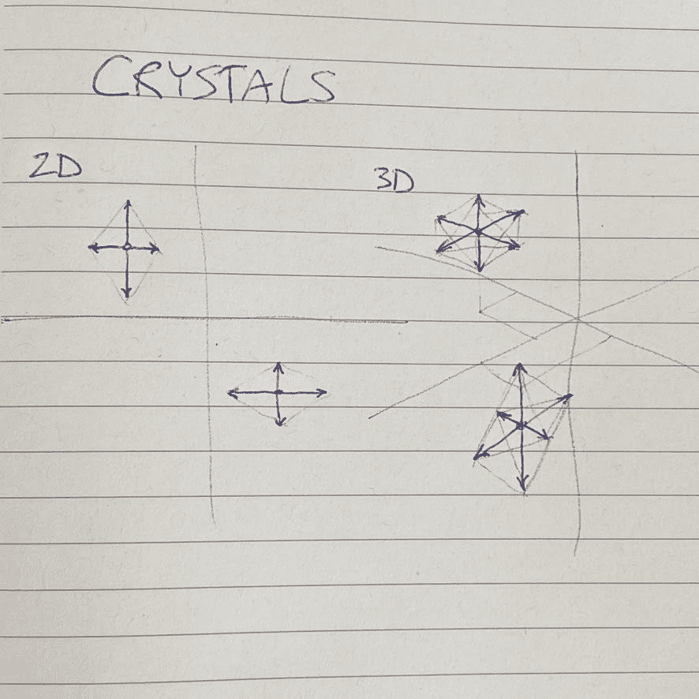
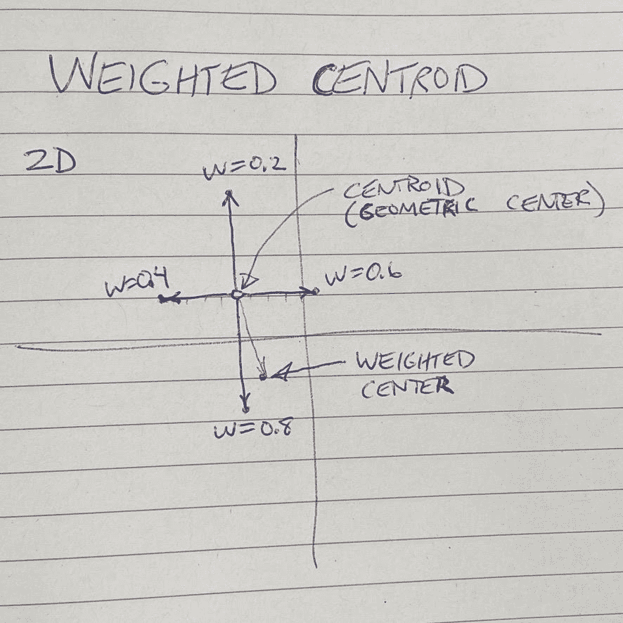
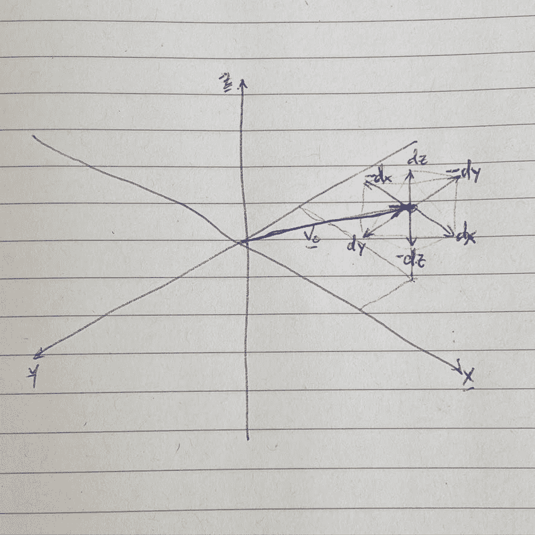
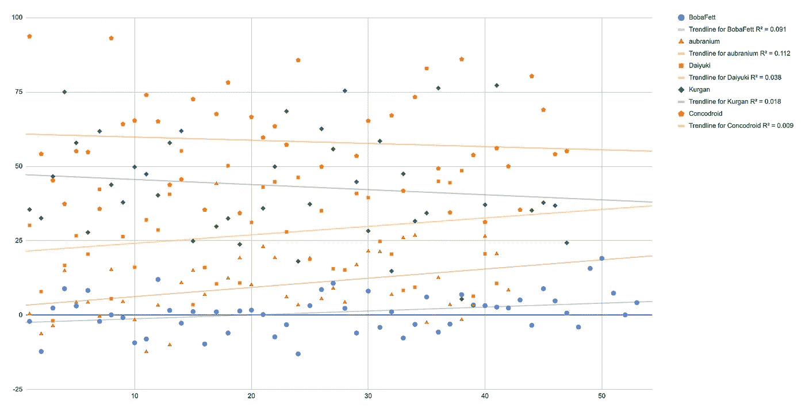

# 人工智能的 DNA:优化的故事

> 原文：<https://medium.com/analytics-vidhya/the-dna-of-ai-a-story-of-optimization-a6770e8aadb6?source=collection_archive---------4----------------------->

# 摘要

我们使用 Kerbal 空间程序来验证优化技术。具体来说，本文着重于随机梯度向量近似的计算，最适合于评分函数中具有高噪声和/或计算成本的情况。这种技术称为偶极晶体梯度合成，使用从多层感知器借来的反向传播方法来通知多元有限差分计算。沿着加权轴的子集生成偶极变体，其中轴权重被调整以支持其变化对梯度贡献最大的维度。我们应用这种技术来优化 KSP 船的各种参数，特别是人工智能设置和机体配置。对变体在战斗环境中的性能进行了评估。战斗表现影响了反向传播过程。

# 概观

这听起来有点奇怪…

至少，这是目标。很难想象有人能够理解 n 维数据结构的复杂性；更难以相信的是，有人会希望在如此多样化的环境中航行。我们大多数人都需要可爱的 YouTube 视频来用搞笑的漫画解释天体物理学之类的事情。即使有所有巧妙的包装和熟练的解释，也很难看出 n 维事物如何与我们日常生活中的任何事物联系起来。像我们生活中的许多其他部分一样，从一些熟悉的东西开始，走向更微妙的理解，会有所帮助。这的确是我们旅程本身的一个隐喻。

# 前奏场景

在我们开始之前，让我们花点时间回顾一下低维环境中的几个场景。这种实践有助于为以后更好地理解复杂性打下基础。我们需要尽可能多的帮助。

## 1D

想象一下，你被选中参加一个广播节目，分享你最喜欢的歌曲，但是有一个问题。电台要求你的歌曲长度必须正好为四分钟，否则他们会拒绝你的申请。您已经按字母顺序排列了您的唱片集，但这意味着所有歌曲的长度都是随机的。还有一个难题——你只有 10 分钟的时间来寻找曲目。在你的参赛作品到期之前，不可能检查每一张唱片来寻找匹配的歌曲。你疯狂地浏览你的相册，阅读每个相册上的标签，直到你找到一个价值接近目标的。你把它放在一边，作为“目前为止最好的”候选，然后继续，也许是随机的，也许是按顺序的。当你觉得时间不多了，你就提交你的候选人。

## 2D

想象一下，在电和互联网出现之前的一个雾天，你站在街角。你受雇于城市规划师，为一个有景观的建筑位置测量附近的景观。你的结果会在今天结束前出来。在晴朗的日子里，这将是简单的扫描地平线上穿过地平面的山丘或建筑物，然后向一个交叉点移动。然而，由于能见度有限，你只能在任何给定的方向上看一个街区。

在每个十字路口，您扫描相邻的十字路口，寻找从您当前位置出发的上坡道路。从可用的选项中，您选择最陡的路径，并沿着它走到下一个十字路口。你可以重复这个过程，直到所有的路都走下坡路。如果你幸运的话，最终的位置可能会有一个让你的雇主满意的有利视野。如果你运气不好，你会发现一座小山并停在那里，宣告胜利。这被称为局部最大值。

## 三维（three dimension 的缩写）

你正在建造一台机器来精确测量夹具中某个任意零件的表面几何形状。您的机器由一个带有微小圆形尖端的超灵敏针头组成。假设该仪器可以在欧几里得空间的所有三维空间中非常精确地测量指针的偏转。您可以在垂直于针的平面内移动工作台，并且可以沿着针的轴将针移向或移离零件。为了简单起见，我们假设你要扫描的部分是凸的，因为凹的部分更复杂。

为了校准机器进行优化，我们需要建立零件的矩形边界。幸运的是，机器还有一个向下对准零件的摄像头，允许机器确定平面形状的边界矩形，以及代表零件外周的弯曲路径。利用这一点，机器可以执行与您在 2D 示例中遵循的过程类似的过程，在各个方向上以小增量步进，试图了解靠近针尖的部分的曲率，朝着最高点向上移动。这被称为爬山算法。

本例中的主要区别是针高度的明确输入。在 2D 的例子中，位置的海拔被用作值函数，我们调整了纬度和经度作为输入。在这里，我们使用指针的偏转作为拓扑梯度的信号，这是我们的值函数。

## 4D

你正在为一场战斗比赛设计一个机器人。你的设计允许调整机器人控制系统的各种参数，但你不知道什么是“最佳”设置。比方说，你可以调整转弯速度，最大车轮扭矩，触发距离，和武器的力量。期望这些参数的不同值影响机器人的战斗性能似乎是合理的。也许你对它的能力的假设也是错误的。

幸运的是，你建造了十个原型，所以你有足够的单位在比赛前做一些战斗试验来测试各种设置。然而，考虑到四维，您将需要 81 个单位来研究某个中心值加上或减去偏移的所有组合。也许有一种方法可以配置少量的单元，通过评估更小的参数集来收集最佳的参数集。这是旅程真正开始的地方。

# 带图片的数学

拿我来说，我喜欢讲故事。从情感上和智力上，甚至精神上，与一个故事联系起来，有一种令人信服的东西。它帮助我们理解复杂的事物。在这一节中，我们将基于第一节中的场景讲述在其中呈现的情况下优化过程的故事。当然，我们会有一些图片来指导我们前进。首先，我们需要回顾一些术语，因为这些术语很快就会被遗忘。

## 术语

*   *偶极子*——一对矢量，大小相等，方向相反。

*   *水晶*——由边连接的顶点组成的凸形空间几何形状，由一组从同一点开始，每一个都结束于一个顶点的向量表示。

*   *加权质心* —几何形状的加权中心，代表所有顶点的加权平均值。

# 寻找古老的地下建筑(2D)

为了直观和简单起见，让我们考虑一个 2D 的例子。这样，我们可以画出漂亮的图画，让数学变得更容易理解。不管我们使用多少个维度，概念都是一样的。两个就够了。

让我们举一个真实历史的例子。大约两千年前，在维苏威火山爆发时，庞贝城被从天而降的火山岩掩埋。我们现在知道许多建筑幸存了下来，随着大自然的愤怒平息，慢慢被泥土覆盖。许多年来，没有人敢接近这片无法居住的土地。数百年后，当一个农民决定挖掘山顶时，他发现自己正俯视着一座古老建筑中的一个房间。知道山顶可能包括一些古代遗迹，让我们试着重现他们的斗争，看看我们如何用数学来改善它。

最简单的例子是一个光滑的锥形山丘。我们会说它被雾或云遮住了，所以我们不能只使用地平线扫描技术来寻找更高的地面。根据我们的起点，我们可能会看到不同的拓扑和不同的上坡方向。下图说明了这一点:

不同起点的上坡方向

# 前进的道路

图 1 中的每个菱形代表一个起点，周围有一个水晶。在每个中心点，我们计算该函数的分数(在本例中为海拔),并将顶点分数与中心分数进行比较，以确定该位置的局部梯度。这是一种称为多元有限差分的技术，是牛顿法的一种数值逼近形式。自从牛顿在 500 多年前发展了他的技术，这并不完全是新的。然而，我们将充分利用这一技术来找到我们的优化解决方案。在这里，我们考虑包括反向传播技术，借用神经网络中的多层感知器。通过测量每个轴相对于某个已知参考点的贡献(以偶极子对的形式)，我们可以进一步告知轴选择过程。这有点像买花。如果你一直从同一个供应商那里得到普通的鲜花，你可能以后不会从这个供应商那里购买，除非价格有可能变得对你有利。为了更好地理解这一点，我们需要考虑一个不同的例子，我们需要确保我们有足够的轴来开始更清楚地看到这个问题。

这里的关键限制是计算每个位置的分数所需的时间。以庞贝发现为例，我们需要在每个地点进行挖掘实验，以发现任何有意义的东西。我们当然不能把整个县都挖出来而不造成大混乱和损失一大笔钱。相反，我们选择点来进行战术测量，以告知我们的决策过程。在我们计划挖掘项目之前，让我们后退一大步，看一下更大的图景。让我们从这里开始使用战斗机器人的比喻，这样我们就可以开始在我们的脑海中把这些碎片拼凑起来。

前面描述的简单例子只涉及我们战斗机器人中需要管理的四个参数。这是我们在有意义的战斗环境中实际需要调整的所有参数的一个小子集。我们可以为单独的子系统提供运动控制器，它们自己的设置独立于其他子系统。这通常表现为系统中耦合参数的解耦集群。对于我们的优化器，小集群是理想的，解耦集群是有益的。

# 战斗基因

在宏观层面上，我们可以相当容易地将参数集群理解为功能分组。一个常见的例子是武器管理员的设置，通常以目标优先级的形式出现。这些参数可能对战斗性能有重大影响，同时与其他参数组完全解耦，例如飞行员 AI 设置。这意味着我们可以在不调整试点设置的情况下尝试目标优先级的变体，并且有一定的信心，我们不需要稍后重新评估试点设置来进行补偿。

现在我们知道有一些参数可能会影响聚类或组中的分数，但我们对组本身一无所知。严格来说，我们不需要事先了解系统的任何信息来测试假设，并在过程中学习。尽管如此，有某种指南针来指引方向还是不错的。我们稍后将回到这一点。现在，让我们关注生态系统本身。什么定义了我们期望的系统行为？有哪些促成因素？

就我们的目的而言，Kerbal 空间计划(KSP)中的船是离散部件和模块的集合，每个部件和模块负责定义飞行器的一些行为。如果没有任何带有控制面模块的部件，飞行员就无法控制飞行器。在这种情况下，我们预计战斗性能会非常非常差。玩家在社区比赛中设计 KSP 工艺，以满足各种不同的目标。因此，我们可以期待玩家创造的工艺中有非常丰富的基因多样性。类似地，这些飞行器都将呈现与玩家的创造性多样性相称的战斗性能。这是一个通过数字镜头研究基因进化的绝佳机会。

所有播放器都从分配给部件和模块的所有参数的默认值开始。每个玩家被允许拼凑任意一组部件，这些部件一起代表一个玩家设计的容器配置，通常用于一组特定的比赛目标。他们也可以随意调整参数，如转向功率，规避时间等。这些参数，连同机身几何形状和操纵面设置的独特配置，编码了我们生态系统中独特个体的本质。改变这些参数中的任何一个值都可能导致飞行器性能的一些变化，也可能不会。

# 进步的醉船

在这一点上，我们有了一个基本的想法，各种参数如何共同影响一艘船的战斗性能。我们甚至可以对它们的聚集以及它们如何相互作用做出一些有根据的猜测。有些会细致入微，比较敏感，有些则不那么有冲击力。此外，在将优化一个设计的结果模型应用于任何其他设计时，也不能保证连续性。用机器学习的术语来说，我们用来决定调整哪个参数子集的模型不能很好地概括。因此，我们被降级为每艘船重新开始，并希望我们的模型很快崩溃。在我们进入更多细节之前，让我们花一点时间来思考定义一个我们可以在一般意义上使用的模型所面临的挑战。

说任何高性能飞机都必须具备某些品质才能在竞争中胜出，这可能很容易。像滚转、俯仰和偏航的操纵面这样的东西，对于在竞争激烈的空中优势环境中生存下来确实是至关重要的。虽然似乎可以找到一个没有这些组件的解决方案，但这样的解决方案将远远没有竞争力。此外，引入新功能有无限的理由。也许胜利的关键是在一个陌生的地方的一个微小的控制表面，就像鲶鱼的胡须一样。也许这是同时拥有几种不同特质的总影响。

由于控制表面和其他起作用的参数的无数配置，我们定义任何通用优化模型的最大希望是依赖于这种多样性几乎没有影响的公共属性。从这个意义上说，我们必须将我们的一般模型限制在我们希望调整的所有参数的最小公分母上。其他参数可能仍然在优化过程中发挥重要作用，但重要的是将我们的重量分配分成两类——一类是我们可以概括的，另一类是我们必须根据给定的机体几何形状来确定的。

# 把所有的放在一起

抽象地说，我们从过程的技术描述开始，所以这里是我们分解它的地方，所以我们可以把它打包在一起。这个过程最好描述为:

*   *——我们不是为空间中的每个轴计算偶极子对，这可能是非常昂贵的，而是基于来自先前迭代的轴贡献权重选择少量轴，并频繁迭代。*
*   ****反向传播*** —每次迭代后，来自每个轴的得分贡献用于增加或减少轴权重；在随后的迭代中，具有较高权重的轴比具有较低权重的轴被选择。*
*   ****有限差分*** —参考点附近的点被采样并用于计算局部梯度向量的近似值。*
*   ****不可微***——虽然可能存在一个控制系统行为的光滑函数，但它不为我们所知；相反，我们必须选择已知点附近的点，并单独评估它们的得分。*
*   **—基于一些已知的误差度量，没有理想的分数要达到，因此我们简单地寻求用越来越高的分数来最大化值，而不是收敛于最小分数。**

# **关于评分的几点注记**

**我们在整个旅程中讨论了分数，但没有任何具体的细节。分数是任何优化过程的基本内在组成部分。没有反馈机制，除了随机蹒跚之外，就不可能规划出前进的道路。在飞机战斗得分的背景下，这种分析使用一种固定的度量标准来计算绝对范围内的性能。这主要是通过命中率和伤害率来衡量的——在一个自由的战斗群中，平均每秒的命中数或每秒造成的伤害数。这对分数的价值有很多影响，因为结果可能会在不同的比赛中有很大的不同。**

**这整个努力是为了理解自然发生在野外的有机基因突变过程和它们的数字对应物之间的相互作用。我们可能会发现进化的最佳方式确实是按照传统的父母/子女遗传进化模型结合个体。现在，我们把重点放在梯度合成部分。**

# **主要迭代周期**

**随着每一次迭代，工艺都有望改进，因为每个变体都以其贡献告知前进的道路。本节重点介绍每个周期中采取的步骤。我们将在首先回顾总体大纲后详细描述每个步骤。**

**循环是这样进行的:**

1.  **从参考工艺开始。**
2.  **选择要变异的顶部 X 个参数轴，按轴权重排序。这些轴存储在与权重因子相关联的图中。**
3.  **为每个轴生成偶极子变量(每个选定轴两个)。**
4.  **每个偶极子对至少选择一个随机对手。**
5.  **运行 N 轮战斗，包括参考、变体和对手。**
6.  **来自变体和参考的总分数。**
7.  **相对于最大变异分数标准化变异分数。**
8.  **使用战斗中的标准化分数计算由偶极子形成的晶体的加权质心。**
9.  **使用质心值生成新的参考。**
10.  **根据相对贡献调整轴权重。**
11.  **重复一遍。**

****

# **详细分析**

## **参考飞行器**

**我们从一个 KSP 工艺文件开始我们的旅程，这是一个以树形结构表示的零件集合。在 KSP 的虚拟世界中，树的每个部分都有一些物理意义。一些储存燃料。其他的用作飞机的升力面或操纵面。我们的算法分析给定的文件，以识别以某种方式对车辆控制输入做出贡献的所有部件。这些将是我们在优化过程中使用的轴。**

**如果我们正在迭代一个现有的循环，我们已经有了一个权重图。如果我们刚刚开始这个过程，我们需要初始化权重图。一旦我们在给定的工艺文件中确定了所有可以调整的轴，我们就为每个轴生成权重因子。默认值为 1.0，我们在初始化时添加了一个微小的随机化因子，以减少设计偏差。**

## **轴选择**

**每一次迭代都涉及到选择要考虑改进的轴。这是通过对轴的加权图进行排序并选择一些排名较高的轴来实现的。轴的具体数量可能由计算每个变量得分的成本决定。为了这项研究的目的，我们使用了进化过程中最好的三个轴。**

## **偶极合成**

**一旦轴被选定，我们简单地产生一对代表我们的轴向偶极子的变量。在本研究中，我们使用 10%的固定失调，希望在快速收敛和保持线性之间取得平衡。未来的研究可能会考虑尝试不同的价值观。**

## **对手注射**

**每次迭代都要考虑到异质性。为了减少近亲繁殖的影响，我们在每个周期中随机注射对手。经过足够次数的迭代，这是为了减少或消除由于缺乏遗传多样性而导致的分歧或停滞。特别添加了对手来对抗这种效应，因为它被认为有助于以前实验的低或可忽略的增长趋势。**

## **数据收集**

**由于 KSP 战斗模拟环境中相对较高的噪声系数，我们在每个迭代周期中运行多次加热。这有助于减少初始条件的偏差，因为开始和订单位置是随机的。我们进行了几次免费的锦标赛预赛，并汇总了分数。出于本研究的目的，我们每次迭代运行 5 次加热。我们还使用 3 分钟的固定加热时间。这意味着我们需要 15 分钟来为单次迭代产生一个分数。加热可以并行运行，以减少总挂钟时间，但这个实验是串行运行的。**

**热火队的名单可能是这样的:**

*   **R1 —参考 seed 工艺**
*   **V1—A 轴的正变量**
*   **V2 —轴 A 的负变量**
*   **A1 —随机选择的拮抗剂**
*   **V3 —轴 B 的正变量**
*   **v4-轴 B 的负变量**
*   **A2 —随机选择的拮抗剂**

## **分数聚合**

**来自所有迭代热度的分数被聚集在一起以产生统计上有意义的结果。对每个变量分别计算该结果，并用于通知下面的梯度合成。对手得分不包括在这一考虑因素中，但保留参考得分。**

## **正常化**

**变异分数相对于集合中的最大分数(不包括参考分数)被标准化。如果最大变体分数低于参考分数，则迭代被认为是坏种子。所有的变异都是因为不好的种子而被丢弃。对于最大值超过参考值的情况，我们继续从偶极晶体计算梯度向量。**

## **梯度合成**

**有了晶体中每个顶点的分数，每个分数代表一个给定变体的多次战斗的累积结果，我们现在对晶体中代表的每个轴的贡献大小有足够的信心。我们可以计算每个轴的单位向量，代表梯度向量的轴向分量。**

## **站出来**

**将每个轴的所有贡献加到一个结果梯度向量中，我们简单地将结果加到我们的参考点上，为下一个迭代周期生成一个新的参考工艺。在我们继续下一次迭代之前，我们需要向系统提供关键的反馈，说明每个轴相对于其他轴的贡献有多大。**

## **反向传播**

**我们使用偶极子两端的分数来决定这个轴相对于参考点的重要性。毕竟我们在这里冲浪的是 n 维曲线。对母鹅有益的事情可能只对公鹅有益，因为周四下雨，邻居的猫睡着了。我们周一给出的反馈可能会非常不同。最后，这是所有被埋没的线索之母。原来反向传播过程是最重要的部分。**

# **结果！**

**总之，这个实验需要将近一周的计算时间。我们比较了五种不同的 KSP 飞行器经过 50 次迭代得到的结果。在每种情况下，我们都有两个阶段——生成和验证。在这里，我们快速回顾一下用于综合和评估结果的过程。**

# **方法学**

## **第一阶段——生成**

**对于第一阶段，我们从一个初始的种子工艺开始，并在其上运行一个迭代，如上所述。这导致近似的梯度向量结果，其用于为下一次迭代生成新的种子。迭代有可能产生不好的结果。在这种情况下，我们只需否决迭代中选择的轴，然后重试。这一直持续到我们有 50 次成功的迭代。**

## **第二阶段—验证**

**一旦我们有了一组来自世代阶段的种子，我们就可以开始验证这些种子，将它们相互比较，并与世代阶段使用的所有拮抗剂进行比较。我们选择六个种子的组(按照迭代的顺序)并对六个拮抗剂运行它们。这允许分数在不需要标准化的情况下相互比较。由于每场预赛中有相同数量的飞行器，得分机会应该是一致的。我们为每组六个种子选手举办 12 人免费锦标赛。这些锦标赛的结果被绘制成每个系列的线性图。**

**此外，我们还包括一场 10 人自由参加的进化前和进化后工艺锦标赛。这项锦标赛将所有的比赛放在一起进行 40 多轮，以产生一个稳定的玩家排名。**

# **解读图表**

**将所有验证结果叠加在一张图中，我们可以看到排名较低的飞行器的总体改进趋势。此图表在纵轴上显示所有验证锦标赛的分数，在横轴上显示迭代次数。如果该技术有效，随着迭代次数的增加，我们应该会看到分数的提高(向上和向右)。我们在顶级飞船上看到了相反的关系。如下所述，这被认为是在整个实验过程中每次重复使用少量加热的结果。**

****

**优化前后的对比图讲述了一个不同的故事，证明了嘈杂的飞机战斗系统。我们看到所有工艺都有改进，除了表现最差的。这里的另一个关键考虑因素是系统的主要参与者。我们希望像转弯率这样的东西能成为空战性能的强有力的预测指标。这个实验有意地选择了一组具有不同武器和机身的不同飞机。完全有可能 50 次迭代不足以改进一个初始配置表现不佳的飞行器。同样，我们可能需要一百或更多轮的最终确认锦标赛，才能对其稳定性有高度的信心。**

****

# **结论**

**这项技术的随机性是其成功的关键。当评估所有维度的高保真度梯度的成本太高时，选择轴的子集并计算梯度的近似值会有很大的好处。将这种采样方法与反向传播相结合产生了对局部最小值/最大值不太敏感的高度自适应的解决方案。当梯度漂移到状态空间的新区域时，该算法自然地考虑了灵敏度沿各个轴的变化。在每个迭代周期中接收的数据提供了在后续迭代中选择轴的最佳猜测。对于鞍点来说尤其如此，在鞍点中，一个轴被优化，而另一个轴没有被优化。需要更多的研究来更好地理解这些细微差别。**

# **未来研究**

**在这个实验的数据收集的早期，很明显我们使用的反向传播算法不是很稳定。这导致一些工艺有明显的改进趋势，但一些数据不一致。尽管锦标赛验证中的分数有所提高，但这使得前两名在种子验证中的表现更差。这可能是由于每次迭代使用的热量较少。由于评分函数中的固有噪声，我们可能需要更多的热量来开发具有统计显著性的梯度近似值。**

**该实验中使用的特定反向传播逻辑导致加权中的一些混乱，而不是我们希望实现的稳定平滑的加权。后续论文可能会更详细地讨论这个问题。此外，还有许多用于调整权重的固定常数。这为将来的迭代建模和/或预测合适的权重提供了一个很好的机会。**

# **特别感谢！**

**首先，我想衷心感谢那些允许我在我的怪异科学实验中使用他们美丽的作品的玩家。这些是来自 KSP/BDArmory 社区的玩家。他们在几个月的准备和开发过程中给予了我们巨大的支持，最终完成了你们在这里看到的作品。**

**此外，感谢我的好朋友丹·波斯特和亚伦·博多-奎迪同意阅读我漫无边际的早期草稿。他们的反馈帮助我组织混乱，并以一种有希望接近的方式呈现这些复杂的概念。**

**一如既往地感谢您的阅读！❤**