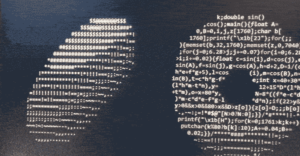
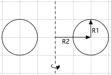
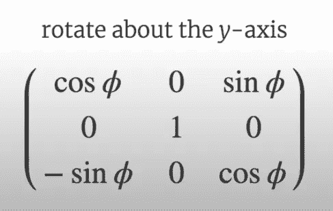
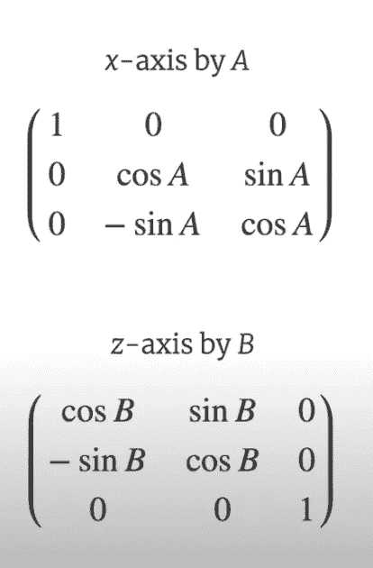
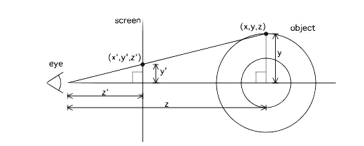
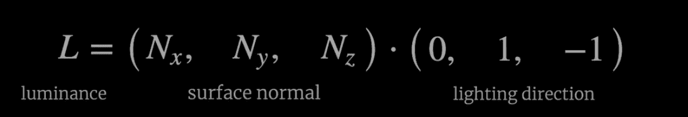
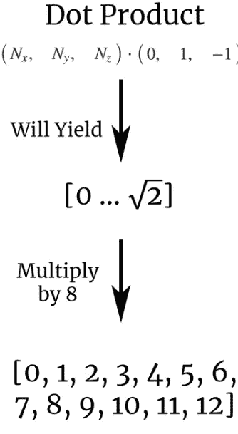
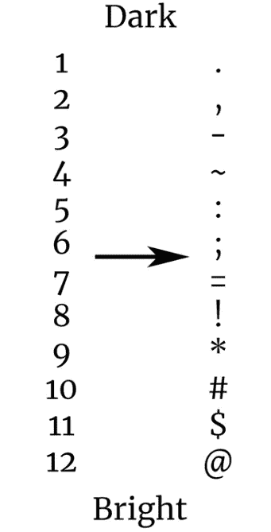
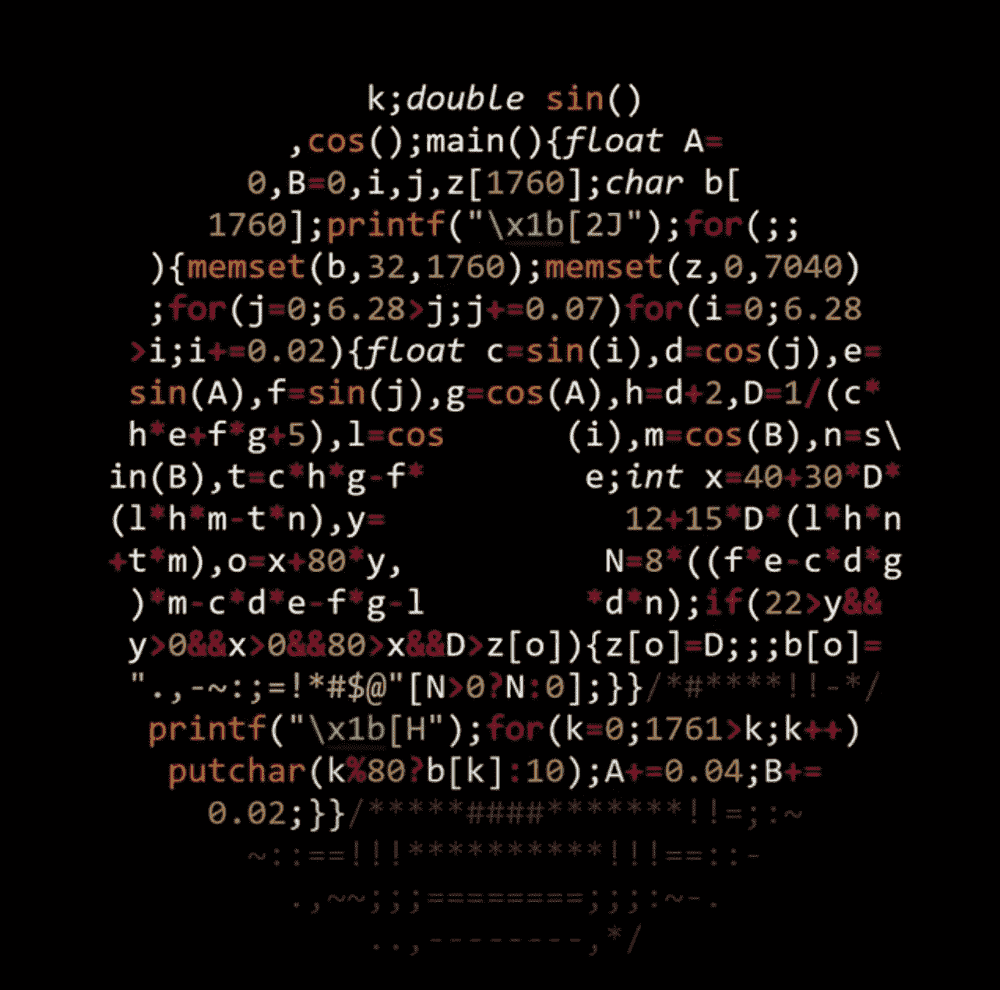

# 甜甜圈代码和背后的数学

> 原文：<https://medium.com/analytics-vidhya/the-donuts-code-the-math-behind-6d473eaec61d?source=collection_archive---------1----------------------->

# 油炸圈饼代码

旋转的“甜甜圈”最近引起了一些关注，它是由令人惊叹的安迪·斯隆创造的。难怪，你的终端上有一个飞行甜甜圈？你可以在 c 语言中找到下面的代码。“像素”是 ASCII 字符`.,-~:;=!*#$@`,它说明了表面的照明值，但我将在下面一步一步地解释数学。

你可以在我的博客上关注这篇关于人工智能/数据科学的文章

**任务:**



步伐

1.  创建一个以 R2 为中心，以 R2 为半径的圆



2.创建一个在 Y 轴上旋转的圆环(“甜甜圈”)



3.现在，我们需要围绕 X 和 Z 轴旋转，这样它看起来就像在屏幕上浮动和旋转。基本上，一个飞行甜甜圈。为什么不呢？



4.那么，如何将这个 3D 物体映射到 2D ie 终端屏幕上呢？



代码中的每个字符对应于我们终端上的一个像素。但是，怎么遮阳呢？为此，我们计算表面法线和光线方向的点积。这将说明屏幕上会有多亮和多暗。



点积的输出将是:



5.最后，你将点积的结果(步骤 4)映射到这些字符上来调整光线。就是这样！



**代码**

```
#include <stdio.h>
#include <math.h>
#include <string.h>
#include <unistd.h>int main() {
    float A = 0, B = 0;
    float i, j;
    int k;
    float z[1760];
    char b[1760];
    printf("\x1b[2J");
    for(;;) {
        memset(b,32,1760);
        memset(z,0,7040);
        for(j=0; j < 6.28; j += 0.07) {
            for(i=0; i < 6.28; i += 0.02) {
                float c = sin(i);
                float d = cos(j);
                float e = sin(A);
                float f = sin(j);
                float g = cos(A);
                float h = d + 2;
                float D = 1 / (c * h * e + f * g + 5);
                float l = cos(i);
                float m = cos(B);
                float n = sin(B);
                float t = c * h * g - f * e;
                int x = 40 + 30 * D * (l * h * m - t * n);
                int y= 12 + 15 * D * (l * h * n + t * m);
                int o = x + 80 * y;
                int N = 8 * ((f * e - c * d * g) * m - c * d * e - f * g - l * d * n);
                if(22 > y && y > 0 && x > 0 && 80 > x && D > z[o]) {
                    z[o] = D;
                    b[o] = ".,-~:;=!*#$@"[N > 0 ? N : 0];
                }
            }
        }
        printf("\x1b[H");
        for(k = 0; k < 1761; k++) {
            putchar(k % 80 ? b[k] : 10);
            A += 0.00004;
            B += 0.00002;
        }
        usleep(30000);
    }
    return 0;
}
```

**学分**

*   查看安迪·斯隆的博客文章，了解更多关于数学的细节:[博客文章:“甜甜圈数学:甜甜圈. c 如何工作”安迪·斯隆的博客文章](https://www.a1k0n.net/2011/07/20/donut-math.html)
*   查看 Alex Friedman 的快速解释和代码:[甜甜圈形状的 C 代码，生成一个 3D 旋转甜甜圈](https://www.youtube.com/watch?v=DEqXNfs_HhY)