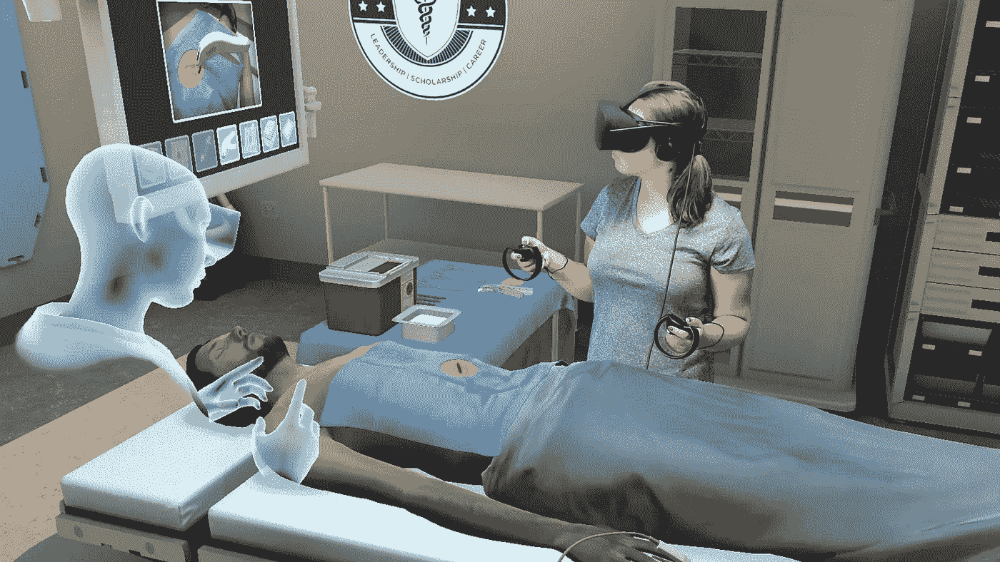

# 新冠肺炎时期医学教育中虚拟现实对社会动力学的影响

> 原文：<https://medium.com/analytics-vidhya/the-effects-of-virtual-reality-on-social-dynamics-in-medical-pedagogy-during-covid-19-5e51275aba48?source=collection_archive---------22----------------------->

## 在疫情时期，虚拟现实有助于支持医学教育吗？

图片来源: [ICE E-tech](https://etech.iec.ch/issue/2019-03/virtual-reality-makes-real-life-even-better)

虚拟现实(VR)使用技术使用户沉浸在模拟的三维环境中。最近，成熟的功能和降低的生产成本使医疗界能够将 VR 用于治疗和教育目的。冠状病毒疾病 2019(新冠肺炎)疫情大幅减少了课堂上的社交互动，迫使医学教育学迅速适应，转向 VR 等新颖的方式继续运作。然而，将虚拟现实等颠覆性技术融入医学的社会影响仍未得到探索。这篇文章将探讨在新冠肺炎疫情的背景下，虚拟现实增强的教学如何通过创建完全虚拟的教室来打破医学院长期以来严格的社会等级制度。即使在常态回归之后，疫情突然推动创新所造成的影响也可能会应用于其他形式的颠覆性技术，从而为医学生和教师之间带来新的教学动力。这篇文章首先将传统医学院的社会背景建立为一个严格的社会等级制度。接下来，虚拟现实的当前能力和社会含义将被探索，并最终在新冠肺炎的背景下进行检查。

# 搭建舞台

Saunders(2010)对 CT 套件中教育层级的观察显示了医学教育学中的传统社会结构。在 20 世纪 90 年代末，Saunders 观察到这种社会结构表现为四个级别的不同资历，即初级医学生、住院医师、更有经验的研究员和最资深的主治放射科医师(147)。一个人的等级水平的指示符采取有形的人工制品的形式，例如官方资格和经验的年数，或者隐含的安排，例如围绕机械视区的座位安排(148)。负责监督的主治放射科医师倾向于将自己放在离观察箱有一段距离的地方，从而允许学生更近距离地检查观察箱内的胶片。社会等级也体现在 CT 套件中的劳动分工上。类似于学校校长通常不直接教学生，主治放射科医生倾向于在观片台会议和会议期间提供一般性指导，而不是详细的指导。CT 室的轮换结构导致研究员负责大部分住院医师的放射教育(149)。初级居民通过负责单调乏味的任务，如手动安排观片箱电影，展示了他们较低的等级水平(154)。此外，更严格的文件格式指南表明了更高水平的指导，并显示了较低等级水平的学生如何缺乏经验(154)。因此，桑德斯在医学领域牢固地建立了教师和学生之间严格的社会等级制度。

桑德斯认为 CT 套件教学法实际上是以师徒关系为模型的(145)。尽管这种模式并不完全等同于封建学徒在整个教育过程中依附于一位大师(146)，但放射科住院医师经历了大量的跟随和与导师的密切合作，保持了对学徒精神的忠诚(149)。桑德斯观察到放射科住院医师接受各种形式的指导。一些教学方法可能是早期教育中熟悉的，如书本知识的死记硬背(146)。其他类型可能看起来更适合，如通过模仿获得机械专业知识。例如，安排观看盒电影这种被认为是卑微的工作的细微差别可以教会肌肉记忆，提高学生的速度和准确性(153)。其他形式的指导包括频繁的会议，放射科医生将分享进展更新，并偶尔以“热点会议”的形式测试住院医生的知识，这种形式培养了软技能，如压力下的能力和演示技能，同时回顾了教学知识(147)。

对桑德斯来说，CT 系列中师徒关系的一个明显表现是教育者和学生如何互动。桑德斯指出，教师和住院医师之间的互动通常涉及没有经验的学生犯新手错误，随后收到建设性的，尽管是严厉的反馈(147)。桑德斯的观察主要集中在“溯因”知识是如何教授的，这涉及磨练一个人的直觉，以根据可用信息做出有根据的猜测(157)[1]。Saunders 记录了主治放射科医生和住院医生在观片间的交流(158)。从互动中，桑德斯清楚地说明了上课的人是如何一直通过暗示来控制课程的叙事，以推动学生走向正确的观察，同时保留足够的信息来迫使学生独立地进行最后的逻辑溯因跳跃。当学生不可避免地犯了错误时，主治医生会惩罚他们，指出错误，同时让学生再次尝试锻炼他们的溯因本能。与会者自信地引导这种互动过程的能力证明了教育者和学生之间在专业知识和资历方面的巨大差距，显示了等级水平之间的明显分离。

在桑德斯的 CT 套件之外，在整个教育过程中明确和含蓄地表现出来的严格的社会等级的思想可以更普遍地应用于医学院的教育学。类似于放射学，医学院使用说教式的讲座来教授解剖学和生物学。此外，桑德斯指出，“学习阅读 CT 扫描是学习阅读医学图像过程的一部分。”(146)因此，即使确切的设备或社会学安排可能不同，CT 套件中采用的学习类型也很可能出现在其他医学领域。例如，外科培训大量涉及通过观察高级外科医生获得的隐性物理知识，因为外科医生需要在成功实施手术之前具有高度发达的精细运动技能(李等人，2017 年，第 43 页)。在辅导课中，学生可以寻求有关他们工作的澄清并获得反馈，在互动中展示师徒互动，有助于磨练一个人的智力本能。然而，合作的程度可能不如放射科住院医师和研究员之间的密切。医学生也要经历实习，表现出学徒的特征，如密切合作和通过跟随执业医师的观察来学习。因此，桑德斯观察到的社会结构也适用于普通医学教育学。

随着时间的推移，技术进步会影响桑德斯所观察到的社会结构的物理环境。尽管桑德斯的 CT 套件中的生活围绕着机械视像盒，但由于数字化，他观察到的确切的社会配置不再存在(161)。桑德斯指出，他在数字革命初期目睹的套件配置对于今天的放射新手来说可能是不可识别的(163)。值得注意的是，许多涉及阅读 CT 图像的实用技能已经从机械技能转变为日益数字化的技能。桑德斯观察到的社会动力学也可以跨时间应用于当前的医学教育及其技术配置，即使应用程序与桑德斯的 CT 套件不相同。

*虚拟现实与医学教育*

虽然桑德斯描述的世界已经数字化，但他通过强调通过更新社会观察来反映当前技术趋势的必要性，预测了数字化对医学教育的重要性(桑德斯，2010 年，第 163 页)。在桑德斯首次在 CT 套件中记录他的观察结果二十多年后，随着颠覆性技术变得无处不在并影响既定的社会结构，这一建议比以往任何时候都更加相关。特别是，尖端的虚拟现实可以影响桑德斯观察到的社会等级制度，即使它似乎与机械的视窗完全不同。

目前的 VR 技术可以提供沉浸式的教育体验。通常，医学教育的 VR 设置使用头戴式显示器(HMD)和笔记本电脑来运行程序(Pottle，2019，第 182 页)。HMD 是虚拟现实沉浸感的关键，因为它通过用生成的图像填充用户的视野来阻挡外部世界，使用户感觉好像他们在虚拟现实程序描绘的世界中。用户可以用手持控制器操纵虚拟物体，为虚拟环境提供一种交互性。如今，虚拟现实技术已经足够成熟，可以安全、简单、经济地使用(182)。虚拟现实程序跟踪用户的方向和手的位置，给用户一些空间意识，这在模拟实际操作中特别有用。为用户提供一种自我感知的感觉，有助于减轻较旧的 VR 程序所导致的常见迷失方向和恶心感(Pax 和 Hamilton，2018，405)。许多虚拟现实程序可以开箱即用，其使用难度堪比电脑游戏，这是当今精通数字技术的学生所熟悉的设备。运行 VR 软件所需的设备也相对容易使用，消费者很容易获得(Pottle，2019，第 182 页)。假设用户拥有一部足够强大的支持虚拟现实的手机，虚拟现实耳机可以像安装在用户头部的纸板手机支架一样简单。因此，如今的虚拟现实技术可能有能力模拟教室，因为它的沉浸式能力和对学生的可用性。

虚拟现实已经显示出增加医学教育经验的有效性。在外科教育中，李等(2017)观察到 VR 仿真作为解剖模型的表现优于其他仿真模型，如动物替代品和视频(3869)。虚拟现实程序提供了高度的交互性和真实感，可以更有效地模拟真实的人类尸体(3870)。此外，可以重复模拟，以衡量与过去的表现相比的进展，类似于 VR 游戏如何让你重放水平(3870)。多次重复模拟的能力特别值得注意，因为体能训练选项由于资源有限和许多模拟的潜在高运行成本而无法做到这一点(Pottle，2019 年，第 182 页)。用于测量性能的自动测量指标，如手术速度、准确性和正确性，可立即获得学生反馈(李等人，2017 年，第 3870 页)。李等人的结论是，虚拟现实能够逼真地模拟解剖模型，再加上其一套教育功能，使接受虚拟现实培训的学生比接受传统外科培训的学生表现得更快、更准确(3873)。该研究还指出，目前的虚拟现实软件不能完全复制物理标本中的外科细微差别和生物变异。然而，升级 VR 软件以支持随机解剖模型并改善 VR 硬件中的触觉反馈可能会解决这一问题。因此，VR 技术可以通过提供模拟解剖模型的有效方法来增强医学教育。

VR 在医学教育学中实现虚拟教室的能力具有将教室分散为学习中心的潜力。Pottle (2019)断言，便携式 VR 教室拥有学生所需的所有资源，可以将学生从物理教室的约束中释放出来，并促进自我导向的学习(184)。学生可以不受时间和地域界限的限制，例如往返实验室的通勤时间和学校开放时间，保持学习。通过使学生能够在任何地方接受严格的实践教育，医学教学可以在没有实际物理位置的情况下进行。例如，教学指导可以通过视频或指定读物进行，而实验室课程则在虚拟现实中进行。来自这些虚拟现实作业的会话数据允许教师捕捉和重放学生的表现，允许更多的机会远程给出详细的反馈和指导。因此，虚拟现实使医学教育能够绕过对传授物理技能的实际教室场地的需求。

教育者和学生之间互动减少的完全虚拟教室的前景可能会解开桑德斯提出的严格社会等级的模型。桑德斯的医学教育模式非常强调教育者和学生之间的合作，在 CT 套件中观察到的大量师生互动证明了这一点(桑德斯，2010 年，第 158 页)。特别是，这些互动中的微妙和自发性说明了桑德斯观察到的师徒关系。此外，桑德斯强调了一个用于聚集和交流的中央教育中心的重要性，例如 CT 套件的机械观察箱。通过将大部分教育委托给模拟器和计算机，存在失去师徒关系中特有的人情味、密切协作和共享环境的风险(162)。

虚拟现实集成可能会通过颠倒和重定向教育者和学生之间的信息流来颠覆桑德斯观察到的社会等级制度。Burri 和 Dumit (2008)对科学图像如何影响社会动态的探索断言，由于高级和低级角色之间适应能力的差异，不断发展的成像方法可能会改变知识的平衡(304)。桑德斯的观察支持了这一论断，表明初级角色往往比高级角色更快地适应新技术，偶尔会通过教育他们的导师使用这些新技术来逆转社会等级中自上而下的信息流动(桑德斯，2010 年，第 162 页)。因此，适应虚拟现实等破坏性技术的学习曲线可以通过改变教育者和学生之间的知识流动来影响层级之间的互动。

创建虚拟现实资源的困难可能会减少教师在计划课程时的自主权。Burri 和 Dumit (2008)探讨了生成、使用和分发科学图像如何引发科学家之间的社会动态，表明制作、分析和交流科学图片的行为通过要求额外的合作影响了社会动态(300)。例如，创建科学传真本身就是一种职业，因为需要技术知识来知道创建可用图像的最佳方法，例如知道捕捉身体的哪一部分以获得有价值的洞察力(302)。然而，现有的等级结构和指挥链导致了特定的社会配置，例如有经验的实验室技术人员指导没有经验的科学家捕捉图像，仅仅是因为技术人员缺乏官方资格来做出技术判断，尽管他们有经验(302)。缺乏技术知识意味着教育工作者需要依靠技术专家来设计虚拟现实模拟，这意味着教师已经减少了对他们的课程计划的控制，因为他们必须考虑虚拟现实教室的设计和限制。

最后，虚拟现实可以通过消除对高级教师的需求，进一步打破桑德斯教育缺乏经验的学生的严格等级制度。将虚拟现实作为一种新的视觉辅助手段，可能会导致额外的点对点学习，而不是桑德斯模型中的层间教育。Pottle (2019)提到了牛津大学的一项案例研究，其中虚拟现实中的点对点学习在教师干预最少的情况下发生(184)，这似乎与桑德斯关于教师是课堂互动背后的驱动力的说法强烈矛盾。对等学习的增加，以及之前提出的对桑德斯社会结构的改变，证明了虚拟现实如何通过模糊等级之间的界限来降低课堂教师的重要性。因此，虚拟现实中的虚拟教室可以通过消除传统的教师从根本上改变教室的动态。

# 疫情时代的问题与教育学

有些人可能会认为，虚拟现实融入医学教育不会彻底修改桑德斯在医学教育学中严格的社会等级制度。虚拟现实往往是对传统教学方法的补充，而不是替代。Pottle (2019)特别指出，虚拟现实在翻转课堂场景中的混合学习中尤其有价值，在翻转课堂场景中，学生在聚集在物理教室中进行讨论之前学习课程内容(184)。因此，技术辅助可能会增加教育者和学生之间的密切交流，但不会改变他们的本质。然而，防止冠状病毒传播的严格社会距离严重影响了传统模型的可持续性。随着医学院迅速适应虚拟学习的突然推动，新的课堂安排体现了学生和教师之间新的社会动态。

为了适应新冠肺炎疫情，医学院将大部分业务转移到了网上，并采用了许多方法来保持学生的参与度。大多数医学院利用学习管理系统和免费讲座等可用的在线资源来替代典型的研讨会和家庭作业(Tabatabai，2020 年，第 141 页)。Almarzooq 等人(2020 年)关于新冠肺炎大学期间研究生医学院虚拟学习的案例研究详细介绍了布莱根妇女医院心血管医学奖学金如何使用微软团队(2635 年)等方法实施虚拟学习环境。这篇文章提供了虚拟方法如何在医学教育中有效实施的轶事证据，即使是在像新冠肺炎疫情(2637)这样具有挑战性和快速发展的时代。然而，它指出，虚拟学习不能完全取代现实生活中的学习，但可以使用当前的虚拟现实模拟来增强(2637)。Bari (2021)观察到，虚拟学习有明显的缺点，例如由于通过视频通话交流的限制而导致的脱离或“缩放疲劳”。对于教育者来说，通过肢体语言失去许多非语言暗示也是一个重大问题。因此，使用虚拟现实来改进疫情时代的虚拟学习系统还有空间。

疫情时期，虚拟现实在医学教育中得到了一定程度的应用。De Ponti 等人在 2020 年进行的一项研究试图确定虚拟现实模拟在疫情期间指导医学生了解临床情况的有效性，当时进行面对面授课的能力受到了严重影响(2)。结果显示，大多数接受调查的学生发现虚拟现实培训方法是有帮助的、现实的，并且是传统学徒期的潜在补充(4)。然而，技术上的困难可能阻碍了一些学生的学习(5)。因此，尽管存在小问题，虚拟现实可以增加医学教学。

在疫情社会距离要求的背景下扩展虚拟现实的用途，应该探索虚拟教室的概念。Pottle (2019)提出了“多人虚拟现实”场景的有趣可能性，有朝一日可能将当前的虚拟现实教具与以前只在物理环境中出现的协作水平相结合(184)。Pottle 提出了现场会议的想法，来自世界各地的医学教育工作者和学生可以在同一个虚拟环境中共同研究同一个问题(184)。尽管听起来有些牵强，但虚拟现实视频通信的想法并不像人们想象的那样奇特。5G 网络等网络技术的进步将意味着对虚拟现实通信的大规模支持可能很快就会实现。更多的设备可能会支持 VR 通信程序，使虚拟教室的 VR 增强通信更接近现实。

虚拟教室的想法将有助于解决视频通话的一些通信限制，并通过在虚拟现实中创建一个学习中心来调和密切合作和完全虚拟学习这两个看似矛盾的概念。在克服了关于技术学习曲线的最初障碍后，桑德斯的社会等级可能会保持不变。尽管大部分教学学习不再直接来自教师，但虚拟教室中有意义的密切合作可以保留桑德斯提出的师徒关系的重要部分，如观察下的实践。由于医学教师所拥有的医学知识财富远远超过了他们在操作虚拟学习工具方面的专业知识的缺乏，因此在等级级别之间自上而下的知识流动可能会继续存在。因此，即使在释放了虚拟教室的虚拟现实技术的潜力之后，即使中心学习场所不再是物理场所，桑德斯的社会等级制度也很可能仍然存在。然而，在疫情期间学习的经验可能会以学生和教师之间平等讨论的增加和同伴学习水平的提高的形式存在。

总之，当前虚拟现实模拟的物理和个人分散化已经破坏了桑德斯在医学教育学中的严格社会等级模型。然而，虚拟现实功能的未来改进带来了虚拟教室的有趣前景，它保留了桑德斯的合作模型，同时利用了虚拟现实增强教育的潜力。随着虚拟现实在医学教育中变得越来越普遍，一旦恢复常态和物理课程，可能会提出更多关于虚拟现实整合到医学教育学中的最佳量的问题。关于这一主题的未来讨论可以探索医学院如何将从虚拟现实中学到的经验应用于将其他形式的颠覆性技术整合到医学教学中。例如，人工智能可以通过增强现有的虚拟现实软件来创建虚拟教师，通过潜在地消除对人类教育者的需求，引起医学教育中社会动态的可分析变化。

# 脚注

[1]由美国哲学家查尔斯·桑德斯·皮尔斯(Charles Sanders Pierce)定义，溯因推理(溯因推理)利用猜想来判断一个观察是否遵守一套先前建立的规则(Saunders，2010，第 154 页)。桑德斯指出，溯因推理类似于演绎和归纳，但在过程和结果方面有所不同(154)。在 CT 套件中，溯因推理确定一个观察是否包含足够的特征以被诊断为特定疾病的症状。当逻辑跳跃进行连接以补偿缺失的属性时，发生了溯因元素，这通常是因为没有两个样本是相同的(156)。

# 文献学

Almarzooq，Z. I .，Lopes，m .，和 Kochar，A. (2020 年)。新冠肺炎疫情期间的虚拟学习:研究生医学教育中的颠覆性技术。美国心脏病学院杂志，75(20)，2635–2638。

巴里，S. (2021 年)。观点|一年的虚拟教学我们失去了什么。检索于 2021 年 3 月 17 日，来自 https://www . chronicle . com/article/what-we-ve-lost-in-a-year-of-virtual-teaching。

Burri，R. V .，& Dumit，J. (2008 年)。13 科学成像和可视化的社会研究。科学与技术研究手册，297，297–317。

De Ponti，r .，Marazzato，j .，Maresca，A.M .等人(2020 年)毕业前医学培训，包括新冠肺炎疫情期间的虚拟现实:关于学生感知的报告。医学教育 20，332。

李，陆，余，方刚，石，丁军，田，张，杨军军，王，谢，蒋，秦(2017)。虚拟现实技术在临床医学中的应用。美国转化研究杂志，9(9)，3867–3880。

诺曼德，j .，斯潘朗，b .，特基亚，f .，卡罗齐诺，m .，斯沃普，d .，斯莱特，M. (2012)。网络虚拟环境中的全身表演排练--案例研究。存在:遥操作者和虚拟环境，21(2)，229–243。

潘，x .，，汉密尔顿，A. (2018)。为什么以及如何使用虚拟现实研究人类社会互动:探索新的研究前景的挑战。英国心理学杂志(伦敦，英国:1953 年)，109(3)，395–417。

波特尔 J. (2019)。虚拟现实与医学教育的变革。未来保健杂志，6(3)，181–185。

桑德斯，B. (2010 年)。CT 套件:机械视窗时代的视觉学徒。在格拉斯尼 c .(编辑。)，技能愿景:在学徒和标准之间(第 145-165 页)。伯格汉图书公司。

塔巴塔拜(2020)。新冠肺炎影响和虚拟医学教育。《医学教育与职业进展杂志》，8(3)，140–143 页。