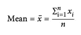

# 数据分析第一章—第一部分

> 原文：<https://medium.com/analytics-vidhya/the-first-chapter-of-data-analysis-part-i-2aafe332cf6b?source=collection_archive---------13----------------------->

任何数据科学项目的第一步都是探索性数据分析(EDA)！

大约 60 年前，美国杰出的统计学家约翰·w·塔基(John w . Tuckey)(1915–2000)发表了一篇名为“**数据分析的未来**”的革命性论文，提出了一种新的科学学科，称为数据分析。在经典统计学中，统计学家大多把他们的注意力限制在推断上，因为这是一个基于有限数量的样本得出总体结论的复杂过程。约翰·塔基在统计学和计算科学如计算机科学和工程学之间建立了联系。在这本现已成为经典的书中，*探索性数据分析，*他利用简单的图表和统计摘要，给出了所研究主题的全貌。

> *在经典统计学中，他们设计实验，然后收集数据，而在数据科学中，他们使用已经收集的数据作为知识发现的基础！*

在 EDA 的第一部分，我们将主要关注汇总统计数据、使用的指标以及如何用 python 语言实现它们。我们从数据结构和类型开始，这是任何数据驱动决策的基础。

# 数据结构

数据来自不同的资源，如物联网设备产生大量待分析的数据。数据科学的首要也是最关键的目标是利用尽可能多的原始数据，并将其转化为可操作的知识。大多数时候，原始数据是以非结构化或半结构化数据的形式收集的。为了提取知识，需要将非结构化数据转换成结构化数据。结构化数据的典型形式是矩形数据(有时称为数据框)，它由许多行组成，称为*记录*，具有多个列，称为*特征*。**在 *Python* 中，使用 Pandas 库，基本的矩形数据结构是 DataFrame 对象。**

# 数据类型

了解了数据的结构之后，您应该知道手边的数据类型。但是为什么知道数据类型如此重要呢？在数据科学和预测建模过程中，数据类型对于采用可视化显示、数据分析和统计模型的类型至关重要。它也决定了软件如何处理变量的计算方面。


数据类型

数据类型分为数字和分类类型。数值数据类型是可以用数值范围表示的数据。它可以是连续的，取某个区间内的任何值，也可以是离散的，只取整数值。在分类数据类型中，数据只能接受一组表示特定类别的特定值。它可以是名义类型，由不同的名称组成，也可以是顺序类型，有明确的顺序，如低、中、高。

# 统计摘要

## **地点**

EAD 的一个基本步骤是找出给定特性的典型值。它决定了给定特征的位置、中心倾向。下面给出了估计位置的不同方法。这部分主要受《数据科学家实用统计学[一书的启发。](https://www.oreilly.com/library/view/practical-statistics-for/9781491952955/)

*   **表示**:所有值的总和除以值的个数。



python 实现是:

```
import numpy as npx = [1, 2, 2, 1, 23, 4, 5, 6, 2, 3]
np.mean(x)
```

*   **Trimmed Mean** :在每端去掉固定数量的排序值，然后取剩余值的平均值。它用于消除极值的影响。


10%修整平均值的 python 实现如下

```
from scipy.stats import trim_meanx = [1, 2, 2, 1, 23, 4, 5, 6, 2, 3]
trim_mean(x, 0.1)
```

*   **加权平均值:**通过将每个数据值 *x_i* 乘以用户指定的权重 *w_i* 并将它们的总和除以权重的总和来计算。公式是:


我们主要在两种情况下使用加权平均值:当一些值比其他值更易变(不太可靠)时。因此，值的变化越大，权重就越低。另一种情况是，每个样本来自不同规模的群体。python3 的实现如下:

```
import numpy as npx = [1, 2, 2, 1, 23, 4, 5, 6, 2, 3]
w = [10, 12, 32, 34, 32, 45, 21, 56, 21, 100]
weighted_mean = np.average(x, weights=w)
```

*   **中位数**:先将数值按升序排序，然后取一个数值，将样本分成相等的两组。如果值的数量是偶数，则是两个中间值的平均值。 ***与依赖于所有值的平均值不同，中值仅依赖于中间值，这使其对异常值具有鲁棒性。*** 离群值是指与数据集中的其他值相距甚远的任何值。python 实现是:

```
import numpy as npx = [1, 2, 2, 1, 23, 4, 5, 6, 2, 3]
median = np.median(x)
```

## 变化性

另一个统计汇总指标称为可变性，衡量值是紧密聚集还是分散分布。可变性的另一个名称是离差。就像位置估计量一样，我们有不同的可变性估计量。

*   **平均绝对偏差:**通过平均每个数值相对于平均值的绝对偏差来计算。公式是:


python 实现是

```
import numpy as np
from numpy import mean, absolutex = [1, 2, 2, 1, 23, 4, 5, 6, 2, 3]
mean_abs_dev = np.mean(np.absolute(x - np.mean(x)))
```

*   **方差:**另一个众所周知的变异性估计量是方差及其平方根 knwon 作为**标准差**。公式是


python 实现是:

```
import numpy as npx = [1, 2, 2, 1, 23, 4, 5, 6, 2, 3]var = np.var(x, ddof=1)
sd = np.std(x, ddof=1)
```

标准差比方差更便于解释，因为它是在相同的数值范围内。

*   **中位数绝对偏差(MAD):** 与位置估计量类似，方差和标准差容易受到异常值的影响。MAD 是另一种基于中位数的变异性估计量，对异常值更稳健。MAD 的公式是:


python 实现如下:

```
from statsmodels import robustx = [1, 2, 2, 1, 23, 4, 5, 6, 2, 3]
mad = robust.scale.mad(x)
```

***标准差总是大于平均绝对偏差，而平均绝对偏差本身又大于中位数绝对偏差。***

*   **四分位距(IQR):** 可变性的另一个常用度量是四分位距或简称 IQR。这就是 75 分和 25 分的区别。在数据集中，第 *P-* 百分位数是一个值，使得至少有 *P* 个百分比的值等于或小于该值，至少有(100 — *P* )个百分比的值等于或大于该值。python 实现是:

```
import numpy as npx = [1, 2, 2, 1, 23, 4, 5, 6, 2, 3]
IQR = np.quantile(x, 0.75) - np.quantile(x, 0.25)
```

# 总结

本文为数据科学奠定了基础。在第一部分中，我们讨论了统计摘要，并介绍了许多位置和可变性度量，以及每个度量有用的情况。在下一部分，我们将讨论 EDA 中最有用的分布和可视化显示。敬请关注！