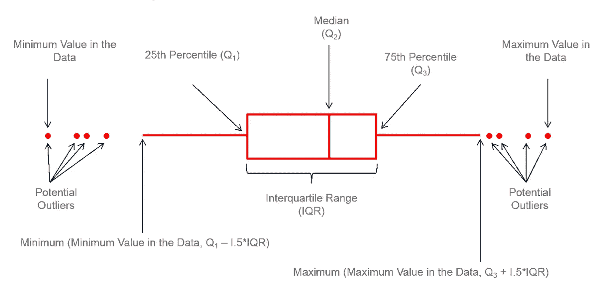
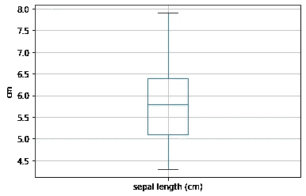
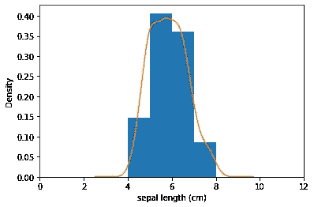
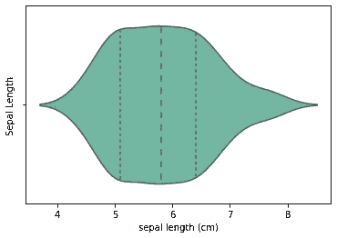
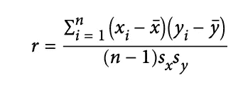
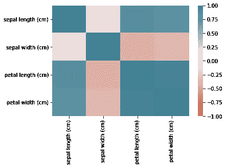
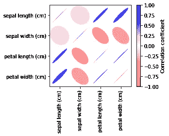
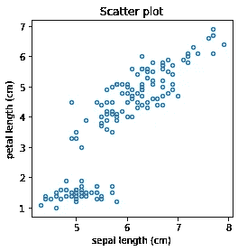
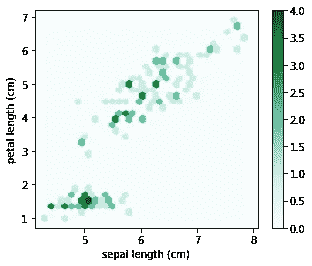
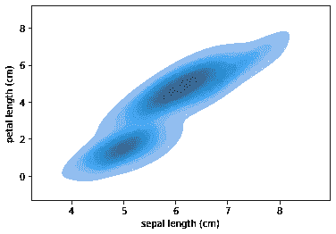

# 数据分析第一章—第二部分

> 原文：<https://medium.com/analytics-vidhya/the-first-chapter-of-data-analysis-part-ii-dedb3406cb9d?source=collection_archive---------8----------------------->

探究数据在整体上是如何分布的。

在[的第一部分](/analytics-vidhya/the-first-chapter-of-data-analysis-part-i-2aafe332cf6b)中，我们找到了探索性数据分析(EDA)的基础，重点是统计汇总。在这一部分中，我们将专门研究数据分布，并研究表示数据的不同方法。

使用统计摘要，我们可以深入了解数据的抽象形式，如位置和可变性。这在单变量分析中尤其重要，因为只有一个变量是感兴趣的。在双变量和多变量分析中，多个变量之间的分布和关系有助于了解幕后发生的事情。

# **数据分发**

查看数据的方式多种多样。每种方法都有独特的抽象和粒度级别。在下文中，我们将研究呈现数据的不同显示方法。为了演示该原理的有效性，我们将使用来自 python *的 *scikit-learn 库*的虹膜数据集。*可以通过以下 python 代码加载数据:

```
import pandas as pd
from sklearn import datasetsiris = datasets.load_iris()#data frame to accommodate the data
df = pd.DataFrame(data=iris.data, columns=['sepal length (cm)', 'sepal width (cm)', 'petal length (cm)', 'petal width (cm)'])
```

## 箱线图

这个图最早是由约翰·w·塔基(1915-2000)提出的，目的是快速了解样本的分布。它基于四分位数(25%、50%、75%百分位数)。在数据集中，第 *P-* 百分位数是一个值，使得至少有 *P* 个百分比的值等于或小于该值，至少有(100 — *P* )个百分比的值等于或大于该值。



[箱线图解剖学](https://www.leansigmacorporation.com/box-plot-with-minitab/)

上图显示了箱形图的结构。箱线图非常便于识别潜在的异常值。通过查看箱线图，您将快速了解样本的位置、可变性(**(IQR)**)和分布。例如， **50%的数据驻留在盒子内部。**作为一个例子，我们展示了针对萼片长度变量的虹膜数据集的箱线图。



萼片长度箱线图

上面方框图的 python 代码是

```
ax = df.boxplot(column='sepal length (cm)')
ax.set_ylabel('cm')
```

注意，由于萼片长度的最大值是 7.9 厘米，上部须延伸到最大值，而不是 1.5IQR+ 75%百分位数。

## 频率表和直方图

频率表将变量分成大小相等的区间，并计算有多少样本落入给定的区间。所以，**桶(区间)的大小决定了频率表绘图的整体性能。如果它们太大，分布的重要特征会变得模糊。如果它们太小，结果就太细了，就失去了看到更大画面的能力。**这也适用于直方图显示。

## 密度图

密度图与直方图相关，并以连续线条显示图的分布。当间隔的宽度非常小时，可以认为是平滑的直方图。通常通过*核密度估计来计算。*萼片长度的直方图和密度估计如下图所示:



直方图和密度图

Pandas hist 图可用于描绘直方图和密度图:

```
ax = df['sepal length (cm)'].plot.hist(density=True, xlim=[0,12], bins=range(2,10))
df['sepal length (cm)'].plot.density(ax=ax)
ax.set_xlabel('sepal length (cm)')
```

**小提琴剧情**

violin 图是箱线图和密度图的组合，它被提议用密度图来扩充箱线图。



小提琴情节

小提琴情节的代码如下:

```
import seaborn as snsax = sns.violinplot(df['sepal length (cm)'], inner='quartile', color='white', palette="Set2")
ax.set_ylabel('Sepal Length')
```

## 相互关系

在双变量和多变量分析中，检验多个变量之间关系的第一步是相关性。如果 X 的高值与 Y 的高值相关，X 的低值与 Y 的低值相关，则变量 X 和 Y(每个变量都有测量数据)被称为正相关。如果 X 的高值与 Y 的低值相关，反之亦然，则变量负相关。相关系数给出了两个变量之间相关性的估计值，这两个变量总是位于同一尺度上。一种流行的相关类型是*皮尔逊相关*系数，如下所示:



皮尔逊相关系数

在 Iris 数据集中，四个不同变量的相关系数如下图所示



可以看出，每个变量与自身的相关性最高，这在直觉上是正确的。此外，一些变量如萼片长度和花瓣长度高度正相关，而萼片宽度和花瓣长度高度负相关。python 实现如下面的代码所示:

```
sns.heatmap(df.corr(), vmin=-1, vmax=1, cmap=sns.diverging_palette(20, 220, as_cmap=True))
```

呈现相关表的另一种方法如下所示，该方法添加了椭圆形状，以明确显示两个变量相关的方向。下面的代码摘自《数据科学家实用统计学》一书。



具有明确方向的相关系数表

形状越暗越窄，两个变量的相关性越高。零相关由正圆表示。下面的代码(摘自《数据科学家实用统计》)演示了相关系数表

```
from matplotlib.collections import EllipseCollection
from matplotlib.colors import Normalize
import numpy as np
import seaborn as sns
import matplotlib.pylab as pltdef plot_corr_ellipses(data, figsize=None, **kwargs):''' https://stackoverflow.com/a/34558488 '''M = np.array(data)
if not M.ndim == 2:
raise ValueError('data must be a 2D array')fig, ax = plt.subplots(1, 1, figsize=figsize, subplot_kw={'aspect':'equal'})
ax.set_xlim(-0.5, M.shape[1] - 0.5)
ax.set_ylim(-0.5, M.shape[0] - 0.5)
ax.invert_yaxis()# xy locations of each ellipse center
xy = np.indices(M.shape)[::-1].reshape(2, -1).T# set the relative sizes of the major/minor axes according to the strength of# the positive/negative correlation
w = np.ones_like(M).ravel() + 0.01
h = 1 - np.abs(M).ravel() - 0.01
a = 45 * np.sign(M).ravel()ec = EllipseCollection(widths=w, heights=h, angles=a, units='x', offsets=xy, norm=Normalize(vmin=-1, vmax=1),
transOffset=ax.transData, array=M.ravel(), **kwargs)
ax.add_collection(ec)# if data is a DataFrame, use the row/column names as tick labelsif isinstance(data, pd.DataFrame):ax.set_xticks(np.arange(M.shape[1]))
ax.set_xticklabels(data.columns, rotation=90)
ax.set_yticks(np.arange(M.shape[0]))
ax.set_yticklabels(data.index)return ec, figm, fig = plot_corr_ellipses(df.corr(), figsize=(5, 4), cmap='bwr_r')cb = fig.colorbar(m)
cb.set_label('Correlation coefficient')plt.tight_layout()
plt.show()
```

**皮尔逊相关系数更容易受到异常值的影响。基于等级的相关系数，例如*斯皮尔曼的ρ*，对于异常值是稳健的。**

## **散点图、六边形宁滨和等高线**

表示两个变量之间关系的标准方法之一是散点图。掌握两个变量之间关系的一般概念是表示数值的有效方法。



散点图

下面的代码实现了散点图

```
ax = df.plot.scatter(x='sepal length (cm)', y='petal length (cm)', figsize=(4, 4), marker='$\u25EF$')
ax.set_xlabel('sepal length (cm)')
ax.set_ylabel('petal length (cm)')
ax.set_title('Scatter plot')
```

从图中可以看出，萼片长度和花瓣长度也呈正相关，相关系数也是如此。

对于拥有数十万或数百万条记录的数据集，散点图会过于密集，因此我们需要一种不同的方式来可视化这种关系。六边形宁滨是展示散点图状的非常有效的方式，同时不会太嘈杂和密集而丢失数据的轨迹。对于与散点图相同的变量集，六边形宁滨将所有值对分成六边形，并根据给定条柱中值的计数调整每个条柱的强度。萼片和花瓣长度的六边形框如下图所示:



六角仓

六角形图的 python 代码如下所示:

```
ax = df.plot.hexbin(x='sepal length (cm)', y='petal length (cm)', gridsize=30, sharex=False, figsize=(5, 4))ax.set_xlabel('sepal length (cm)')
ax.set_ylabel('petal length (cm)')
```

有时，通过反绘图透镜观察联合分布是有益的。当数据量很大，需要在散点图中清楚显示时，计数器图是另一种方法。萼片和花瓣长度的计数图如下图所示:



等值线图表

等值线图的 python 代码如下图所示:

```
ax = sns.kdeplot(data=df, x=’sepal length (cm)’, y=’petal length (cm)’, fill=True)ax.set_xlabel(‘sepal length (cm)’)
ax.set_ylabel(‘petal length (cm)’)
```

# 结论

在这篇短文中，我们旨在涵盖数据分析中最基本但又最基本的原则。本文和第一部分[一起展示了 EDA 的第一步，EDA 是统计分析中的独立主题。](/analytics-vidhya/the-first-chapter-of-data-analysis-part-i-2aafe332cf6b)