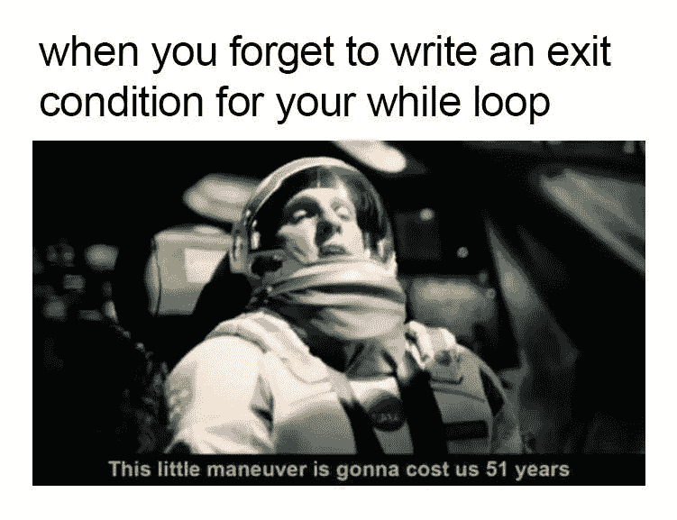
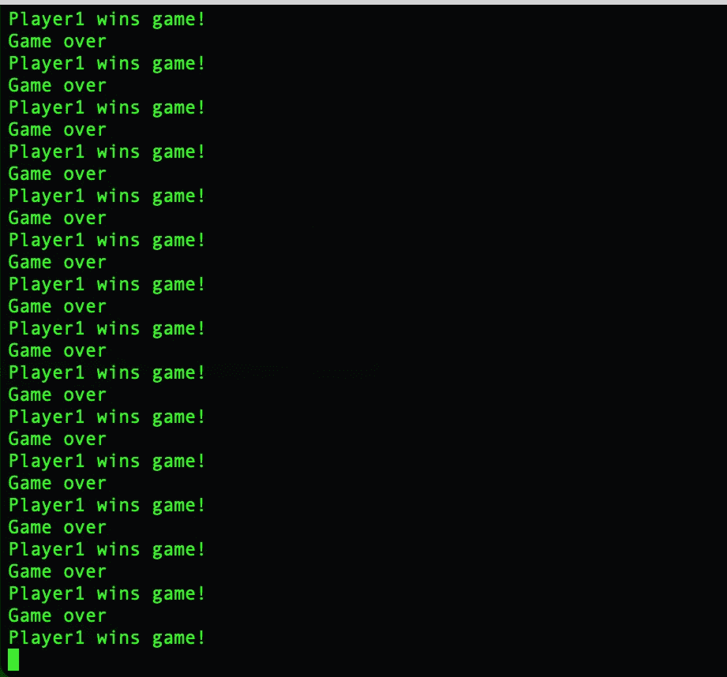
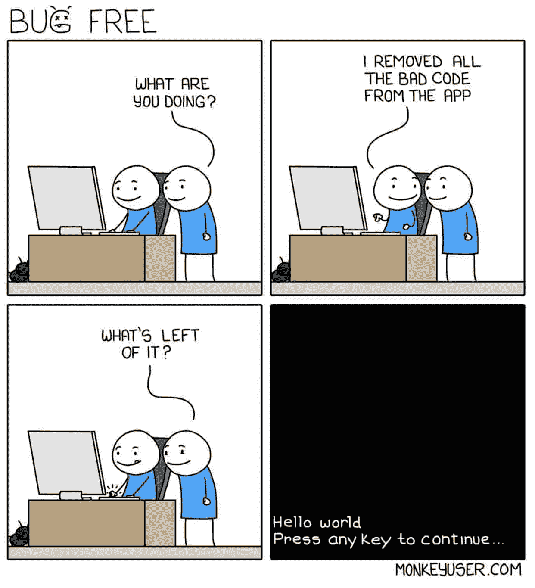

# 第一次陷入无限 Python 循环…

> 原文：<https://medium.com/analytics-vidhya/the-first-time-i-got-stuck-in-an-infinite-python-loop-bdbf33c7ffb?source=collection_archive---------13----------------------->

…以及我在陷入另一个无限循环之前为修复它所做的一切，以及从我的第一个代码项目中学到的其他东西。

我的第一堂 Python 课([关于柯尔特·斯蒂尔的 Python 3 Udemy Bootcamp](https://www.udemy.com/course/the-modern-python3-bootcamp/) )包括一个快速教程，教我如何做一个无限 While 循环，以及如何永远不要再这样做，除非目的是烧我的电脑。

现在，While 循环是一个非常好的工具。当与*功能* break 语句一起使用时，一个简单的 While 循环可以成为一些非常酷的应用程序的基本结构。这里的“break statement”指的是任何会打破循环的语句，而不是 python [关键字](https://www.w3schools.com/python/ref_keyword_break.asp)“break”。

概念很简单；编写条件逻辑，当所述条件为真时，代码将被执行。一旦语句不再为真，代码就会停止。很简单，对吧？



这要归功于这个 LOLs 迷因的创造者。不幸的是，我不知道那是谁。如果碰巧是你，给我发个信息，我就可以链接你的页面了！

我在为一个石头、剪子、布的游戏写快速脚本时，偶然发现了我的第一个无限循环。

这个游戏通常由人类来玩，由两个玩家在数到三或者说“石头，剪刀，布，开始”后，闪现手势(拳头代表石头，张开手代表布，和平手势代表剪刀)!！！！!"。

获胜者是根据一些非常简单的规则决定的:石头赢剪刀，布赢石头，剪刀赢布。更多关于游戏起源的信息请点击。

由于我不知道如何建立一个图形用户界面，我的游戏将通过计算机终端来玩，而且将只基于文本。

初始设置很简单，我需要让用户输入他们的选择，我需要计算机做出选择，我需要根据游戏规则宣布获胜者。为此，我使用 [Python 的随机模块](https://docs.python.org/3/library/random.html)让计算机“挑选一个对象”，并将选择存储在一个变量中。我还声明了一个供用户选择的变量和一系列决定本轮获胜者的 If 语句。

当我写好游戏的主要结构时，我感到非常自信，并决定添加一些✨ ***临时演员*** ✨.

该脚本的早期版本如下所示:

一个早期版本的游戏，允许用户选择一个昵称，在比赛中随时退出，并在得分的同时进行多轮比赛。

我添加了一个输入，让用户选择一个昵称，并在整个游戏中使用它，我还设置了一些变量来跟踪分数，并添加了退出游戏的选项。

在这一点上，我想改变脚本的一些东西(*意外的行为斗争是真实的*)，但我最主要的事情是我想让用户能够再次玩而不必重启文件。

将灾难排队。

我创建了一个名为“active_game”的变量，并将其值设置为“y”*****，然后在我的主结构周围包裹了一个 while 循环，并以一个提示结束，提示用户决定是继续玩还是退出。用户的输入将相应地更新 active_game 变量。

***** 我认为值得一提的是，有更好的、可能更多的*python 式的*方法来定义 active_game 变量，但当时我被陷入无限循环的想法吓坏了，避开布尔似乎是阻止这种情况发生的最好方法。我不知道…

无论如何，下面是让我陷入循环的代码。看看你是否能发现错误:

也许看到结果会有所帮助:



你抓住它了吗？

如果你没有，不要担心，我只花了 1.5 个小时重新运行相同的脚本，画奇怪的脸，同时对我的电脑永远坏掉的想法感到恼火和压力。谢天谢地，电脑有一个“退出终端”选项，可以结束正在运行的进程。



[https://www.monkeyuser.com/](https://www.monkeyuser.com/)

玩笑归玩笑，这确实花了我很长时间来解决。我犯的错误是没有缩进用户必须选择是否再次播放的那一行。如果仔细观察，会发现提示在外循环之外，没有使用任何东西来中断，也没有添加新的输入，唯一正确的说法是一个分数比另一个分数高，这意味着获胜者将被无休止地打印出来。

很困惑吗？我们来分解一下。

在我的外部循环中，我告诉程序只要 active_game 等于“y”就运行。然后，我定义了一个内部循环，只要两个分数都小于 winning_score(在本例中为 3 ),这个循环就会继续运行。在接下来的步骤中，比较用户和计算机给出的答案，并将分数存储在各自的分数变量中。

一旦得分变量中的任何一个达到 3，内部循环就被打破，打印出“游戏结束”，一个新的 If 语句告诉程序根据谁的得分最高打印出获胜者。但是编辑 active_game 值的选项从来没有给出过。

这里的关键是外循环，我们说过只要 active_game 等于“y”它就会运行。因为我们从未要求编辑变量，所以没有办法退出循环。

标志性的莫妮卡来表达我们现在的感受。

那么，我是怎么解决的呢？我按下 tab 键，将结束语句放在循环中。菜鸟失误？是的，但是找出为什么我的代码失败的过程是一次疯狂的经历。我重读了我的脚本 100 多次，我读了堆栈溢出的每一个线程，我甚至质疑我是否应该从课程中重新学习循环模块。直到我一行一行地向别人解释我的脚本，我才意识到错误在哪里。

接下来要做的是重新运行脚本，以确保循环正常工作。我执行了命令，开始玩游戏。一切都很顺利，直到我达到了获胜的分数，被问及是否想再玩一次。我试了一次，没有成功，程序关闭了。非常好。我重启了游戏，到达了结尾，这一次出现提示时，我按了“y”。你能猜到接下来发生了什么吗？如果有帮助的话，再看一下上面的脚本。

是的，我再次被提示，“你想再玩一次吗？是/否:"。于是，我打了“y”，再次被提示*。这种情况持续了几分钟。我很困惑。*

*我回到我的脚本，开始大声朗读，试图在我的脑海中重放逻辑。就在那里，在第 19 行。*

```
*while computer_score < winning_score and player_score < winning_score:*
```

*只有当两个分数都小于 3 时，才执行游戏循环。因为我已经打过了，而且我每赢一轮就在分数上加一分，至少有一局的分数不再低于 3。因此，选择再打一轮是不可能的。*

*解决这个问题的方法是在游戏结束时重置分数变量。然后，用户可以选择再玩一次并真的这么做。*

*我的游戏终于成功了！！我让身边的每个人都试了一下，并根据反馈做了一些改变。我还加入了一些电脑互动，灵感来自我小时候玩过的旧电子游戏。*

*也有一些意想不到的行为，如当用户按下退出时，游戏的赢家就决定了。我添加了声明来避免这种情况，也删除了“平局游戏”的选项，因为这种情况永远不会发生:如果用户只赢得一轮比赛的分数，这不会是两个用户在游戏结束时都获得 3 分的情况。*

*在这个超级简单的项目中，我学到了很多东西。我本来想避免花太多时间在这上面，因为我觉得这太简单了，不相关，但男孩是我错了！*

*对我来说，这次经历的主要收获是，从来没有一个项目是不值得我们去做的。在每一行代码中都有机会学习新的东西。*

*我还学到了学习的道路永远不会结束，需要更新某些概念的知识是很好的，但是怀疑自己就不行了。恐惧会让你偏离逻辑的道路(还记得那个疯狂的 active_game 变量吗？一个 bool 值可能不会是一个破碎的脚本的原因)，犯错误是很自然的！关键是保持冷静。此外，从那以后，我开始在技术领域工作，我已经看到高级开发人员犯了数百次愚蠢的错误。没什么好怕的。*

*也许下一次我会试着做一些 GUI 的东西，我们会看到的。同时，我的石头、剪子、布游戏的代码可以在这里找到。*

*感谢阅读！*