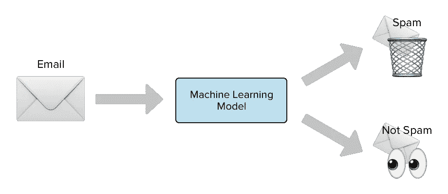

# 机器学习的基础第 1 部分

> 原文：<https://medium.com/analytics-vidhya/the-fundamentals-of-machine-learning-part-1-e7d5e8b66905?source=collection_archive---------21----------------------->

亲爱的读者们，写关于不同科技相关事物的博客一直是我感兴趣的领域。尤其是在机器学习方面。现在我终于决定跳进游泳池，我希望和你们一起游向终点。:-D .从今天开始，我们将深入研究机器学习，并尝试通过 Python 理解一些机器学习概念。

**注:这个系列实际上是受 Aurelien Geron 的“用 Scikit-Learn，Keras & TensorFlow 进行机器学习”的启发。**

我们开始吧。

## **什么是机器学习？**

机器学习是一门编程艺术，在这门艺术中，机器或系统获得了从其经验中学习某些东西的能力。机器学习的一个更广义的定义可以是

> *“[机器学习是]一个研究领域，它赋予计算机无需明确编程就能学习的能力。”亚瑟·塞缪尔，1959 年*

另一个可能是，一个更面向工程的例子

> *“据说计算机从经验 E 中学习关于某些任务和某些性能测量 P，随着经验 E 的增加而提高。”* —汤姆·米切尔，1997

也被称为 Ai(人工智能)之父的约翰·麦卡锡在一篇名为《人工智能》的文献中首次使用了人工智能这个术语，他也是人工智能学科的创始人之一。他引用了，

*“很难严谨到一台机器是否真的‘知道’、‘思考’等等。，因为我们很难定义这些东西。我们对人类心理过程的理解只比鱼对游泳的理解稍好一点*

现在，让我们举一个机器学习的例子。假设，你想进入一家酒店，在进入酒店之前，管理人员会要求你验证你是否含有任何 X 病毒。如果是，将不允许您进入酒店，否则允许您进入。为此，系统将获取您的健康相关活动数据，并根据您提供的数据对您是否感染进行分类。

在这种情况下，任务 T 是标记您是否被感染，经验 E 是系统的训练部分，它从以前的数据中学习，而 P 是系统将您分类为被感染或未被感染的表现，它是一种称为准确性的特定表现测量的形式。

现在，如果你只是下载一份百科全书到你的硬盘上，你的电脑会有更多的数据，但它不会突然变得更好。因此，它不是机器学习。

## **我们为什么要使用机器学习？**

几十年前，有一种为复杂问题编写非常复杂的代码的传统，比如在人和机器之间下棋，过滤电子邮件是否是垃圾邮件。这些复杂的代码可能是复杂的嵌套 if-then-else 条件，程序员必须为每个条件的所有输出编写代码。

假设一个垃圾邮件过滤算法的例子。如果用户想检测一封邮件是否是垃圾邮件，就必须找出邮件主题和正文中的模式，找到模式后，用户就可以区分它是否是垃圾邮件。为了对这个问题编码一个算法，程序员不得不考虑每一个可能的模式，并把它们放入算法中，这最终将导致编码者的一个乏味的旅程，并且仍然不能保证在模式上提供具有良好准确性的结果。

为了解决这个问题，程序员可以使用机器学习算法，其中模型将自动学习数据中存在的流和模式，不仅能够产生开箱即用的输入。

垃圾邮件过滤器示例

## 机器学习在哪里出名？

*   众所周知，在这些问题中，现有的解决方案需要大量的手工调整或很长的规则列表。
*   适应:经过训练的机器学习模型具有适应新环境(输入)的能力。也就是说，一个模型也可以回答那些从未被训练过的问题。
*   为复杂问题和大量数据提供见解。

## 机器学习系统的类型。

有许多不同类型的机器学习系统，它们是:

*   监督学习
*   无监督学习
*   半监督学习
*   强化学习
*   批量学习
*   在线学习
*   基于实例的学习
*   基于模型的学习

## 结论:

在下一部分，我们将涵盖对机器学习类型的理解，此外，我们将尝试揭示机器学习的挑战以及更多。

结束。保重，:D