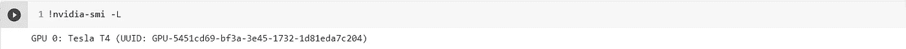
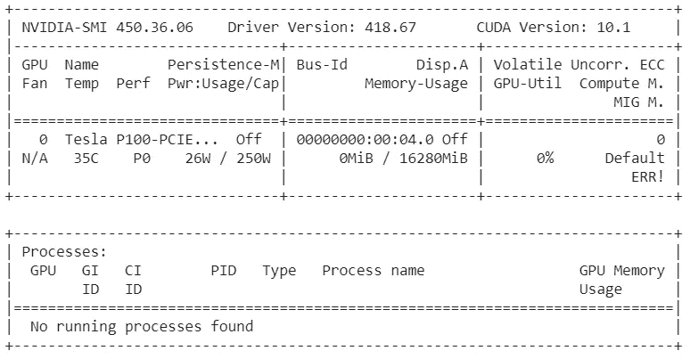
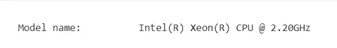

# 每个 Colab 用户都应该知道的八个命令

> 原文：<https://medium.com/analytics-vidhya/the-google-colab-system-specification-check-69d159597417?source=collection_archive---------1----------------------->


无论你是 python 初学者、数据科学家还是深度学习研究人员，你通常都在使用最灵活、最容易使用的 Google Colaboratory 或简称为 Colab。您的 Colab 支持免费使用 GPU 的能力，以加快您的执行时间。Colab 还提供了共享笔记本的便利。如果你不熟悉谷歌联合实验室，我请求你先访问谷歌联合实验室的友好介绍。

在这里，今天你将快速学习如何在 Colab 上检查各种系统规格。

1.  **查看图形处理器的数量及其名称:**

```
!nvidia-smi -L
```

nvidia 提供的 nvidia-smi 命令用于管理和监控启用了 GPU 的节点，list option -L 显示连接到节点的 GPU 列表。通过在您的代码片段上执行上述命令，您将获得 GPU 的数量和名称。在我的例子中，我得到了如下结果:



类似地，用户可以使用查询选项来显示 GPU 和单元信息。

```
!nvidia-smi -q
```

通过在您的代码片段上执行上述命令，您将获得完整的 nvidia-smi 日志。

**2。在执行深度学习或数据科学任务时获取 GPU 活动的轨迹:**

```
!nvidia-smi
```

在执行时，您会看到类似这样的内容，



**3。获取 CPU 信息:**

```
!lscpu |grep 'Model name'
```

在执行时，您会看到类似这样的内容，



**4。检查物理处理器的插槽数量:**

```
!lscpu | grep 'Number of Socket(s):'
```

执行后，您将获得 Colab 分配给您的套接字数量。就我而言，我得到了 1 英镑。

**5。检查每个处理器拥有的内核数量:**

```
!lscpu | grep 'Core(s) each processor has/per socket:'
```

执行后，您将获得 Colab 为每个插槽分配的内核数量。在我的例子中我得到了 1。

**6。检查每个内核的线程数量:**

```
!lscpu | grep 'Number of threads/core:'
```

在执行时，您将获得 Colab 分配给您的每个内核的线程数。在我的例子中，我得到了 2。

**7。检查 CPU 的时钟频率:**

```
!lscpu | grep "Clock frequency in MHz:"
```

在执行时，你将获得分配给你的 CPU 的时钟频率。

**8。查看分配给你的内存:**

```
!free -h --si | awk  '/Mem:/{print $2}'
```

执行时，您将看到分配给您的当前使用的空闲内存。

*感谢提升自己。分享一下你的看法。*