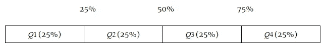
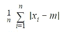
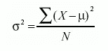
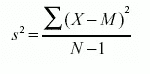
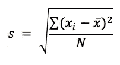

# 《分散》中的语法术语:它们是什么以及快速公式

> 原文：<https://medium.com/analytics-vidhya/the-grammar-terms-in-dispersion-what-are-they-and-the-quick-formulae-50d6fa38ff49?source=collection_archive---------12----------------------->

离差用于确定数据中的不确定性或查看信息是否分散。一般来说，它意味着一系列项目的大小缺乏一致性。当一个序列中项目大小的差异或缺乏一致性很大时，离散度被认为是显著的。当离差较低时，大多数数据点接近典型值，中心趋势更可靠或更能反映数据，导致离差较低，反之亦然。

如何将这种分布的可变性转化为一些相关的描述性统计数据？为了分析我们的数据，我们来看一下这些描述符:

# 范围

最大值和最小值之间的差异由数据集的范围给出。因此，该范围只考虑了两个最极端的值，而很少涉及介于两者之间的数据点。

> 范围=最大值-最小值

该范围很容易受到异常值的影响。该范围受数据集大小的影响。因此，当您从同一总体中抽取随机样本时，随着样本量的不断增加，范围也会不断扩大。只有当样本大小相等时，人们才应该使用这个范围来比较变异性。

# 四分位数

数据按四分位数分成四份。第一个四分位数 Q1 等于第 25 个百分位数，第三个四分位数 Q3 等于第 75 个百分位数。第二个四分位数，Q2，和第 50 个百分位数都被称为中位数。

四分位数

四分位值不一定属于数据集。

# 四分位数间距(IQR)

IQR 是一个反映数据集中间一半(即中间的 50%)分布情况的数字，可以帮助确定异常值。四分位距是对数据集中“中间 50”位置的计算。四分位范围是对大多数值所在位置的度量，其中范围是对集合中开始和结束位置的度量。

> 四分位距= Q3-Q1

IQR 受极端值的影响不大。

# **平均绝对偏差**

对平均值的方差(或偏差)的计算给出了平均值偏差。如果大多数数据值非常接近平均值，则平均偏差分数会很小，这表明数据中的相似性很高。如果数据点之间的差异较大，表明相似性较低，则平均偏差得分较高。

平均绝对偏差

将这个公式视为一个过程或一系列措施可能更有意义，我们可以用它来获得我们的统计数据:

我们从数据集平均值或中心测量值开始，用 m 表示。首先，我们找出每个数据值偏离 m 的程度。这意味着我们取每个数据值与 m 之间的差值。然后，取上一步中每个差值的绝对值。换句话说，对于所有的区别，我们失去了所有的负号。这背后的理论是，m 有正的和负的变化。如果我们不找出一种方法来消除负号，所有的偏差将在求和时相互抵消。所有这些绝对值加在一起。

最后，我们将这个和除以 n，这是数据值的总数。

# **差异**

方差是一个数值，表示数据集中各个数字的平均值分布有多广，因此定义了数据集中每个值与平均值之间的差异。与前面的可变性步骤不同，当将每个值与平均值进行比较时，方差包含估计值中的所有值。您计算数据点和平均值之间的一组平方差来计算这个数字，对它们进行计数，然后用它们除以观察次数。

方差不能为负。根据您是估计整个总体的方差还是使用样本来测量总体的方差，有两种方差公式。

## 总体方差

这允许人们陈述总体中的数据点是如何分布的。对于同一个数据集，如果引入一个常数值，总体变异为零，并且保持不变。

总体方差

σ2 是等式中方差的总体参数，μ是总体平均参数，N 是包含整个总体的数据点数量。

对于同一个数据集，如果引入一个常数值，总体变异为零，并且保持不变。

## 采样离散

样本方差的测量方法与总体方差的测量方法相同。

唯一的区别是，我们只使用人口数据集中的某些样本数据值来测量样本方差。

采样离散

在等式中，s2 是样本方差，M 是样本均值。在分母中，N-1 修正样本低估总体方差的倾向。

# **标准差**

数据集的标准差给出了数据集中每个值与平均值的差异程度。这与平均偏差非常相似，实际上，它给了我们非常相似的细节。标准差方便地使用数据的原始单位，使分析更简单。标准差也是最常用的变异性指标。

设 xi 为数据点的观测值，x 为平均值，N 为总数据点。

标准偏差

标准差非常重要，因为正态分布或高斯分布有助于我们量化数据点出现在数据集之外的概率。