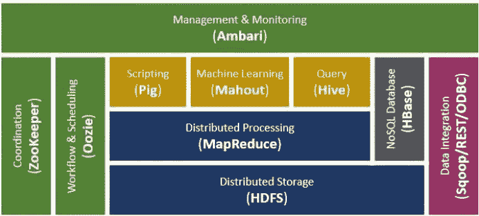

# Hadoop 生态系统

> 原文：<https://medium.com/analytics-vidhya/the-hadoop-ecosystem-1f5f9a05db94?source=collection_archive---------17----------------------->

H **adoop** 是一款基于 java 的大数据分析工具，用于在存在海量数据时填补传统方法中的空白和陷阱。它是一个开源框架，用于在商用硬件集群上存储数据和运行应用程序。它提供了海量存储和处理数据的巨大能力。它基于硬件故障是可能的并且必须由框架处理的假设。Hadoop 将大型数据文件分割成块或片段，在集群中的节点间分发，并将代码转换为数据以实现并行处理。数据是本地可用的，并且更少的进程间通信时间允许更快的处理。Hadoop 的另一个重要特性是数据冗余，因此可以轻松管理节点故障。 **Hadoop 生态系统**是一个套件，其中包含许多服务，如存储、查询、分析、维护等，这些服务共同用于解决大数据问题。它包括 HDFS、Oozie、Zookeeper、Spark、Sqoop 等组件。在这里，我们将详细研究其中的一些组件。

1.Hadoop Common——它包括 Hadoop 模块所需的库。

2.HDFS (Hadoop 分布式文件系统)——这是一个模仿 Google 文件系统(GFS)论文的分布式文件系统。它是 Hadoop 的存储组件，支持数据复制和容错。它由名称节点(主节点)组成，将接收到的文件分解为较小的块(64/128 Mb)，并将数据的副本存储在数据节点(从节点)中。

3.map Reduce——这是一个模仿 GFS 论文的分布式框架。它是 Hadoop 中的计算组件，允许并行处理大量原始数据。它将工作分解为 map 和 reduce 任务，其中 Map 执行数据的排序和过滤，Reduce 聚合映射的数据。每个节点称为任务跟踪器，执行这些 Map 和 Reduce 任务。Map 任务会将输入元素转换为键-值对，然后按键对其进行分组，并由 reduce 函数进行处理，以给出零个或多个键-值对的最终输出。

## 基于 MapReduce 的程序是如何执行的？

用户程序在 fork 命令的帮助下创建主控制器进程。它还派生了许多工作进程。主创建 map 和 reduce 任务，将它们分配给工人，并跟踪这些任务。每个 map 任务在其本地节点为每个 reduce 任务创建一个中间文件，该文件作为输入传递给 reduce 任务。所有 reduce 任务都为 MapReduce 程序生成一个输出。

4.Hadoop YARN(又一个资源协商者)—它是一个资源管理平台，用于管理集群中的计算资源，并使用它们来调度用户的应用程序。它由资源管理器、节点管理器和应用管理器组成。

5.Hive-它是一个 Hadoop 生态系统组件，用于查询和分析 Hadoop 系统的大型数据集。它用于执行数据汇总、数据查询和数据分析。它使用 HQL (Hive Query Language ),查询通过 HiveQL 转换为 MapReduce 作业。让我们看看它是如何工作的。

Hive Web UI 或 Hive 命令行向驱动程序发送查询以供执行。驱动程序将在编译器的帮助下检查查询的语法和要求。然后向 Metastore 发送一个元数据请求以获取数据，然后将数据作为响应发送回编译器。编译器会将计划发送给驱动程序，然后传递给执行引擎，接着是作业跟踪器和任务跟踪器。执行引擎将从数据节点接收结果，并将它们发送给驱动程序。最后，驱动程序会将它们发送到接口。Hive 数据模型由数据库、表、分区和桶组成。

6.h base——这是一个 NoSQL 数据库，负责管理分布式数据集，旨在将结构化数据存储在表中。它是一个可扩展的分布式数据库，提供对 HDFS 中的读或写数据的实时访问。HBase 主要有两个组件- HBase Master 和 RegionServer。

您可能想知道它与关系数据库有何不同。以下是方法:

与面向行的 RDBMS 不同，它是面向列的。它是无模式的，而 RDBMS 使用模式。此外，它具有非规范化的数据，适合于联机分析处理(OLAP)，而 RDBMS 则适合于联机事务处理(OLTP)。

HBase 数据模型由表、由行键标识的行、由多个列组成的列族、单元格和不同版本的数据组成。

7.Pig **-** 它由雅虎开发，基于 pig Latin 语言，一种类似于 SQL 的基于查询的语言。它是一个构建数据流、处理和分析庞大数据集的平台。Pig 执行命令，MapReduce 的所有活动都在后台处理。处理后，Pig 将结果存储在 HDFS。它提供了可扩展性、所有类型的数据处理、优化等等。

8.Zookeeper- Apache Zookeeper 是一个集中式服务，用于维护配置信息、命名和提供分布式同步。它还可以提供团体服务。通过 Zookeeper 可以管理大量的机器集群。

9.Apache Mahout- Mahout 是一个开源框架，用于创建可扩展的[机器学习](http://data-flair.training/blogs/machine-learning-tutorial/)算法和数据挖掘库。一旦数据存储在 Hadoop HDFS 中，Mahout 就会提供数据科学工具来自动在这些大数据集中找到有意义的模式。它执行诸如聚类、频繁模式挖掘、分类等算法。

10.Apache Flume——Flume 有效地收集、聚合和移动大量数据，并将其发送回 HDFS。这是一种容错和可靠的机制。它允许数据从数据源流入 Hadoop 环境。使用 Flume，人们可以将来自多个服务器的数据立即导入 Hadoop。

11.sqoop——它是一个在 Hadoop 和 RDBMS 之间传输数据的工具。它允许将数据从 RDBMS 导入 Hadoop，并将数据从 Hadoop 导出到 RDBMS。

12.Apache Spark——它是为快速计算而设计的，并扩展了 MapReduce 来执行复杂的计算和流处理。它速度快，支持多种语言，包括 Java 和 Python。它支持流数据、机器学习、SQL 和 Map and Reduce。它可以安装在 HDFS 之上，也可以在没有任何预安装的情况下运行。

其架构包括 Spark SQL、用于流分析的 Spark streaming、MLlib 或机器学习库，以及 GraphX，这是一种分布式图形处理框架。

Hadoop 生态系统