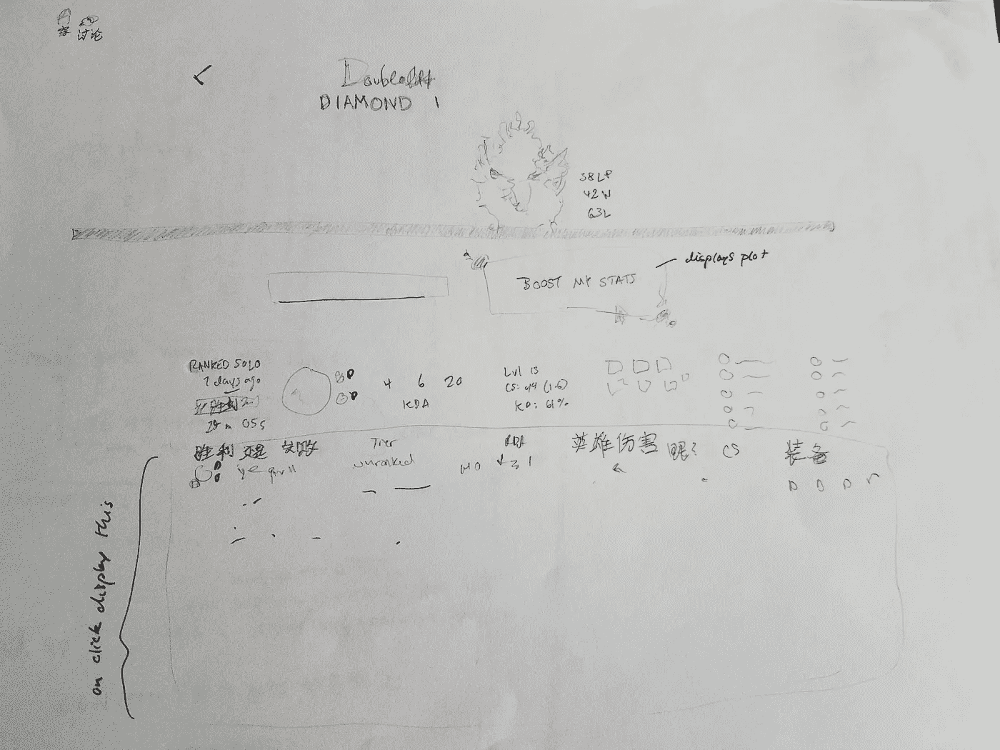
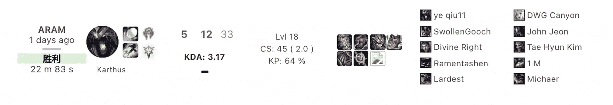
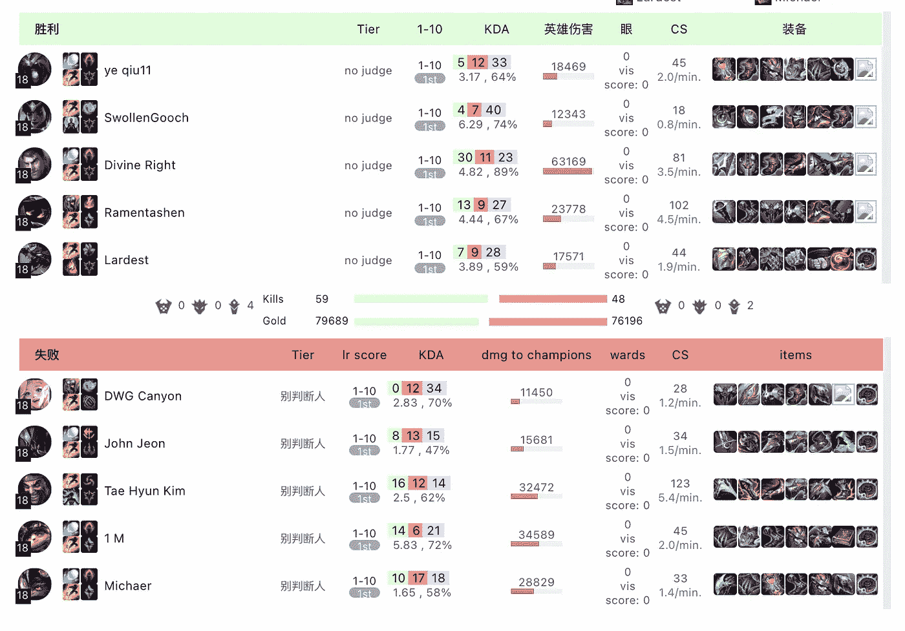
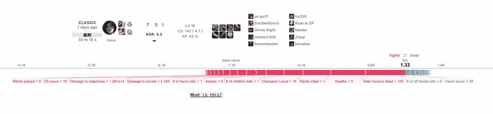
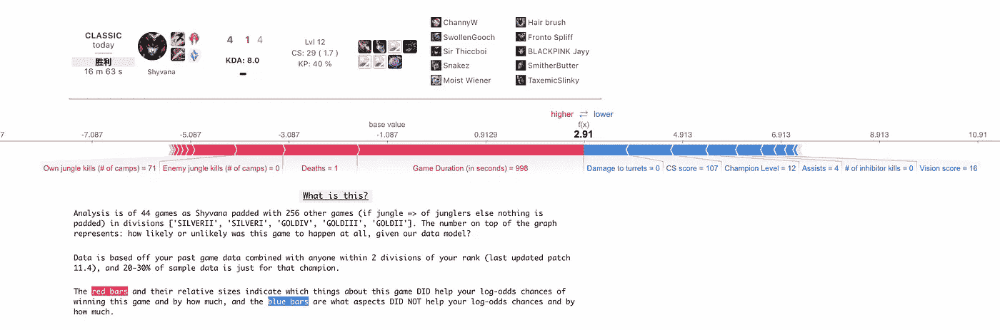

# 衷心的故事，我建立了一个英雄联盟的胜利解释为硬卡银 II 玩家(100%不是我)

> 原文：<https://medium.com/analytics-vidhya/the-heartfelt-story-of-me-building-a-league-of-legends-win-interpreter-for-hard-stuck-silver-ii-36684c99facc?source=collection_archive---------7----------------------->


# 介绍

英雄联盟是一个 5v5 团队游戏，每个玩家可以选择一个冠军(从 154 个选项中选择)和角色(顶级，丛林，中期，adc/bot，支持/bot)。该游戏的竞争场景是充满活力的和全球性的，有一个*绝对无毒*排名配对选项，玩家可以在其中相互竞争，并爬上 ELO 阶梯排名。我想看看机器学习模型是否能回答玩家可能对比赛提出的常见问题:“在这场比赛中，我做了什么有助于或有损于我获胜的机会，以及发生的每件事有多重要？”

在我继续讲下去之前，请亲自尝试一下[这里](http://liamisaacs.com/league)——请注意，算法计算起来很费力，而且 API 的速率有限制，所以在测试阶段，如果有两个人以上在使用它，算法确实会崩溃😰😰

这篇博文会更多💫面向旅程💫而不是本质上的🐍机器人 snek🐍(python3，我更喜欢这么称呼)，不过请随意看这里的所有代码。

# 如何应对雄心壮志？

在 3 月 8 日的晚上，我发现自己处于一种和我开始大部分项目时相似的心理状态:头脑风暴后的崩溃，在孤独的街道上缓慢地演奏萨克斯管，试图实际做这件事的痛苦。

我曾认为，如果在用算法技巧熨平它之前，我尝试“勾画”一幅我想要的图像，会更有意义。



大约在 2021 年 3 月，利亚姆的第一个网络应用草图(可能是有史以来)

即使在这之后，我也很难看清从显示器的哪一部分开始。我决定尝试使用 Flask/Django、html 和一些 javascript 来制作比赛显示的第一个单行部分。没有机器学习，没有算法，只有 EDA。

## `Reading player data, passing to app.py`

`player data-->app.py`

我们从定义玩家数据开始

```
#in a .py file that's not app.py#playerdata.py
from riotwatcher import LolWatcher, ApiErrorclass game_info():     def __init__(self, api_key, name, region, game_id): 
        self.api_key = api_key
        self.name = name
        self.region = region
        self.game_id = game_id
        watcher = LolWatcher(self.api_key)
        self.user = watcher.summoner.by_name(region, name)

    def match_data(self):
        watcher = LolWatcher(self.api_key)
        self.matches = watcher.match.matchlist_by_account
                       (self.region, self.user['accountId'])
        self.this_match = watcher.match.by_id(self.region, 
                       self.game_id)

        def get_data(): 
            n = []
            for row in m['participants']: #for player in match
                m_row = {} 
                m_row['kills'] = row['stats']['kills']
                #so on and so forth for every piece of data you want
                n.append(m_row)
            return n

        n = get_data()
```

我们可以这样做

```
#player data-->app.py#in app.py
from models.playerdata import game_info
from riotwatcher import LolWatcher, ApiErrorapp = Flask(__name__)@app.route('/initial_search_page', methods=["GET", "POST"])
def riot_api_call(): 
    #get search input, like 'Doublelift' if request.method = 'POST':
        form = request.form
    for key in form:
        name = form[key] region = 'na1'
    user = watcher.summoner.by_name(region, name)
    matches = watcher.match.matchlist_by_account(region, 
              user['accountId'])

    game_ids = []
    game_amount = 3
    for i in range(game_amount): 
        game_ids.append(matches['matches'][i]['gameId'])

    dfs = {}
    for game_id in game_ids:
        dfs[game_id] = game_info(api_key, name, region, game_id).
                       match_data()
```

由于`game_info()`是一个带有`match_data()`方法的类，我们可以在任意数量的游戏中使用它。面向对象编程又一次给我们带来了荣耀。

## 创建表单页面

*   `initial_serach_page.html`

我们创建一个表单来获取我们要搜索的名称，比如“Doublelift”

```
<form id="riot-api-form" action = "{{ url_for('riot_api_call') }}">
     <input placeholder="Doublelift..." type="text">
</form>
```

假设上面的`riot_api_call()`加载了另一个 html 页面，

```
@app.route(‘/initial_search_page’, methods=[“GET”, “POST”])
def riot_api_call():
    ...
    ...
    return render_template('public/separate.html', dfs = dfs)
```

在我们的`separate.html`中，我们可以运行一个`for`循环来显示每一场比赛。

下面是`html`的一个简短片段:

```


   <div class="gamelist">
      <div class="gameitem">
         <div class="gameitem {{ 'win' if 
          D_df.loc[D_df['summonerName'] == name]['win'].values[0] == 
          '胜利' else 'lose' }}">
            <div class="content">
               <div class="gamestats">
                 <div class="gametype">
                        {{ D_df.loc[D_df['summonerName'] == name]
                        ['gameMode'].values[0] }}
                 </div>
                 <div class="timestamp">
                        
                        {{ D_df.loc[D_df['summonerName'] == name]
                        ['lastGamePlayedWhen'].values[0] }} days ago
                        
                          today
                        
```

来来回回看了足够多，远远超过杰瑞·宋飞(我不看《宋飞正传》——这种参考合适吗？)，我得到了



从 match_data()到我对 OP.gg 的单行统计的看法

## 点击显示高级统计数据

我首先编写了单击时淡入淡出 html div 所需的 javascript

```
var show_details = document.querySelectorAll('.game_deets')
var btn = document.querySelectorAll('.content')for (let i=0; i<btn.length; i++){
    btn[i].addEventListener("click", function() {
        if(show_deets[i].dataset.state !== 'faded_in'){
            unfade(show_deets[i])
        } else {
            fade(show_deets[i])
        }
    });
}
//where fade, unfade are functions to change opacity
```

为了定义`game_deets`,`html`基本上是一个表



我对 op.gg 高级统计表的看法

# Web 应用程序如何像故事讲述者一样工作？

在这一点上，我们有意义地偏离了模仿 OP.gg、blitz.gg 等应用程序的功能。这是一个大 moment✨✨

在我有意义地离开现状之前，我想说的是:

网页设计重在重构。当我们为从别处获得的体验设计一个 web 应用程序时，我们重新讲述了那个体验的故事；例如，通过他们的应用程序订购棒约翰只是过去你必须去看棒约翰·🥵的一个简单版本

在我们的环境中，一个用于显示游戏统计数据的英雄联盟 Web 应用程序在不玩游戏的情况下复述了游戏中发生的事情。OP.gg 真的很有趣，因为它把一个游戏的重讲故事拆分为 2 层:(1)简短的总结；和(2)下面的高级统计。

在我重新讲述故事时，我选择不关注第一级或第十级，这两者 OP.gg 都有。一方面，等级对于输赢来说是一个很好的直觉，因为如果你和一个 5 倍于你等级的玩家比赛，你很可能会输。另一方面，知道这一点并不总是一条有用的信息:更多的时候，它被用作“我输了，因为这个玩家是钻石，而我是银”，而不是“我输了，因为钻石玩家击败了我。”基于游戏特征的 1-10 的算法线性回归(lr)分数具有相同的效果，你反思自己想:“哦，我得到了第一名，我不知道为什么，但我会做更多的事情”或“我得到了最后一名，多么无用的游戏”。这两个因素都是不能帮助你批判自己的判断。

这种分析有两个**突出的问题**:(1)你把你的“游戏故事”简化为 KDA，把 dmg 简化为冠军、结界、CS、物品；(2)你不知道这些特征实际上有多重要——这就是 OP.gg 上的线性回归分数试图做的事情，但由于它看起来是一个没有系数的黑盒模型，它并没有完全做到这一点。

# 机器学习模型，以及没有数据“判断”玩家的斗争

我将要向你们展示的算法背后的想法不是效率，优雅，它只是一个卑微的愿望，即制造一个机器学习算法，而不是毫无理由地判断人。

刚刚制作了另一个毫无理由地评判电影的应用程序，我一开始就有点出师不利。偶然编写一个算法，连续几周保持异常高的 50 度灰度值，这很有趣，但这是因为你会立即想到“这个算法有多愚蠢，为什么它不给暮光之城电影高分？”

不过，在这里，我试着严肃一点——《英雄联盟》一点也不好笑。这意味着使用这种算法的人不会立即质疑它。让算法变得透明是有意义的。

我想使用逻辑回归模型，这种模型可以推导出一组特性对给定结果(比如赢/输)有什么影响以及影响有多大。加上 SHAP 力图，我们可以看到是什么来回推动模型的结果，就好像对玩家说“我不是说做这个或做那个，但这可能会做到这一点。”



我昨天玩的一个凯撒游戏的 SHAP 情节的例子

现在我们可以**看到**算法对这个游戏的看法。5 人死亡？这场比赛没死太多还不错。也许应该买《裂缝先驱报》，或者少买些病房。看来视觉控制很有价值。

最后一部分是添加`What is this?`功能。我想主动告诉这个人数据是从哪里来的。为了做到这一点，我必须收集它。

# 以开始结束:数据收集

既然已经在结尾开始了，就让我们在开头结束吧。我在收集数据的时候结束了这个项目。是的，没错。对不起，我必须自我肯定和弯曲🦦🦦

对我们模型的输入是至关重要的。虽然我最初只是用 10 万个韩国挑战者游戏的随机数据集来构建它，但我很快意识到:最高水平的游戏不可能对白银 II 中的北美人有所帮助；当然，100k 游戏很棒，但是我要对用户游戏进行多少采样才能真正个性化这些结果呢？

在与我的一位出色的教授(因为利亚姆的统计数据…不太好)交谈后，我们认为某种协作过滤会有所帮助。我走开的时候想“什么是协同过滤”，但这意味着把玩家和像他们一样的玩家分组。所以，这要一直追溯到这篇文章的开头，当我们谈到英雄联盟是 5v5 的时候。你可以从 154 个冠军和角色中选择一个。你在一个赛区按等级排名(比如 IRONIV，SILVERII)。这些都是成熟的过滤类别，但是我们需要一个健康的数据集来保存这些信息。

我不会告诉你细节，但是我花了大约一周的时间不断地运行一些代码来获得每一级别的数据(大约 1000 场游戏)。我把数据集上传到 Kaggle [这里](https://www.kaggle.com/liamisaacs/leagueoflegends-ranked-na-soloq-data-patch-114)。这里的数据采集码是。



从那里，我们可以“过滤”每个游戏的输入数据，我们需要一个 SHAP 图。

# 概括起来

这种模式的优势

1.  适用于玩元冠军的中低 elo junglers(其中有大量数据可以轻松地进行协作过滤)；
2.  可以考虑并量化某个特性在给定的成功/失败中有多重要；
3.  可以考虑给定玩家的游戏风格；
4.  可以提供很好的反馈——更少的病房，带更多的龙，诸如此类。

该模型的缺点:

1.  数据量非常低——数据越多越好——对于较小的样本，模型会过拟合；
2.  数据收集管道需要大量的维护，因为游戏不断更新(部分原因是 API 速率限制的缺点多于模型)；
3.  数据模型需要很长时间才能运行，而且一次只能供几个人使用(由于速率限制和通用模型设计，该项目可能更适合用于在数据库或其他地方缓存用户数据)
4.  🌑🌑🌑我们需要黑暗模式🌑🌑🌑

# — — — —谢谢你

感谢您的阅读。请点击找到应用

有兴趣一起工作吗？liamnisaacs@gmail.com 请联系我@[🦥](mailto:liamnisaacs@gmail.com)！

*想看更多我的作品吗？*见@[liamisaacs.com](http://liamisaacs.com/)

*注:*该项目是 Metis 数据科学强化 3 个月训练营项目的一部分，其定义是专注于以项目为导向的机器学习技能应用，以及我自己对世界及其数据的调查的统计设计。