# 深度学习的“你好，世界”

> 原文：<https://medium.com/analytics-vidhya/the-hello-world-of-deep-learning-b140d2343206?source=collection_archive---------5----------------------->


计算机科学中的“hello，world”程序传统上用于向新手介绍编程语言。该程序基本上是一行打印“hello，world”的代码。此外，“hello，world”程序还扩展到了其他编程领域。例如，当向新的学习者介绍 web 开发时，短语“你好，世界”经常被用作你的第一个网站的标题。

在这一点上，我很肯定你知道我为什么把这篇文章命名为“深度学习的‘你好，世界’”。尽管从现在开始我们不再使用短语“hello，world ”,但本文旨在通过使用 python 从头创建一个简单的神经网络，向新手学习者温和地介绍深度学习的基础知识。

**什么是深度学习……**

深度学习这个术语指的是训练一个神经网络。那么，什么是神经网络？让我们看看下面的例子。


示例数据(红色)和二次拟合(蓝色)

假设我们已经收集了一些数据‘x’和‘y’(红点)，我们想要一个数学模型，在给定‘x’的情况下预测‘y’。因此，我们在这里想要做的是，创建一个输入“x”值并输出“y”值估计值的模型。有多种方法可以做到这一点。这里，我们使用神经网络。


神经网络的一个例子

神经网络是机器学习算法的子集，由输入层、神经元层(在上图中用圆圈表示)和输出层组成。基本上，我们向神经网络输入一些值。然后网络的神经元执行一些计算并输出一些值。我们将在本文后面讨论这些神经元是如何被训练的。

现在，我们可以用一个具有单个神经元的神经网络来表示我们的示例，该神经网络接收“x”值并计算“y”值。如果我们仔细观察数据(红点)，我们可以看到它们看起来像一个二次函数(蓝线)。因此，如果我们想要预测“y”值，我们可以使用二次方程来表示神经元，并让神经网络学习二次函数的参数。在这种情况下，神经元接受一个“x”值，并使用学习到的二次函数来预测“y”值。

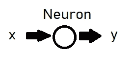

具有单个神经元的神经网络

**从头开始编码和训练神经网络…**

现在我们对什么是神经网络有了一些概念，让我们尝试使用二次函数来合成一些数据。然后我们会训练一个单神经元神经网络来学习二次模型的参数，做一些预测。如果你想去查看完整的代码，你可以点击[这里](https://github.com/kaneelgit/ML-DL-Algorithms/blob/main/Hello%20World%20of%20Deep%20Learning.ipynb)。

首先，让我们创建一个代表模型神经元的类。

```
#build the model class
class Model():

    def __init__(self):

        #assign the initial variables
        self.a = 15
        self.b = -2
        self.c = 10

    def __call__(self, x):

        return self.a * (x)**2 + self.b * x + self.c
```

这是我们的神经元执行的操作。它取一个值“x ”,然后使用二次方程(a x + b x + c)来计算“y”值。注意我们模型的初始值对于 a，b，c 分别是 15，-2，10。

现在让我们创建一些合成数据。我们将使用 10、5 和 12 作为 a、b 和 c 的真实值。因此，我们的神经网络的目标是学习这些真实的 a、b 和 c 值。

```
#synthetic data
true_a = 10
true_b = 5
true_c = 12#number of examples
num_examples = 1000#create x and y data
x = np.random.normal(0, 1, num_examples)
y = true_a * np.square(x) + true_b * x + true_c
```

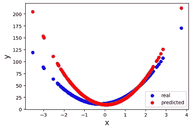

来自我们模型的真实数据和预测数据

上图显示了预测数据(由我们的初始值生成)和真实数据(由我们的真实参数值生成)。理想情况下，一旦训练好神经网络，预测图(红色)应该在真实图(蓝色)之上。现在让我们看看我们如何训练神经网络来学习模型的参数。

如上所述，预测数据是从初始值生成的。目标是找到给出最接近真实值的预测值的参数 a、b 和 c。为了做到这一点，我们测量我们的预测值与真实值的差异。这个测量值通常称为损失值，计算这个值的函数称为损失函数。有多个损失函数，但在我们的模型中，我们将使用“均方误差(mse)”。所有深度学习算法的目标都是最小化这个损失值。换句话说，减少实际值和预测值之间的差异。

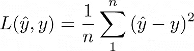

计算 mse 的公式

```
#create a loss function. we will use mean squared error
def loss(y_predicted, y_true):

    return np.mean(np.square(y_predicted - y_true))
```

一旦我们有了损失，我们必须找到我们的模型的参数如何随着这个损失函数而变化。为了做到这一点，我们必须找到我们的参数对损失函数的导数。(如果你想知道如何推导下面的方程，去我的 [*Jupyter 笔记本*](https://github.com/kaneelgit/ML-DL-Algorithms/blob/main/Hello%20World%20of%20Deep%20Learning.ipynb) )。

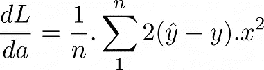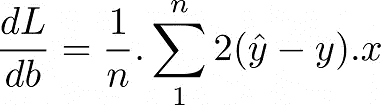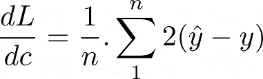

参数对损失函数的导数

```
#let's calculate the derivativess w.r.t the loss
def grads(inputs, outputs, predictions):

    #calculate dL/da (calling it da)
    da = np.dot(np.square(inputs).T, 2 * (predictions - outputs))
    da = da/len(inputs)

    #calculate dL/db (calling it db)
    db = np.dot(inputs.T, 2*(predictions - outputs))
    db = db/len(inputs)

    #calculate dL/dc (calling it dc)
    dc = np.sum(predictions - outputs)
    dc = dc/len(inputs)

    return da, db, dc
```

计算完导数后，我们现在通过从参数的最近估计值中减去导数来更新参数值。注意，在更新参数之前，我们还必须将导数乘以一个常数值，称为学习率(α)。这个学习速率是模型的超参数，控制模型学习的速率或速度。

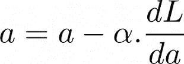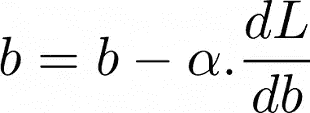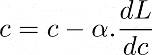

更新参数

```
#now let's create a function that fits the model given the model parameters, inputs and outputs to the datadef fit(model, inputs, outputs, learning_rate):

    #calculate the current loss using the loss function
    current_loss = loss(outputs, model(inputs))

    #calculate the gradients for each variable in the model
    da, db, dc = grads(inputs, outputs, model(inputs))

    #update the parameters of the model
    model.a = model.a - learning_rate * da
    model.b = model.b - learning_rate * db
    model.c = model.c - learning_rate * dc

    return current_loss
```

最后，我们有了训练模型所需的所有函数。现在，让我们训练我们的模型 50 次迭代/时期来看看结果。请注意，在每次迭代中，模型将首先使用参数的当前估计值来预测“y”值。然后，它将计算损失值，并根据计算的导数更新参数值。我们可以通过跟踪相对于纪元编号的损失值来检查模型是否真的在学习。如果模型正在学习，当历元增加时，损失值将减少。

```
#initialize the model
model = Model()#number of epochs
epochs = 50#get a b c and losses
list_a, list_b, list_c = [], [], []
losses = []#train the model for 50 epochs
for epoch in range(epochs):

    list_a.append(model.a)
    list_b.append(model.b)
    list_c.append(model.c)

    current_loss = fit(model, x, y, 0.1)
    losses.append(current_loss)

    if epoch % 5 == 0:

        print('epoch {} --------> mean squared error           {}'.format(epoch, np.round(current_loss, 4)))
        print('Real and predicted values after epoch {}'.format(epoch))
        plot_data(x, y, model(x), figsize = (4, 2))
```

下面是 0 和 50 个时期后预测数据和实际数据的曲线图。正如我们所料，在训练结束时，预测的(红色)数据位于真实数据之上。

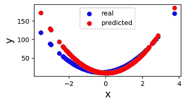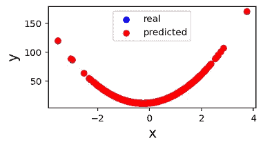

0(上)50(下)时期后的预测数据与实际数据

让我们进一步看看我们的模型表现如何。

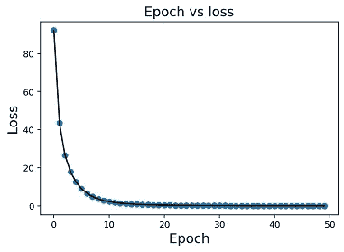

在该图中，您可以看到当纪元编号增加时，损耗如何减少。这是我们的模型正在学习的标志。减少的损失表明，在每个时期之后，实际值和预测值之间的差异变得越来越小。

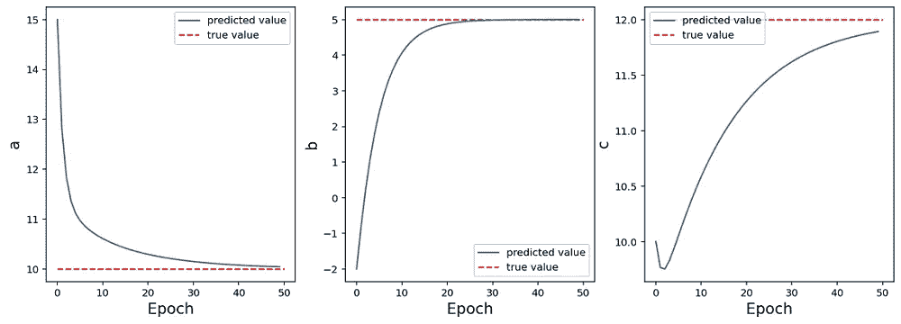

真值和参数随时间的变化

这里我们看到当历元数增加时，预测的参数值如何收敛到真实值。所有三个参数都收敛到生成数据的真实值(a、b 和 c 分别为 10、5 和 12)。

另外说明一下，我们用来寻找损失函数局部最小值的算法叫做“梯度下降”。当我们用梯度迭代地减去每个参数时，参数值收敛到最优值。如果我们看下图，浅蓝色的表面是给定不同的 b 和 c 值的损耗(注意，在这个图中我们只有 b 和 c。出于说明的目的，这种情况下的 a 值保持不变)。红点是 b 和 c 值及其在每个时期的相应损失。我们可以看到，b 和 c 的初始值给出了较高的损耗。随着时期的增加，b 和 c 值收敛到它们的最优值，而损耗收敛到局部最小值。

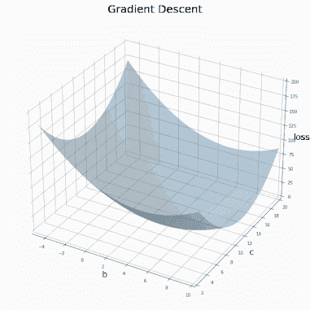

收敛于损失函数局部最小值的梯度下降

**结论..**

在本文中，我们使用 python 从头开始创建了一个神经网络。我们使用具有一个神经元的简单网络结构来估计二次函数的参数。我们首先合成数据，创建函数来计算损失、参数的梯度、更新参数，最后使用 50 个时期来训练模型。我们看到损失如何随着时代的增加而减少，以及参数如何收敛到它们的真实值。

当我开始学习深度学习和神经网络时，我发现在前进到更高级的技术和算法之前，建立这个简单的模型非常有帮助。因此，如果你是一个新手，并且正在阅读这篇文章，我希望这也能帮助你理解深度学习的基础。

希望你喜欢这篇文章。感谢阅读！