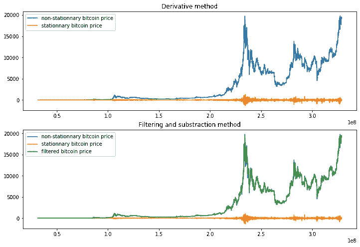

# 比特币价格隐藏的秘密

> 原文：<https://medium.com/analytics-vidhya/the-hidden-secrets-of-the-bitcoin-price-201c52d0f11d?source=collection_archive---------10----------------------->

## 从统计学角度探索比特币价格。


照片由 [**Pixabay**](https://www.pexels.com/@pixabay?utm_content=attributionCopyText&utm_medium=referral&utm_source=pexels) 发自 [**Pexels**](https://www.pexels.com/photo/close-up-of-coins-315788/?utm_content=attributionCopyText&utm_medium=referral&utm_source=pexels)

比特币是中本聪在 2009 年创造的一种数字货币，他将其描述为“电子现金的点对点版本”。比特币(和其他加密货币)的一大优势是所有数据都是开放和不可变的，位于区块链内部。数据的开放性和不变性使得区块链背后的研究非常活跃，主要是在价格预测方面。许多人理所当然地涌入区块链的数据(如地址、交易等..)，但我会在这篇文章中表明，比特币价格本身已经是非常有益的了。理解价格的行为将对预测价格的模型和参数的选择产生实质性的影响。

价格的行为可以通过时间序列的两个主要属性来理解:平稳性和季节性。例如，平稳时间序列比非平稳时间序列更容易建模。

在接下来的内容中，我将与大家分享我在查看价格时的思维过程，使用统计工具和 python 编程。

> **注** [本帖的原创和互动版本](https://ltetrel.github.io/data-science/2021/01/13/bitcoin_price.html)(通过[活页夹](https://mybinder.readthedocs.io/en/latest/introduction.html))在我的网站上有，如果你想了解更多信息，请查看。
> 这篇文章是使用 [jupyter_to_medium](/dunder-data/jupyter-to-medium-initial-post-ecd140d339f0) 工具渲染的。

## TL；博士；医生

1.  时间序列的两个重要特性:平稳性(分布不依赖于时间)和季节性(数据中的循环模式)。
2.  自相关检查数据是否是不稳定的；导数或数据滤波/减法来去除非平稳分量。
3.  FFT 和短 FFT 分析季节性。

## 1.时间序列快速入门

正如我所说的，时间序列有两个重要的属性:季节性和平稳性。
平稳过程意味着数据的分布(统计属性)不随时间而变化，这就是为什么建模要容易得多。季节性代表数据变化的频率(对于比特币价格，我们可以用每天的周期数来表示)，也代表数据开始变化的时间。

我们将首先着重分析平稳性，然后是季节性。

## 1.1.平稳性

检测数据是否稳定的一种方法是计算数据的自相关，如果数据降级很快，它就是稳定的。
文献中有许多不同类型的非平稳数据，所以如果你想了解更多，我建议你阅读下面的[帖子](https://towardsdatascience.com/stationarity-in-time-series-analysis-90c94f27322)。同样检查[这个数字](https://otexts.com/fpp2/stationarity.html)，并尝试猜测哪个时间序列是稳定的！

## 1.2.季节性

为了分析比特币的季节性，我们可以进行[傅立叶分析](https://www.ritchievink.com/blog/2017/04/23/understanding-the-fourier-transform-by-example/)来提取最显著的频率。FFT 的幅度告诉我们给定的频率分量如何影响价格。另一方面，当价格动态开始时，FFT 的相位是很有趣的。如果幅度或相位具有随机白噪声趋势，则没有主分量的证据。

如果你想了解更多关于季节性的知识，可以看看这篇不错的博文。

## 2.密码

## 2.1.加载数据

比特币每小时的美元价格可以通过使用 [glassnode](https://studio.glassnode.com/pricing) 和他们的高级订阅来收集。如果你不想付费，24 小时的数据是免费的。这里我们将使用每小时的数据来获得更精确的分析。

```
### imports
import os
import numpy as np
import matplotlib.pyplot as plt
import tensorflow as tf

import warnings
warnings.filterwarnings("ignore")
```

首先，我们想创建一个函数来加载数据。

```
# function to read the data
def read_data(filepath):
    price = []
    time = []

    with open(filepath) as f:
        lines = f.readlines()[1:]

    for data in lines:
        curr_time = float(data.split(",")[0])
        curr_price = -1
        if data.split(",")[1][:-1]:
            curr_price = float(data.split(",")[1][:-1])
        time += [curr_time]
        price += [curr_price]

    return np.array(price, dtype=np.float32), np.array(time, dtype=int)
```

现在我们将跳过第一年来加载数据。

```
# define paths
filepath = "../data/market/price_usd_close_BTC_1h"
figure_dir = ""

# loading the hourly data, to avoid unimformative data, we skip the first year (8760 h)
price, time = read_data(filepath)
time_shifted = time - time[0]
price = price[8760:]
time_shifted = time_shifted[8760:]
```

让我们来看看一段时间内的比特币价格，

```
### plot
plt.figure()
plt.plot(time_shifted, price)
plt.title("Bitcoin price over time (USD)")
plt.ylabel("price (USD)")
plt.xlabel("time (h)")
if figure_dir:
    plt.savefig(os.path.join(figure_dir, "price.png"))
plt.show()
plt.close()
```


当观察比特币价格时，数据的非平稳行为是显而易见的。我们也可以清楚地看到 2017/2020 年 12 月的大幅上涨。

## 2.2.平稳性

消除数据中非平稳成分的一种方法是计算其导数。另一种方法是用高斯核过滤数据，并将其减去原始价格数据。

```
# derivative
price_dt = price[1:] - price[:-1]

# filter
filter_width = 12
def gaussian_kernel_1d(filter_width):
    #99% of the values
    sigma = (filter_width)/2.33
    norm = 1.0 / (np.sqrt(2*np.pi) * sigma)
    kernel = [norm * np.exp((-1)*(x**2)/(2 * sigma**2)) for x in range(-filter_width, filter_width + 1)]
    return np.float32(kernel / np.sum(kernel))
f = tf.reshape(gaussian_kernel_1d(filter_width), [-1, 1, 1])
tf_price = tf.reshape(tf.constant(price, dtype=tf.float32), [1, -1, 1])
tf_price = tf.reshape(tf.nn.conv1d(tf_price, filters=f, stride=1, padding='VALID'), [-1])
# padding is necessary to keep same dim
tf_price = tf.concat([ tf.constant(tf_price[0].numpy(), shape=filter_width), tf_price ], axis=0)
filt_price = tf.concat([ tf_price,tf.constant(tf_price[-1].numpy(), shape=filter_width) ], axis=0).numpy()
price_centered = price - filt_price
```

通过比较这两种方法(导数和过滤)，我们看到结果价格现在以零为中心。在下图中，它们以橙色显示:

```
### plot
fig, axes = plt.subplots(2, figsize=(12, 8))
axes[0].plot(time_shifted, price, label="non-stationnary bitcoin price")
axes[0].plot(time_shifted[:-1], price_dt, label="stationnary bitcoin price")
axes[0].set_title('Derivative method')
axes[0].legend(loc="upper left")
axes[1].plot(time_shifted, price, label="non-stationnary bitcoin price")
axes[1].plot(time_shifted, price_centered, label="stationnary bitcoin price")
axes[1].plot(time_shifted, filt_price, label="filtered bitcoin price")
axes[1].set_title('Filtering and substraction method')
axes[1].legend(loc="upper left")
if figure_dir:
    plt.savefig(os.path.join(figure_dir, "price_stationnarity.png"))
plt.show()
plt.close()
```



为了验证过程的质量，可以使用过滤方法检查原始价格数据(蓝线)和静态价格数据(绿线)的自相关性。这将告诉我们数据在处理后有多稳定。

我们将计算不同延迟的自相关性，延迟时间最长为每小时 2 天。

```
### auto-correlation function
def autocorr(input, delay):
    input = tf.constant(input, dtype=tf.float32)
    input_delayed = tf.roll(input, shift=delay, axis=0)

    x1 = tf.reshape(input, [1, -1, 1])
    x2 = tf.reshape(input_delayed, [-1, 1, 1])
    return tf.reshape(tf.nn.conv1d(x1, filters=x2, stride=1, padding='VALID'), [-1])# autocorrelation of the price for different delays
delays = np.arange(0, 48)
# raw price data
autocorr_price = []
for hour in delays:
    autocorr_price += [autocorr(price, hour)]
# stationnary data
autocorr_centered_price = []
for hour in delays:
    autocorr_centered_price += [autocorr(price_centered, hour)]
```

从图中可以清楚地看出，平稳数据的自相关性比原始价格数据的自相关性下降得更快。这意味着我们成功地去除了价格中的非平稳成分！

```
### plot
fig, axes = plt.subplots(2, figsize=(12, 8))
axes[0].stem(delays, autocorr_centered_price, linefmt='b-', markerfmt='bo', basefmt='', use_line_collection=True)
axes[0].set_title('stationnary bitcoin price auto-correlation')
axes[1].stem(delays, autocorr_price, linefmt='b-', markerfmt='bo', basefmt='', use_line_collection=True)
axes[1].set_title('raw bitcoin price auto-correlation')
axes[1].set(xlabel='delay (h)', ylabel='amplitude')
if figure_dir:
    plt.savefig(os.path.join(figure_dir, "check_stationnarity.png"))
plt.show()
plt.close()
```


研究平稳性组件还允许我们确定最适合数据的预测窗口。例如，对于给定的时间戳，通过检查原始价格的分布与其相邻价格的差异有多快。

通过比较每个时间戳与其相邻时间戳的直方图(即计算相关性)，可以了解预测的可接受范围。如果分布彼此接近，显然更容易预测(因为它们彼此接近)。

```
### histogram function
def data_distribution(inp):
    return np.histogram(inp, range=(0, 20000), bins=500, density=True)[0]win_size = 2*24 #distribution of the data is calculated within 2 days (in hours)
slide = 5*24 #we slide up to -/+ 5 days
corr = []

# loop through al timestamps
timestamps_range = np.arange(slide + int(win_size/2), len(price) - slide - int(win_size/2), 72)
sliding_range = np.arange(-slide, slide + 1)
for i in timestamps_range:
    idx = i-int(win_size/2)
    # distribution of the price (over price from day -7.5 to day +7.5), the fixed distributioin
    fixed_price = price[idx:int(idx + win_size)]
    fixed_distrib = data_distribution(fixed_price)
    curr_corr = []
     # compare to each distribution at different timestamps (sliding from -30 to +30), the moving distribution 
    for offset in sliding_range:
        idx = offset + i - int(win_size/2)
        moving_price = price[idx:(idx + win_size)]
        moving_distrib = data_distribution(moving_price)
        curr_corr += [np.correlate(fixed_distrib, moving_distrib)]
    curr_corr = curr_corr / np.max(curr_corr)    
    corr += [curr_corr]    
    if i%7992 == 0:
        print("day {}/{}".format(i/24, len(price)/24))

output = np.array(corr)[:, :, 0]day 333.0/3439.5
day 666.0/3439.5
day 999.0/3439.5
day 1332.0/3439.5
day 1665.0/3439.5
day 1998.0/3439.5
day 2331.0/3439.5
day 2664.0/3439.5
day 2997.0/3439.5
day 3330.0/3439.5
```

在下面的图中，y 轴描述了在比特币价格的不同时间戳获取的一些样本。从上到下，它遵循时间顺序，但这并不重要，因为每个样本都可以独立采集。x 轴描述了计算直方图的不同偏移量(从-120 小时到+120 小时)。颜色是这些分布和时间戳 h0(样本的当前时间戳)的分布之间的相关结果。

```
### plot
plt.imshow(output, cmap="gray")
plt.axis("tight")
idx_sliding_range = np.arange(0, len(sliding_range), 30)
plt.xticks([i for i in idx_sliding_range], ["h{}".format(sliding_range[i]) for i in idx_sliding_range])
plt.xlabel("time offset (h)")
plt.ylabel("samples")
cbar = plt.colorbar()
cbar.set_label('correlation value')
if figure_dir:
    plt.imsave(os.path.join(figure_dir, "range_accuracy.png"), output, cmap="gray")
plt.show()
plt.close()
```


看着它，我们可以说预测的可接受范围是大约+/-15 小时。

> **注意**
> 颜色的范围是非常细微的，有时是恒定的。这是因为直方图中的仓数量(500)和价格值范围从 0 到 20k 美元，这意味着精度约为 40 美元。因此，如果价格在某段时间内在 40 美元范围内波动，直方图将完美匹配。

## 2.3.季节性

现在让我们通过计算 FFT 来切换季节性分析，并提取其幅度和相位分量。
如前所述，FFT 将用于理解数据中的冗余模式。因为 FFT 在 LTI(线性和时不变)系统上工作得更好，所以它不能应用于原始比特币价格(它不是稳定的！).因此，我们将它应用于固定的比特币价格。

```
# fft
price_fouried = tf.signal.fft(price_centered)
T = 1/24 # sampling interval in days
N = price_fouried.shape[0]
frequencies = np.linspace(0, 1 / T, N)
```

在下图中，没有明显的证据表明存在这种模式，尽管我们看到了重要频率的证据，范围从每天 1 到 1.9 个周期，在 1.52 处有一个小峰值。这意味着比特币价格“一般”可以用周期为~15.8 小时的正弦曲线来解释。

```
### plot
fig, axes = plt.subplots(2, figsize=(12, 8))
axes[0].plot(frequencies[:N // 2], tf.abs(price_fouried)[:N // 2] * 1 / N)
axes[0].set_title('FFT magnitude')
axes[1].plot(frequencies[:N // 2], tf.math.angle(price_fouried)[:N // 2])
axes[1].set_title('FFT phase')
axes[1].set(xlabel='cycles per day', ylabel='amplitude')
if figure_dir:
    plt.savefig(os.path.join(figure_dir, "fft.png"))
plt.show()
plt.close()
```


对非平稳数据进行季节性分析的另一种方法是计算其频谱图(从时间-频率分析中得出)。频谱图是信号频谱在时间上的直观表示。它通常用于(例如由 [spleeter](https://github.com/deezer/spleeter) 从音频信号中提取语音)。可以使用短傅立叶变换来计算频谱图，其基本上在短窗口上运行傅立叶变换，滑动通过所有数据。

这里，我们将使用 48 个样本(小时)的窗口大小，步长为 1 和 62 个频率分量。

```
# tensorflow provides a fast implementation of the fast fourier transform.
stft = tf.signal.stft(price, frame_length=48, frame_step=1, fft_length=125, pad_end=True)
spectrogram = tf.abs(stft).numpy()### plot
# inspired from https://www.tensorflow.org/tutorials/audio/simple_audio
# convert to log scale and transpose so that the time is represented in the x-axis (columns).
fig, axes = plt.subplots(2, figsize=(12, 8))
max_time = np.max(time_shifted)
axes[0].plot(time_shifted, price)
axes[0].set_xlim([0, max_time])
axes[0].set_title('non-stationnary bitcoin price')
log_spec = np.log(spectrogram.T)
axes[1].pcolormesh(time_shifted, np.arange(log_spec.shape[0]), log_spec)
axes[1].set_xlim([0, max_time])
axes[1].set_title('Spectrogram (short-fft)')
axes[1].set(xlabel='time (h)', ylabel='frequencies')
if figure_dir:
    plt.savefig(os.path.join(figure_dir, "spectrogram.png"))
plt.show()
plt.close()
```


从图中可以看出，每当数据发生较大变化时(例如 2017 年 12 月)，响应的幅度都要高得多。一般来说，无论何时，FFT 看起来都像一个白噪声。

## 结论

根据我们上面看到的性质，有一件事可以肯定地说:由于比特币的时间依赖性，预测其价格绝非易事。

希望我们找到了一种简化过程的方法，通过去除数据中的非平稳成分(因此它不再依赖于时间)。这使我们能够分析数据中的冗余模式，我们发现这种模式是存在的。重复出现的模式很有趣，因为它们可以在以后作为一个新的特征用于预测模型(例如，考虑将一天中的时间添加到天气预测模型中)。

这些发现向我们展示了获得比特币价格准确预测模型的新方法，但这是另一回事了…

## 走得更远

我真的建议您阅读 Hyndman 的书，它涵盖了时间序列预测的所有最佳实践以及编码示例。在线版本在这里[有售。](https://otexts.com/fpp2/index.html)

## 确认

感谢 [Vahid Zarifpayam](https://twitter.com/Vahidzarif1) 对这篇文章的评论。
信用归于 [Bitprobe](https://bitprobe.io/) 。