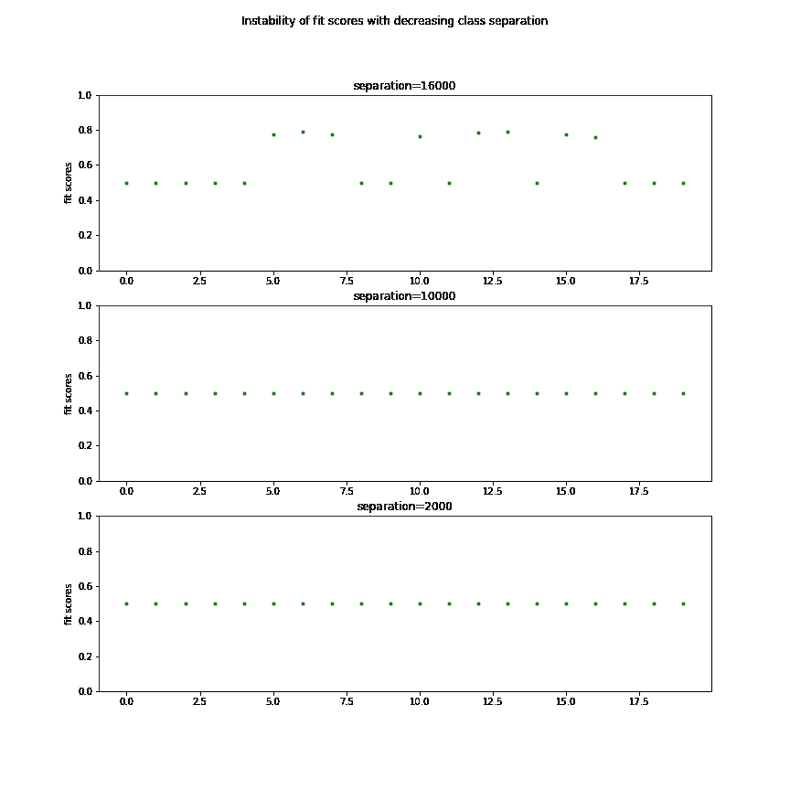

# 逻辑回归中的不稳定性

> 原文：<https://medium.com/analytics-vidhya/the-instability-of-logistic-regression-1bb35f9054bf?source=collection_archive---------6----------------------->

问题越简单，解决方案越差

来源:谷歌图片

对于从同一人群中获得的训练集，逻辑回归的预测似乎很不稳定！！！为了介绍这个问题，让我先介绍一下我面临这个问题的背景。

# 1.背景:

我在数据集上执行逻辑回归—对于给定的信用余额(从 0 到 20000 不等)，响应是信用违约状态(是/否)。训练集是通过控制逻辑函数本身生成(模拟)的。注意到，对于相同的模拟函数，在不同尝试中生成的训练集的拟合分数在 50%和 87%之间变化。这就是问题的来源——‘T2 的逻辑回归本质上是不稳定的吗’。

# 2.目标:

来源:谷歌图片

我们将尝试理解为什么从相同模拟函数生成的训练集的拟合分数不稳定。在***‘统计学习介绍——詹姆斯、威滕、哈斯蒂、提布拉尼’***第 138 页第 4.4 节中可以找到这方面的提示

> ***当类被很好地分开时，逻辑回归模型的参数估计令人惊讶地不稳定。线性判别分析没有这个问题。***

我们将试图通过实证研究来验证和理解这种不稳定性的本质，然后看看线性判别分析是否能解决这个问题。

# 3.模拟模型:

下面是用于生成训练集的概率分布曲线，以及训练集本身-

图 1:模拟模型和样本训练集

两个响应类别(默认=是和默认=否)在特性(信用余额)方面的区别如下所示—

图 2:响应类的分离

# 4.不稳定性与阶级分离；

我们准备了如上所述的三个训练集，以递减的类间隔。递减的类间距显示如下。

图 3:减少类分离

对于上述三个等级分离级别中的每一个级别-

*   我们生成 20 个训练集
*   对每一个应用逻辑回归，并找到合适的分数
*   因此，对于每一级别的分类，我们有 20 个合适的分数。我们感兴趣的是随着类分离水平的变化，拟合分数的不稳定性。

图 4:三个分离级别，拟合分数各不相同

上面图中的分离值是这样获得的

*   根据控制概率分布函数，有一个信用余额 x_high，其违约概率=yes 是 0.9(如图 1 所示)。
*   类似地，有一个 x_low，它的违约概率=是 0.1
*   (x _ high x _ low)是分离值，这是表示类分离的一个很好的度量。

从上述三个图可以清楚地看出，拟合分数的不稳定性是如何随着类别分离的减少而降低的。然而，跨越 3 个分离值的测试不够稳健。我们需要在更多的分离水平上运行测试，以验证拟合分数的可变性是否确实随着分离值的降低而降低。为此，在给定分离值的情况下，我们需要一个度量来捕捉拟合分数的不稳定性。任何给定分离值的 20 个拟合分数的方差将作为不稳定性的度量。我们将对照分离值研究这种差异。

我们由此产生的数据如下—

表 1:给定分离的拟合分数

上面的列标题代表分离值，而列代表给定分离值的拟合分数。

当绘制不同分离水平的拟合分数的方差时，我们得到下图-

图 5:分离度与适合度差异

上图显示，在分离值 5000(蓝色垂直线)以下，方差完全消失(注意，x 轴向右减少)。**没错，fit 分数最终非常低，只有 50%(从表格的右栏可以明显看出)。但他们“一贯”贫穷(这很好！！)而这正是我们现在所关心的。**注意，随着间隔的降低，x 值的比例保持不变— *O(10 )* 。因此，似乎不是特征值的比例，而是分离导致了拟合分数的不稳定性。

# 5.补救措施—线性判别分析:

在这篇文章的“**目标**”部分，建议使用线性判别分析作为这个问题的解决方案。因此，我们现在将看看 LDA 是否遭受类似的不稳定性。

当针对线性判别分析生成相同的拟合分数方差对分离的数据时，获得以下图

图 LDA 的分离度与拟合度差异

可以看出，线性判别分析没有可变性问题。需要提到的一点是 LDA 的拟合分数是**一致且良好的**。然而，我们在这里关注的是“一致性”。为什么逻辑回归在低分离值时满足于较差的拟合，而 LDA 具有较好的拟合——这是以后的问题。

# 6.结论:

因此，如***【ISLR***中所声称的，对于分离良好的阶层，逻辑回归确实变得不稳定。

> ***划分界限分明的阶层很容易。然而，情况越简单，逻辑回归的表现就越不稳定。因此有了这篇文章的副标题。似乎逻辑回归在分类不同品种的狗方面做得很好，但在分类狗和猫时做得很差。***

LDA 没有这个问题。因此，在这种情况下使用逻辑回归时，我们有两种方法可以选择

*   缩放要素-这可能会减少分离。(一般来说，它是否会使合身性更好，还需要进一步研究。在这种情况下，人们可以验证它确实如此。看我的 [stackoverflow 问题](https://stackoverflow.com/questions/68150694/do-features-need-to-be-scaled-in-logistic-regression)。)
*   或者用 LDA。

# PS:

与这个演示相关的代码可以在[我的 github 库](https://github.com/AnirbanChakraborty06/StatisticalLearning-ConfusionToClarity/blob/main/AnswersAndDemos/Instability%20of%20logistic%20regression%20for%20largely%20separated%20classes.ipynb)中找到。该存储库包含统计学习方法领域中的其他类似问题和答案。