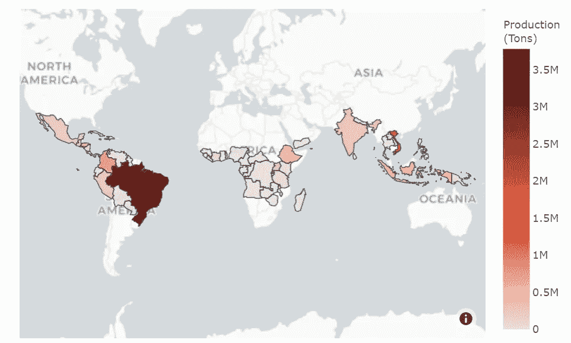

# 咖啡的数据之旅

> 原文：<https://medium.com/analytics-vidhya/the-journey-of-coffee-through-data-fcdffe0689c0?source=collection_archive---------15----------------------->

我认识的很多人都喝咖啡，也许是在早上开始他们的一天，或者在漫长的夜晚完成一个项目。我个人很喜欢它，我很确定我不是一个人，就在美国，大约 64%的成年人每天至少喝一杯。

但是这咖啡是从哪里来的呢？产量最高的地方在哪里？咖啡在哪里被调制成美味的饮料？

在本文中，我将使用 Python 和 1990 年至 2018 年咖啡的生产、消费和价格的数据集来回答这些问题。数据集来自国际咖啡组织(ICO)，在这里可以得到[。](http://www.ico.org/new_historical.asp)

如果你对这个分析背后的代码感兴趣，请去这个[渲染版的 Jupyter 笔记本](https://leopalavicini.github.io/coffee/)。

## 咖啡生产

为了让咖啡树能够生长并产出咖啡豆，它需要特定类型的天气。这取决于咖啡的种类，但可以概括为热带气候，中等海拔，温度约 16-26°C 和大量降雨。这些条件是沿着赤道线发现的，这可以在世界咖啡生产地图上清楚地看到，因为所有生产国都集中在世界的这一地区。

这张地图最突出的一点是，巴西是世界上主要的咖啡生产国，2018 年生产了超过 300 万吨咖啡，占世界总产量的 36%。

当我开始从事这个项目时，我以为哥伦比亚是世界上主要的咖啡生产国，这是因为他们的混合咖啡受欢迎和美味，然后我震惊地发现，它不是第一个，而是第三个，生产大约 80 万吨咖啡。

而如果巴西第一，哥伦比亚第三，谁是第二？嗯，是越南，2018 年生产约 187 万吨咖啡，占咖啡总产量的 18%。越南也是世界上最昂贵的咖啡之一——黄鼠狼咖啡的生产国，黄鼠狼咖啡是一种咖啡豆，被麝香猫吃掉并消化，然后烘烤而成。

现在，就地区而言，拉丁美洲是世界上最重要的产区，生产超过整个世界咖啡产量的一半(58%)。紧随其后的是亚洲，产量约占世界总产量的 30%。

在非洲，咖啡的主要生产国是埃塞俄比亚，产量为 46 万吨。埃塞俄比亚也是被认为是咖啡原产地的两个国家之一，另一个是也门(关于哪一个是咖啡的确切发源地存在争议，但这取决于你问谁)。但是即使这两个国家都有咖啡的历史，他们现在的咖啡产量完全不同，因为也门只生产大约 6 千吨。

近年来，所有这些产量都在增加，2018 年全球咖啡产量为 1030 万吨。从下图中可以看出这一增量，从 1990 年到 2018 年，产量几乎翻了一番。

这种生产速度被认为在未来几年是不可持续的，因为由于气候变化，一场所谓的“咖啡危机”即将到来。随着气温不断上升，种植咖啡的天气条件受到威胁，特别是阿拉比卡咖啡，需要凉爽的温度才能茁壮成长。

## 咖啡消耗量

但是大量生产的咖啡去哪里了呢？如果我们分析来自 ICO 的数据，我们可以看到大部分咖啡消费并不在生产地，而是在欧洲和美国，如下图所示。

欧盟是咖啡消费量最高的地区，其消费量超过 250 万吨，约占世界消费量的 25%。这并不奇怪，因为欧盟集中了大量的人口和一些人均咖啡消费量最高的国家，如瑞典和芬兰，每年人均消费超过 10 公斤。

咖啡消费量排名第二的是美国，2018 年消费量为 150 万吨。其次是巴西，消费量为 130 万吨，尽管是第三大消费国，但仅占总产量的 35%。

这是主要咖啡生产商的普遍现象，出口量超过本地消费量。墨西哥是唯一一个一半以上的产品在其境内消费的国家。而在其他主要生产国，如越南和洪都拉斯，情况正好相反，它们的消费量不到产量的 9%。

人们消费的大量咖啡使其成为世界上最受欢迎的饮料之一。这种对咖啡的喜爱和消费一直在稳步增长，如下图所示。

世界对咖啡的需求每五年增加 100 万吨，如果这种需求保持同样的速度，将很难满足与气候变化有关的问题。

## 咖啡价格

我们已经讨论了全世界咖啡的生产和消费，但是价格呢？价格取决于具体年份的产量、咖啡的质量、咖啡的来源和品种。下面是全球主要进口商 2018 年咖啡均价图。

咖啡最贵的地方是意大利，2018 年零售价格平均为每磅 8.12 美元。但在欧洲，价格差异很大，因为对主要进口商来说，最便宜的地方是瑞典，平均价格为 3.24 美元/磅。

在美国，咖啡的平均价格约为 4.30 美元/磅，远低于欧洲以外另一个主要进口国日本的 5.80 美元/磅。这可能是因为美国对咖啡的需求更高，因为美国是仅次于欧盟的第二大消费国。

咖啡的世界平均价格多年来一直在变化，因为这是一种在全球范围内交易的产品。从 1990 年到 2018 年，价格上涨了约 1.29 美元/磅，其间有高有低，如下图所示。

但随着气候变化导致产量下降，以及人们对早晨一杯美味咖啡的需求将继续增长，预计价格将继续快速上涨。

## 结论

巴西、越南和哥伦比亚的咖啡产量巨大。它们的产量占全球总产量的一半以上，约为 63%。大部分咖啡直接流向第一世界国家，这些国家占了世界咖啡消费量的一半。

气候变化对我们的咖啡仪式是一个严重的威胁，随着全球变暖的持续，适合咖啡种植的区域正在减少，产量也随之减少。随着产量减少，像我这样的咖啡因上瘾者对咖啡的需求持续增长，这种日常仪式将变得更加昂贵。

## 参考

1 — [每位咖啡爱好者的 33 个迷人咖啡统计](https://disturbmenot.co/coffee-statistics/#:~:text=Americans%20drink%20about%20400%20million,Americans%20prepare%20coffee%20at%20home)。

2 — [咖啡:谁种植、饮用和支付最多？](https://www.bbc.com/news/business-43742686#:~:text=Who%20drinks%20the%20most%3F,year%2C%20at%2012.5kg%20each)