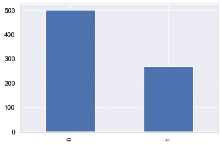
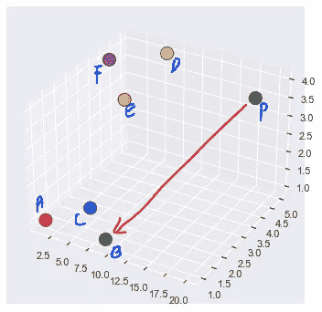
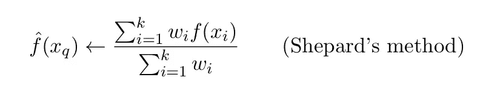

# K-最近邻(kNN)机器学习算法-第 2 部分

> 原文：<https://medium.com/analytics-vidhya/the-k-nearest-neighbor-knn-machine-learning-algorithm-part-2-8bdc9a05c041?source=collection_archive---------6----------------------->

妮娜·斯特雷尔在 [Unsplash](https://unsplash.com/) 拍摄的照片

# 到目前为止，在上一篇文章中，我们讨论了 kNN 算法的某些方面，在这篇文章中，我们还将进一步讨论该算法的一些方面和行为。

关键主题:

*   目标不平衡问题
*   kNN 作为一种回归技术
*   标准化的重要性
*   输入缺失值

让我们开始吧。

# **1。误导多数阶级标签— *目标失衡问题***

想象一下，我们试图检测两种不同类型的信号，一种来自保险箱，另一种是敌人的信号，这是一项极其关键的任务，就像入侵检测系统一样。问题是，罕见阶层的预测能力将不如多数阶层。在这种情况下，模型更多地暴露于从多数阶级学习，因为与少数阶级相比，它占主导地位。

目标失衡问题

> python 中有像 **imblearn** 这样的预加载库来应对这些问题。

# 2.作为回归的最近邻技术——局部加权回归

你可能会认为这是用词不当。更常见的是，kNN 以其分类用途而闻名，但不太为人所知的是，它也可以用于回归问题。这种变体被称为***【LWR】***，因为它使用*距离加权*训练示例来形成局部近似。它在本地被称为**，因为它仅基于查询点附近的数据，而**被称为加权**，因为每个训练示例的贡献都根据其与查询点的距离进行加权。**

> **请注意，kNN 回归使用与 kNN 分类相同的**距离函数，如 L1、L2 或闵可夫斯基距离或其任何子距离。****

# **3.标准化的重要性**

**规范化方面在迎合 kNN 的时候是极其**非** - **琐碎**的。原因是 kNN 算法受到 ***幅度*** 的影响，尤其是在使用欧几里德距离时。例如:假设我们在一个有 3 个特征的数据集上应用 kNN。第一个特征的范围是*1–10(正常)*，第二个特征的范围是*1–20(正常)*，最后一个特征的范围是*1–1000(不正常)*。在这种情况下，大多数聚类将基于最后一个要素生成，因为与 1–1000 相比，1 到 10 和 1–20 之间的差异较小。为了避免这种错误分类，我们应该**标准化特征变量**。**

****

**三维点集；p 是 q 查询点**

> ***执行标准化有不同的技术，包括*最小-最大标准化(更受欢迎)、标准分数标准化，甚至加权平均。**

****

**加权平均归一化—谢泼德法**

# **4.缺失值的插补— KNNImputer**

****

**[Ehimetalor Akhere Unuabona](https://unsplash.com/@theeastlondonphotographer)在 [Unsplash](https://unsplash.com/) 上拍摄的照片**

**直接到如何表演的地步？**

*   **如果一个样本有**个以上的特征缺失**，那么该样本的相邻特征可能不同，这取决于被估算的特定特征。**
*   **当可用的邻居数量较少且没有定义到训练集的距离时，在插补期间使用该特征的**训练集平均值**。**
*   **如果至少有一个邻居具有规定的距离，则在插补期间将使用剩余邻居的**加权或未加权平均值**。**
*   **如果某个特征在训练中总是缺失，它将被删除。**

> **感谢 sklearn 的 ML 库，它有`[sklearn.impute](https://scikit-learn.org/stable/modules/classes.html#module-sklearn.impute)`。KNNImputer 可以作为解决这个问题的方法。**

**这是奖金…**

**这就是最近邻算法的全部内容。感谢您的宝贵时间:)**