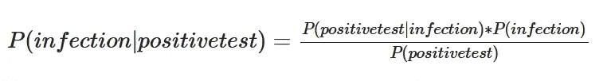
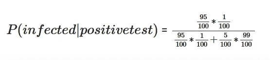
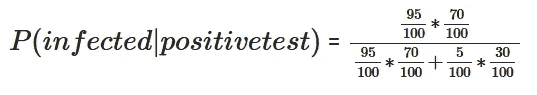

# 医学定律和贝叶斯定理

> 原文：<https://medium.com/analytics-vidhya/the-laws-of-medicine-and-the-bayes-theorem-a5196204f727?source=collection_archive---------19----------------------->

**第 0 部分:家务管理**

这篇博文回顾了悉达多·慕克吉博士的著作《医学法则》的第一章，并用贝叶斯定理用我的话来阐述他的思想。

**第一部分:简介**

大多数决策都是在不完善的知识和不完整的信息下做出的。机遇在大多数决策中扮演着重要的角色，忽视它们会导致不良的结果。**悉达多·慕克吉博士在他的《医学法则》一书中**描述了在医学领域中机遇所扮演的角色。他相信随机不可能从他的领域中被驱逐出去，这就是为什么他强调医生的强烈直觉比诊断测试更重要，因此这本书的第一定律是***强烈的直觉比微弱的测试***更有力量。作者为解释和支持上述规则**而提供的论据可以借助贝叶斯定理**来理解。在这里，我将遵循慕克吉博士在第一章中的论点，并用贝叶斯定理来解释它。

概括地说，有两种方法来诊断病人:让他们做一系列诊断测试，而不确定他们的风险概况，或者给病人指定一个风险概况，然后安排确认性测试。人们可能会发现第一种选择更好，更省时，但慕克吉博士不这么认为，因为***只有在先验概率的背景下，测试才能得到合理的解释***把先验概率看作是对病人可能患有某种特定疾病的初始概率的估计。为什么先验概率很重要？根据作者的说法，“如果患者在没有任何关于其风险的先验知识的情况下进行筛查，那么假阳性或假阴性率可能会混淆任何诊断尝试”。医生如何估计先验概率？通过尖锐的问题。他们向病人提出看似拐弯抹角的问题，试图抓住可能折磨他们的疾病。这是强化学习的一个例子，经验丰富的医生通过反复试验来提炼他们的问题，以便尽早发现问题的根源。现在让我们举个例子，详细看看医生说的这些是什么意思。

**第二部分:示例**

案例 1

考虑一个群体。该人群没有经过任何预选，即计算条件概率，随机样本是从人群中抽取的，没有将有患病风险的人和没有患病风险的人分开。换句话说，当我们测试所有人和每个人时，我们正在模拟我们的后验概率会发生什么。

设 K 代表一种疾病的患病率，K′代表它的补充。设 T 是一个假阳性率等于 5%的测试。如果一个人在这种情况下测试呈阳性，那么他感染的可能性有多大？假设 K = 1,即只有 1%的人口被认为有感染的风险。

**所需概率为 P(感染|阳性检测)=？**

让我们使用贝叶斯法则，详细写出这个概率。

这里，k 估计 P(已感染)，k `估计 P(未感染)。

由于 k = 1 %，k`=99%。

p(阳性测试|感染)=真阳性= 1–5%。

p(阳性试验|无感染)=假阳性= 5%。

现在我们准备计算上面的条件概率，答案是 16%，可以计算如下。

案例 2

现在让我们预先选择上述人群，以便只测试具有风险因素的人。让我们看看上面的条件概率发生了什么。

仅仅假设在这个由具有危险因素的人组成的人群中，P(感染)= 70%。这里的想法是，当医生根据患者的风险因素让他们进行诊断测试，而不是盲目地要求进行一系列高级测试时，这一人群中的患病率会增加。随着患病率的增加，上述可能性也增加。

请注意，我们应用于该人群的测试是相同的，因此真阳性和假阳性的概率没有变化。

现在我们准备计算这个群体的条件概率，答案是 97%,计算如下。

**第三部分:结论**

随机性无处不在。在这篇博客文章中，我们试图理解一个人在没有考虑到这种随机性时所犯的错误。*用一句* [*维特根斯坦语*](https://en.wikipedia.org/wiki/Ludwig_Wittgenstein) *点拨，我以“如果这篇博文是随机推荐给你的，请不要读它”作为结束语。*

**第 4 部分:参考文献**

1.  《医学的法则:来自一门不确定科学的现场笔记》,悉达多·慕克吉著
2.  [贝叶斯定理](https://en.wikipedia.org/wiki/Bayes%27_theorem)