# 学习率查找器

> 原文：<https://medium.com/analytics-vidhya/the-learning-rate-finder-9203fdc67c92?source=collection_archive---------5----------------------->

## 使用学习率查找器改进我们的深度学习模型

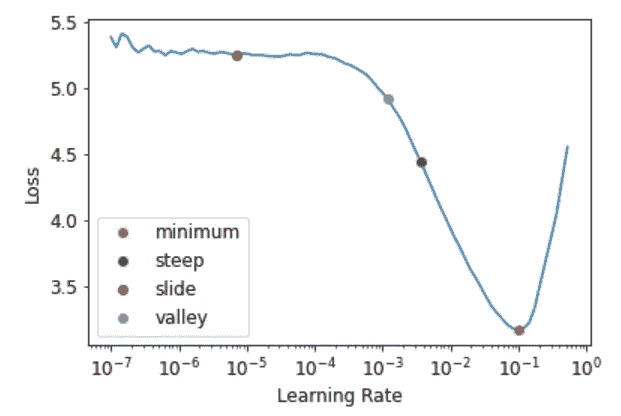

该图是使用《Fastai & PyTorch 程序员深度学习》一书中提供的代码创建的

L 收益率是一个非常重要的超参数，因为它控制着模型学习的速率或速度。我们如何找到一个不太高也不太低的完美学习率？Lesile Smith (2015)提出了一个想法，叫做学习率搜索器。他的想法是从一个非常非常小的学习率开始，然后逐渐提高。学习率永远不会变得太高而难以处理。自 1950 年以来，神经网络一直在开发中，但学习率搜索器直到 2015 年才出现。在此之前，找到一个好的学习率是深度学习从业者最重要的任务。

我们将通过编写一个对宠物品种进行分类的例子来执行这个想法。就在几年前，这种分类问题被认为是一项具有挑战性的任务。然而，今天它变得太容易了！感谢 fastai 和其他类似的库。完整代码请访问 GitHub 链接:[https://GitHub . com/Adeelzafar/My-Version-of-Fastai-Course/blob/main/PET _ Breed _ prediction . ipynb](https://github.com/Adeelzafar/My-Version-of-Fastai-Course/blob/main/PET_Breed_Prediction.ipynb)

# 导入必要的库

```
from fastbook import *
from fastai.vision.all import *
```

# 加载和解包 PETS 数据集

fastai 库提供了 Pets 数据集。让我们打开它并检查文件的路径。

```
path = untar_data(URLs.PETS)path.ls()
```

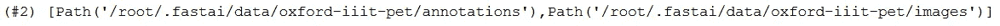

```
(path/'images').ls()
```

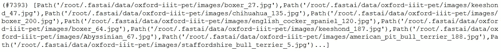

```
fname = (path/'images').ls()[0]
fname
```

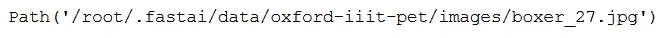

# 创建数据块

首先，我们将创建一个正则表达式。这个表达式提取出所有导致最后一个下划线的字符。后续字符是数字，然后是 JPEG 扩展名。 *RegexLabeller* 类用于标记正则表达式。

```
re.findall(r'(.+)_\d+.jpg$', fname.name)
```

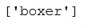

```
pets = DataBlock(blocks= (ImageBlock, CategoryBlock),
                 get_items= get_image_files,
                 splitter = RandomSplitter(seed= 42),
                 get_y=using_attr(RegexLabeller(r'(.+)_\d+.jpg$'), 'name'),
```

```
dls = pets.dataloaders(path/'images')
```

```
dls.show_batch(nrows = 1, ncols= 3)
```

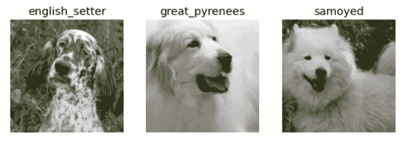

# 微调我们的 Resnet 模型

对于我们的初始测试，我们将执行一个简单的 resnet 模型，然后我们将使用不同的学习率来微调我们的模型。

```
learn = cnn_learner(dls, resnet34, metrics= error_rate)
learn.fine_tune(2)
```

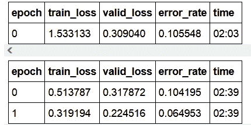

# 评估和改进我们的模型

模型解释是非常重要的一步。让我们可视化一个混淆矩阵来研究错误分类的例子。我们还将通过我们的模型看到最混乱的分类示例。

```
interp = ClassificationInterpretation.from_learner(learn)
interp.plot_confusion_matrix(figsize=(12, 12))
```

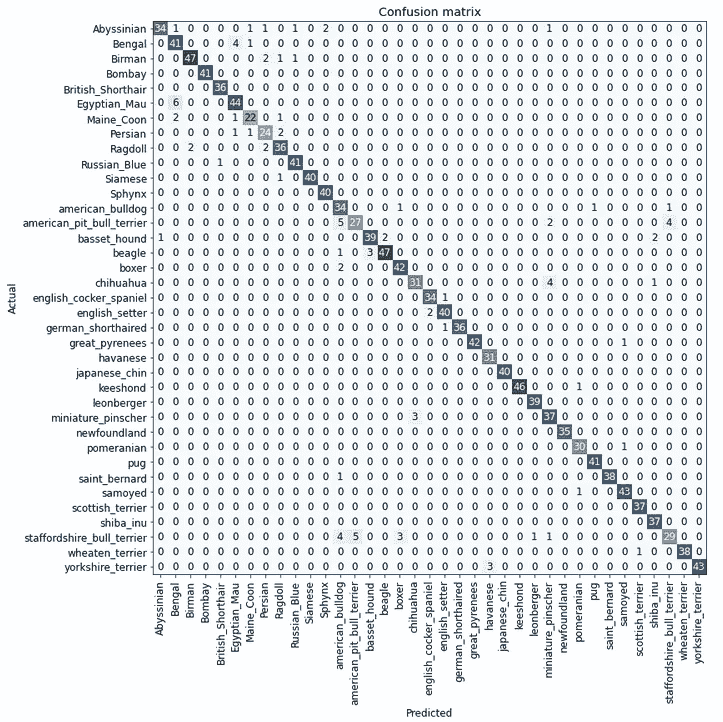

```
interp.plot_top_losses(2, nrows=2)
```

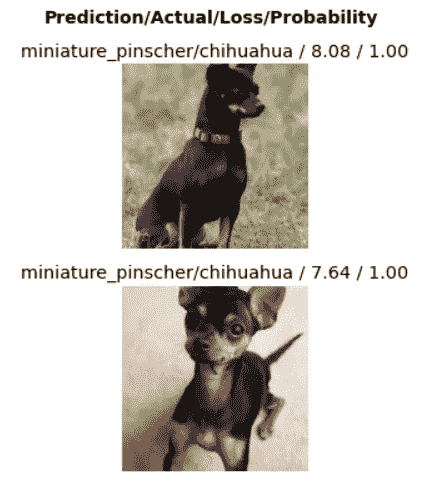

```
interp.most_confused(min_val=5)
```

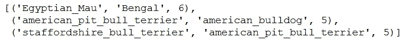

# 学习率查找器

因此，让我们深入到问题最重要的部分: ***找到一个合适的学习率*** 。如果学习率太低，模型需要许多代才能收敛。另一方面，如果学习率太高，模型最终会波动。让我们使用默认(高)学习率来训练我们的模型。

```
learn = cnn_learner(dls, resnet34, metrics=error_rate)
learn.fine_tune(1, base_lr=0.1)
```

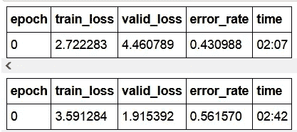

我们的模型性能下降，优化器超过了最小损失。我们的学习率搜索器来帮忙了。学习率探测器计算最小、陡峭、滑动和山谷。这给了我们一个确定最佳学习率的好主意。

```
learn = cnn_learner(dls, resnet34, metrics=error_rate)
lr_min, lr_steep, lr_slide, lr_valley = learn.lr_find(suggest_funcs=(minimum, steep, slide, valley))
```

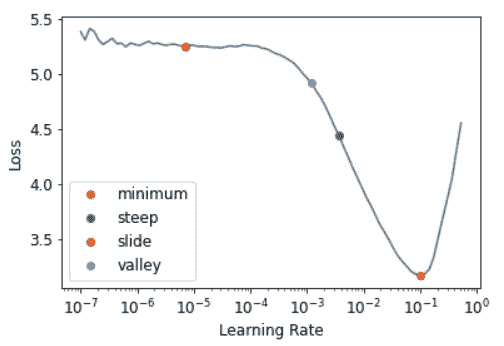

从学习率查找器中，我们选择最陡点作为基本学习率。我们没有选择最小值，因为此时模型不再学习。

```
learn = cnn_learner(dls, resnet34, metrics=error_rate)
learn.fine_tune(2, base_lr=3e-3)
```

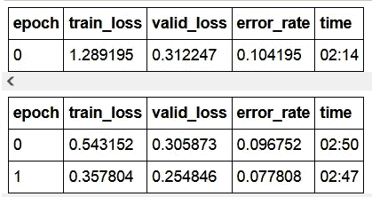

我们可以清楚地看到错误率下降了。这改进了我们的模型，但我们还可以进一步改进。我们也可以使用*区别学习率*。*区别学习率*为我们预训练模型的深层和最后一层设置不同的学习率。在我们接下来的工作中，我们将讨论*区别学习率。*下次见……快乐编码

# 信用

本文内容的灵感来自于杰瑞米·霍华德和西尔万·古格的《fastai & PyTorch 程序员深度学习》。