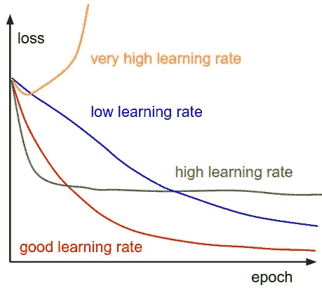

# 损失越少越好……但是怎么做呢？

> 原文：<https://medium.com/analytics-vidhya/the-less-the-loss-the-better-but-how-66fe233c243c?source=collection_archive---------10----------------------->

## 你可以在我的 Github 上找到这篇文章。


[附身摄影](https://unsplash.com/@possessedphotography?utm_source=medium&utm_medium=referral)在 [Unsplash](https://unsplash.com?utm_source=medium&utm_medium=referral) 上拍照

深度学习近年来取得了巨大的成功。随着数据越来越大，模型越来越深，我们必须使用优化算法来减少模型的损失。

无论是机器学习还是深度学习，我们总想把自己模型的损失降到最低。实际值和预测值之间的微小差异增加了我们未来预测的可靠性。

> 优化的目标是减少训练错误，通过这样做，我们应该小心过度拟合。

损失表明模型在准确性方面的表现。通过改变损失，我们可以改变我们训练的模型的性能。为此，我们通过最小化电流损耗来提高新模型的性能。就像这篇文章的名字一样， ***损失越少越好*** 。

> *将任何数学表达式最小化(或最大化)的过程称为优化。*

优化器是用于改变诸如权重、学习率等属性以减少损失的算法。



学习率决定了每次迭代的步长。如果台阶很大，我们可能会错过最小值。如果很小，找到最小值需要时间。**你可以阅读** [**这篇**](/analytics-vidhya/linear-regression-e5eecc7f26f1) **的文章，了解更多关于这个话题的详细信息。**

我将在本文中提到六种优化算法。

1.  随机梯度下降
2.  小批量随机梯度下降
3.  动力
4.  阿达格拉德
5.  阿达德尔塔
6.  RMSprop
7.  圣经》和《古兰经》传统中）亚当（人类第一人的名字
8.  梯度下降

***对于第 8 部分，我已经写过了。我会把*** [***链接***](/analytics-vidhya/linear-regression-e5eecc7f26f1) ***留给你去读。***

***那我们开始吧！***

# 1.随机梯度下降

与梯度下降不同，它使用从原始数据集中随机选择的数据，而不是在每次迭代中使用整个数据集。最好是使用整个数据集来达到最小值，而不是随机地达到最小值，但是现在这个过程非常昂贵，因为数据开始增长。

SGD 算法如下:

```
θ = θ − α⋅∂(J(θ;x(i),y(i)))/∂θ
```

因为它是通过在每次迭代中从数据集中抽取随机样本来进行的，所以到达最小值的路径会有更多的噪声。但是只要我们达到最小值，这并不重要。


> 尽管与典型的梯度下降相比，它需要更多的迭代次数来达到最小值，但它在计算上仍然比典型的梯度下降便宜得多。

## SGD 的优势

1.  内存需求小于梯度下降。
2.  通过每步仅关注训练集的一部分来减少过度拟合。

## SGD 的缺点

1.  可能会陷入局部最小值。
2.  完成一个纪元可能需要很长时间。

# 2.小批量随机梯度下降

我们知道梯度下降和随机梯度下降。让我们再复习一遍。然后我会提到批量梯度下降，我想让你知道。

**梯度下降**基本上是通过检查已经完成训练的数据集上的错误来执行改进过程。

**随机梯度下降**，它不是在每个过程步骤中使用整个数据集，而是用它从数据中接收到的随机数据来执行优化过程。

**批量梯度下降**是梯度下降算法的一种变体，它为训练数据集中的每个示例计算误差，但仅在评估了所有训练示例后更新模型。[【1】](https://machinelearningmastery.com/gentle-introduction-mini-batch-gradient-descent-configure-batch-size/)

小批量梯度下降是梯度下降算法的一种变体，该算法将训练数据集分成小批量，用于计算模型误差和更新模型系数。[【2】](https://machinelearningmastery.com/gentle-introduction-mini-batch-gradient-descent-configure-batch-size/)

MB-SGD 算法是 SGD 算法的扩展，它克服了 SGD 算法时间复杂度大的问题。MB-SGD 算法从数据集中取出一批点或点的子集来计算导数。

可以观察到，MB-SGD 的损失函数的导数与 GD 的损失函数的导数在一些迭代次数之后几乎相同。但是与 GD 相比，MB-SGD 实现最小值的迭代次数很大，并且计算成本也很高。[【3】](https://machinelearningmastery.com/gentle-introduction-mini-batch-gradient-descent-configure-batch-size/)


[来源](https://datascience-enthusiast.com/figures/kiank_minibatch.png)

## MB-SGD 的优势

1.与 SGD 算法相比，达到最小值需要更少的时间。

2.在计算上比 SGD 更高效。

## MB-SGD 的缺点

1.  可能会陷入局部最小值。
2.  小批量需要为学习算法配置一个额外的“小批量”超参数。[【4】](https://machinelearningmastery.com/gentle-introduction-mini-batch-gradient-descent-configure-batch-size/)

# 3.动力

由于 MB-SGD 将在每次迭代时更新参数，因此它将采用的路径将是振荡的。动量也考虑先前的梯度来更新参数。

MB-SGD 算法的一个主要缺点是权重的更新非常嘈杂。具有动量的 SGD 通过对梯度去噪克服了这个缺点。权重的更新依赖于有噪声的导数，并且如果我们以某种方式对导数去噪，那么收敛时间将会减少。想法是使用指数加权平均来对导数进行去噪，即与先前更新相比，给予最近更新更多的权重。它加速了向相关方向的收敛，减少了向无关方向的波动。该方法中还使用了一个超参数，称为动量，用“γ”表示。

```
V(t) = γ.V(t−1) + α.∂(J(θ))/∂θ
```


[来源](https://miro.medium.com/max/1684/0*TKxSMrG2xPLtcRVy.png)

> **动量项γ通常设定为 0.9 或类似值。使用所有先前的更新来计算时间“t”处的动量，与先前的更新相比，给予最近的更新更大的权重。这导致收敛速度加快。**

你可以简单的把它想成一个球从山上掉下来。它的速度会根据山坡的方向而变化。

# 4.阿达格拉德

其他优化算法保持学习速率不变，而 AdaGrad 根据权重分配自适应学习速率。它对与频繁出现的特征相关联的参数执行较小的更新，而对与不频繁出现的特征相关联的参数执行较大的更新。因此，该算法非常适合稀疏数据。AdaGrad 在谷歌用于训练大规模神经网络。此外，AdaGrad 用于训练手套单词嵌入，因为不常用的单词比常用的单词需要更多的更新。[【6】](https://ruder.io/optimizing-gradient-descent/index.html#adagrad)

我不会过多地探究这个问题的数学原理。如果您想了解关于该主题的更多信息，您可以阅读源代码 6。

## 阿达格拉德的优势

1.无需更新学习率，因为它是手动改变的。

## 阿达格勒的缺点

1.  当迭代次数变得非常大时，学习率降低到非常小的数值，这导致收敛缓慢。

# 5.阿达德尔塔

对于 AdaGrad，随着迭代次数的增加，学习率变得非常小，因此收敛到最小值需要太长时间。AdaDelta 基于梯度更新的移动窗口来调整学习速率，而不是累积所有过去的梯度。这样，即使已经进行了多次更新，AdaDelta 也能继续学习。相比 Adagrad，在 AdaDelta 的原始版本中，你不用设置初始学习速率。

使用 Adadelta，我们甚至不需要设置默认学习率，因为它已经从更新规则中删除了。


[来源](https://www.kdnuggets.com/2020/12/optimization-algorithms-neural-networks.html)

# 6.RMSprop

RMSprop 是 Geoff Hinton 在他的 Coursera 课程的第 6e 讲中提出的一种未发表的自适应学习率方法。RMSprop 将学习率除以梯度平方的指数衰减平均值。Hinton 建议将γ设置为 0.9，而学习率η的一个好的默认值是 0.001。RMSprop 是为了解决 Adagrad 学习率急剧下降的问题而开发的。


[来源](https://www.kdnuggets.com/2020/12/optimization-algorithms-neural-networks.html)

# 7.亚当

Adam 可以看作是 RMSprop 和带动量的随机梯度下降的组合。Adam 计算每个参数的自适应学习率。除了存储像 Adadelta 和 RMSprop 这样的过去平方梯度 vt 的指数衰减平均值之外，Adam 还保持过去梯度 mt 的指数衰减平均值，类似于动量。动量可以被视为一个沿斜坡向下运行的球，而亚当的行为就像一个有摩擦力的重球，因此更喜欢误差面上平坦的极小值。[【7】](https://www.kdnuggets.com/2020/12/optimization-algorithms-neural-networks.html)

# 实施时间！

我用谷歌 Colab 做这项工作。可以通过这个[链接](https://colab.research.google.com/notebooks/intro.ipynb)免费使用 Colab GPU！

现在，是实施的时候了。我们很快就会看到，并理解优化算法之间的差异。

这部分我们将使用 MNIST 数据集。

> ***此作品均取自*** [***此处***](https://github.com/ayyucekizrak/Keras_ile_Derin_Ogrenmeye_Giris/blob/master/B%C3%B6l%C3%BCm4/Optimizasyon_Y%C3%B6ntemlerinin_Kar%C5%9F%C4%B1la%C5%9Ft%C4%B1rmas%C4%B1.ipynb) ***。***

```
# importing librariesimport keras
from keras.datasets import mnist
from keras.models import load_model
from keras.models import Sequential
from keras.layers import Dense, Dropout, Flatten
from keras. layers import Conv2D, MaxPooling2D
from keras import backend as K
from keras import optimizers
from keras.callbacks import ReduceLROnPlateau
import tensorflow  as tf
from keras.layers import *
import matplotlib.pyplot as plt# download dataset(x_train, y_train), (x_test, y_test) = mnist.load_data()reduce_lr = ReduceLROnPlateau(monitor='val_loss', factor=0.2, patience=5, min_lr=1e-5)# setting necessary parametersbatch_size = 128
num_classes = 10
epochs = 20
w_l2 = 1e-5
```

训练和测试形状；

```
img_rows, img_cols = 28, 28if K.image_data_format() == 'channels_first' :
         x_train = x_train.reshape(x_train.shape[0], img_rows, img_cols)
         x_test = x_test.reshape(x_test.shape[0], img_rows, img_cols)
         input_shape = (1, img_rows, img_cols)else:
         x_train = x_train.reshape(x_train.shape[0], img_rows, img_cols, 1)
         x_test = x_test.reshape(x_test.shape[0], img_rows, img_cols, 1)
         input_shape = (img_rows, img_cols, 1)x_train = x_train.astype('float32')
x_test = x_test.astype('float32')
x_train /= 255
x_test /= 255
print(f"x_train shape : {x_train.shape}")
print(x_train.shape[0], 'train samples')
print(x_test.shape[0], 'test samples')# converting class vectors to binary class matricesy_train = keras.utils.to_categorical(y_train, num_classes)
y_test = keras.utils.to_categorical(y_test, num_classes)
```

输出:


```
# building conventional neural networksfrom keras import regularizers
model = Sequential()
model.add(Conv2D(32, kernel_size=(3, 3), kernel_regularizer=regularizers.l2(w_l2),input_shape=input_shape))model.add(BatchNormalization())model.add(Activation('relu'))model.add(Conv2D(64, (3, 3),  kernel_regularizer=regularizers.l2(w_l2)))model.add(BatchNormalization())model.add(Activation('relu'))model.add(MaxPooling2D(pool_size=(2, 2)))model.add(Dropout(0.25))model.add(Flatten())model.add(Dense(128, kernel_regularizer=regularizers.l2(w_l2)))model.add(BatchNormalization())model.add(Activation('relu'))model.add(Dropout(0.5))model.add(Dense(num_classes, activation='softmax'))
```

## 随机梯度下降；

```
model.compile(loss = keras.losses.categorical_crossentropy, optimizer = keras.optimizers.SGD(), metrics = ['accuracy'])model.summary()
```


```
# training the modelhist_SGD = model.fit(x_train, y_train, batch_size = batch_size, epochs = epochs, verbose = 1,validation_data = (x_test, y_test), callbacks = [reduce_lr])score = model.evaluate(x_test, y_test, verbose = 0)print('Test loss: ', score[0])print('Test accuracy: ', score[1])
```

经过培训，我的价值观是:

测试损失:0。56860 . 68868686861

测试精度:0.98986868686

## 亚当

```
model.compile(loss = keras.losses.categorical_crossentropy, optimizer = keras.optimizers.Adam(), metrics = ['accuracy'])model.summary()
```


```
# training the modelhist_adam = model.fit(x_train, y_train, batch_size = batch_size, epochs = epochs, verbose = 1, validation_data = (x_test, y_test), callbacks = [reduce_lr])
score = model.evaluate(x_test, y_test, verbose = 0)print('Test loss:', score[0])
print('Test accuracy:', score[1])
```

训练完模型后:

测试损失:0。56860 . 88888886861

测试精度:0.99986868686

## RMSprop

```
model.compile(loss = keras.losses.categorical_crossentropy, optimizer = keras.optimizers.RMSprop(), metrics = ['accuracy'])model.summary()
```


```
hist_RMSprob=model.fit(x_train, y_train, batch_size=batch_size, epochs=epochs, verbose=1, validation_data=(x_test, y_test), callbacks=[reduce_lr])score = model.evaluate(x_test, y_test, verbose=0)print('Test loss:', score[0])print('Test accuracy:', score[1])
```

培训后:

测试损失:0。56860 . 68868686861

测试精度:0.9932000041007996

## 阿达格拉德

```
model.compile(loss=keras.losses.categorical_crossentropy, optimizer=keras.optimizers.Adagrad(), metrics=['accuracy'])model.summary()
```


```
hist_adagrad=model.fit(x_train, y_train, batch_size=batch_size, epochs=epochs, verbose=1, validation_data=(x_test, y_test), callbacks=[reduce_lr])score = model.evaluate(x_test, y_test, verbose=0)print('Test loss:', score[0])
print('Test accuracy:', score[1])
```

培训后:

测试损失:0。58660 . 68868686861

测试精度:0.9932000041007996

## 阿达德尔塔

```
model.compile(loss=keras.losses.categorical_crossentropy, optimizer=keras.optimizers.Adadelta(),metrics=['accuracy'])model.summary()
```


```
hist_adadelta = model.fit(x_train, y_train, batch_size=batch_size, epochs=epochs, verbose=1, validation_data=(x_test, y_test), callbacks=[reduce_lr])score = model.evaluate(x_test, y_test, verbose=0)print('Test loss:', score[0])
print('Test accuracy:', score[1])
```

培训后:

测试损失:0。56860 . 88886888686

测试精度:0.9932000041007996

## 绘制结果

> 我对下面的代码有一些问题。对于 tensor flow 2+‘ACC’变成了‘accuracy’。这就是为什么原始代码对我不起作用。我把 acc 改成了 accuracy。


```
hists = [hist_adam, hist_SGD, hist_RMSprob, hist_adadelta, hist_adagrad]plot_history(hists, attribute='accuracy', axis=(-1,21,0.965,1.0), loc='lower right')
```


```
plot_history(hists, attribute='loss', axis=(-1,21,0.009, 0.09), loc='lower right')
```


从上面的图中可以看出，ADAM 优化比其他优化稍有不同。

## 你可以在我的 [Github](https://github.com/GuldenizBektas/Optimization-Algorithms) 上找到这篇文章的笔记本。

## 参考

[信号源 1](https://d2l.ai/chapter_optimization/optimization-intro.html#optimization-and-estimation)

[信号源 2](https://www.kdnuggets.com/2020/12/optimization-algorithms-neural-networks.html)

[信号源 3](https://www.geeksforgeeks.org/ml-stochastic-gradient-descent-sgd/)

[信号源 4](https://datascience-enthusiast.com/DL/Optimization_methods.html)

[信号源 5](https://machinelearningmastery.com/gentle-introduction-mini-batch-gradient-descent-configure-batch-size/)

[信号源 6](https://ruder.io/optimizing-gradient-descent/index.html#adagrad)

[来源 7](https://github.com/ayyucekizrak/Keras_ile_Derin_Ogrenmeye_Giris/blob/master/B%C3%B6l%C3%BCm4/Optimizasyon_Y%C3%B6ntemlerinin_Kar%C5%9F%C4%B1la%C5%9Ft%C4%B1rmas%C4%B1.ipynb)