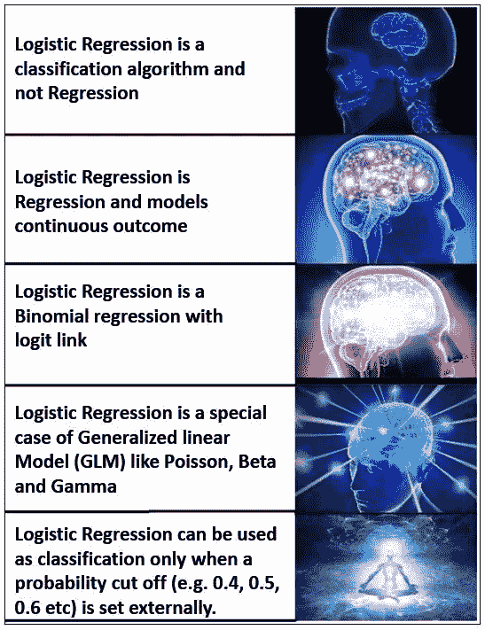
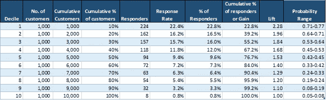
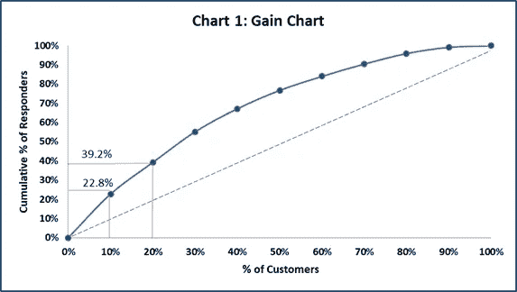
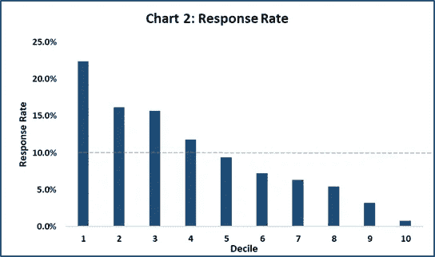
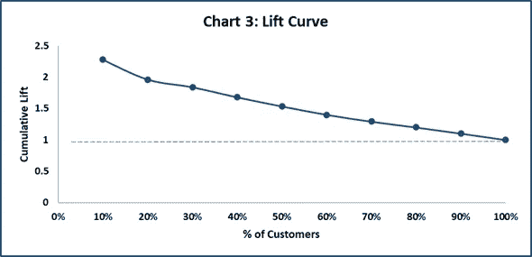
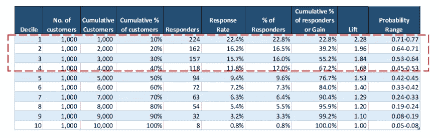

# 失落的十分位数分析艺术

> 原文：<https://medium.com/analytics-vidhya/the-lost-art-of-decile-analysis-33719cd08425?source=collection_archive---------6----------------------->

资料来源:联合国人类住区规划署

> *“Logistic 回归不是回归而是一种分类算法”。*

你可能在最新流行的机器学习书籍、博客中看到过这一点，或者你可能听到过*数据科学大师*在他们高度订阅的 YouTube 频道中说出同样的话。

机器学习已经篡夺并重新命名了许多统计技术。往往到了他们现在不相信和拒绝其统计来源的程度。恰当的例子是“逻辑回归不是回归”

然而，没有什么比这种说法更偏离事实了。我们生活在一个迷因文化中，迷因甚至变成了加密货币。

那么，为什么不用迷因来证明逻辑回归确实是回归呢？

> *逻辑回归确实是回归。*

来源:作者

这个迷因会让你们中的大多数人明白一些事情。然而，为了更清楚起见，让我把它拆开。

> 逻辑回归模型是一个连续的结果(概率)。概率范围在 0 到 1 之间。

当我们希望响应变量分为两类(流失/未流失、通过/失败、垃圾邮件/无垃圾邮件等)时，使用二元逻辑回归作为分类算法。)

通常，我们通过设置适当的概率截止值或阈值(0.4、0.5、0.6 等)将逻辑回归纳入分类算法。).

**使用阈值进行分类的问题**

确定概率阈值纯粹是一个业务需求，而不是统计需求。阈值可能因领域/行业而异。

弗兰克·哈勒尔在他的博客中恰当地指出“分类是一种被迫的选择”。

> 分类是被迫的选择。

现在考虑这个例子，你选择阈值 0.5。现在，ML 算法输出 4 个客户违约或不违约(1-违约，0-不违约)的概率为 0.51、0.49、0.23 和 0.92。根据阈值，2 个被分类为“违约”，2 个被分类为“无违约”。但是，扪心自问一下，对于概率为 0.51 和 0.49 的客户来说，是不是太接近了？0.51 肯定更接近 0.49(被归类为无违约)，而不是 0.92(被归类为违约)。

一些流行的机器学习包和低代码工具没有向用户明确描述预测的概率。因此，用户不知道预测的概率是多少。他/她只需做出决定—默认或不默认(1 或 0)。在 0.49 和 0.51 的情况下，用户愉快地分别做出了这个人不会违约和会违约的决定。但是对预测概率的一瞥揭示了它太接近了以至于不能预测！

阈值的另一个问题是，当我们使用一个不恰当的评分规则时，比如分类准确性，它很容易被欺骗。举个例子，如果 100 个人中有 95 个人贷款违约，5 个人没有。如果分类器将每个人都归类为贷款违约，那么它的准确率将达到 95%！！

**那么，有没有更好的使用逻辑回归的方法呢？**

答案是肯定的。

金融和营销等行业分别以更合适的方式使用逻辑回归进行信用风险建模和营销活动定位。

**一个真实的用例**

比方说，你是一个 CMO，在你的组织中负责一个产品的销售和营销。你计划发起一场营销活动来增加该产品的销量。你已经得到了一个固定的预算。现在，您希望获得尽可能高的投资回报率，即花费确切的固定预算或更少的预算，获得尽可能高的销售额。这是你有的。

您有 10，000 名客户的数据，这些客户在过去购买过或没有购买过类似的产品。

您希望了解这次应该以哪些客户为目标来增加购买的可能性。

很明显，你会瞄准那些更有可能购买产品的人，因为你有固定的活动预算。如何着手呢？

# 十分位数分析和增益图来拯救这里。

**什么是十分位数分析？**

十分位数分析曾经是一种普遍使用的技术，但是教导和将机器学习问题分成“分类”或“回归”类型的惯例导致人们忘记十分位数分析类型的分析。我非常肯定，大多数新创造的数据科学家甚至没有听说过十分位数分析。回到十分位数分析。

十分位数分析用于从最高值到最低值对数据集进行分类，反之亦然。(基于预测的概率)

顾名思义，该分析包括将数据集分成十个相等的组。每个组都应该有相同数量的观察/客户。

它按照从最有可能响应到最不可能响应的顺序对客户进行排序。

十分位数分析是怎么做的？

**第一步:**建立逻辑回归模型。在这种情况下，因变量是“购买产品的可能性”。1 表示已购买，0 表示未购买。此外，还选择了相关的独立变量。

**第二步:**用逻辑回归算法得到预测概率。按降序排列概率。

**步骤 3:** 将整个数据集分成 10 组，每组应包含相同数量的观察值。因此，如果有 10，000 条记录，每个组将有 1000 条记录/客户。

**步骤 4:** 计算每个十分位数的应答者百分比

**第 5 步:**计算每个十分位数的回复率

**第 6 步:**计算每个十分位数的提升值

前 10%的客户最有可能作出回应，后 10%的客户最有可能作出回应，依此类推。

十分位数分析的一个主要优点是概率和概率范围是它们自己的误差度量。也就是说，如果前十分位数的概率范围是 0.75-0.81，那么这个人不购买该产品的概率，即误差将是(1-[0.75-0.81]，这里“[]”表示 0.75-0.81 之间的值的区间，包括 0.75 和 0.81

十分位数分析输出看起来像什么？

下表描述了典型的十分位数分析输出。

表 1:来源作者

让我们打开输出表。

如前所述，每个十分位数拥有相同数量的客户(每个十分位数 1000)。

**%**

请参考表 1:

这里，十分位数 1 的应答者百分比= 224/984 = 22.8%

984 是所有 10 个十分位数中应答者的总数

同样，十分位数 2 的应答者百分比= 16.5% (162/984)

前 2 个十分位数应答者的累积百分比= 39.2%

# 收益和收益图:

从表 1 来看，十分位数 1 包含最有可能购买的前 10%的客户。十分位数 1 具有最高的响应者数量(224 个响应者)。

因此，在所有十分位数的应答者中，22.8%的应答者位于十分位数 1。因此，对于 10%的客户群，在十分位数 1 中有 22.8%的回答。

同样，十分位数 1 和十分位数 2 中 20%的客户群有 39.2%的回复。

下面的增益图更好地解释了这一点。

来源:作者

**收益图要点:**收益图可用于评估每十分位数中有多少%的客户做出回应。因此，我们可以只从最上层的十分之一中挑选顾客，而不是从最下层的十分之一中挑选顾客。

虚线是基线。基线表明，如果我们在没有模型的情况下随机锁定客户，有多少%的客户会做出回应。

# 反应率

回复率表明每十分位数中做出回复的客户所占的百分比。十分位数 1 的回答百分比最高，其次是十分位数 2，依此类推。

**每十分位数的回应率** =该十分位数的回应者人数/该十分位数的顾客人数

请参考表 1:

这里，十分位数 1 的回答率= 224/ 1000 = 22.4%

**回复率比较要点:**每个十分位数的回复率如下图所示。所有十分位数的平均回答率为 9.8%。因此，从十分位数 1 到十分位数 4 的客户高于平均回复率，应该成为活动的目标客户。

来源:作者

# 升力和升力曲线

**提升** =每个十分位数的应答者/顾客的累积百分比

请参考表 1:

十分位数 1 的提升= 22.8%/10% = 2.28

十分位数 2 的提升= 39.2%/20% = 1.96

**如何解释**:如果我们的目标是前两位，那么我们的目标是 20%的客户。在相同的十分位数中，应答者的累计百分比为 39.2%。因此，升力为 1.96。

提升值为 1 意味着与随机确定的客户数量相比没有任何收益。Lift 大于 1 意味着模型方法优于随机选择客户。

**提升图的要点:**可用于识别提升较高的十分位数。

来源:作者

# 如何在商业决策中使用十分位数分析:

既然我们已经完成了构建十分位数分析，下一个相关的问题是我们如何使用它来制定有效的业务决策:

**让我们重温一下我们的十分位数分析表**

来源:作者

来源:作者

根据上述结果，我们决定将目标客户定位在前 4 位，因为他们购买该产品的可能性更高。

从商业角度来说，瞄准前 4 个十分位数的 ROI 更多。随着我们向下移动，投资回报率迅速下降，不值得追求这些客户。

所以，这就结束了我们的十分位数分析文章。欢迎您的评论。

“本文由[阿里马实验室](https://www.arymalabs.com/)供稿。由[文卡特拉曼](https://www.linkedin.com/in/venkat-raman-analytics/)和 [Ridhima Kumar](https://www.linkedin.com/in/ridhima-kumar7/) 合著。

Aryma Labs 是一家数据科学公司，专门从事营销组合建模、营销/数字分析、机器学习和 NLP。

我们为快速消费品、电子商务、银行、制造、媒体和广告行业的客户提供服务。"

参考资料:

1.  [https://www.fharrell.com/post/classification/](https://www.fharrell.com/post/classification/)