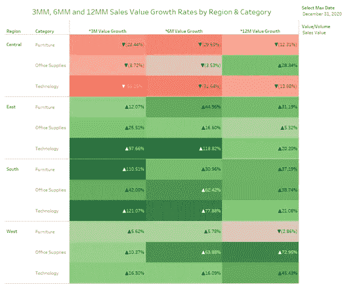

# 逐月增长的魔力

> 原文：<https://medium.com/analytics-vidhya/the-magic-of-month-over-month-growth-1f6f6af2b4de?source=collection_archive---------1----------------------->

Tableau 如何帮助确定您的公司是遵循线性增长趋势还是指数增长趋势。

[在此下载我的工作手册](https://public.tableau.com/profile/nikki.smit1659#!/vizhome/MonthonMonthGrowthRates/GrowthRates)

**月环比(MoM)增长**显示价值变化占上月价值的百分比。该指标通常用于分析移动应用、网站、SaaS 产品等的月销售额、数量甚至活跃用户的增长率。这是一个常用的 KPI，用来衡量一个…