# 主成分分析的数学

> 原文：<https://medium.com/analytics-vidhya/the-math-of-principal-component-analysis-pca-bf7da48247fc?source=collection_archive---------0----------------------->

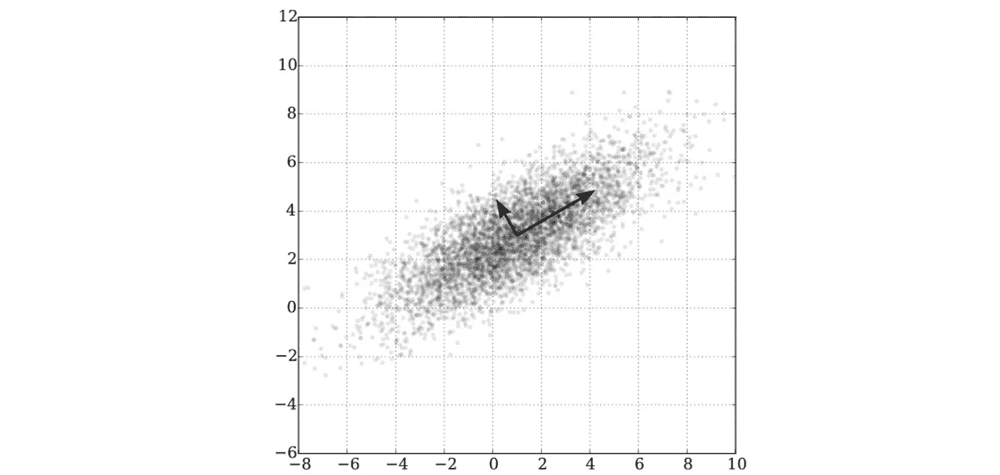

以(1，3)为中心的二元高斯分布上的 PCA。图片由尼古拉斯·瓜林拍摄

## 使用源于线性代数的两种不同策略来理解降维中最重要的公式

*本文假设读者熟悉任何线性代数入门课程的内容——正交性、特征分解、谱定理、奇异值分解(SVD)……*

混淆进行主成分分析(PCA)的正确方法几乎是不可避免的。不同的来源支持不同的方法，任何学习者都很快推断出 PCA 并不是真正的*特定算法，*而是一系列可能不同的步骤，最终结果是相同的:数据被简化成一组更简洁的特征。

谈完 PCA 的基本目标后，我将解释*两种*计算 PCA 的常用方法背后的数学原理。第一个包括创建一个*协方差矩阵*(如果这让你不舒服，不要担心，我会解释它)并对它进行一些特征计算。

第二个涉及奇异值分解(SVD)。当然，如果你对这两种直觉中的任何一种感觉更舒服，你可以继续这样理解它，但是这篇文章的重点是概述看待它的两种方式是如何完全等价的。

## 主成分分析的目标

重要的是，首先要对 PCA 试图实现的目标有一个模糊的认识。

它试图*减少输入数据的维度。*但这意味着什么呢？我们举一个具体的例子。假设我们从对加拿大公民的大规模调查中收集到两个大致相关的特征:个人幸福和个人成就。

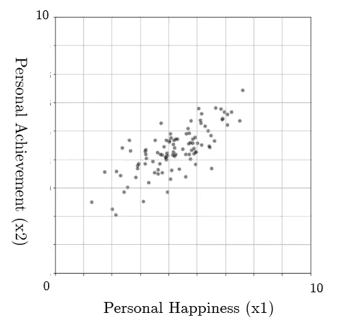

正如我们所见，这两个特征高度相关——个人成就高的人可能更快乐，反之亦然。

假设这两个特征只是一个*大得多的数据集*的一部分，该数据集还有更多与调查中不同问题的答案相关联的特征(x3，x4… xn)。假设我们有*如此多的数据*以至于我们的数据分析技术开始变得不稳定，我们希望找到减少数据集大小的方法。

纵观各种问题的图表，我们发现个人幸福和个人成就高度相关。如果我们能把这两个特征合并成一个特征，就像“个人满足感”一样，我们可以节省很多空间。

这是一个“降维”问题，非常适合主成分分析。我们希望分析数据，并得出*主成分—* 两者的组合特征。

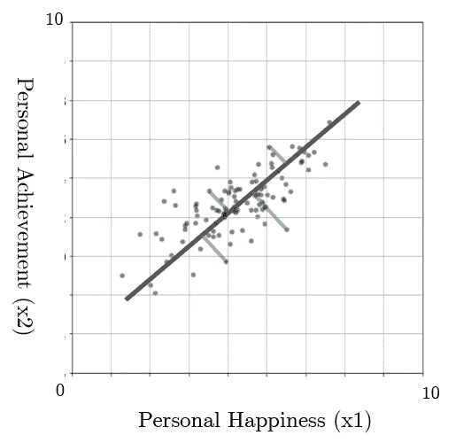

我们可以通过绘制一个穿过这些数据点的向量，并将每个点投影到我们创建的线上来实现这一点。我们正在将二维数据转换成只需要一维数据。

现在，我们的数据可以显示在数字线上，每个投影点现在只需要一个坐标就可以定位。

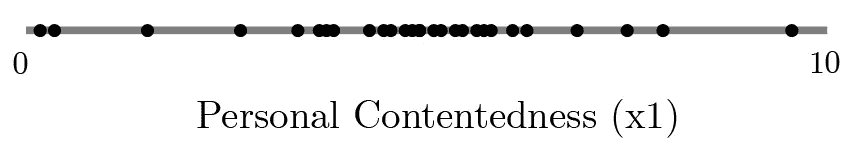

这种降维会牺牲*一些*信息，但我们正在努力做的是找到最小化信息损失的线。

我们通过使用点的*方差*来衡量线条保留信息的能力。也就是说，每个点离平均值的平均距离。一条好的线将具有最大化的方差——它最好地保留了每个点的位置。让我们看几个例子。

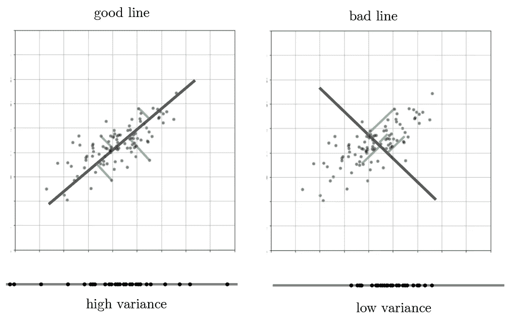

我们可以看到，在低方差的情况下，我们删除了许多最重要的数据，精简后的数据集几乎不像我们的 2D 数据。

在高方差的情况下，我们看到我们的一维数字线相当有效地保留了信息，显示了更完整的点分布。

我们试图通过数据集找到使方差最大化的向量(线)。这要困难得多，也是我将要讨论的两个数学公式的主要目的。

**所有这些都适用于更高维度，当我们想要将一些 n 维数据空间减少到一些 k 维数据空间时，我们不是绘制最佳直线，而是通过 n 维空间绘制最佳 k 维超平面。*

首先，我将在没有任何奇异值分解(SVD)概念的情况下处理 PCA 算法，并以“特征向量方式”来看待它。

## **协方差矩阵法的特征向量**

这可能是计算 PCA 最常用的方法，所以我先从它开始。它依赖于统计学中的一些概念，即*协方差矩阵。但是首先，我们需要设置输入数据的格式。*

首先，继续我们的调查示例，我们调查了 *100 名参与者。*这些参与者中的每一位都有一份“快乐”和“成就”调查问题的录音答案。

我们将其表示为输入矩阵 X，长度为 100 x 2。每行是一个新的训练示例(个人)，每列是该个人的快乐(x1)和成就(x2)。

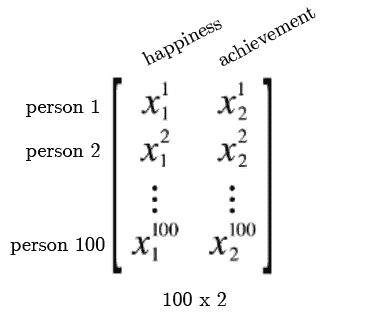

## 协方差矩阵

我们要做的是构造一个 2 x 2 *协方差矩阵*来表示每个变量之间的协方差。我将很快解释为什么我们要搜索协方差矩阵。但首先，我们来探索一下。在伪数学中，协方差矩阵看起来像这样:

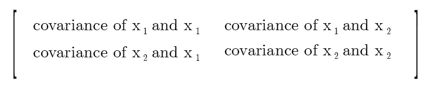

协方差衡量不同变量之间的方差。一些变量 a 和 b 之间的负协方差意味着当 a 上升时，b 下降。正的协方差意味着当 a 上升时，b 也上升。

在我们的场景中，左上角将测量*快乐*和*快乐—* 之间的协方差当我们测量相同事物之间的协方差时，我们只是测量方差。

而我们的非对角协方差是相同的——在 *a* 和 *b* 之间的协方差与 *b* 和 *a* 之间的协方差相同(顺序无关紧要)。

因此，我们期望的协方差矩阵简化为:

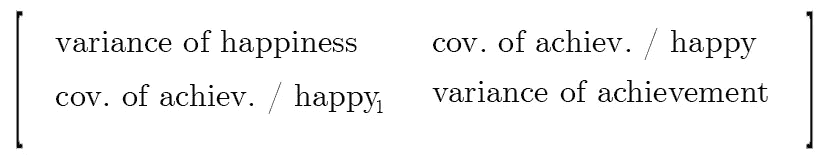

我们的协方差矩阵，以及所有的协方差矩阵，都是对称的，沿着对角线有方差。协方差可以被视为对角方差，如果这有所帮助的话。协方差给出了数据的*方向*的细节，方差给出了与平均值的平均距离的细节。

## 构建协方差矩阵

我们可以通过对我们的输入矩阵 x 进行简单的矩阵运算来简单直接地构造协方差矩阵。

记住计算两个特征的协方差的精确公式(每个都有 N 个示例):

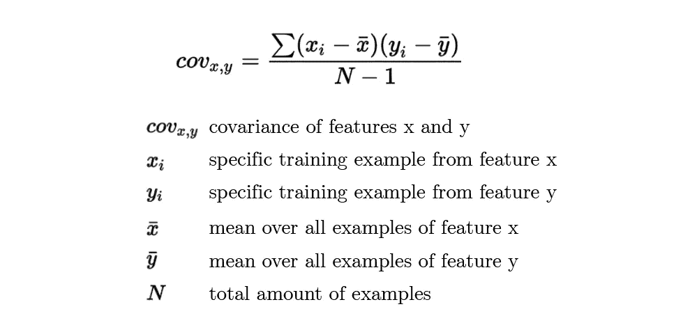

利用这一点，我们可以得出一个更加简化的矩阵乘法来计算协方差。请注意，我们的协方差公式是对每个特征及其相应平均值的差的乘积求和。

我们可以做些什么来“自动化”从每个特征中减去平均值的过程。我们可以通过从每个训练示例中减去每个特征的平均值来标准化我们的矩阵。

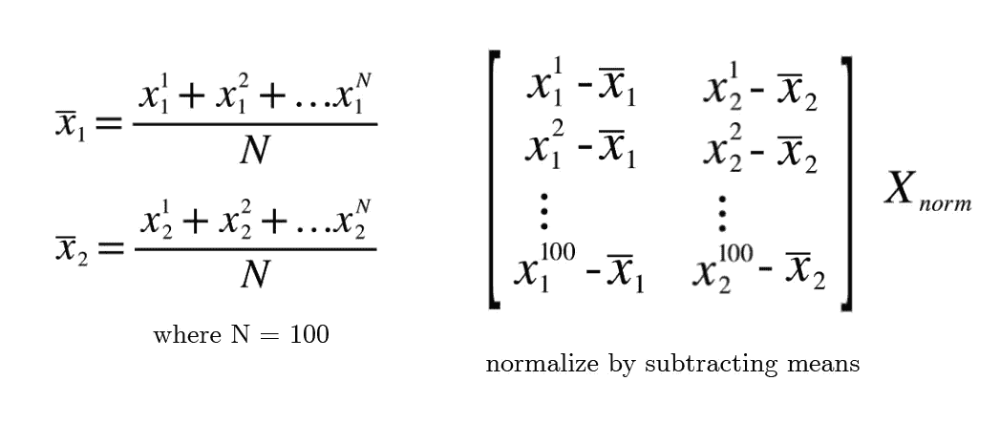

这给我们留下了一个修改后的“标准化”X，其中所有列(示例)的平均值为 0。在具有数值范围(年龄、星期几、储蓄账户中的钱)的数据集中，我们可能还想用列的标准差来划分每一列，但是由于我们的两个数据都是 1-10，所以我们不必这样做。

现在，为了计算我们的协方差矩阵，我们可以简单地乘以归一化矩阵 Xnorm 的转置。

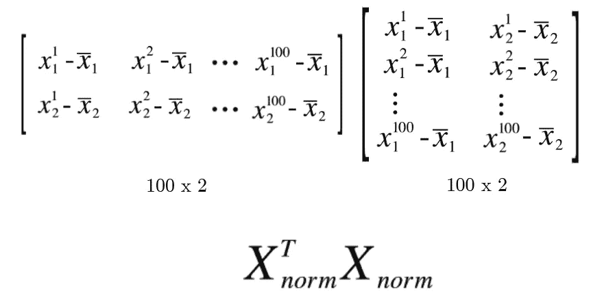

通过逐行逐列的矩阵乘法，我们可以看到，我们正在精确地计算 2 x 2 输出中四个条目的协方差公式。记住总和正好等于一个点积，一切都会水到渠成。

我们所缺少的是将每个协方差总和除以示例数量 N，我们可以通过将 2 x 2 输出除以 N 来实现。因此，*任何*协方差矩阵的总公式(这适用于任何维数！):如下所示:

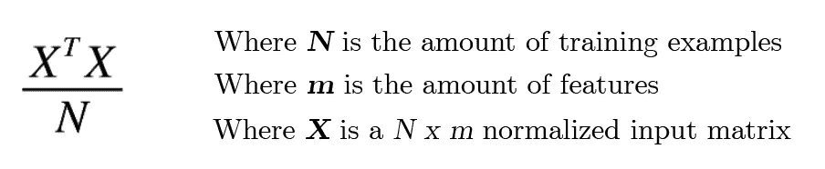

你有时可能会看到(XX^T)/N，但这是当 x 是一个 m x N 规范化的输入矩阵(训练的例子是列而不是行)。这就像是吉尔伯特·斯特朗关于 PCA 和 Eckart-Young 的讲座。两种方法都有效，结果是一样的——一个 m x m 的协方差矩阵。

矩阵符号能有助于简化复杂的公式，这一点令人惊讶不已。想象一下，必须使用求和写出卷积矩阵的公式！

## 协方差矩阵的特征向量与谱定理

*这种直觉受到用户阿米巴* [*的启发，在十字架上验证了*](https://stats.stackexchange.com/questions/2691/making-sense-of-principal-component-analysis-eigenvectors-eigenvalues) *。*

我会提前告诉你计算主成分的答案(对应于我们新的*个人满意度系列中每个训练示例结果的向量)。*

我们的“主分量”，或者说通过 2D 空间的一个向量，该向量使*最大化所有投影到它上面的点的方差，*是与 ***最大特征值相关联的协方差矩阵的*特征向量。****

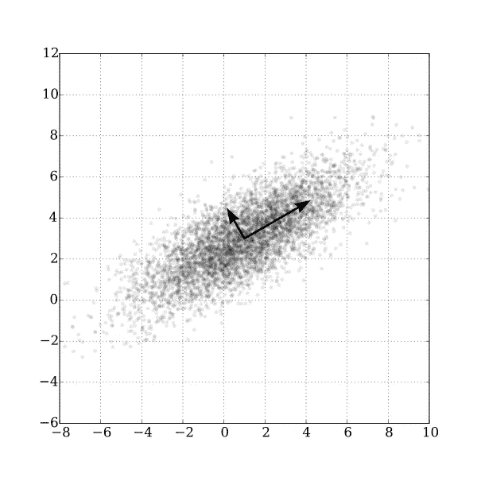

简单地说，我们的协方差矩阵可能有两个特征向量，用这两个箭头表示。我们将具有较长长度的一个(因此，较大的特征值，因为我们将 PCA 中的特征向量视为单位长度)作为我们的主分量。但是为什么我们的特征向量一开始会朝着这个方向呢？

更难的问题是为什么会这样。有几种方法可以看出这种直觉为什么有效。它们都不太容易理解，我将尝试使用一种方法来处理*谱定理。*

谱定理在任何线性代数入门课程的特征单元中都有涉及，所以我在这里不再赘述。概括来说，任何对称矩阵都可以分解为:

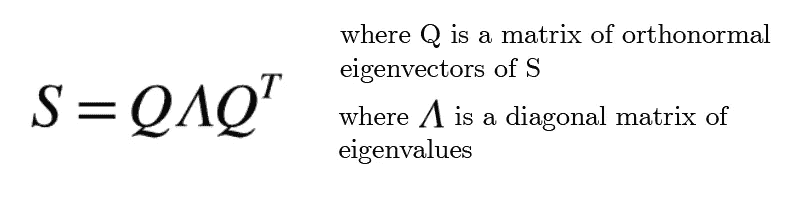

这是 more A = qλQinv 因式分解的推广，因为对称矩阵具有正交(因此，通过除以每个向量的长度而正交)的特征值。标准正交矩阵的逆矩阵等于它的转置矩阵。

此外，由于任何对称矩阵都有全套的 *n* 个特征向量，所有的特征向量都是正交的(并且可以通过除以每个向量的长度很容易地使其正交)，所以我们可以*使用特征向量作为基础。*

因为我们的协方差矩阵 C 是对称的，并且将永远是对称的，所以谱定理也适用于我们的协方差矩阵。我们可以从 q 的列中得到一个本征基。

为了使这个具体化，让我们用具体的值来做一个协方差矩阵 C。让我们继续我们的*幸福-成就*问题的例子。

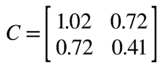

注意这个矩阵是对称的。

我们现在可以计算这个协方差矩阵 C 的特征向量和特征值，看看当我们把这些向量作为我们的基时会发生什么。

我们计算我们的特征向量(默认情况下是正交的，因为我们处理的是对称矩阵)，并通过除以向量的长度将它们转换为正交。我们可以通过将每个特征值乘以相应向量的长度(除以长度，相乘相消)来乘以特征值，从而计算伴随新的标准正交向量的特征值。

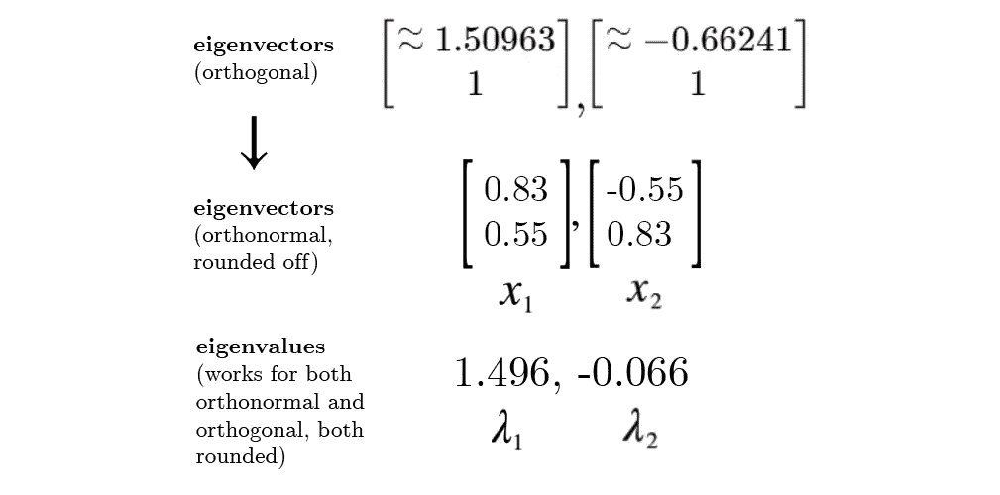

现在，让我们看看我们是否可以切换到一个*特征基—* 因此，我们的两个特征向量成为我们的基向量—我们的(1，0) = (0.83，0.55)和(0，1) = (-0.55，0.83)。我们可以在笛卡尔坐标空间的图形上绘制这些基向量，并看到它们确实是正交的，单位长度，就像我们正常的单位向量一样，只是旋转了。

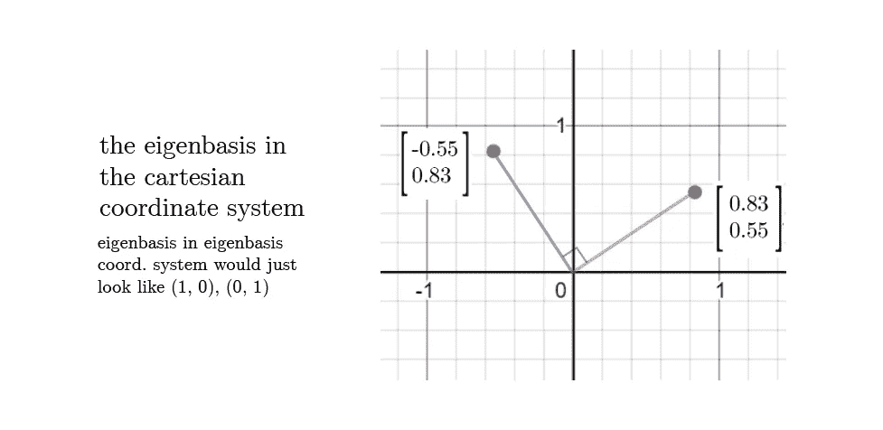

但是现在需要注意的是，我们将占据*本征基坐标系*，这里的(1，0)实际上等同于上面笛卡尔坐标系中的向量。

那么现在，假设特征基坐标系，我们如何表示我们的矩阵 C 呢？记住特征向量和特征值的决定性规则:

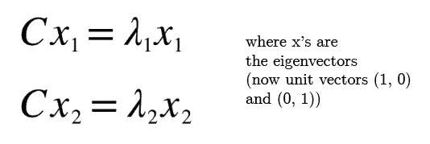

对于第一个例子，我们可以把我们知道的东西代入本征值的公式，通过简单的推导，看看 C 一定是什么，我们可以得出结论:

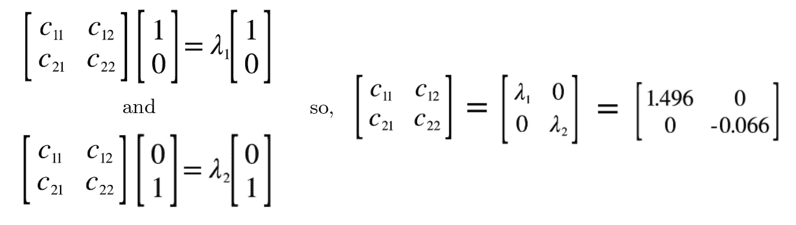

我们正处于直觉的最后阶段。现在的关键是,*仍然把这个 C，根据我们新的特征基，看作一个协方差矩阵。*

非对角线为零(并且在任何大小的矩阵中总是为 0)的事实意味着，在这个空间中，在两个特征之间没有*相关性(平均而言)。*这很有道理:

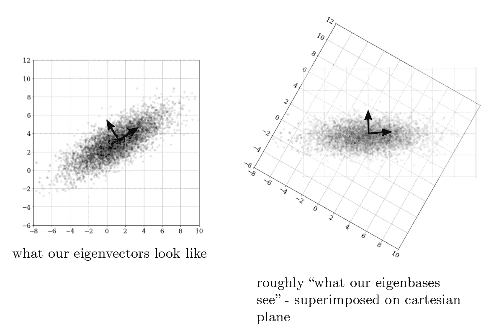

花点时间去理解这里发生了什么。

你可以看到*从本征基的角度来看，*在本征基空间中，x1 和 x2 之间似乎没有任何相关性(协方差)——看起来大致像高斯噪声。我们所能确定的是我们的方差(现在是沿着我们的*新*轴的方差，本征向量)，它现在等于我们的特征值。

但这里有一个问题:当查看我们的新协方差矩阵时(从合成图像中特征向量的“角度”来看，您可以认为它只是协方差矩阵)，我们注意到当*沿着 x1 轴投影时，可以实现最大方差。*

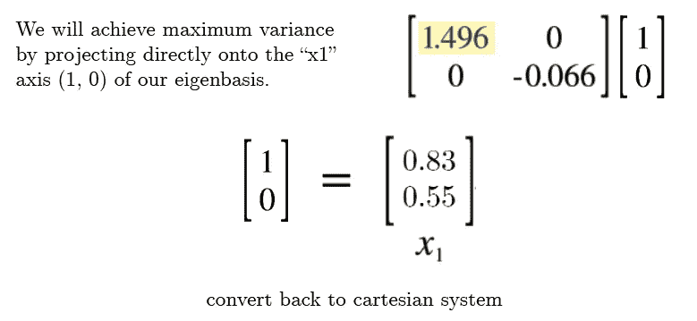

我们将*投影到*某个向量上的原因是，现在我们有了没有任何协方差的协方差矩阵，我们可以严格地测量数据“对角线”部分的方差。我们可以把它看作是在一维线上，只需要担心方差。协方差为零的事实确保了我们不能通过向上或向下移动一点线来获得任何额外的方差。

当然，当我们将特征基世界中的“x1 轴”向量转换回笛卡尔平面时，我们记得它只是特征向量 x1。

所以，x1 是使方差最大化的线。回到我们在直觉开始时对规则的陈述，x1 确实是与最大特征值相关联的特征向量。

这个 x1 是**主成分。**

如果我们在多个维度中，多个正交特征值都指向不同的方向，并且想要 m 个特征中的*最重要的* ***k 个*** *特征，*我们将获取与 *k 个*最大特征值相关联的特征向量。

现在我们明白了为什么与最大特征值相关的特征向量是主分量，我们可以回过头来记住我们所做的一切是*寻找协方差矩阵(X 转置 X)/N 的特征值和特征向量*

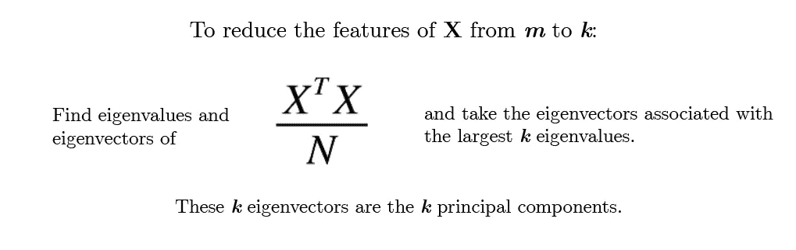

假设 X 已经被归一化，并且是 N×m

既然我们知道了原始计算以及公式背后的含义，我们就可以更容易地理解第二种处理 PCA 的方法——奇异值分解。

请注意，如果你只是想要一种方式，并对此感到满意，现在就请离开吧！这只是为了那些对 SVD 的两种不同表示感到困惑的人。

## 基于奇异值分解的主成分分析

这是写给以前接触过 SVD 概念并且非常熟悉的人的——因为这篇文章已经很长了，所以我不会花时间在基础知识上。我强烈推荐[这个讲座](https://www.youtube.com/watch?v=rYz83XPxiZo&ab_channel=MITOpenCourseWare)，因为它很好地结合了 PCA。还有，是吉尔伯特·斯特朗，真的不会错。

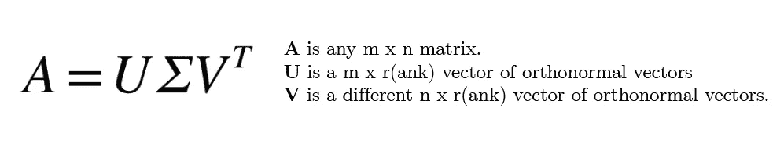

奇异值分解的整个目的与特征相似——但在这里，它也适用于非方阵。SVD 的目的是找到向量和奇异值，当相乘时，*保持正交。*但现在这并不重要。

通过一些快速的计算，我们将了解为什么在计算 PCA 的代码中经常调用 SVD。它们可能看起来是随机的，但很快就会有意义。

让我们通过替换 SVD 定义，将一个转置相乘。

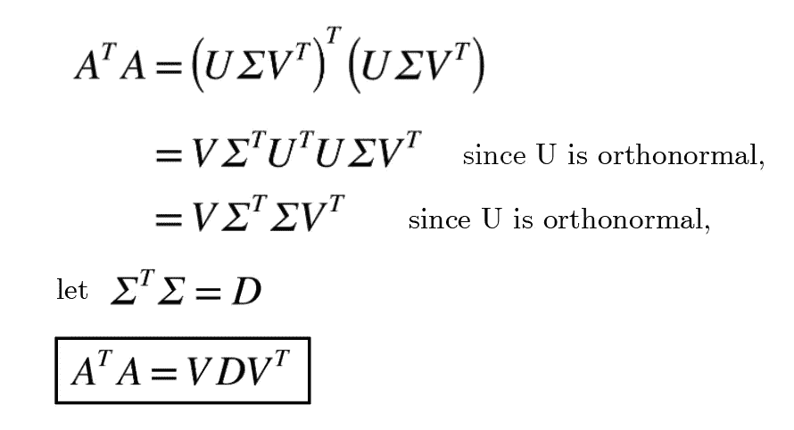

我们可以看到，右手边的最终输出完全模仿了矩阵对角化的格式。这意味着 D 是转置 A 的*特征值*，V 是*特征向量。*

注意一个更重要的事实——A 可以是任何向量。这包括本文开头的数据向量 X。还记得 X 转置 X 在 N 上求协方差矩阵吗？嗯，*计算 SVD 自动计算协方差矩阵的特征向量和特征值。*

我们所缺少的是“超过 N”部分，这可以被视为将协方差矩阵乘以标量 1/N，标量乘以矩阵会使目标矩阵的特征值发生成比例的变化，所以一切都是一样的，只是我们的特征值现在都除以 N。

这就是为什么人们将奇异值分解用于主成分分析。

## 埃卡特-扬-米尔斯基和主成分分析

这种 SVD 方法有一点细微差别，但我不会深入探讨。它需要深入研究 Eckart-Young-Mirsky 定理，该定理涉及将 SVD 分解成秩 1 分量。

回想特征值方法，你可能会发现一些联系。我再次推荐吉尔伯特·斯特朗的讲座，因为这几乎是唯一一个详细介绍埃卡特-杨-米尔斯基定理的视频。

就这样，谢谢你留下来，我希望你学到了一些东西。我现在要去睡觉了，因为现在是学校晚上的早上 5:02，干杯。

*亚当·达拉是不列颠哥伦比亚省温哥华市的一名高中生。他对户外世界非常着迷，目前正在学习环保方面的新兴技术。访问他在 adamdhalla.com 的网站。*

*跟着他的 I*[*nstagram*](https://www.instagram.com/adam.dhalla/?hl=en)*，还有他的*[*LinkedIn*](https://www.linkedin.com/in/adam-dhalla-9385111b7/)*。欲知更多，类似内容，* ***订阅他的*** [***简讯在此。*T38**](https://adamdhalla.substack.com/)