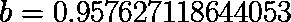

# 线性回归背后的数学

> 原文：<https://medium.com/analytics-vidhya/the-maths-behind-linear-regression-12bb72431b00?source=collection_archive---------5----------------------->

考虑一个由两个变量 **x** 和 **y** 表征的现象。

观察完这一现象后，我们现在处理一个样本数据集。

# **目标:我们想找到一个将 x 和 y 联系起来的数学公式**

这个公式将允许我们预测 **x** 的未观测值的 **y** 的值

合理的开始是创建数据集的散点图，以了解 **y** 相对于 **x.** 如何变化

散点图表明 **x** 和 **y** 之间的关系几乎是**线性的，因此，我们假设:**

其中 **a** 和 **b** 为待定常数。

**问题:**这个公式可以根据 **a** 和 **b.** 的值表示无限多条线

**解**:找出 **a** 和 **b** 的值，其中 **y(x)** 最符合数据集。

这就是线性回归发挥作用的地方。

线性回归是一种模型，用于在自变量 **x** 和因变量 **y** 之间建立线性关系。

> **我们可以认为线性回归是一种优化方法。**

# **最小二乘法:**

最小二乘法是可用于根据数据集确定两个参数 **a** 和 **b** 值的几种方法之一。

这个想法是计算 **a** 和 **b** 的值，它们对应于**误差平方和**的最小值。

错误的定义如下:

其中:

y 的精确值

y 的预测值

误差平方和定义为:

其中 **n** 是数据集中样本的**数量，在我们的例子中是 4。**

我们想找出函数 S(a，b)最小的 a 和 b 的值。

函数的极值(最小值或最大值)可以通过将导数设置为 0 来找到。*(只要函数在* ***R*** *数集中可微)*。

在我们的例子中，误差函数 S(a，b)是一个多项式，因此在 **R** 中可微，所以我们写为:

我们最终得到一个齐次方程组。

求解这些方程得到:

其中:

x 的平均值

y 的平均值

使用我们分析得出的那些结果，我们计算出 **a** 和 **b** 的最佳值:

最后，我们的回归模型看起来像这样:

根据数据集绘制的回归模型

# **为什么是最小二乘法？**

为什么要在最小化误差函数之前先平方误差？为什么不把所有的误差加起来呢？

直接对误差求和的问题是误差可能是正的，也可能是负的。正数和负数往往会相互抵消。

假设我们有一个误差 **e1=100** 和另一个误差**E2 =-100；**两个误差之和 **(e1+e2=0)** 表明我们的模型是 100%准确的，但事实显然并非如此，因为误差太大了。

因此，在创建误差函数之前，我们需要假设所有的误差都是正的，因此，将误差函数定义为误差的总和是行不通的。

要把负数转换成正数，我们一般取数的绝对值，或者我们就平方。那么为什么不取误差的绝对值呢？

可以使用这种方法，称为**最小绝对偏差**方法。尽管如此，由于绝对值微分带来的复杂性，我们往往倾向于在回归分析中使用最小二乘法。

例如，看一下下面的函数:

这个函数在 **x=0** 中显然是不可微的。

使用最小二乘法只是让这个过程更容易。

# **就是这样，这就是线性回归的工作原理。**