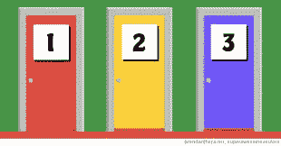

# 蒙蒂·霍尔问题

> 原文：<https://medium.com/analytics-vidhya/the-monty-hall-problem-c8ab0a7f12cc?source=collection_archive---------15----------------------->

图片由纳赛尔·塔米米在 Unsplash 上拍摄

我发现蒙蒂·霍尔问题是思考概率的一个很好的实用方法。

虽然这个问题一开始听起来不太直观，但当你开始把事情写在纸上，甚至是电子表格上时，事情就变得很清楚了。

**问题来了——**

你面前有三扇门，其中一扇门有巨额现金大奖，另外两扇门是空的。你当然不知道哪一个有奖品，但主持人有。如果你猜对了门，奖品就是你的了。

三扇门

主人让你选一扇门。在这个阶段，在你看来，这三扇门都有可能获奖。所以，你能做的就是猜一猜。

现在，为了让事情变得有趣，游戏节目主持人将你选择的门放在一边，在另外两扇门**和*中，故意打开一扇没有奖品的门*。**

想到自己还在游戏中，你松了一口气。此时，主机会给你一个选项，让你用剩下的关闭的门来切换你的门。

问题是——*该不该换另一扇门*？

我们来评价一下。

下表代表第一次迭代，绿色单元格代表奖励。

初始概率

例如，如果您选择 1 号门，您将有三分之一的机会获奖。

现在，我们来评价一下主持人给你的选择。你真的决定换门了。有哪些可能性？

如果您最初选择了门 1-

a.)在第一种情况下，你输了(你已经在正确的门上了)

b.)在情况 2 中，当您将*从门 1 切换到门 2(门 3 已经打开)时，您获胜*

*c.)在情况 3 中，当您将 ***从门 1 切换到门 3(门 2 已经打开)时，您就赢了****

*所以，你赢了三种情况中的两种，即概率为 0.67，是初始概率 0.33 的两倍。如果最初选择了门 2 或门 3，也可以进行同样的计算。*

> *从数学上来说，换工作是有意义的，即使你可能觉得无所谓。*

*你还遇到过哪些有趣的概率问题？*