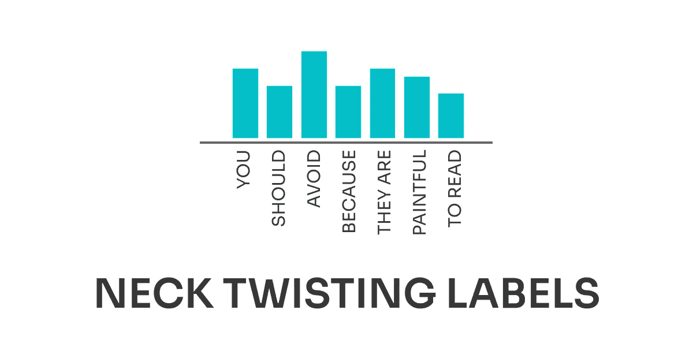

# 你应该避免扭脖子

> 原文：<https://medium.com/analytics-vidhya/the-neck-twisting-chart-d5395fad2a6e?source=collection_archive---------24----------------------->

## 增量改进#02:条形图的使用

这是关于**增量改进**的系列文章的第二篇，为了使视觉设计更好，可以做这些改进。在每篇文章中，我都会分析数据可视化，看看哪些有效，哪些无效，以及如何改进。