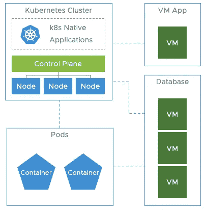
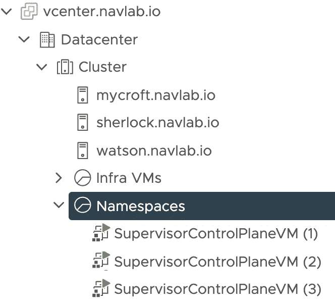
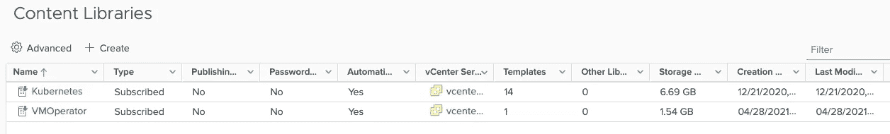
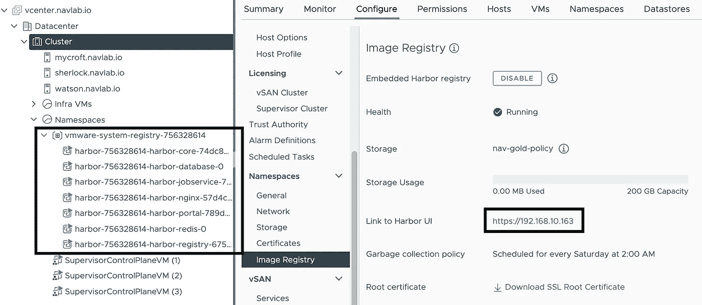
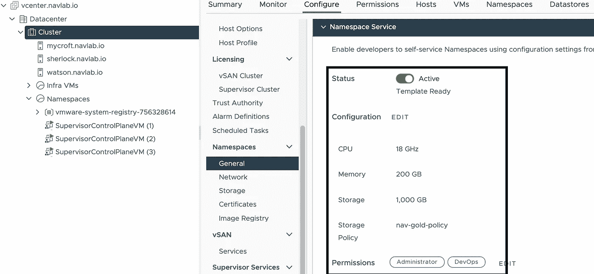
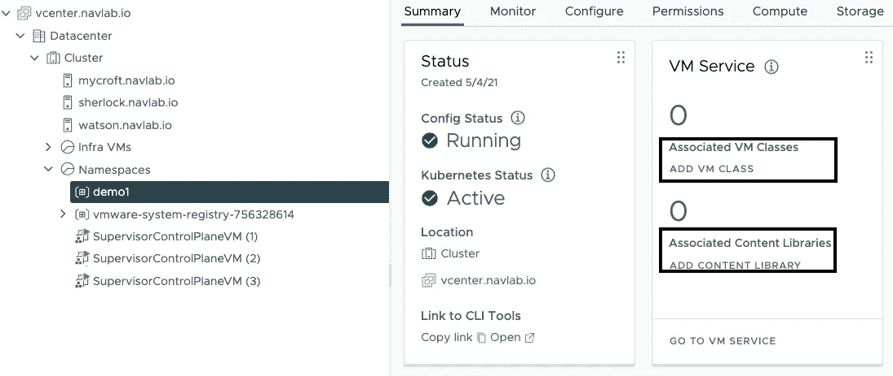
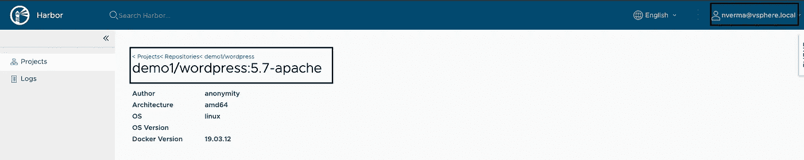
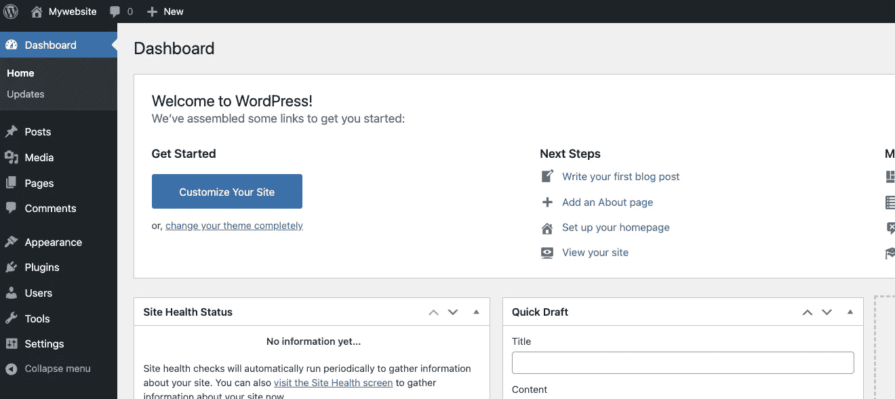
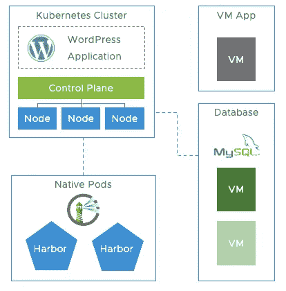
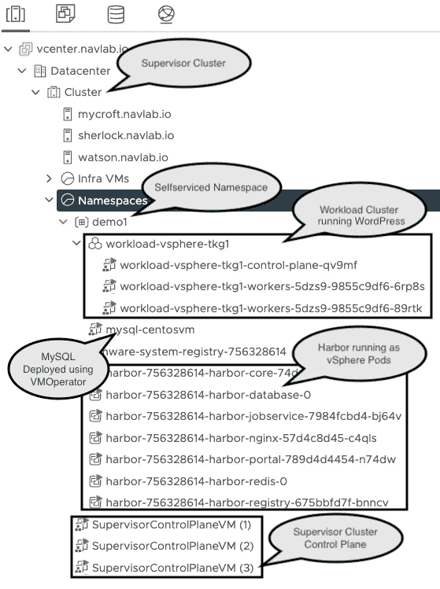

# vSphere 上新的现代工作负载

> 原文：<https://medium.com/analytics-vidhya/the-new-modern-workload-on-vsphere-fed63d57ff8d?source=collection_archive---------5----------------------->


# 介绍

vSphere 7 with Tanzu 正在改变人们实现内部应用交付现代化的方式。随着 Kubernetes 在平台中的本机集成，在 vSphere 环境中提供新应用程序堆栈的大门已经打开。您只能在 vSphere 平台内部署虚拟机的日子已经一去不复返了。随着 Tanzu 的集成，您现在可以在虚拟机旁边本地部署新对象，如 **pods** 、**负载平衡器**、 **Kubernetes 集群**。随着期待已久的虚拟机操作员功能(7.0u2a 版)的发布，DevOps 角色甚至可以利用标准 Kubernetes 流程和 CLI 来部署虚拟机和 pod。在本文中，我将通过一个简单的例子来讨论 DevOps 角色如何利用他们选择的 Kubernetes 工具来部署由 Kubernetes 集群、虚拟机、pod、注册表和负载平衡器组成的应用程序堆栈。

# 新的工作负载概念

如前所述，几年前，开发人员要求为应用程序部署调配虚拟机。vSphere 管理员部署虚拟机，然后将控制权移交给开发人员，开发人员在这些虚拟机上部署应用程序。整个过程需要几天到几周的时间，基础设施的每一层都被当成宠物。这导致了虚拟机部署的自动化。

随着 Kubernetes 的引入，运营团队负责建立和管理 Kubernetes 集群。DevOps 角色(在某些情况下，同一组人)将在这些 Kubernetes 集群上部署容器化的应用程序。在大多数情况下，通过容器化，应用程序已经变成了牛，但不幸的是，底层基础设施仍然被当作宠物对待。这带来了自身的一系列挑战。

随着流程的成熟，运营团队也开始寻找将 Kubernetes 基础设施视为牲畜的选择。Cluster API 是帮助减轻日常 Kubernetes 集群生命周期管理负担的开创性项目之一。现在，DevOps 角色可以创建和管理他们的 Kubernetes 基础设施，就像管理他们的应用程序部署一样。

当我们开始应用程序现代化旅程的下一阶段时，我们发现下一组应用程序相当棘手或复杂。它们有许多交互点，单一的有状态 VM 交互导致容器化极其困难。



挂钩多个基础设施组件的示例应用程序。

我们如何使这样的应用程序现代化？我们如何将整个设置视为牲口，并拥有一个声明性的 YAML 来部署和维护所述应用程序的期望状态？

# vSphere 携手 Tanzu 助您一臂之力

vSphere 的现有客户和新客户可以从现已本机集成到 vCenter 中的新功能中受益匪浅。网上有许多文章总结和详细介绍了 vSphere 中 Kubernetes、Cluster API、Harbor 和其他 CNCF 技术的本机集成如何为客户带来价值。只需点击一个按钮(嗯，可能是一个简短的向导)，vSphere 管理员现在就可以将现有的 vSphere 集群转换为理解 Kubernetes 语言的 **Supervisor 集群**。这个主管集群可以直接交付大量云原生服务，供 DevOps 角色使用。其中一些服务是—

*   集装箱注册使用[港](https://goharbor.io/)
*   使用[集群 AP](https://cluster-api.sigs.k8s.io/introduction.html) I 的 Kubernetes 集群 LCM
*   负载平衡器服务
*   认证服务
*   能够在 ESXi 中本地运行容器
*   命名空间和资源管理
*   使用 [VMOperator](https://github.com/vmware-tanzu/vm-operator-api) 的虚拟机 LCM
*   还会有更多。

现在让我们看看 DevOps 角色如何利用这些服务和特性，使用简单的声明性配置文件来部署复杂的应用程序。

# 方案

我们将使用一个简单的例子，如果对它的部署标准施加多种限制，这个例子很快就会变得复杂。

让我们将标准的 [Kubernetes WordPress 部署](https://kubernetes.io/docs/tutorials/stateful-application/mysql-wordpress-persistent-volume/)用于我们的示例应用程序。在本例中，MySQL pod 是使用持久卷部署的(从 Dockerhub 中的映像),并通过服务公开。部署了一个 WordPress pod(使用 Dockerhub 中的映像)来访问 MySQL DB 服务。WordPress 应用程序通过用户可以访问的端口 80 上的负载平衡器服务公开。

让我们假设 DevOps 团队受到一些常见的限制。

*   vSphere 团队不希望 DevOps 团队超出共享基础架构环境中的资源配额。
*   DevOps 团队需要安全地管理 Kubernetes 环境的 LCM。
*   由于安全限制，用户不允许从 Dockerhub 下载图像。
*   MySQL 数据库非常大，并且/或者需要大量的计算资源。
*   由于这些或其他一些安全限制，容器化 MySQL 数据库可能不是一个选项。

这些是您在任何 IT 组织中都会遇到的一些常规限制和要求，它们会很快使应用程序的架构模式变得复杂。

现在，DevOps 团队负责部署他们的 Kubernetes 集群。他们需要提供一个内部容器注册表。他们的数据库需要驻留在虚拟机上，虚拟机的生命周期需要得到安全管理。所有这些组件都需要安全地驻留在它们的边界内，而不超过分配的配额。所有这些能不能用简单的 YAML 文件来管理，让团队以 GitOps 的方式操作？答案是肯定的。

# 解决办法

## 平台设置

旅程从 vSphere admin 在 vSphere 7 U2a 或更高版本的环境中启用工作负载管理开始。这将启用我们之前在**集群**上讨论过的所有特性。



vSphere 管理员还会创建所需的内容库，以便开发运维用户可以在其命名空间内使用虚拟机映像。它们的内容创建者通过订阅的内容库提供这些映像，例如，Vmware 为 [Tanzu Kubernetes 集群映像](https://wp-content.vmware.com/v2/latest/lib.json)和[虚拟机映像](https://marketplace.cloud.vmware.com/)提供映像。



接下来，vSphere admin 在 Supervisor 集群上启用 Harbor registry 服务。如果您使用 NSX 作为网络堆栈，则此功能可用。(对于不基于 NSX 的网络堆栈，可以使用虚拟机操作员启用类似的解决方案)。如下图所示，此过程在 ESXi 服务器上安装了几个单元，并配置了可供终端用户使用的 Harbor 端点。



vSphere 管理员还可以使用 kubectl CLI 查看这些对象，因为这些只是驻留在 Supervisor 集群上的 Kubernetes 对象。

```
$ kubectl vsphere login --server wcp.navlab.io --vsphere-username administrator@vsphere.local --insecure-skip-tls-verify$ kubectl get svc -n vmware-system-registry-756328614                              
NAME                                 TYPE           CLUSTER-IP    EXTERNAL-IP      PORT(S)             AGE
harbor-756328614                     LoadBalancer   10.96.0.109   192.168.10.163   443:31012/TCP       11m
harbor-756328614-harbor-core         ClusterIP      10.96.0.202   <none>           80/TCP              10m
...$ kubectl get pods -n vmware-system-registry-756328614 -o wide                     
NAME                                                 READY   STATUS    RESTARTS   AGE   IP            NODE               NOMINATED NODE   READINESS GATES
harbor-756328614-harbor-core-74dc84785-jhw54         1/1     Running   0          16m   10.244.0.24   watson.navlab.io   <none>           <none>
harbor-756328614-harbor-database-0                   1/1     Running   0          16m   10.244.0.18   watson.navlab.io   <none>           <none>
```

最后，vSphere admin 在 Supervisor 集群上启用自助命名空间。通过这个选项，管理员可以对每个 DevOps 用户可以在 Supervisor 集群上创建和使用的未来名称空间的资源和访问进行模板化。



这就是需要做的所有前期准备。现在，基础架构被移交给 DevOps 团队，以便在此环境中部署他们的应用程序。

## 应用程序部署

DevOps 用户现在可以使用登录到 Supervisor 集群，并开始与它进行交互，以使用 Kubernetes API/CLI 创建对象。第一步是创建应用程序将驻留的名称空间。创建的命名空间继承了上一步中在模板内实施的所有配额、限制和 RBAC。如果设置了 integrated Harbor registry(见上文),那么名称空间的创建会自动触发在 Harbor 环境中创建具有关联 RBAC 的项目。

```
$ kubectl vsphere login --server wcp.navlab.io --vsphere-username nverma@vsphere.local --insecure-skip-tls-verify$ cat ns.yaml---
apiVersion: v1
kind: Namespace
metadata:
  name: demo1$ kubectl create -f ns.yaml
namespace/demo1 created
```

接下来的两个步骤是手动的(希望由 vSphere 产品团队自动完成)。新创建的名称空间需要绑定一组 VMclasses 和内容库。这目前可以通过中央界面实现。



```
$ kubectl get virtualmachineclassbinding -n demo1                                  
NAME                 VIRTUALMACHINECLASS   AGE
best-effort-large    best-effort-large     4m56s
best-effort-medium   best-effort-medium    4m56s
best-effort-small    best-effort-small     4m56s
best-effort-xsmall   best-effort-xsmall    4m55s$ kubectl get contentsourcebindings -n demo1                                       
NAME                                   CONTENTSOURCE
9c54ca6c-fdf3-4ed8-b628-1a622641ebb7   9c54ca6c-fdf3-4ed8-b628-1a622641ebb7
9f4c1210-2c9b-46d2-81ad-f8f5139e4e74   9f4c1210-2c9b-46d2-81ad-f8f5139e4e74
```

下一步是部署将在 CentOS 虚拟机上运行的 MySQL 数据库(在撰写本文时，VMware 为使用 VMOperator 的虚拟机部署提供了基于 CentOS 的 OVA。这是通过云市场实现的。在他们的网站上可以找到关于如何通过内容库消费市场图像的文档。第一步是构建一个 cloud-init.yaml 文件。关于如何构建 cloud-init 文件的文档可以参考[这里的](https://cloudinit.readthedocs.io/en/latest/)。MySQL 自动化的一个示例文件可能与此类似—

```
#cloud-config
chpasswd:
    list: |
      centos:password
    expire: false
groups:
  - docker
users:
  - default
  - name: centos
    ssh-authorized-keys:
      - ssh-rsa AAAAB3Nz...m50YwPyUFoUAUOXaqM6J8sXJd1THHFXBd/9jmnI60abFj50hqNuk62cN9kHW55HSO/L/Llz/PZyuk0wTbfqzc8BRA3Z0YiLo+I/LIc0= nverma@bastion0
    sudo: ALL=(ALL) NOPASSWD:ALL
    groups: sudo, docker
    shell: /bin/bash
# Enable password based authentication if needed
# ssh_pwauth: True
network:
  version: 2
  ethernets:
      ens192:
          dhcp4: true
package_update: true
packages:
  - mysql-server
  - net-tools
runcmd:
  - systemctl enable mysqld
  - systemctl start mysqld
  - sudo mysql -e "CREATE DATABASE wordpress;"
  - sudo mysql -e "CREATE USER 'wordpress_user'@'%' IDENTIFIED BY 'password';"
  - sudo mysql -e "GRANT ALL ON wordpress.* TO 'wordpress_user'@'%'"
  - sudo mysql -e "FLUSH PRIVILEGES;"
  - sed -i '$abind-address=0.0.0.0' /etc/my.cnf.d/mysql-server.cnf
  - systemctl restart mysqld
  - firewall-offline-cmd --add-port=3306/tcp
  - firewall-cmd --reload
```

base64 编码的 cloud-init.yaml 值[ *猫 cloud-init . YAML | base64-w0；echo* 文件被添加到虚拟机部署配置文件中。VMware 网站上提供了有关如何构建规范文件的详细信息。

```
# vm.yml
---
apiVersion: v1
kind: PersistentVolumeClaim
metadata:
  name: mysql-pvc
  namespace: demo1
spec:
  accessModes:
  - ReadWriteOnce
  resources:
    requests:
      storage: 4Gi
  storageClassName: nav-gold-policy
  volumeMode: Filesystem
---
apiVersion: vmoperator.vmware.com/v1alpha1
kind: VirtualMachine
metadata:
  labels:
    vm-selector: mysql-centosvm
  name: mysql-centosvm
  namespace: demo1
spec:
  imageName: centos-stream-8-vmservice-v1alpha1-1619529007339
  className: best-effort-small
  powerState: poweredOn
  storageClass: nav-gold-policy
  networkInterfaces:
  - networkType: nsx-t
    networkName: ""
  volumes:
  - name: my-centos-vol
    persistentVolumeClaim:
      claimName: mysql-pvc
  readinessProbe:
    tcpSocket:
      port: 22
  vmMetadata:
    configMapName: centos-cloudinit
    transport: OvfEnv
---
apiVersion: v1
kind: ConfigMap
metadata:
    name: centos-cloudinit
    namespace: demo1
data:
  user-data: [insert your base64 encoded cloud-init.yaml value here]  
  hostname: centos-mysql
---
apiVersion: vmoperator.vmware.com/v1alpha1
kind: VirtualMachineService
metadata:
  name: mysql-vmservices
spec:
  ports:
  - name: ssh
    port: 22
    protocol: TCP
    targetPort: 22
  - name: mwsql
    port: 3306
    protocol: TCP
    targetPort: 3306
  selector:
    vm-selector: mysql-centosvm
  type: LoadBalancer
```

MySQL VM 及其相关组件已经部署。在虚拟机可以使用之前，部署、启动和执行云初始化流程大约需要 3 到 4 分钟。

```
$ kubectl apply -f vm.yml -n demo1                                               
persistentvolumeclaim/mysql-pvc created
virtualmachine.vmoperator.vmware.com/mysql-centosvm created
configmap/centos-cloudinit created
virtualmachineservice.vmoperator.vmware.com/mysql-vmservices created$ kubectl get svc -n demo1                                                         NAME               TYPE           CLUSTER-IP    EXTERNAL-IP      PORT(S)                       AGE
mysql-vmservices   LoadBalancer   10.96.0.147   192.168.10.162   22:31887/TCP,3306:30863/TCP   14m
```

验证—
要验证 MySQL VM 是否已成功创建并可访问，您可以从其 RSA 密钥在 cloud-init 中共享的主机进行 ssh。yaml。登录虚拟机，验证 MySQL 是否成功监听端口 3306。

```
$ ssh centos@192.168.10.162 [centos@centos-mysql ~]$ netstat -an
Active Internet connections (servers and established)
Proto Recv-Q Send-Q Local Address           Foreign Address         State
tcp        0      0 0.0.0.0:22              0.0.0.0:*               LISTEN
tcp        0      0 0.0.0.0:3306            0.0.0.0:*               LISTEN
...
```

厉害！！现在我们需要部署 WordPress 应用程序。在此之前，我们需要创建一个 Kubernetes 集群。使用在管理集群上运行的 Cluster-API，这也是一个简单的操作。

```
# cluster.yaml
---
apiVersion: run.tanzu.vmware.com/v1alpha1
kind: TanzuKubernetesCluster
metadata:
  name: workload-vsphere-tkg1
  namespace: demo1
spec:
  distribution:
    version: v1.18.15
  topology:
    controlPlane:
      count: 1
      class: best-effort-medium
      storageClass: nav-gold-policy
      volumes:
        - name: etcd
          mountPath: /var/lib/etcd
          capacity:
            storage: 4Gi
    workers:
      count: 2
      class: best-effort-medium
      storageClass: nav-gold-policy
      volumes:
        - name: containerd
          mountPath: /var/lib/containerd
          capacity:
            storage: 30Gi
  settings:
    network:
      services:
        cidrBlocks: ["198.51.100.0/24"]
      pods:
        cidrBlocks: ["192.0.2.0/22"]
    storage:
      classes: ["nav-gold-policy"]
      defaultClass: nav-gold-policy
```

使用上述文件创建集群。根据请求的节点数量，完成群集创建可能需要 5-10 分钟。出于自动化的目的，您可以观察 Tanzu Kubernetes 集群(tkc)对象的状态，以验证 Kubernetes 集群是否启动并准备好使用。

```
$ kubectl apply -f cluster1.yaml -n demo1                                          tanzukubernetescluster.run.tanzu.vmware.com/workload-vsphere-tkg1 created$kubectl get tkc -n demo1                                                                                                 
NAME                    CONTROL PLANE   WORKER   DISTRIBUTION                      AGE   PHASE     TKR COMPATIBLE   UPDATES AVAILABLE
workload-vsphere-tkg1   1               2        v1.18.15+vmware.1-tkg.1.600e412   13h   running   True             [1.19.7+vmware.1-tkg.1.fc82c41]
```

一旦集群准备好了，我们现在准备将 WordPress 应用程序部署到集群中。如先决条件中所述，我们不能直接从 Dockerhub 中提取 WordPress 图片。我们需要将映像托管在私有 Harbor 注册表中，该注册表设置为直接在 ESXI 服务器上运行的 vSphere pods(见上文)。从一个可以访问互联网的跳转主机上，下载 WordPress 图片，用 Harbor 注册表名称标记它，然后按照下面的示例命令将它上传到注册表

```
$ docker login [https://192.168.10.163](https://192.168.10.163)                                   Username: nverma@vsphere.local
Password:
WARNING! Your password will be stored unencrypted in /home/nverma/.docker/config.json.
Configure a credential helper to remove this warning. See
[https://docs.docker.com/engine/reference/commandline/login/#credentials-store](https://docs.docker.com/engine/reference/commandline/login/#credentials-store)Login Succeeded$ docker pull wordpress:5.7-apache                                              5.7-apache: Pulling from library/wordpress
f7ec5a41d630: Pull complete
...
Status: Downloaded newer image for wordpress:5.7-apache
docker.io/library/wordpress:5.7-apache$ docker images
docker images                                                             REPOSITORY                        TAG                 IMAGE ID            CREATED             SIZE
wordpress                         5.7-apache          7fda6c241024        4 days ago          551MB
...$ docker tag 7fda6c241024 192.168.10.163/demo1/wordpress:5.7-apache
# Note the IP address of the Harbor registry is the same as the one in the screenshot above.
# A project called demo1 was automatically created when the namespace was deployed. This is the project where we will be uploading the image$ docker push 192.168.10.163/demo1/wordpress                                    
The push refers to repository [192.168.10.163/demo1/wordpress]
623e5ea375d9: Pushed
...
5.7-apache: digest: sha256:ff25d3a299dc7778cdc51793f899f4a5a745cc78a00632fb466f59d96cbf83b5 size: 4709
```



显示 Wordpress 上传图片的港口界面。

既然图像已经上传到本地 Harbor 存储库，我们可以使用标准的 Kubernetes 方法来部署 WordPress 应用程序。首先，我们登录到新部署的 Kubernetes 集群，并修改 Kubeconfig 活动上下文。还创建了一个包含私有注册中心凭证的秘密对象。

```
$ kubectl vsphere login --server wcp.navlab.io --vsphere-username nverma@vsphere.local --insecure-skip-tls-verify --tanzu-kubernetes-cluster-name workload-vsphere-tkg1 --tanzu-kubernetes-cluster-namespace demo1...$ kubectl config use-context workload-vsphere-tkg1
Switched to context "workload-vsphere-tkg1".$ kubectl create secret docker-registry regcred --docker-server=192.168.10.163 --docker-username=nverma@vsphere.local --docker-password="my vsphere.local password" --docker-email=nverma@vsphere.local
```

如果这是第一次连接到 TKC，您可能希望根据您的要求放宽 pod 安全策略。这在 Vmware 的网站上有记录。下面显示了 DevOps 将用来部署 WordPress 的示例 YAML(引用自 Kubernetes 文档，并根据当前需求进行了修改)。该应用程序通过端口 80 上的服务类型负载平衡器公开。请注意 MySQL 服务(在上一步中运行在虚拟机上)是如何被 MYSQLDB_SERVICE_HOST 环境变量引用的。MYSQLDB 服务被配置为无选择器服务，以直接访问前面步骤中公开的虚拟机的负载平衡器服务。

```
# wordpress.yaml
---
apiVersion: v1
kind: Service
metadata:
  name: wordpress
  labels:
    app: wordpress
spec:
  ports:
    - port: 80
  selector:
    app: wordpress
    tier: frontend
  type: LoadBalancer
---
apiVersion: v1
kind: PersistentVolumeClaim
metadata:
  name: wp-pv-claim
  labels:
    app: wordpress
spec:
  accessModes:
    - ReadWriteOnce
  resources:
    requests:
      storage: 20Gi
---
apiVersion: apps/v1
kind: Deployment
metadata:
  name: wordpress
  labels:
    app: wordpress
spec:
  selector:
    matchLabels:
      app: wordpress
      tier: frontend
  strategy:
    type: Recreate
  template:
    metadata:
      labels:
        app: wordpress
        tier: frontend
    spec:
      containers:
      - image: 192.168.10.163/demo1/wordpress:5.7-apache
        name: wordpress
        env:
        - name: WORDPRESS_DB_HOST
          value: "$(MYSQLDB_SERVICE_HOST)"
        - name: WORDPRESS_DB_PASSWORD
          value: "password"
        - name: WORDPRESS_DB_USER
          value: "wordpress_user"
        ports:
        - containerPort: 80
          name: wordpress
        volumeMounts:
        - name: wordpress-persistent-storage
          mountPath: /var/www/html
      volumes:
      - name: wordpress-persistent-storage
        persistentVolumeClaim:
          claimName: wp-pv-claim
      imagePullSecrets:
      - name: regcred
---
apiVersion: v1
kind: Service
metadata:
  name: mysqldb
spec:
  ports:
  - name: mysql
    port: 3306
    protocol: TCP
---
apiVersion: v1
kind: Endpoints
metadata:
  name: mysqldb
subsets:
- addresses:
  - ip: 192.168.10.162
  ports:
  - name: mysql
    port: 3306
    protocol: TCP
```

一旦您应用了上面的 YAML，并让应用程序在新的集群上启动，WordPress 应用程序将可以在端口 80 上访问。

```
$ kubectl apply -f wordpress.yaml                     
service/wordpress created
persistentvolumeclaim/wp-pv-claim created
deployment.apps/wordpress created
service/mysqldb created
endpoints/mysqldb created$ kubectl get svc -A                                 
NAMESPACE     NAME         TYPE           CLUSTER-IP       EXTERNAL-IP      PORT(S)                  AGE
default       mysqldb      ClusterIP      198.51.100.47    <none>           3306/TCP                 3m57s
default       wordpress    LoadBalancer   198.51.100.230   192.168.10.165   80:32379/TCP             3m57s
...
```

在网络浏览器的端口 80 上访问我们的应用程序，我们得到我们熟悉的 WordPress 管理页面！！！



# 结论

正如本文开头所讨论的，使用 Kubernetes 与 vSphere 的新概念和更紧密的集成，我们可以在 vSphere 和 Tanzu 环境中交付复杂的工作负载。下图展示了我们新建筑的外观。请注意，为了保持本文的简短，我们没有引入 VM 应用程序的额外集成点(以灰色显示)。这可以通过类似于如何部署数据库虚拟机的概念轻松实现。整个设置包含在`demo1`名称空间中，因此遵守了对名称空间的所有约束。



由于运营团队在建立整个应用程序堆栈时几乎不需要做任何准备工作，因此开发人员的权力得到了释放。他们可以使用标准的 CICD 工具，通过原生 Kubernetes 集成，在 vSphere 平台内自动处理如此复杂的工作负载。

作为参考，请参见下图，该图是中心环境的带注释的屏幕截图，展示了 vCenter server 上现在可用的所有对象。



Github 链接到本博客中引用的文件—[https://github . com/papi vot/the-new-modern-workload-on-VSP here](https://github.com/papivot/the-new-modern-workload-on-vSphere)