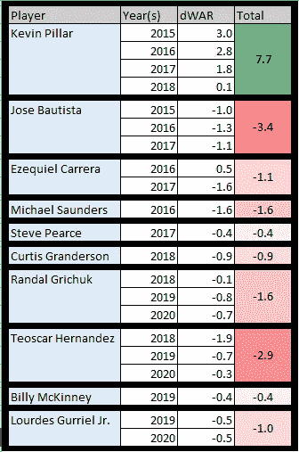
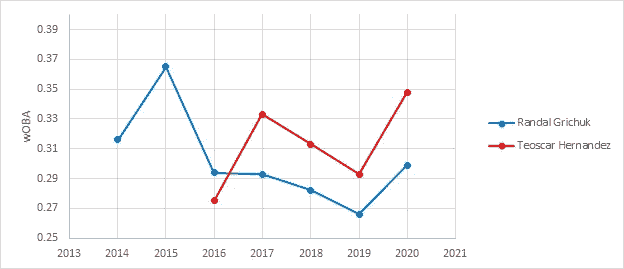

# 新多伦多蓝鸟队的右外野手

> 原文：<https://medium.com/analytics-vidhya/the-new-toronto-blue-jays-starting-right-fielder-30e88894fc06?source=collection_archive---------16----------------------->

自从 2015 年特洛伊·图洛维茨基和大卫·普莱斯被交易以来，多伦多蓝鸟队带着最大的获胜希望回来了。最近，在另一个罕见的事件中，蓝鸟签下了一名大自由球员，并在接下来的几年里巩固了他在名单上的位置。这笔交易使前休斯顿太空人乔治·斯普林格成为特许经营历史上最大的签约，在 6 年的时间里总计 1.5 亿美元。“丛林之王”乔治·斯普林格极大地帮助了蓝鸟队，使得已经很恐怖的击球手阵容*更加恐怖。*

把话题转到球的另一面，斯普林格的速度和防守能力确保了有点不稳定的外场防守。在斯普林格加入之前，球员们必须经历大量的位置变化和发展。这些年，外场防守不符合大联盟标准。现在斯普林格已经签约打中外场，并有另外 3 名外野手支持他的两翼，蓝鸟队面临一个很好的问题。谁将占据外野角落的位置？现有的外野手中哪一个会获得最多的上场时间？

正如俗话所说，省下一美元就是赚到一美元，这一点在体育运动中体现得非常明显:一桶被拒绝的球就是一桶得分的球，省下一球就是一球得分的球。在棒球比赛中，保住一分就是赢得一分。蓝鸟队有围绕得分得分建立球队的历史。想想何塞·包蒂斯塔、迈克尔·桑德斯和柯蒂斯·格兰德森。这些球员并不是伟大防守的同义词。他们因在任期内提供高于平均水平的进攻而闻名。在过去的 6 年里，松鸦队主要专注于进攻，得分高出联盟平均水平约 0.2 分。这甚至包括 2017 年至 2019 年的“黑暗时代”。显而易见，在过去的 5 年里，管理层对外手的选择一直偏向于进攻。表 1 通过计算蓝鸟球员的 wRAA 来比较他们。

***表 wRAA 的蓝鸟(15'-20')***

*(Weight Runs over Average 或 wRAA 衡量每个球员对全队进攻的得分贡献。简单地说，高于零意味着他们那一年比普通球员得分更多，低于零意味着他们得分更少)*

虽然这些球员知道如何使用球棒，但当想到手套时，很少会有闪光的时刻。这张表对凯文·皮勒进行了负面评价，但他的名声继续成为过去 6 年中外场防守中发生的最好的事情。

***表 2:矮脚蓝鸟(15'-20')***

*(防守胜于替补或 dWAR 是通过使用大量的防守棒球统计数据将球员与联盟平均水平进行比较来计算的。高于 0 且球员在自己位置上比一般球员强，低于 0 表示相反)*

如表 2 所示，凯文·皮勒最突出的是他的手套给了松鸦队高于平均水平的外场防守和全联盟球迷瞠目结舌的亮点。

Pillar 为中外场的明星防守设立了标杆，此后再也没有球员填补过这一空白。即使有这个人类的亮点在草地上巡逻，松鸦在外场也很挣扎。在皮勒的任期内(2015-2018 年)，他们在 UZR 排名第 21、17、25 和 28 位，在 2019-2020 年，他们排名第 22 和 25 位。

即使在 2016 年的巅峰时期，当 Pillar 覆盖了大部分外场草地时，他们也没有取得积极的进展，因为外场在赛季结束时总共获得了-0.4 UZR。

在过去的半年里，2016 蓝鸟在外场防守上达到了巅峰……直到现在。

乔治·斯普林格加入了小卢尔德·古里尔、兰德尔·格里丘克和特奥斯卡·埃尔南德斯的外野阵容，这引出了蓝鸦的粉丝们想知道的问题:这些人谁会在外野的哪里打球？正如人们猜测的那样，斯普林格将担任多伦多的中锋，原因显而易见。他在 2017 年开始转向打 CF，当时杰克·马里斯尼克有限的进攻能力超过了他为休斯顿太空人队制造得分的能力。太空人队寻求马里斯尼克的防守，但它不是斯普林格在这个位置上的能力的对手，并给球队带来了高于平均水平的进攻，正如你在表 3 中看到的。斯普林格成为 CF 角色的明确选择，不久后马里斯尼克被交易到大都会队。

***表 3:休斯顿 CF 大战& OPS 对比(16'-19')***

**中外场位置:乔治·斯普林格**

这解决了 CF 的争论，如果有一个开始的话。现在我们的焦点将指向外野的角落。这些职位的候选人列于表 4:

***表 4:蓝鸟之战& OPS 对比(16'-20')***

*(进攻胜于替补或 oWAR 类似于 dWAR，但它仅基于进攻表现来衡量球员的价值
OPS+:一种联赛和球场调整的击球统计，衡量球员的进攻贡献，得分为 100，是一名普通球员。例如，125 的 OPS+意味着击球手比大联盟的平均水平高 25%*

不像斯普林格 vs 马里斯尼克表，很难衡量每个球员的攻防能力来选择谁最好。特奥斯卡和格里丘克有更多的数据，因为每个球员都在大联盟中积累了 5 年以上的服务时间，但卢尔德的时间表没有追溯到那么远。

卢尔德只打了两年的外场手。作为 2018 年的新秀，他的任务是在中内场备份阿列迪斯·迪亚兹和德文·特拉维斯。2019 年，更多的中内野手加入了弗雷迪·加尔维斯、埃里克·索加德和博·比切特。这一转变将卢尔德推到了左外野，并给了他一个在新的位置上大放异彩的机会……他确实大放异彩。

卢尔德已经被证明是松鸦队中位置调整最好的外野手，同时他的场均得分不断增加(124 分对特奥斯卡的 120 分)。假设小弗拉迪米尔·格雷罗和吵闹的特列斯是占据指定击球手(DH)位置的人(自从加入联盟以来获得了负面的防守评分)，卢尔德将完美地适合 LF 的角色。此外，在过去的两年里，卢尔德在 LF 打了 969.2 局，相比之下，特奥斯卡打了 356.1 局，格里丘克打了 0 局。尽管特奥斯卡和格里丘克在多个外场位置上积累了经验，但卢尔德只了解 LF grass。在过去的几年里，卢尔德一直是一个崭露头角的，似乎被低估的力量。即使有了施普林格，LF 似乎也是小卢尔德·古里尔(Lourdes Gurriel Jr .)进入 2021 赛季的唯一选择。

左外野位置:小卢尔德·古里尔

剩下的就是右场(RF)位置和两个合格的个人:Randal Grichuk 和 Teoscar Hernandez。从进攻角度评价两人，都是中等偏上的进攻球员。如图 1 所示，自从加入大联盟以来，这两个人的 oWAR 值都是正数。

***图一:格里丘克 vs 埃尔南德斯·奥瓦尔对比(16'-20')***

特奥斯卡的奥瓦尔胜过格里丘克，但重要的是评估其他指标，以确定谁是这个角色的合适人选。将我们的注意力转向更具体的统计数据，看起来格里丘克在多个击球类别上不如特奥斯卡，例如:

# 基于球百分比

***图表 2:格里丘克 vs 埃尔南德斯 BB%对比(14'-20')***

*(以球%或 BB%为基础，衡量玩家在一次行走中完成的盘子出现的百分比)*

# 桶百分比

***图 3:格里丘克 vs 埃尔南德斯木桶%对比(15'-20')***

*(桶百分比，测量落在退出速度和发射角度分类中的击球数量，其历史上导致高击球率)*

# 根据基数平均值加权(wOBA)

***图 4:格里丘克 vs 埃尔南德斯 wOBA 对比(14'-20')***

*(加权平均垒打或 wOBA 衡量球员安全到达垒的能力，同时比保送和单打更重视额外的垒打)*

# 比赛中的平均击球率(BABIP)

***图 5:格里丘克 vs 埃尔南德斯 BABIP 对比(14'-20')***

精通棒球的球迷可能会说，BABIP 并不真正重要，因为它可能会被运气扭曲，他们可能是对的。BABIP 不应该被用作评估一名球员的唯一决定因素，但知道它是如何计算的((安打数-本垒打)/(击球数-本垒打数-三振数+高飞球数))让我们可以做出一个假设。一个球员击球越努力，越稳定，不管它是否在比赛中结束，他们的 BABIP 就越大。看图表 6 和 7，我们可以看到特奥斯卡的硬命中率和平均出球速度都比格里丘克高。现在我们知道，从 2018 年到 2020 年，特奥斯卡的进攻大大超过了格里丘克。

***图表 6:格里丘克 vs 埃尔南德斯出口速度对比(14'-20')***

*(退出速度或 EV 衡量球员在所有击球上的平均退出速度)*

***图 7:格里丘克 vs 埃尔南德斯硬%对比(15'-20')***

*(HARD%计算击出速度为 95 英里/小时或更高的球的百分比)*

然而，这篇文章不是要争论谁是更好的击球手，而是要回答谁应该在 RF 位置上花更多的时间。虽然进攻很重要，但是你必须打好自己的位置，以确保用球棒赢得的分数不会被拙劣的接球和低效的飞球所浪费。

格里丘克在职业生涯中打了比特奥斯卡更多的局数，因此，这些数据限制了我们。我们将不得不看看每个球员在所有外场位置的集体 Def 等级，以全面了解谁最适合这个角色。

***表 5:格里丘克 vs 赫尔南德斯的 Def
对比(14'-20')***

*(defence 或 Def 使用多个防守统计来计算球员的防守等级，同时考虑位置调整)*

表 5 清楚地描述了格里丘克在所有外场位置上都是更好的外场手。然而，它们的 RF Def 等级的差异是相似的。也许是因为格里丘克的上场时间，也许是特奥斯卡在休斯顿小联盟时就有了在 RF 的经历。

为了更深入地了解它们的射频性能，表 6 比较了它们过去 4 年的 Def 等级。请注意，特奥斯卡在 2019 赛季从未参加过 RF 比赛，因为他正在 CF 和 LF 接受测试。

***表 6:格里丘克 vs 埃尔南德斯 RF Def
对比(17'-20')***

如表 6 所示，Grichuk 在 MLB 的整个职业生涯中，在这个职位上积累了更多的经验。在 2017 年和 2018 年，他打了近 4 倍于特奥斯卡的局数，并积累了积极的 Def 评级(0.7)。但是，我们能评价的最近的比较，都是来自格里丘克 2019 年的表现和特奥斯卡 2020 年的表现。在这些可比较的赛季中，特奥斯卡被认为是比格里丘克更好的防守型右外野手。

格里丘克在红雀队的记录是 4 年前。从那以后，他在松鸦队的角色更多的是中外野手。此外，他的进攻贡献在过去 5 年里一直呈下降趋势。如果最近能说明什么的话，特奥斯卡的防守能力在慢慢提高，而他的打击能力却有了很大的提高。总之，格里丘克的防守能力可能比特奥斯卡好，但他的击球能力不是特奥斯卡的对手。

多伦多蓝鸟队有一个很大的问题:他们队里有太多优秀的球员。虽然格里丘克和特奥斯卡的表现相似，两个球员都适合 RF，但特奥斯卡总体上会打得更好。因此，特奥斯卡·埃尔南德斯理应成为多伦多蓝鸟队的首发右外野手。

右外野手:特奥斯卡·埃尔南德斯