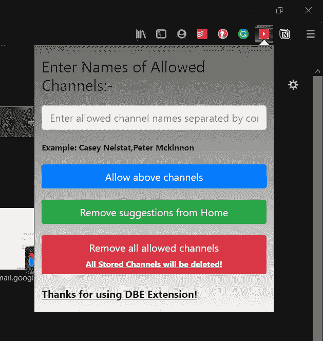

# 火狐浏览器的“非邪恶 YouTube”扩展——教程

> 原文：<https://medium.com/analytics-vidhya/the-not-evil-youtube-extension-for-firefox-a-tutorial-ebb7063367b6?source=collection_archive---------17----------------------->

# 介绍

作为一名软件工程师，我在 YouTube 上看了很多教育视频。像 freecodecamp、MITOpenCourseware 等频道有很多很棒的内容，有助于理解不同的概念以及不同的编码框架。但这遇到了一个基本问题，YouTube 希望你留在他们的网站上，因此会显示许多与你正在观看的教育内容不一定相关的推荐。(你知道那些标题像“你不会相信接下来发生了什么”的)所以我决定写一个 Firefox 扩展来解决这个问题。我决定将它命名为“不邪恶的 YouTube”，灵感来自谷歌最初的座右铭“不要邪恶”。这是我第一次尝试写扩展，我将分享我在这篇文章中学到的东西。

# 第 1 部分:清单. json

```
{
  "manifest_version": 2,
  "name": "The not evil youtube",
  "version": "3.0.2",
  "description": "Removes unwanted videos from suggestions on homepage as well as suggestion tab when the video is playing.",
  "icons": {
    "48": "yt_icon.png"
  },
  "permissions": [
    "activeTab",
    "tabs",
    "storage"
  ],
  "browser_action": {
    "default_icon": "yt_icon.png",
    "default_title": "DBE",
    "default_popup": "index.html"
  }
}
```

在项目的根目录中，您必须创建这个文件，并将其命名为“manifest.json”。这是描述扩展组件的文件。

密钥 manifest_version、name 和 version 是必需的。

permissions 键用于指定扩展所需的所有权限。

browser 动作用于设计当您单击浏览器菜单上的扩展图标时弹出的页面。

现在让我们来看看 index.html

# 第二部分:index.html 与 fe.js

```
<!DOCTYPE HTML>
<html><head>
    <link rel="stylesheet" href="[https://stackpath.bootstrapcdn.com/bootstrap/4.4.1/css/bootstrap.min.css](https://stackpath.bootstrapcdn.com/bootstrap/4.4.1/css/bootstrap.min.css)"
        integrity="sha384-Vkoo8x4CGsO3+Hhxv8T/Q5PaXtkKtu6ug5TOeNV6gBiFeWPGFN9MuhOf23Q9Ifjh" crossorigin="anonymous">
    <script src="[https://stackpath.bootstrapcdn.com/bootstrap/4.4.1/js/bootstrap.min.js](https://stackpath.bootstrapcdn.com/bootstrap/4.4.1/js/bootstrap.min.js)"
        integrity="sha384-wfSDF2E50Y2D1uUdj0O3uMBJnjuUD4Ih7YwaYd1iqfktj0Uod8GCExl3Og8ifwB6"
        crossorigin="anonymous"></script>
    <style>
        #maindiv {
            margin-left: 3%;
            margin-right: 3%;
            margin-top: 5%;
            align-items: center;
            align-content: center;
        }#global {
            background-image: linear-gradient(to bottom, #63645f, #f5f1f1);
        }.bton {
            padding-left: 10px;
            padding-right: 10px;
            text-align: center;
            font-size: auto;
            cursor: pointer;
        }.myBtn {
            margin-top: 5%;
            margin-bottom: 5%;
        }
    </style>
</head><body id="global">
    <div id="maindiv">
        <h4 class="text">Enter Names of Allowed Channels:-</h3>
            <div class="form-group">
                <div class="myBtn form-group"><input class="form-control"
                        placeholder="Enter allowed channel names separated by commas" id="ip" type="text" /></div>
                <small id="emailHelp" class="form-text font-weight-bolder">Example: Casey Neistat,Peter Mckinnon</small>
            </div>
            <div class="form-group">
                <div class="bton myBtn btn btn-primary btn-block" id="submit"> Allow above
                    channels</div>
                <div class="bton myBtn btn btn-success btn-block" id="remove"> Remove
                    suggestions from Home</div>
                <div class="bton myBtn btn btn-danger btn-block" id="deleteAll"> Remove
                    all allowed channels
                    <small class="form-text font-weight-bolder"><u>All Stored Channels will be deleted!</u></small>
                </div></div>
            <p><strong><u>Thanks for using DBE Extension!</u></strong></p>
    </div>
    <script src="fe.js"></script>
</body></html>
```

这只是一个非常基本的 html 页面，带有一些引导样式。页面中嵌入的脚本 fe.js 是我们实际开始编写扩展的地方。

这就是 index.html 的样子。



*   fe.js(前端脚本)

```
function listenForClicks() {/*
        This function triggers the listener in hide.js to 
        call the function "trigger" in hide.js
    */
    function trigger(tabs) {
        browser.tabs.sendMessage(tabs[0].id, {
            command: "run",
        });
    }//Set a listener on the remove suggestions button
    let elem = document.getElementById("remove");
    elem.addEventListener("click", (e) => {
        browser.tabs.query({ active: true, currentWindow: true })
            .then(trigger)
            .catch(() => {
                console.error("Script Broke")
            });});/*
        This function triggers the listener in hide.js to 
        call the function "allowedChannel" in hide.js and passes value as an argument.
    */
  //Label - A
    function triggerInput(tabs) {
        let value = document.getElementById("ip").value;
        browser.tabs.sendMessage(tabs[0].id, {
            command: "ip",
            data: value
        });
    }//Set a listener on the submit channel button
  //Label - B
    let ele = document.getElementById("submit");
    ele.addEventListener("click", (e) => {
        browser.tabs.query({ active: true, currentWindow: true })
            .then(triggerInput)
            .catch(() => {
                console.error("Script Broke")
            });});/*
        This function triggers the listener in hide.js to 
        call the function "clearStorage" in hide.js
    */
    function clearStorage(tabs) {
        browser.tabs.sendMessage(tabs[0].id, {
            command: "armageddon"
        });
    }let btn = document.getElementById("deleteAll");
    btn.addEventListener("click", (e) => {
        browser.tabs.query({ active: true, currentWindow: true })
            .then(clearStorage)
            .catch(() => {
                console.error("Script Broke")
            });});}/**
 * When the popup loads, inject a content script into the active tab,
 * and add a click handler.
 * If we couldn't inject the script, handle the error.
 * This is taken from official documentation from 
 * [https://developer.mozilla.org/en-US/docs/Mozilla/Add-ons/WebExtensions/Your_first_WebExtension](https://developer.mozilla.org/en-US/docs/Mozilla/Add-ons/WebExtensions/Your_first_WebExtension)
 */
browser.tabs.executeScript({ file: "/hide.js" })
    .then(listenForClicks)
    .catch(() => {
        console.log("Script Broke");
    });
```

当 fe.js 加载时，我们调用 hide.js 脚本(也称为内容脚本),它在选项卡上设置一个监听器。这有助于我们从内容脚本中动态注入不同的功能。我们还声明了一个 listenForClicks 函数，它在 index.html 的所有按钮上设置 onclick 侦听器。

我将在这里解释其中一个监听器，其他两个以同样的方式工作。

标签 B 处的 ele.addEventListener 函数(见上面的代码)设置一个 onclickevent，如果当前选项卡是活动的，它调用标签 A 处的 triggerInput 函数(见上面的代码)。

triggerInput 函数调用 browser.tabs.sendMessage，将当前选项卡的 id 和一个对象作为参数传递。

现在让我们看看 hide.js 是如何读取这个对象的。

# 第 3 部分:hide.js(内容脚本)

这被称为内容脚本(来自官方文档)，它被注入到浏览器中，并与网页上的元素进行交互。它有 3 个功能 clearStorage，trigger 和 addAllowedChannel。

```
function clearStorage(){
    localStorage.clear();
    //console.log("All channel names deleted!");
}if (!localStorage.getItem("allowedArray")) {
    //A sample array of channel names.
    let allowedArrayString = "freeCodeCamp.org,ecnerwala,Engineering with Utsav,sudoCODE,3Blue1Brown,Clément Mihailescu, Errichto,Akshay Saini,MIT OpenCourseWare,stanfordonline,Andrew Huberman";
    localStorage.setItem("allowedArray", allowedArrayString);
    //console.log("First Write Done")
}function addAllowedChannel(channelName = "default") {
    if (channelName === "default") {
        return;
    }
    else {
        let currentString = localStorage.getItem("allowedArray");
        let array = currentString.split(',');
        if (array.indexOf(channelName) === -1) {
            let allowedArrayString = currentString + "," + channelName;
            localStorage.setItem("allowedArray", allowedArrayString);
            //console.log("Added channel ", channelName);
        }}
}function trigger() {
    var allowedArray = localStorage.getItem("allowedArray").split(',')
    //console.log("Triggered", allowedArray);
  //Label - Main Logic
    if (window.location.href === "[https://www.youtube.com/](https://www.youtube.com/)") {
        var e = null;
        e = document.getElementById("contents").childNodes;
        let i = e[0];
        while (i !== null) {
            let b = i.nextSibling;
            var allowed = false;
            for (let j = 0; j < allowedArray.length; j++) {
                if (i.innerText.includes(allowedArray[j])) {
                    allowed = true;
                }
            }
            if (!allowed) {
                i.remove();
            }
            i = b;}
    }
    else {
        var element = null;
        element = document.getElementById("secondary");
        element.remove();
    }
    let toolbar = document.getElementById("guide-button");
    toolbar.remove();let chips = document.getElementById("chips");
    if (chips) {
        chips.click();
        chips.remove();
    }let sections = document.getElementById("contentContainer");
    if (sections) {
        sections.remove();
    }}/*  
    This is a listener set when the pop up loads and 
    is called when we call browser.tabs.query() from fe.js
    Based on agrument passed, it calls different functions.
*/
browser.runtime.onMessage.addListener((message) => {
    if (message.command === "run") {
        trigger();
    }
    else if (message.command === "ip") {
        addAllowedChannel(message.data);
    }
    else if(message.command === "armageddon"){
        clearStorage();
    }
});
```

现在，我们停止了上一部分，我们调用了 browser.tabs.sendMessage，并将参数作为对象。browser . runtime . on message . add listener 侦听此事件。

在函数内部，我们检查命令，这里是“ip ”,因此我们读取从 fe.js 发送的数据，并调用 addAllowedChannel 方法将此通道添加到 allowedArray。该数组也存储在浏览器的本地存储中。(为此，我们还在 manifest.json 中添加了存储权限。)

在触发器函数中，我们基本上基于 id 获取不同的元素并删除它们。

在 Label-Main 逻辑的触发功能中，我们主要检查我们是否在主页上，如果是，则获取页面上的所有视频，并检查它们是否来自我们允许的频道。如果没有，我们删除它们。

这里是首页的前后:


# 结论

因此，当你在 YouTube 上观看视频时，你有一个简单的扩展来收回控制权。正如我所说，这是我第一次延期，所以我知道这可能并不完美，也不是最有效的方式。如果你对我如何改进有任何建议，请告诉我。

下次见。

我会在下面留下一些有用的链接。

该项目的 Github Repo:

[https://github.com/Prathmesh2498/FireFoxYTExtension](https://github.com/Prathmesh2498/FireFoxYTExtension)

Firefox 的官方文档:

1.  [https://developer . Mozilla . org/en-US/docs/Mozilla/Add-ons/web extensions/Your _ first _ web extension](https://developer.mozilla.org/en-US/docs/Mozilla/Add-ons/WebExtensions/Your_first_WebExtension)
2.  [https://developer . Mozilla . org/en-US/docs/Mozilla/Add-ons/web extensions/Your _ second _ web extension](https://developer.mozilla.org/en-US/docs/Mozilla/Add-ons/WebExtensions/Your_second_WebExtension)