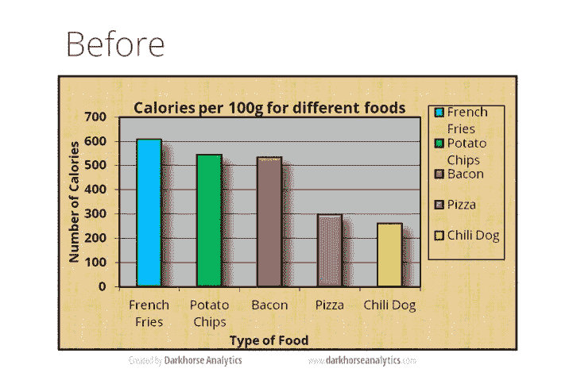
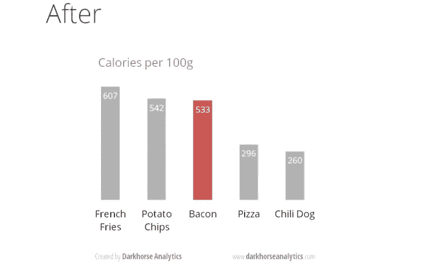

# 数据可视化所需的唯一指南

> 原文：<https://medium.com/analytics-vidhya/the-only-guide-youll-ever-need-for-the-data-visualisation-2b88f79f6d4e?source=collection_archive---------5----------------------->

> 观想的目的是洞察力，而不是图画

我们中的许多人都陷入了这个陷阱，以误导我们试图描绘的信息为代价，获得了精彩的彩色图表。

我总是试图保持简单，并且大多能够使用流行的图表和坚持原色来形象化。记住这一点，今天我将列出 5 个要点，坚持有效的观想，讲述一个令人信服的故事。

## 我应该使用什么图表？

我认为这是我们清理完数据并准备好可视化后最重要的问题。要回答这个问题，我们再问更多的问题:

> 您希望在一个图表中显示多少个变量？它可以是单轴或多轴图表。
> 
> 对于每个变量，您将显示多少个数据点？可能只有 500 万或 100 万
> 
> 您是显示一段时间内的值，还是显示项目或组中的值？我们可能对显示趋势、分类汇总等感兴趣。

目前有 1000 个图表，但所有这些图表都属于某个类别，例如，如果我们想要一种可视化方法来显示数据之间的关系和联系，或者显示两个或更多变量之间的相关性，它属于**关系类别**。

请参考这份[目录](https://datavizcatalogue.com/search.html)中的所有类别以及用于该类别的图表。

## 数据油墨比率

数据-墨水比率是由爱德华·塔夫特引入的概念，他的工作对设计有效的数据展示做出了巨大贡献。

> 根据 Tufte 的说法，所有不能描述统计信息的墨水或“图表垃圾”都应该被去除，更高的数据-墨水比率将导致在图表阅读任务中更快的判断和更高的准确性。

这样做是为了提高数据-油墨比率:

> 移除背景
> 
> 移除多余的标签
> 
> 移除边框和粗体
> 
> 删除或加亮线条
> 
> 添加直接数据标签
> 
> 减少颜色
> 
> 移除特殊效果

你可以观察这些图像，发现从第二张图中提取信息要容易得多。

# 更多数据文章:

> 1.[不使用数据的 5 个理由(以及为什么大多数是谎言)](https://amitb0007.medium.com/5-reasons-not-to-use-data-and-why-most-are-bs-92cf5e369011)
> 
> 2. [Begineer 的数据策略指南](https://amitb0007.medium.com/beginners-guide-to-data-strategy-625d65dc23da?source=your_stories_page----------------------------------------)
> 
> 3.[推荐网飞电影的聊天机器人](https://chatbotslife.com/simple-chat-bot-for-recommending-netflix-movies-and-tv-shows-bd411f7827eb?source=your_stories_page----------------------------------------)
> 
> 4.[电子商务网站的产品相似性和购物篮分析](https://amitb0007.medium.com/product-affinity-and-basket-analysis-for-an-ecommerce-website-4a388fc48dd0?source=your_stories_page----------------------------------------)

## **颜色**

颜色是任何图表和整体视觉效果不可或缺的一部分，但颜色的上下文整合非常重要，图表中颜色太多会使其不太可靠，颜色太少会使其显得笨重。在进行权衡时，请记住以下几点:

> 在任何图表中，不要使用超过六种颜色。
> 
> 为了比较不同时间段的相同值，使用不同强度的相同颜色(从亮到暗)。
> 
> 对于不同的类别，使用不同的颜色。最广泛使用的颜色是黑色、白色、红色、绿色、蓝色和黄色。(注意，它们都是广泛使用的初级)
> 
> 为系列中的所有图表保持相同的调色板或样式，为相似的图表保持相同的坐标轴和标签，以使您的图表一致且易于比较。(例如，对于 Airbnb，以品牌颜色#FF5A60 为例，为了保持一致性，在所有图表中使用相同的颜色和调色板)
> 
> 最后，了解你的受众。应该制作图表，确保色盲人士可以阅读。

## 回到数据

即使数据是干净的，没有任何重复的、错误的字符串、空值或任何其他不需要的物质，对数据的逻辑理解对于从表中绘制两个或更多变量也是重要的。

> 图表中的数字(在图表中显示为条形图、面积图、气泡图或其他物理测量元素)应该与呈现的数值成正比。
> 
> 此外，对于柱形图和条形图，为了便于比较，请按值的升序或降序对数据进行排序，而不是按字母顺序。这也适用于饼图。
> 
> 在图表中使用时间时，将其设置在水平轴上。时间应该从左向右。即使没有值，也不要跳过值(时间段)。

这些有助于我们保持图表的信息量和可信度。

## 仪表板

在我们的上下文中，仪表板是不同图表的集合。一般来说，我们使用不同类别的图表(比较、关系等)来创建仪表板，因此保持一致性并与受众相关变得很重要。您的仪表板的目的是帮助引导读者的眼睛通过一个以上的可视化，讲述每个洞察力的故事，并揭示它们是如何连接的。你越是采用更好的仪表板设计，你的用户就会发现发生了什么，为什么和什么是最重要的。考虑你是如何引导他们的视线穿过仪表板的。你是否向用户展示了下一步该往哪里看？

> **指导用户**:不要在没有指导如何使用可视化的情况下让人们孤立无援。尝试将过滤器标题替换为关于如何导航的明确语言说明。
> 
> **三大法则**:不要让大量重要信息争夺注意力。大多数时候，在一个仪表板上有三个以上的可视化就太多了。

## 最后

出色的可视化不仅能帮助你更好地理解数据，还能提供更快、更有意义的答案，甚至启发他人提出和回答新问题。

**参考文献**:

[https://eazybi.com/blog/data-visualization-and-chart-types](https://eazybi.com/blog/data-visualization-and-chart-types)T8[https://infovis-wiki.net/wiki/Data-Ink_Ratio](https://infovis-wiki.net/wiki/Data-Ink_Ratio)