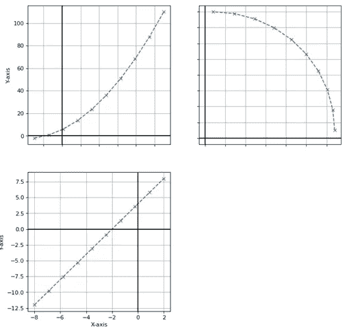
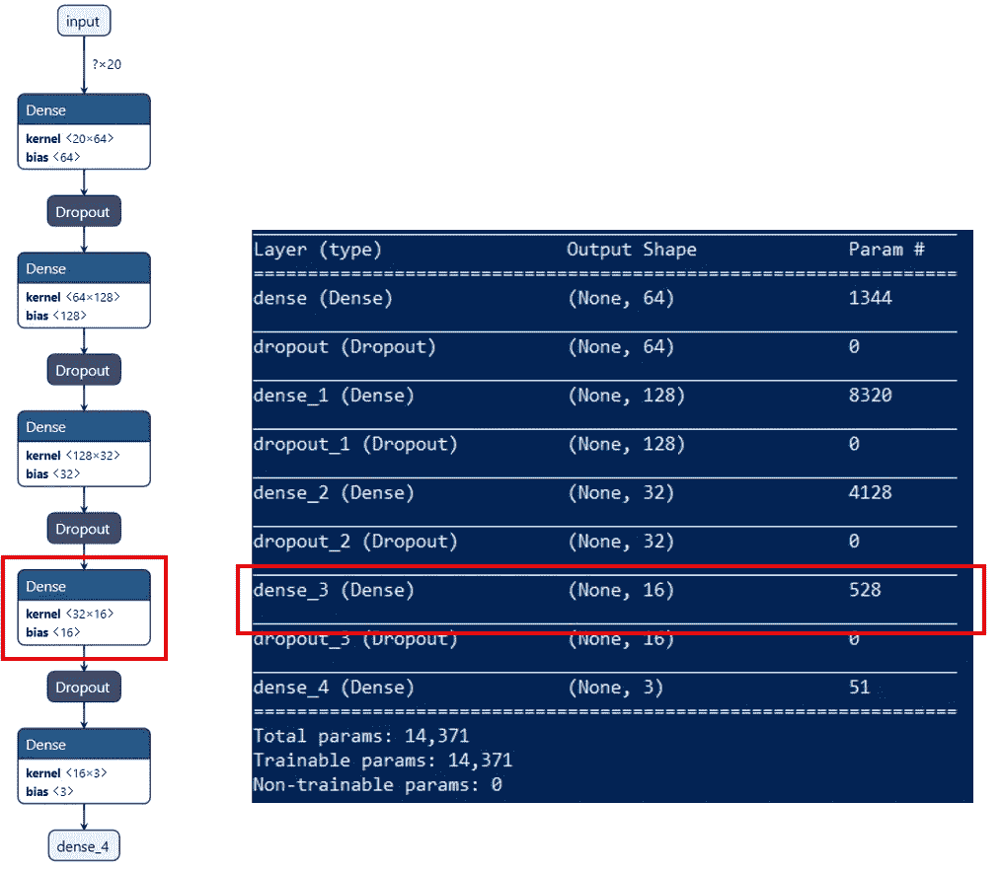
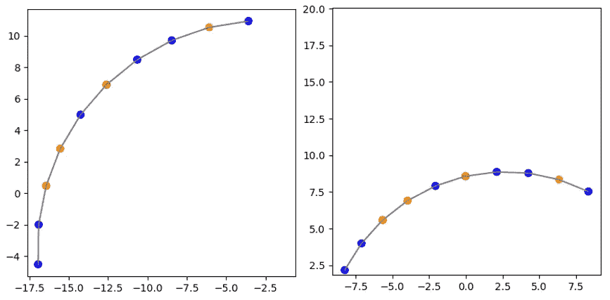
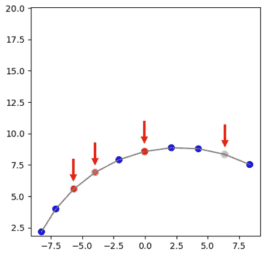
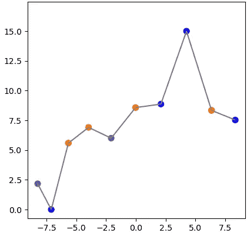
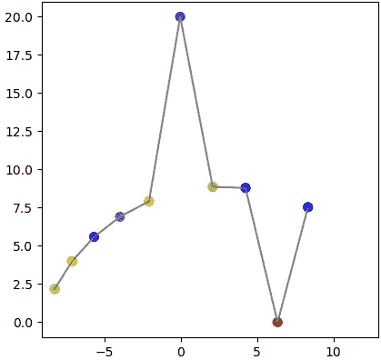

# 让 AI 完全透明的另一面

> 原文：<https://medium.com/analytics-vidhya/the-other-side-of-making-ai-fully-transparent-5d1bdaa8c2b1?source=collection_archive---------18----------------------->

在过去的几年里，使用基于机器学习和/或深度学习的方法的系统的应用有了很大的进步。简而言之:人工智能越来越成为人类的合作者，他们判断复杂的情况或为决策收集信息。

但是也有越来越多的批评声音呼吁对学习系统及其使用进行监管。作为反应，欧盟委员会公布了“可信 AI 的道德准则”([https://EC . Europa . eu/digital-single-market/en/news/Ethics-guidelines-trust worthy-AI](https://ec.europa.eu/digital-single-market/en/news/ethics-guidelines-trustworthy-ai))。透明度在这里描述如下:

> 透明:数据、系统和 AI 商业模型应该是透明的。追溯机制可以帮助实现这一点。此外，人工智能系统及其决策应该以适合相关利益相关者的方式进行解释。人类需要意识到他们正在与一个人工智能系统进行交互，并且必须被告知该系统的能力和局限性。

听起来不错，不是吗？

总的来说——是的。但是欧洲委员会想要达到什么目的，他们在管理人工智能方面的目标是什么？在本出版物的范围内，这是为了避免伤害和歧视。有些人可能会说，人工智能系统应该完全透明，这样每个人都可以理解任何决定。但这也可能导致这些系统的脆弱性，并可能导致滥用和操纵。让我们看一个简单的例子！

在另一篇文章中，我创建了一个简单的神经网络，它可以对数字数据的特征进行分类，并区分抛物线或圆形([链接](/@julianschweigert/classifiy-the-characteristics-of-numerical-values-with-keras-tensorflow-d5f6bf0e29f6?sk=75de44aefd25929e0556fd02dfc46b38))。训练好的模型可以从我的 github repo 下载:【https://github.com/jschw/Keras-Timeseries-Classification 

抛物线、圆和直线的示例数据

在这个例子中，使用了五个完全连接的层。可以读出倒数第二个密集层的值并进行外推，以确定每个输入数据点对分类结果的影响。这些值可以标准化(0 到 1)并在蓝色/黄色/红色之间着色。因此，我们得到了某种类型的热图:蓝色值是“冷”的，对结果没有或只有很小的影响，从黄色到红色，影响增加(如温度)。第 7 层得到 32 个值，有 16 个单位和 16 个偏差，因此该层有 32 * 16 + 16 = 528 个参数。但是我们只需要 16 个输出值:

使用 Netron(左)和 model.summary()可视化的神经网络拓扑

这个过程和“GradCAM”略有关联，可以用来可视化一幅图像中的区域对分类结果的影响([https://medium . com/@ Mohamed chetoui/grad-cam-gradient-weighted-class-activation-mapping-ffd 72742243 a](/@mohamedchetoui/grad-cam-gradient-weighted-class-activation-mapping-ffd72742243a))。

但是回到我们的例子和这段代码:

生成密集层“热图”的示例代码

*   加载训练好的模型
*   创建一个函数来访问所有图层输出
*   前馈一些数据
*   获取第 7 层的输出，并计算“热图”
*   应用色彩映射表并显示它

如果我们观察圆形的数据点，通过它们的影响进行着色，我们可以看到两组完全不同的数据点之间的相似性:

圆圈数据的两个“热图”

下一步是查看更多不同的圆数据示例，并尝试识别导致分类结果“圆”的点模式。

分类圆时的相关数据点

有了这些知识，我们可以向神经网络提供任何数据，并操纵具有重大影响的点，以实现特定的结果:

随机操作不相关的点以获得“圆”的结果

这些样本点看起来甚至不像一个圆，但被归类为圆，得分为 83%！

当然，我们也可以反其道而行之:破坏数据！操纵正确的数据以得到错误的结果。

操纵相关点以避免结果“循环”

这可以隐藏在大量数据中完成，因此没有人会识别任何操纵。曲线看起来像一个圆，但两个异常值迫使神经网络将其归类为抛物线(得分= 99%！)，因为这些离群点是对一个圆的分类结果影响比较大的点。也许，在其他情况下，分数也可能低于阈值，因此结果将是错误或归类为回退类别号。

我知道，这是一个非常简单的神经网络，更大的深度学习模型不可能那么容易探索。但也不是不可能！

一个众所周知的例子是对抗性攻击:【https://openai.com/blog/adversarial-example-research/[。熊猫和长臂猿的例子是无害的，但当涉及到自动驾驶时，操纵街道标志的恶意攻击可能非常危险！](https://openai.com/blog/adversarial-example-research/)

对于所有那些认为这是科幻小说的人来说:很遗憾，不是的(“用敌对的交通标志愚弄一辆真正的汽车”，【https://arxiv.org/ftp/arxiv/papers/1907/1907.00374.pdf】T4)

## 系统透明与数据透明

主要关心的是避免任何人受到伤害和任何不公平的不利处境。但我怀疑这能否通过使所有系统内部完全透明来实现。所有这些机器学习模型都是为了表示给定数量的训练数据而构建的。在最好的情况下，模型架构是正确的，它可以根据训练数据很好地概括未知数据。因此，如果训练数据有偏差或不代表现实，模型结构可能是好的或不好的，它将做出不正确的决策。

记住，让模型“安全”有两个关键点:

*   **数据透明:**训练数据不应该包含任何偏差。就与个人相关的数据而言，任何群体都不应被低估。“良好”数据的验收标准不能笼统地定义，而是因具体情况而异。
*   **范围透明:**机器学习模型的决策空间应该针对具体应用进行预定义。这可能取决于概括的能力。如果模型能够(在数学上)很好地概括未知数据，其决策空间可以更大。如果模型的提议超出了定义的范围，就必须有人详细地审查决策。

这两个最低要求可以在不发布任何可能使模型易受攻击的内部消息的情况下得到满足！

正如我们所见，欧洲委员会的道德准则在大多数方面都是朝着正确方向迈出的一步。但我不同意全面解释 AI 系统的呼吁。

如果系统完全透明，我们迟早会遇到大麻烦。它不会带来平等的机会，反而会给那些知道可以操纵哪些参数来获得他们想要的结果的人带来优势。