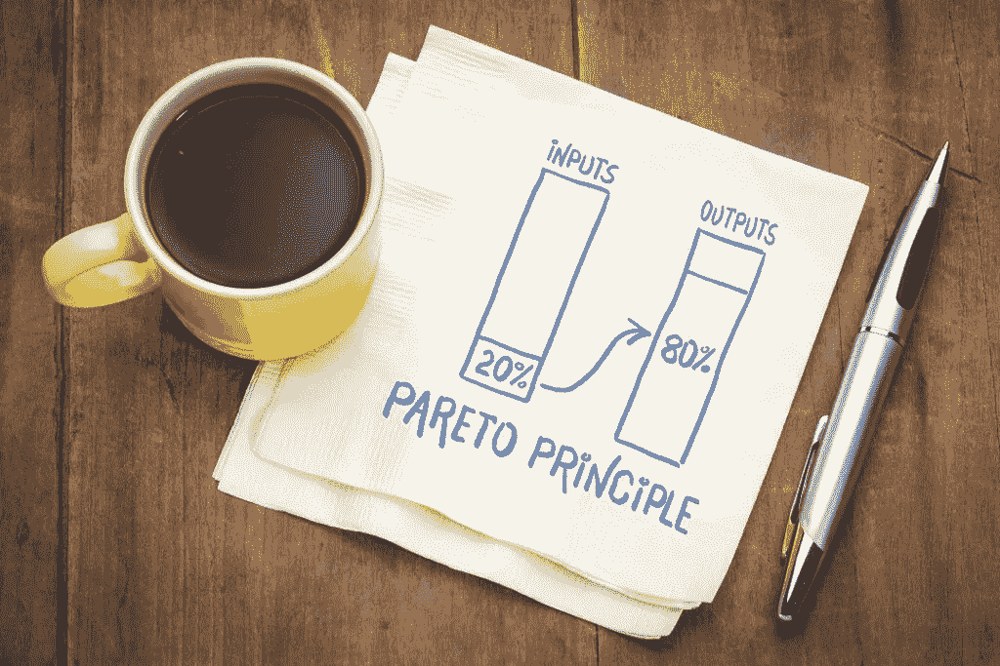
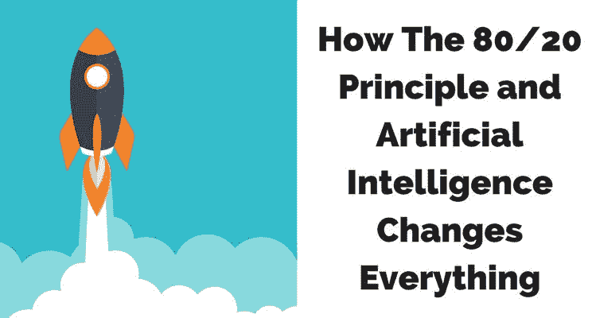

# 帕累托原则——2022 年 ML 工程师的游戏规则改变者

> 原文：<https://medium.com/analytics-vidhya/the-pareto-principle-game-changer-to-ml-engineers-in-2022-72c53673cb91?source=collection_archive---------2----------------------->

少数人的努力会得到多数人的结果

科技领域的每一个领域都被生产力和优化所包围，因此帕累托法则始终适用于这些领域。

随着深度学习/人工智能领域的快速发展，ML 工程师学习并掌握帕累托原则，并在日常任务中正确应用它，生产力可以大大提高。

政治经济学教授维尔弗雷多·帕累托发表了他对社会财富分配的研究成果。他观察到的巨大不平等，例如 20%的人拥有 80%的财富，让经济学家、社会学家和政治学家感到惊讶。在上个世纪，不同领域的几位先驱在包括商业在内的几种情况下观察到了这种不成比例的分布。极少数输入/原因(例如 20%的输入)直接影响绝大多数输出/效果(例如 80%的输出)的理论被称为帕累托原则，也称为 80-20 法则。 ***帕累托原理指出，对于各种各样的情况，大约 80%的结果是由大约 20%的原因造成的。***

让我们看看帕累托原理的例子

1.  在一本书里，20%的页面包含了 80%最重要的信息。
2.  公司 20%的客户，创造了公司 80%的收入
3.  微软指出，通过修复报告最多的前 20%的错误，给定系统中 80%的相关错误和崩溃将被消除

4.80%的用户交互通常来自约 20%的用户

5.一个项目 80%的价值通常来自于前 20%的努力

显然，我们可以从他/她如何花时间学习、设计和选择 ML 项目、冲刺规划和项目期间的审查、编码和修复 bug 等方面，看到机器学习工程师应用帕累托原则的重要性。让我们深入一点

**项目优先级和规划**

机器学习涉及机器通过从数据中学习来解决业务问题，在公司中制定 ML 项目时，我们可以通过简单地量化公司中客户面临的每个问题的价值，加上报告最多的问题，并按照价值递减的顺序排列它们，来应用帕累托原则。你会经常注意到，解决前几个问题将极大地提高客户满意度，即解决客户报告的前 20%的问题，将导致公司销售额增加 80%。

**数据规划**

复杂的业务问题需要的数据超出了分析数据集市中现成可用的数据。在成功地对项目进行优先级排序后，需要从项目的正确来源获取正确的数据。让我提醒你，机器学习中模型的成功和性能在很大程度上取决于拥有正确的数据，因此吴恩达发起了以数据为中心的 ***运动。***

这样，ML 工程师将需要请求访问、购买、获取、抓取、解析、处理和整合来自内部/外部来源的数据。这些有不同的形状、大小、健康程度、复杂程度、成本等。等待整个数据计划到位可能会导致我们无法控制的项目延迟。一种简单的方法是根据这些数据需求对最终解决方案的价值对其进行分类，例如，绝对必须、必须拥有和可选**(帕累托原则)**。

**造型**

机器学习模型的大部分性能通常来自于少量的努力。从特征工程开始，通常很少特征完成模型的大部分工作，即 20%的特征占模型性能的 80%,因此专注于 20%的特征，工程师可以优化模型的性能、训练时间、计算成本。

同样的原则也适用于模型调整，有许多超参数需要调整，特别是在神经网络中，但通常 20%的超参数对模型的性能影响更大，因此在这些超参数上花费更多的精力可以优化模型的性能并减少项目时间。

**结论**

80/20 法则适用于机器学习项目的每一个细节，是一个重要的指导原则。适当地应用可以极大地增加人工智能/机器学习的结果和影响。