# 变形金刚之路

> 原文：<https://medium.com/analytics-vidhya/the-pathway-to-transformers-347a87421260?source=collection_archive---------0----------------------->

Dall-E mini 生成的图像

2017 年，在“注意力是你所需要的一切”[1]中，谷歌推出了一种新的深度学习架构:变压器。这些被证明是一个真正的转折点，导致了几个预训练模型的创建，首先是 BERT [2]，现在是许多 NLP 任务的技术水平的基础；GPT-2 [3]，用于文本生成任务，如翻译、摘要、回答问题，但也可以用来下棋；GPT-3 [4]在 GPT-2 的基础上改进了文本生成能力，可以生成音乐和代码。特别是在最近的发展中，它们在自然语言处理以外的领域也表现非常好，一个例子是 Dall-E [5]，这是 GPT 3 的一个版本，经过训练可以从文本描述中生成图像。
根据 [PaperWithCode](https://paperswithcode.com/methods/category/transformers) 统计，目前有 87 种基于变形金刚的模型用于自然语言任务。

本文旨在为那些使用预先训练好的基于 Transformer 的模型作为黑盒而不了解其内部工作原理的人，以及那些刚刚开始学习这种架构并希望超越直观解释的人提供指导。

完全理解本指南的**先决条件**是:

*   机器学习基础；
*   循环神经网络(RNN)和长短期记忆(LSTM)。

不了解这些概念，学习变压器是过早的一步。

在深入研究变压器的结构之前，我需要介绍编码器、解码器、注意力和自我注意力的概念。

# 编码器-解码器模型

编码器和解码器最初是由 Cho 等人[6]在 2014 年为统计机器翻译任务推出的。它首先使用编码器将输入序列编码为上下文向量，并使用此中间表示通过解码器生成输出序列。

Cho 等人提出的编码器-解码器模型基于递归神经网络，具体来说:

## **编码器:**

编码器输入一个序列 *x = (x₁，x₂，…，xᵢ)* ，将第一个令牌 *x₁* 压缩成一个固定长度的隐藏状态向量 *h̅₁* ，然后，对于后面的每个令牌，将最后一个隐藏状态 *h̅ᵢ₋₁* 和当前令牌 *xᵢ* 压缩成各自的隐藏状态 *h̅ᵢ* :

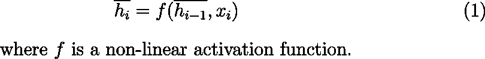

将等式(1)应用于每个记号，就得到输入序列的上下文向量 c。

## **解码器:**

解码器的目的是产生一个新的固定长度的输出序列。它计算隐藏状态 *hᵢ* ，该隐藏状态采用先前的解码器隐藏状态 *hᵢ₋₁* ，先前的输出 *yᵢ₋₁* ，以及上下文向量 *c* :

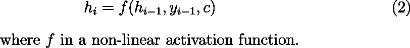

隐藏状态 *hᵢ* 的输出被馈入另一个激活函数*g*；这在一组可能的输出标记上产生概率分布:

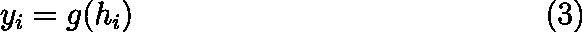

将等式(3) *应用 m* 次，就得到令牌的输出序列。

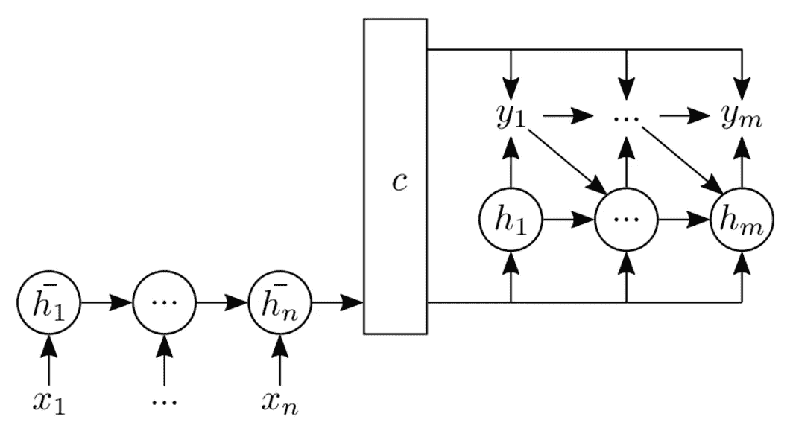

图 1:编码器-解码器模型表示。左手边是编码器，
右手边是解码器。

# 注意机制

编码器-解码器模型的主要限制是解码器只考虑编码器传递的最后一个隐藏状态。这样，所有信息都被压缩到最后一个隐藏状态的向量中。结果，序列中第一个标记给出的信息丢失了。
一种解决方案是使用双向隐藏层以逆序处理输入，以表示句子的两个方向。这有助于较短的序列，但对于较长的序列，丢失信息的问题仍然存在。为了解决这个问题，Bahdanau、Cho 和 Bengio [7]建议使用双向 rnn 来计算前向和后向隐藏状态，因此输入令牌表示由前向和后向隐藏状态的串联给出:

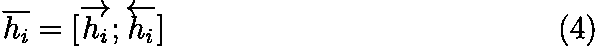

因此，我们对每个令牌都有一个表示，并且上下文向量被计算为编码器隐藏状态 *hᵢ* 的加权和。解码器学习权重，这样，我们有 *m* 个不同的上下文向量(输出的每个元素一个)，所以解码器隐藏状态的定义改变了:

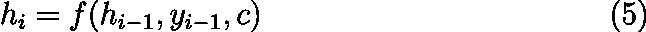

有了这种新方法，解码者就可以决定要注意源句子的哪一部分。由于这个原因，它也被称为“全球关注”[8]。
后来针对不同的任务和不同的架构提出了其他的注意机制。

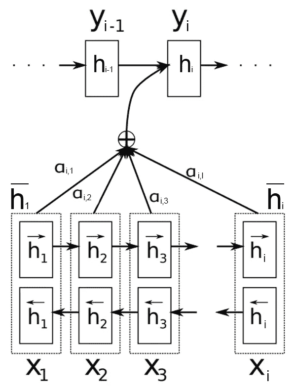

图 2:注意机制表征。底部是编码器，顶部是解码器。

# 自我注意机制

注意机制仅限于解码器步骤，因此 Lin 等人[1]提出了一种自注意机制，该机制在嵌入令牌时忽略了注意，因此在编码器步骤中也是如此。林等人用具有 *u* 个隐藏单元的双 RNN 计算隐藏状态，将前向和后向隐藏状态串联起来(如等式 4)，得到 *H = (h₁，，…，)*与 *H ∈ Rⁿ ᵘ* ，自我注意机制由下式给出:

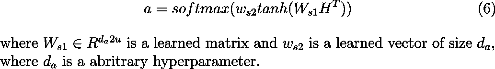

最终的注意力上下文向量是:

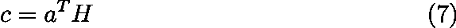

然后林等人扩展了这种自我注意机制，用矩阵 W *、* ∈ Rrda 代替*、*，得到矩阵 *A* :

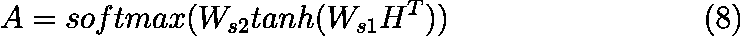

从而获得上下文矩阵 *C*

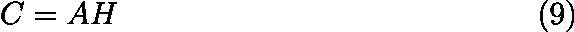

这允许捕获输入句子的多个部分。

# 变压器模型

在编码器中使用自关注和在解码器中使用关注显著地提高了基本编码器-解码器模型的性能，但是由于 RNN 的顺序性质(一次处理一个令牌)，将关注机制与基于 RNN 的模型一起使用降低了并行化的可能性和存储器效率。为了克服这些效率问题，Vaswani 等人提出了一种新的架构，称为变压器[1]。转换器在编码器和解码器中都使用了注意力机制的扩展:多头注意力。

## 多头注意力机制

Vaswani 等人提出了注意力机制的扩展，其思想是使用缩放的点积注意力(图 4 ),它将查询和一组键值对映射到输出:

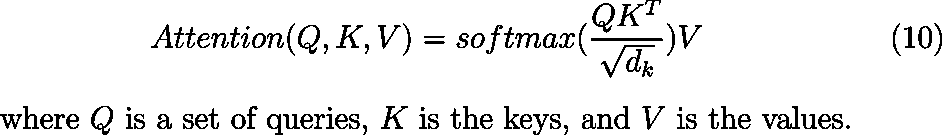

比例因子√(1/dₖ)被证明可以提高模型的有效性。在自我关注机制中，*查询*、*键*和*值*是同一个句子(输入句子)乘以权重矩阵，在训练过程中更新。

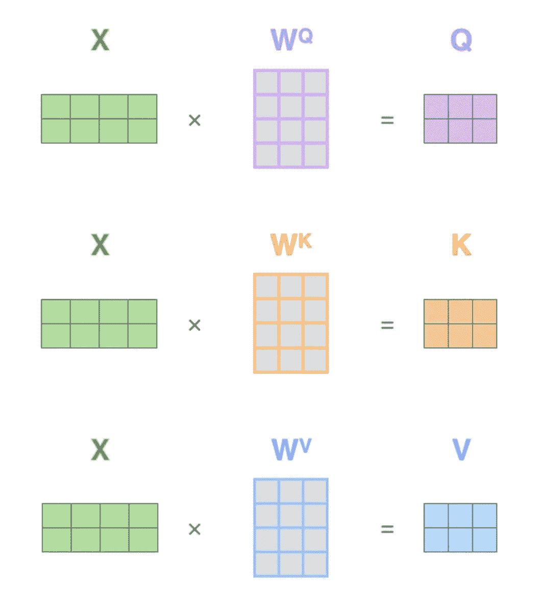

图 3:自关注变压器中使用的输入变换，Q =
查询，K = Key，V = Value。

这些不同的输入转换使输入能够关注自身。这反过来允许模型了解上下文。多头组件(图 4 包括将句子的每个标记的嵌入划分为 h 个向量，其中 h 是头的数量，并行计算注意力机制(等式 10)，并且在最后，连接每个头的输出向量。

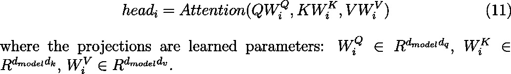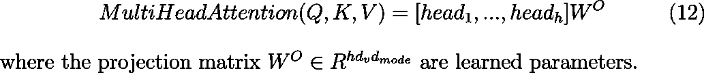

其中投影矩阵 *Wᴼ∈ Rʰᵈᵛᵈᵐᵒᵈᵉˡ* 是学习到的参数。

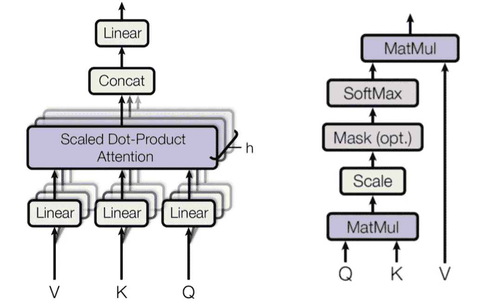

图 4:在左侧是多头注意力表示，在右侧是缩放的点积表示。

## 变压器架构

变压器架构包括一个编码器(图 5 左侧)和一个解码器(图 5 右侧)。

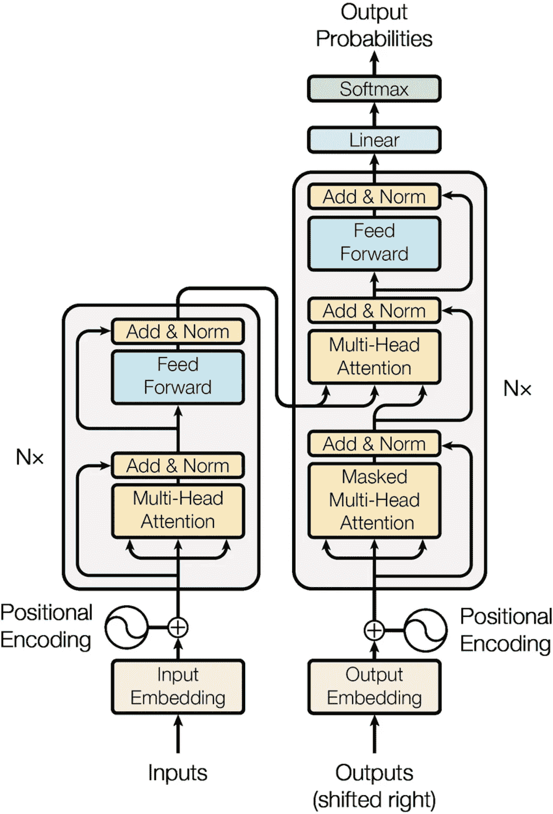

图 5:变压器架构。

**编码器**由 *N 个*相同的层组成，每层由两个
子层组成:

1.  一个多头自关注机制，后面是归一化层；
2.  一个前馈神经网络，后面是一个归一化层。

这两个组件中的每一个都被剩余连接所包围。它们允许梯度直接流经网络，而不经过非线性激活函数。这有助于缓解深度网络中的梯度消失问题。

**解码器**也由一堆 *N* 相同的层组成，每层由三个子层组成。

1.  接收解码器堆栈的先前输出的多头自关注。解码器只需注意前面的单词(不像编码器考虑整个文本)，因为单词的预测只能依赖于前面的单词。为此，使用了矩阵 Q 和 K 的掩蔽机制(图 4)。随后是标准化层。
2.  多头自关注，接收来自前一解码器子层的查询以及来自编码器输出的密钥和值。这允许解码器处理输入序列中的所有单词。随后是标准化层。
3.  一个前馈神经网络，后面是一个归一化层。

解码器层周围也有残余连接。编码器和解码器输入序列被嵌入并用位置编码进行注释。

# 结论

在这篇文章中，我总结了创造变形金刚的道路；我已经进入了主要的技术细节，同时试图保持阅读容易理解。要了解更多的细节，我可以参考参考文献。
了解了变压器的工作原理，理解最终模型的架构就非常简单了；它们只不过是解码器组件序列(如 GPT)或编码器序列(如 BERT)。

# 参考

1.  阿希什·瓦斯瓦尼、诺姆·沙泽尔、尼基·帕尔马、雅各布·乌兹科雷特、莱昂·琼斯、
    艾丹·戈麦斯、L·乌卡斯·凯泽和伊利亚·波洛苏欣。你需要的只是关注。在 I. Guyon、U. Von Luxburg、S. Bengio、H. Wallach、R. Fergus、S. Vishwanathan 和 R. Garnett 编辑的《神经信息处理系统的进展》第 30 卷中。柯伦联合公司，2017 年。
2.  德芙琳，雅各布和张，明伟和李，肯顿和图塔诺娃，克里斯蒂娜。Bert:用于语言理解的深度双向转换器的预训练。arXiv 预印本 arXiv:1810.04805，2018。
3.  、亚历克和吴、杰弗里和柴尔德、雷文和卢安、戴维和阿莫代伊、达里奥和苏茨基弗、伊利亚等人。语言模型是无人监督的多任务学习者。OpenAi 博客，2019。
4.  汤姆·布朗、本杰明·曼、尼克·莱德、梅勒妮·苏比亚、贾里德·卡普兰、普拉富拉·达里瓦尔、阿尔温德·尼拉坎坦、普拉纳夫·希亚姆、吉里什·萨斯特里、阿曼达·阿斯克尔、桑迪尼·阿加瓦尔等人。语言模型是一次性学习者。arXiv 2005.14165，2020。
5.  拉梅什、阿迪蒂亚和巴甫洛夫、米哈伊尔和戈、加布里埃尔和格雷、斯科特和沃斯、切尔西和、亚历克和陈、马克和苏茨基弗、伊利亚。零镜头文本到图像生成。2021 年机器学习国际会议。
6.  赵京贤、巴特·范·梅里恩博尔、卡格拉尔·古尔切雷、迪米特里·巴丹瑙、费特希·布加雷斯、奥尔赫·施文克和约舒阿·本吉奥。使用用于统计机器翻译的 rnn 编码器-解码器学习短语表示。arXiv 预印本 arXiv:1406.1078，2014。
7.  Dzmitry Bahdanau、Kyunghyun Cho 和 Yoshua Bengio。通过联合学习对齐和翻译的神经机器翻译。arXiv 预印本 arXiv:1409.0473，2014。
8.  Minh-Thang Luong，Hieu Pham 和 Christopher D Manning。基于注意力的神经机器翻译的有效方法。arXiv 预印本
    arXiv:1508.04025，2015。