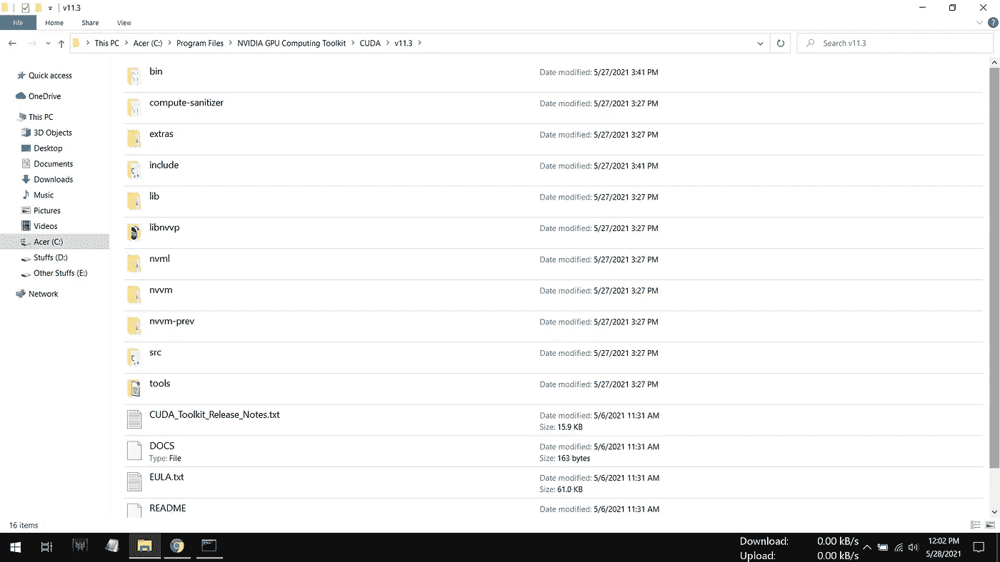

# 安装 tensorflow_gpu 的完美 JupyterLab 环境

> 原文：<https://medium.com/analytics-vidhya/the-perfect-jupyterlab-environment-with-tensorflow-gpu-installation-afe32fcba0ba?source=collection_archive---------11----------------------->

努力寻找如何安装 **tensorflow_gpu** 以及一个工作 **JupyterLab** 环境？？？

但不会了。您的搜索已经结束，在这本简单的安装指南中，我将告诉您为您的下一个大项目安装 **JupyterLab** 和 **tensorflow_gpu** 的每个步骤。

请仔细按照本指南安装，不要出现任何错误。

你需要什么

*   ***Python 安装程序*** (用于执行 Python 命令)
*   ***Node.js 安装程序*** (关于 Jupyter 笔记本的构建状态没有错误)
*   ***CUDA 开发工具包*** (用于在你的 GPU 上运行 TensorFlow 代码)
*   ***cuDNN 文件*** (用于访问深度学习架构)

那么，让我们开始吧…

1.  我们将使用 **Python 3.9.6** 。因此，请访问链接:-[https://www.python.org/downloads/](https://www.python.org/downloads/)，下载最新版本的 Python 安装程序并照常安装。在安装过程中，不要忘记勾选“*将 Python x.x 添加到路径*”复选框。
2.  现在访问[https://nodejs.org/en/download/](https://nodejs.org/en/download/)，根据操作系统的类型( ***Windows*** 、 ***Mac*** 或 ***Linux*** )和架构( **32 位**或 **64 位**)下载安装程序。照常安装。
3.  我们将安装 **tensorflow_gpu 2.5.0** ，如果我们有 **CUDA 11.2** 或以上版本和 **cuDNN 8.1** 或以上版本，它将完美工作。我怎么知道的？？？只需访问[https://www.tensorflow.org/install/source_windows](https://www.tensorflow.org/install/source_windows)(针对 ***Windows*** 用户)并向下滚动一点点，就会看到 tensorflow_gpu 构建配置。现在从[https://developer.nvidia.com/cuda-downloads](https://developer.nvidia.com/cuda-downloads)下载 **CUDA 开发工具包**。

**注意** :-会说“找不到 Visual Studio 支持的版本”。嗯，如果你已经安装了 **Visual Studio 2019** 就好了。别担心，没有它也能工作。

4.现在从[https://developer.nvidia.com/cudnn](https://developer.nvidia.com/cudnn)下载 **CUDA 深度神经网络库** ( **cuDNN** )。访问链接并使用 Nvidia 或 Google 帐户登录。然后下载并解压 zip 文件。提取之后，你会看到一个文件夹，在这个文件夹里面，你会看到 **3** 其他文件夹，即 *bin* 、 *include* 和 *lib* 。把这些 **3** 文件夹复制到这个`C:\Program Files\NVIDIA GPU Computing Toolkit\CUDA\v11.x`里面就可以了。

**解压后 cuDNN zip 文件内的 3 个文件夹**

**将 3 个文件夹复制到这里**

5.按下键盘上的 Windows 按钮，搜索“ ***编辑环境变量*** ”，点击第一个结果。双击路径，然后新建，添加名为 *bin* 和 *libnvvp* 的文件夹路径:-

*   `“C:\Program Files\NVIDIA GPU Computing Toolkit\CUDA\v11.3\bin”`
*   `“C:\Program Files\NVIDIA GPU Computing Toolkit\CUDA\v11.3\libnvvp”`

**搜索“编辑环境变量”**

**点击环境变量**

**双击路径**

**点击新建按钮**

**将路径粘贴到文件夹(见步骤 5)…只需查看上图中的最后 2 个路径。**

6.是时候重启你的电脑或笔记本电脑了…😊

7.在任何驱动器中创建一个文件夹；假设您选择的文件夹名称是， *CodeHub* 在 **D** 驱动器中创建。通过在搜索栏中键入 **cmd** 打开命令提示符，并使用以下命令将目录更改到该文件夹:-

*   `D: (hit enter)`
*   `cd CodeHub (hit enter)`

8.现在使用这个命令创建一个**虚拟环境**

*   `python -m venv MLEnv`

**注意** :- *MLEnv* 是虚拟环境的名称。你可以根据自己的选择来命名。

9.升级 pip 的方式:-

*   `python -m pip install — upgrade pip`

10.将 *activate.bat* 文件的路径复制到 *MLEnv* 文件夹下的 *Scripts* 文件夹中，粘贴到 **cmd** :-

*   `“D:\CodeHub\MLEnv\Scripts\activate.bat” (hit enter)`

这将激活您的虚拟环境。

11.现在是时候安装我们期待已久的 **2** 东西了…

*   `pip install jupyterlab`
*   `pip install tensorflow_gpu=2.5.0`

12.现在关闭命令提示符。再次打开它，将目录更改为您要打开的 **JupyterLab** 服务器所在的驱动器，该服务器可以访问该特定驱动器:-

*   `D: (hit enter)`
*   `jupyter-lab (hit enter)`

它将在您的默认浏览器中打开一个新标签，现在您可以在您选择的特定访问驱动器中的位置创建一个新笔记本，并开始编码。

希望你明白每一点…如果对安装过程有任何疑问，请在下面评论。

我一定会帮你的！

✍ *阿吉特·库马尔·萨胡*