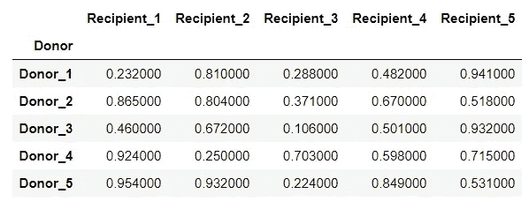
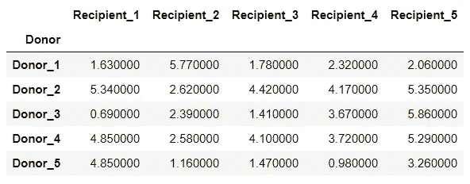
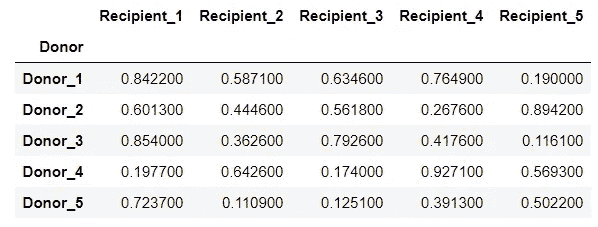
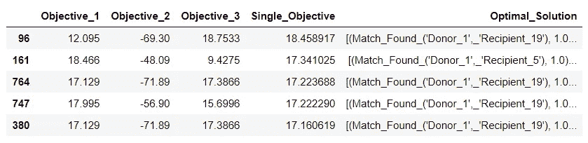
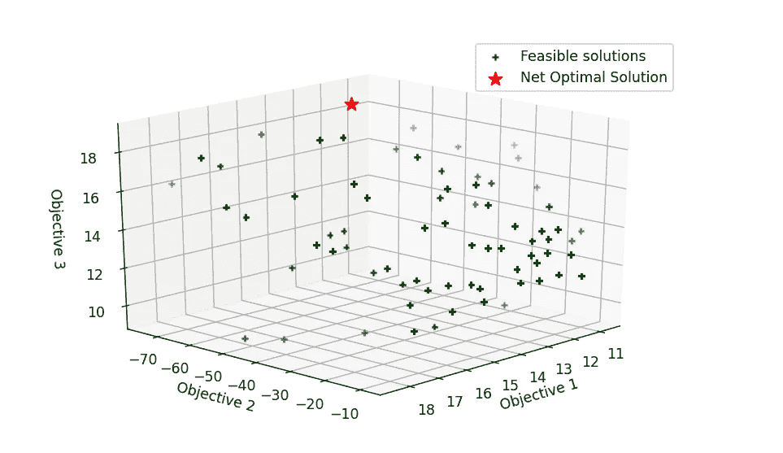
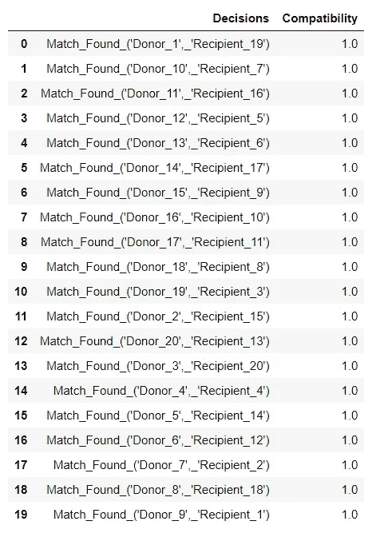

# 完美匹配:使用多目标线性优化将器官捐赠者和接受者配对

> 原文：<https://medium.com/analytics-vidhya/the-perfect-match-57c253c8b9b3?source=collection_archive---------20----------------------->


图片提供:[https://www.fairtransplant.org/thelogo/](https://www.fairtransplant.org/thelogo/)

如果你曾经被死后重生的想法迷住，那么你很有可能会遇到一个有第二次生命的人。由于全球医学研究人员的非凡努力，先进的外科手术程序应运而生，器官捐献和移植最终成为现实。然而，尽管有 90%的美国成年人支持器官捐献，但只有不到 60%的人真正注册成为捐献者。进一步的统计数据表明，接受者的等待名单上每 9 分钟增加一人，平均每天有 17 人死亡，如果他们在正确的时间接受移植，这些生命本来是可以挽救的。

本文试图利用大规模多目标优化的潜力来设计一种机制，有效地将潜在的供体与受体配对，确保在最短的时间内获得最大的相容性和高的术后存活率。

> 所有代码和数据都可以通过我的 GitHub repo 找到:【https://github.com/mohiteprathamesh1996/Heart-Donor-Pairing 

# 导入必要的依赖项

```
import random
import pandas as pd
from tqdm import tqdm
import matplotlib.pyplot as plt
import numpy as np
import itertools
import re
from pulp import *from IPython.core.display import display, HTMLdef display_side_by_side(dfs:list, captions:list):
    """Display tables side by side to save vertical space
    Input:
        dfs: list of pandas.DataFrame
        captions: list of table captions
    """
    output = ""
    combined = dict(zip(captions, dfs))
    for caption, df in combined.items():
        output += df.style.set_table_attributes("style='display:inline'").set_caption(caption)._repr_html_()
        output += "\xa0\xa0\xa0"
    display(HTML(output))import warnings
warnings.filterwarnings("ignore")
```

# 数据描述

出于这个问题陈述的目的，我为等待心脏移植的受者创建了一个样本数据集。

1.  *术前供体与受体的相容性:*

```
compatibility = pd.read_excel("donor_recepient_information.xlsx", sheet_name="pre_surgical_compatibility")compatibility.set_index(["Donor"], inplace=True)
```



从供体“I”到受体“j”的心脏移植的整体相容性是基于供体心脏在受体胸腔内的舒适程度。

2.*从捐赠者到接受者的时间(小时):*

```
time_to_reach = pd.read_excel("donor_recepient_information.xlsx", sheet_name="TimeToReach")time_to_reach.set_index(["Donor"], inplace=True)
```



整个移植程序必须在注册捐赠者正式死亡或被宣布脑死亡后的 4 至 6 小时内进行。上述数据显示了从受体到达预期的供体需要多少时间(以小时为单位)。

3.*术后存活率:*

```
survival = pd.read_excel("donor_recepient_information.xlsx", sheet_name="post_surgical_survival_rate")survival.set_index(["Donor"], inplace=True)
```



该数据集揭示了关于接受移植后 4 至 5 年的受体的预计存活率的信息。现代移植程序使这一指标提高到了 60-90%。

# 决策变量

这里我们可以定义二元决策变量， *X(i，j)* 使得

> *如果供体“I”与受体“j”配对，X (i，j)= 1*
> 
> *否则为 0，对于所有 i ∈ [1，…，20]和 j ∈ [1，…，20]*

```
# List of donors
donor_list = compatibility.index.to_list()# List of recipients
recipient_list = compatibility.columns.to_list()# Dictionary of binary decision variables
var_dict = LpVariable.dicts(
name = "Match Found",
indexs = [(d, r) for d in donor_list for r in recipient_list], 
cat = "Binary")
```

# 定义目标函数

如前所述，我们现在的任务是同时优化 3 个目标函数，即:

1.  最大化->整体术前兼容性:

> **最大化，Objective _ 1 =σσ相容性(I，j) * X (i，j)**
> 
> ***为所有 i ∈ [1，…，20]和 j ∈ [1，…，20]***

2.最大限度地缩短->接触潜在捐赠者的总时间

> **最小化，Objective _ 2 =σσTime(I，j) * X (i，j)**
> 
> ***为所有 i ∈ [1，…，20]和 j ∈ [1，…，20]***

3.最大化->术后所有受体的总存活率

> **最大化，目标 _ 3 =σσ存活率(I，j) * X (i，j)**
> 
> ***对于所有 i ∈ [1，…，20]和 j ∈ [1，…，20]***

```
# Objective 1: Maximize donor compatibility
objective_1 = lpSum(
[compatibility.loc[d, r]*var_dict[(d, r)] \
for d in donor_list for r in recipient_list]) # Objective 2: Minimize time to reach the nearest donor
objective_2 = lpSum(
[time_to_reach.loc[d, r]*var_dict[(d, r)] \
for d in donor_list for r in recipient_list]) # Objective 3: Maximize post surgery survival probability
objective_3 = lpSum(
[survival.loc[d, r]*var_dict[(d, r)]\
 for d in donor_list for r in recipient_list])
```

当涉及多目标优化问题时，最通用的技术是采用加权和方法，即我们基本上为每个目标函数分配权重，并制定单目标 LP，例如，

**最大化，Z = W1 *目标 _1 + W2*(目标 _ 2)+W3 *目标 _3**

其中 W1、W2 和 W3 是分配给每个目标的权重，使得

W1，W2，W3 ∈ [0，1]和 W1 +W2 + W3

*为了将单个目标函数定义为最大化问题，重要的是让所有独立的目标函数都在同一个方向上，这就是为什么你可以看到为什么我将 Objective_2 乘以一个负号，这应该是一个最小化问题。

# 限制

配对必须以这样一种方式进行，即每个受体可以从**恰好 1 个**捐献者那里接受移植，同样每个捐献者可以向**恰好 1 个**预期受体捐献。

也就是说，

**σX(I，j) = 1 其中 I(供体)是常数，j(受体) *∈ [1，…，20]***

**σX(I，j) = 1 其中 j(受者)为常数，I(供者)*∈【1，…，20】***

# 获得可行空间和最优性的角点

现在让我们用单个目标函数将上述 LP 公式化，并将所有约束包括为 Python 代码，并迭代多个权重组合，获得最优解的可行空间。我们将运行代码以获得大约 1000 次迭代的新解决方案:

```
solutions = []for num in tqdm(range(1000)):
    weights = np.array([random.random(), random.random(), random.random()])# Ensuring sum of all weights adds up to 1
    weights = weights/sum(weights)# Define the maximization LPP
    model = LpProblem("Best Match", LpMaximize)# Define single objective
    model += (weights[0] * objective_1) + (weights[1] * -objective_2) + (weights[2] * objective_3)# LP constraints
    #----Constraint_1 -> A donor can donate to only one recipient
    for d in donor_list:
        model += lpSum([var_dict[(d, r)] for r in recipient_list]) == 1#----Constraint_2 -> A recipient can recieve from only 1 donor
    for r in recipient_list:
        model += lpSum([var_dict[(d, r)] for d in donor_list]) == 1# Solving the LP
    model.solve()# Saving results
    solutions.append([objective_1.value(), 
                      -objective_2.value(),
                      objective_3.value(), 
                      value(model.objective),
                      [(v.name,v.varValue) for v in model.variables() if v.varValue!=0]])# Save optimized results as a dataframe
df_optimal = pd.DataFrame(solutions, columns=["Objective_1", 
                                              "Objective_2",
                                              "Objective_3",
                                              "Single_Objective",
                                              "Optimal_Solution"])df_optimal.sort_values(by=["Single_Objective"], ascending=False).head()
```



# 可视化三维可行空间

```
from mpl_toolkits.mplot3d import Axes3D
import matplotlib.pyplot as plt%matplotlib notebook
plt.rcParams["figure.figsize"] = (8, 5)
fig = plt.figure()
ax = fig.add_subplot(111, projection='3d')ax.scatter(df_optimal[df_optimal["Single_Objective"]!=max(df_optimal["Single_Objective"])]["Objective_1"], 
           df_optimal[df_optimal["Single_Objective"]!=max(df_optimal["Single_Objective"])]["Objective_2"],
           df_optimal[df_optimal["Single_Objective"]!=max(df_optimal["Single_Objective"])]["Objective_3"], 
           c='green',
           marker='+',
           label = "Feasible solutions")ax.scatter(df_optimal[df_optimal["Single_Objective"]==max(df_optimal["Single_Objective"])]["Objective_1"], 
           df_optimal[df_optimal["Single_Objective"]==max(df_optimal["Single_Objective"])]["Objective_2"],
           df_optimal[df_optimal["Single_Objective"]==max(df_optimal["Single_Objective"])]["Objective_3"], 
           c='red',
           s=100,
           marker='*', 
           label = "Net Optimal Solution")ax.set_xlabel('Objective 1')
ax.set_ylabel('Objective 2')
ax.set_zlabel('Objective 3')plt.legend()plt.show()
```



我们终于找到了一套可行的解决方案。角点(红星)是你可以找到你的最优解的地方！作为所有可行解的结果而形成的三维表面也被称为帕累托最优边界，以意大利工程师和经济学家[维尔弗雷多·帕累托](https://en.wikipedia.org/wiki/Vilfredo_Pareto)(1848–1923)的名字命名。

# 寻找最佳匹配

基于上图中的最佳角点，可以获得最相容的供体和受体的理想对。

```
best_pair = df_optimal[df_optimal["Single_Objective"]==max(df_optimal["Single_Objective"])]status = pd.DataFrame(list(best_pair["Optimal_Solution"])[0], columns = ["Decisions","Compatibility"])status
```



我真的希望你喜欢读这篇文章。请随时提出你的意见或建议。感谢您的宝贵时间！

请随时在 LinkedIn 上联系我:)[https://www.linkedin.com/in/prathameshmohite96/](https://www.linkedin.com/in/prathameshmohite96/)

# 参考

1.  [https://www . organ donor . gov/statistics-stories/statistics . html](https://www.organdonor.gov/statistics-stories/statistics.html)
2.  [https://www . donate life . net/types-of-donation/heart-donation/#:~:text =当% 20a % 20donor % 20heart %成为，匹配% 20 process % 20 for % 20 all % 20 器官](https://www.donatelife.net/types-of-donation/heart-donation/#:~:text=When%20a%20donor%20heart%20becomes,matching%20process%20for%20all%20organs)。
3.  迪米特里斯·贝西马斯。 *15.071 分析边缘。【2017 年春季。麻省理工学院:麻省理工学院开放课件，[https://ocw.mit.edu](https://ocw.mit.edu/courses/sloan-school-of-management/15-071-the-analytics-edge-spring-2017)。许可:[知识共享协议 BY-NC-SA](https://creativecommons.org/licenses/by-nc-sa/4.0/) 。*
4.  [https://www . YouTube . com/channel/uctnr 86 xhh _ _ llwylq 62 qdzw/videos](https://www.youtube.com/channel/UCTNr86XHH__llwylQ62QdZw/videos)