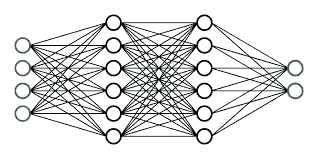
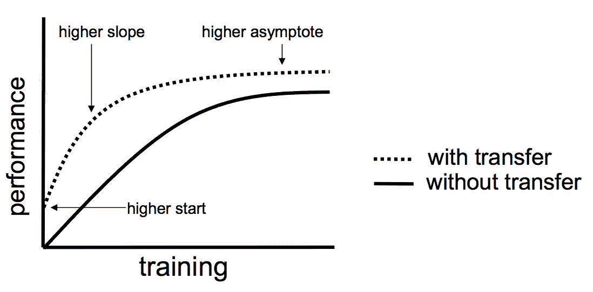

# 深度学习中迁移学习的力量

> 原文：<https://medium.com/analytics-vidhya/the-power-of-transfer-learning-in-deep-learning-681f86a62f79?source=collection_archive---------3----------------------->

# 介绍

如果你熟悉机器学习，特别是深度学习，你可能听说过迁移学习这个术语。什么是迁移学习？在这篇博客中，我们将讨论

1.  迁移学习的需要
2.  什么是迁移学习
3.  如何运用迁移学习
4.  迁移学习的好处和局限性

# 迁移学习的需要

顾名思义，迁移学习是一种将从特定任务中获得的学习或知识进行迁移的过程。这在深度学习中如何适用？

在机器学习中，为了执行每一项任务，我们需要训练一个模型，对吗？为了训练模型，机器学习工程师需要

1.  用于训练和测试的数据
2.  可以执行任务的模型

对于执行任务的模型，我们用训练数据集训练模型，用交叉验证数据集评估模型，最后用测试数据测试性能。主要有两种用于监督任务的机器学习算法。

1.  经典的机器学习算法，如线性回归、决策树、集成模型等。
2.  使用神经网络构建的深度学习算法

经典的机器学习模型可以很好地处理几百或几千个训练数据，因为模型不是很复杂，只包含几个参数。但如果考虑深度神经网络，就不是这样了。考虑如下所示的神经网络

一个样本神经网络

我们可以看到有许多权重需要优化。由于深度神经网络通常非常深、复杂，并且需要优化大量的权重，因此这种网络的训练需要非常大量的数据。在某些情况下，训练甚至需要数百万个数据点。这主要有两个缺点

1.  数据点的可用性——在各种搜索引擎的帮助下，如今获取数据已经成为可能。但是想象一下需要数百万个数据点以及检查和清理这些数据所需的人工劳动的情况。通常，很难获得如此大量的数据。
2.  时间-使用数百万数据训练深度学习模型非常耗时。
3.  资源-深度学习模型的训练通常需要强大的资源，并需要大量的 GPU

迁移学习可以被认为是解决上述问题的一种方法。你可以为你的任务开发一个非常好的深度学习模型，使用非常少的数据、时间和资源。

# 什么是迁移学习

我们看到了为什么我们需要迁移学习。但是迁移学习到底是什么呢？它是如何工作的？让我们看看。

迁移学习是一种将知识从一种模式转换到另一种模式的方法。考虑一个简单的图像分类问题的例子，其中我们需要将图像分类为猫和狗。对于涉及图像数据的任务，我们的首要考虑将是卷积神经网络(CNN)模型，对吗？但是如上所述，这些模型需要大量的训练数据和资源才能产生好的结果。

现在假设我们有另一个模型，模型 A，它已经对大量图像数据进行了训练，并且可以对许多类别的图像进行分类。模型 A 的权重已经被优化，因此它能够找到任何给定图像的模式和形状，并对其进行分类。如果我们可以利用这个模型的一部分来完成我们的任务——对猫和狗的图像进行分类，会怎么样呢？

在一项任务中训练的模型在另一项任务中被重用的过程被称为迁移学习。在我们上面的例子中，模型 A 被称为预训练模型，因为它已经在大量数据上进行了训练，并且它可以以更少的错误或失误来执行任务。现在让我们看看如何使用这种方法。

# 如何运用迁移学习

## 源模型的选择

执行迁移学习的第一步是选择预训练的模型。许多组织和研究机构发布了在大型和挑战性数据集上训练的模型。模型或训练的模型权重可以直接从它们的来源下载。但是决定使用哪种模型也很重要。例如，对于图像分类任务，有各种可用的模型，这些模型已经在大型数据集上进行了训练，如 I [mageNet](https://www.image-net.org/) 、 [CIFAR 10](https://www.cs.toronto.edu/~kriz/cifar.html) 等。类似地，如果任务与文本分类相关，像 BERT、Word2Vec 等模型。可以使用。这种预训练模型的选择是基于领域专业知识或经验的。

## 重复使用模型

下一步是将选定的预训练模型用于您的任务。一旦选择了一个合适的源模型，就有多种方法可以在他们的任务中使用这个模型。

1.  直接使用预训练模型

如果您的数据和预训练模型的训练数据匹配，您可以直接使用预训练模型。考虑上面的图像分类例子。假设有一个预先训练好的模型，它已经被训练完成相同的分类任务。然后，您可以在数据中直接使用该模型。考虑另一个例子。如果你的任务是获得句子的嵌入，那么你可以直接使用像 [BERT](https://ai.googleblog.com/2018/11/open-sourcing-bert-state-of-art-pre.html) 这样的语言模型。BERT 在整个英语维基百科和布朗语料库上接受训练，并在下游自然语言处理任务上进行微调，如问答句子对。所以如果你的数据也差不多，那么你可以直接用 BERT 模型。

2.使用预训练模型中的瓶颈特征

我们可以使用该模型来提取特征，而不是使用预先训练的模型。例如，考虑相同的图像分类问题。有各种 CNN 模型，这些模型在大量数据上被预先训练，用于执行类似的分类任务。这些模型在 ImageNet、CIFAR 10 等数据集上进行了预训练。并且被训练来分类各种类别，像人类、飞机、鱼、鸟等等。我们总是可以通过移除最终的 SoftMax 或分类层来使用这些模型的训练层。这种方法有助于我们利用所有经过训练的权重，这将从图像中生成有意义的特征。这也将帮助我们根据我们的任务(在上面的例子中，2)指定最后一个分类层的维度。此外，如果预训练网络具有来自最后完全连接之前的层的*7×7×512*输出。我们可以展平这一层，这将产生一个新的 *N x 21，055* 网络输出( *N* —数据点的数量)。在这一层之上，我们还可以添加一个我们选择的简单分类模型。

3.微调预训练模型的最后几层

在前面的方法中，我们只训练了最终的分类层。我们把所有的层都放到最后一层，用它来提取给定图像的特征。或者我们可以说，我们冻结了除了预训练模型的最后一个分类层之外的所有层，并且单独训练了最终的分类器。还有第三个选项，即只冻结预训练模型的一些早期层，然后训练最后几层。这就是所谓的微调。

> 我们总是修改后面的层，因为已经观察到网络中的前面的层捕获更多的通用特征，而后面的层是非常特定于数据集的。

例如，我们可以使用一个经过训练的模型来识别猫，可以进行微调并用于识别狗。我们总是可以选择训练的层数。这被认为是一个超参数。你拥有的数据越多，我们可以微调的层就越多。

# 迁移学习的好处和局限性

虽然迁移学习听起来很简单，但它是一个非常强大的工具。迁移学习将帮助工程师用非常少的数据和资源执行深度学习任务。使用合适的预训练模型将有助于产生更准确的结果，并加快训练过程。下图显示了迁移学习如何帮助产生更准确的结果

你可以看到，与另一个模型相比，迁移学习模型的性能更高，并且很快达到饱和。

像任何技术一样，迁移学习也有自己的挑战和局限性。迁移学习的最大局限之一就是负迁移问题。

> 迁移学习只有在初始问题和目标问题足够相似以至于第一轮培训相关时才有效。开发人员可以就什么类型的训练算作与目标“足够相似”得出合理的结论，但算法不一定要一致。

# 结论

在这篇博客中，我试图介绍一种叫做迁移学习的最强大的技术。我试图介绍一些基本概念，比如什么是迁移学习，如何使用这种方法开发强大的模型，以及这种方法的好处和局限性

如有任何疑问或建议，请通过 [LinkedIn](https://www.linkedin.com/in/vinitha-v-n-5a0560179/) 联系我

你也可以在 [Github](https://github.com/Vinithavn) 上查看我的项目