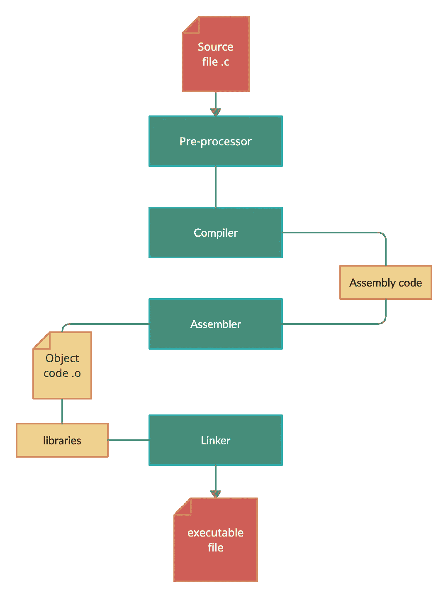

# 用 C 语言编译的过程

> 原文：<https://medium.com/analytics-vidhya/the-process-of-compilation-with-c-6b9e97b9596a?source=collection_archive---------21----------------------->

我们的计算机能够做很多事情，但要让它发生，我们需要用它能理解的语言交谈。这方面的问题是，如果我们深究计算机真正理解的东西，那就是二进制代码。一种由 0 和 1 的多种组合组成的语言。如果我们想交流什么的话，这是很刺耳的语言。这就是编程语言发挥作用的地方，它们简化了我们与计算机的交流。然而，计算机一直在读取 0 和 1，这就是我们今天文章的重点，这是如何发生的。

这个过程叫做编译，编译器负责为我们完成这项工作。其中最流行的是 GNU 编译器集合(GCC ),它是第一批能够将脚本重新排列成计算机可读文件的编译器之一。通过使用命令行和机器语言(二进制代码)向计算机发出命令可能并不复杂，但是编写完整的程序确实以一种不合适的方式扩展了任务。

下面就来说说 C 编程语言的创始人丹尼斯·里奇。它是第一个对编程语言产生影响的编程语言之一，并且提高了所有开发人员以比以前更容易的方式创建程序的能力。虽然这种语言是在 1972 年到 1973 年间发展起来的，但是直到 20 世纪 80 年代才开始流行。现在许多常用的语言都是基于 C 语言的一些特性，这使得这种语言成为历史上最古老和最有价值的语言之一。

我们可以把编程语言看作是以人类为基础的语言的一种类似的构思方式，每一种语言都有自己的语法和规则，以一种全面的方式正确地编写它。但是，如果我们想创造复杂的想法，学习用计算机能读懂的语言写作是非常困难和不切实际的。为了做到这一点，我们需要一种解释器，将我们的语言翻译成机器代码，以便它能够正确理解我们的想法。然而，要翻译正确的想法，我们需要确保遵循正确写作的规则。

# 编译的过程

正如我们已经说过的，编译器负责使你的代码机器可读，我们将探索一下这个过程是如何工作的。

首先我们需要考虑的是，编译的过程细分为四个阶段。预处理器、编译器、汇编器，最后是链接器，它们按这个顺序工作。我们可以把这些阶段想象成一个办公室的不同部门为了以最有效的方式完成任务而工作。


# 预处理部门

预处理器是处理我们编写的代码的第一个部门。翻译所有内容的第一步是为其他部门提供他们需要的信息。它负责将我们添加的现有头文件的代码追加到原始文件中。可能认为头文件是使我们的代码有意义所需要的引用。也可以把它想象成字典，它给出了我们正在编译的代码中使用的单词的定义。然而，他们没有指定我们所使用的功能，图书馆是存储信息的人，他们将在这个过程中遥遥领先。

在 C 语言中，需要在处理实际代码之前处理头。每个 C 文件使用的标准头文件是“<stdio.h>”(标准输入和输出)，它需要写在实际代码之前。</stdio.h>

这个部门的另一项任务是清除代码中存在的所有注释。注释不是代码的一部分，我们做了一些注释，让我们和其他人更容易理解我们的代码。虽然它们对我们真的很有用，但计算机无法读取它们，实际上扰乱了编译的过程。

当预处理器准备好扩展代码，干净的代码准备好进入下一步，编译器。



# 编译部门

这是语言开始变得更接近计算机如何用自己的硬件处理器处理它的时候。虽然在这一点上仍然是人类可读的。这个部门负责解码单个单词和符号，并将它们与正确的语义相关联，以将它们翻译成汇编代码。这种类型的代码看起来更像是计算机为了运行我们的代码而需要做的一系列指令。

# 装配部门

这个部门是唯一一个能够阅读汇编代码的部门，所以它也是唯一一个能够使用汇编代码的部门。它的工作是将其翻译成二进制，即实际的机器代码。我们就要让程序机器可读了！

汇编程序的问题是它没有将二进制代码链接到所需库的源代码。汇编程序产生的代码称为目标代码，它是机器代码，但只包含我们程序的数据。为了运行我们的程序，我们需要相关库的信息。当我们的伙伴链接器部门进来的时候。

# 链接器部门

正如我们已经说过的，这是唯一一个能够将我们的程序与之前创建的信息联系起来的部门。在这种情况下，这些信息被称为库，在创建程序的过程中非常有用。

有两种类型的库，静态库和动态库，但是我们不会进一步讨论这个概念，因为它误导了本文的目的。【T2>>

链接器部分包含了创建一个统一程序的信息，该程序由许多独立的目标文件和库组成，在运行过程中解析符号引用。我们可以把它想象成一个会议室，在这里所有的文件和现有的库都被考虑进来，以整合一个一致的程序。

# 办公室

到现在为止，我们应该有一个只由我们编写的代码生成的可执行程序。其余的服务由编译器办公室提供。令人惊讶的是，这不仅仅是 GCC 编译器提供的服务，我们还可以访问在这个过程的任何阶段生成的代码。

首先，要开始这个过程，我们需要在终端上运行“gcc”命令，然后运行“program-script.c”来调用办公室。

```
gcc programscript.c
```

这将编译它，并给出一个默认的名称(“a.out”)，如果我们想自定义我们的名字，我们需要添加标记“-o”后的脚本名称前面的自定义文件名。

正如我们之前提到的，我们可以在任何阶段停止这个过程。为了在预处理器阶段停止它，我们需要运行带有标记“-E”的“gcc”命令，注意我们不需要添加实际的可执行文件名称，因为它永远不会到达那个阶段。

```
gcc -E programscript.c
```

这将返回给我们一个预处理过的文件，没有注释和所有由。我”扩展。如果我们想知道我们添加的头文件的内容，这个命令会很有用。

编译器将获取我们脚本中的所有信息，选择有用的信息，并将其写入汇编代码。在这个阶段看一下这个文件也是有用的。这一次，旗帜“-S”将起作用。

```
gcc -S programscript.c
```

在这一点上，我们通过请求汇编器处理的信息得到的代码将不会像以前那样可读。尽管我们可以通过运行命令"-c "来请求它。

```
gcc -c programscript.c
```

在下一个阶段，文件已经被链接器处理了，这就是实际的可执行文件。当然，我们可以打开并读取文件，但它是二进制代码，那是计算机可以读取的实际代码。

当我们继续这个过程时，产生的文件更难理解，如果我们将它与我们的口语进行比较，距离会增加得更多。然而，请记住，计算机是由人类制造的，在历史上的某个时候，工程师只能通过使用机器语言与他们的计算机交流。我们需要为我们现在与电脑交流的方式感到幸运。从那以后就更难了。