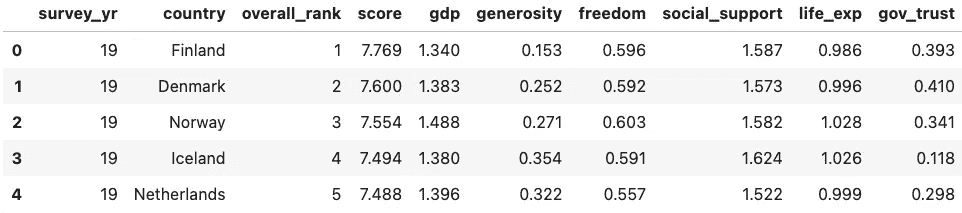

# 用 Python 和 PostgreSQL 追求快乐

> 原文：<https://medium.com/analytics-vidhya/the-pursuit-of-happiness-with-python-and-postgresql-4f3f8f5fc08e?source=collection_archive---------17----------------------->


创造信息就像任何创造过程一样。它从寻找材料(在这种情况下是数据源)开始，然后是清理、连接和争论数据集。当你完成的时候，你已经建造了一些美丽的东西，并获得了新的见解来分享——然后你又重新开始。

在信息创建中使用最广泛的语言之一是 Python，它受到数据科学家、工程师和分析师的喜爱，因为它有一个巨大的现有库生态系统来处理数据争论。

这篇博文探索了三个这样的库:`pandas`、`ddlgenerator`和`psycopg2`。这些都使我们能够清理数据集，并将其推送到 PostgreSQL 数据库，以后可以在该数据库中查询数据，并将其暴露给大量不同的公司数据。

今天，我们的目标很简单:我们将探索一个幸福数据集，并试图找出我们应该搬到世界上的哪个地方才能拥有快乐的生活！

以下是高级流程:

# 0.获取数据集

如前所述，首先要找到一个数据集。 [Kaggle](https://www.kaggle.com) 是一个在数据科学社区广泛使用的网站，提供用于挑战、比赛或学习的数据集。他们有一个很好的关于世界幸福的数据集，只需要登录就可以下载。它包含 5 个 CSV 文件，每年一个，列出了各个国家的幸福排名以及其他一些指标。

让我们创建一个名为`happiness`的文件夹和一个名为`data`的子文件夹来存储文件:

```
mkdir -p happiness/data cd happiness
```

接下来，从 [Kaggle](https://www.kaggle.com/unsdsn/world-happiness) 下载数据，并将 5 个 CSV 放在`happiness/data`文件夹中。

# 1.清理数据

正如经常发生的那样，源数据集并不总是整洁干净的。对于我们的幸福数据集来说也是如此。浏览文件时，我们可以看到`2015.csv`和`2016.csv`共享相同格式的列名和数据。但是`2017.csv`缺少了`Region`列，其他一些列的命名和排序不同(`Generosity`和`Trust`被交换)。这同样适用于文件`2018.csv`和`2019.csv`，在那里我们再也找不到置信区间了。此外，年份只包含在文件名中，而不在列中。

在开始我们的清理工作之前，每次我们开始一个新的 Python 项目时，创建一个单独的[虚拟环境](https://docs.python.org/3/tutorial/venv.html)是一个很好的实践。这确保了我们的默认 Python 环境不会因为可能冲突的库而过载。我们可以创建一个虚拟环境，并像这样启用它:

```
python -m venv python_pg source python_pg/bin/activate
```

为了产生一致的数据视图，文件需要一些处理，所以让我们戴上 Python 超级英雄的面具。首先安装 [pandas](https://pandas.pydata.org/) 库，它将通过在您的终端中执行以下代码来帮助我们进行数据操作和分析:

```
pip install pandas
```

现在我们可以在我们的`happiness`文件夹中创建一个名为`prepare.py`的文件，并开始在其中包含一些 Python 代码。我们将首先导入先前安装的库，以及默认情况下应该安装的和，并分别启用与操作系统和路径名模式扩展的交互。

```
import pandas as pd import glob, os
```

接下来，定义我们将在名为`all_years_df`的目标数据帧中使用的列名，以存储清理后的数据集。将以下几行添加到`prepare.py`文件:

```
column_names = ['survey_yr', 'country', 'overall_rank',
                'score', 'gdp', 'generosity', 'freedom',
                'social_support', 'life_exp', 'gov_trust']all_years_df = pd.DataFrame()
```

现在是时候拨乱反正，解析`data`文件夹中的所有 CSV 文件了。将以下代码添加到`prepare.py`文件中:

```
files = glob.glob('data/*.csv')for fp in files:
    # Handling file names as new column
    file_year = os.path.basename(fp).split('.')[0]
    file_content = pd.read_csv(fp).assign(Year=int(file_year)-2000)# Picking the right column for each file based on the year
    uniformed_columns = find_columns(file_content, file_year)# Conforming column names and appending the parsed year data to all_years_df
    uniformed_columns.columns = column_names
    all_years_df = pd.concat([all_years_df, uniformed_columns])all_years_df.to_csv('results.csv', index=False)
```

`glob`函数返回`happiness/data`文件夹中的文件列表，我们循环遍历这些文件。对于每个文件，我们用`os.path.basename`读取文件名，用点(`.`)分割文件名，取第一部分，只提取年份信息。`file_content`行使用 pandas 的`read_csv`函数加载文件数据，并用年份的最后两位数字(`int(file_year)-2000`)填充新列`Year`(使用`assign`函数)。

接下来我们调用`find_columns`函数，我们将很快定义它，根据年份从源文件中选择正确的列。

之后，我们合并仅包含一年数据的`uniformed_columns`数据帧中的列名，然后在过程结束时将它附加到包含整个数据集的`all_years_df`数据帧中。最后，我们将最终结果存储在`happiness`文件夹中名为`results.csv`的 CSV 文件中。

# 选择正确的列

缺少的部分是`find_columns`函数定义，在这里我们合并了列名和顺序。如上所述，根据年份，我们需要从源文件中选择正确的列。将以下代码添加到`prepare.py`文件中，紧接在`import`语句之后，以在不同年份执行该技巧:

```
def find_columns(file_content, file_year):
    if file_year in ['2015', '2016']:
        uniformed_columns = file_content[[
            'Year', 'Country', 'Happiness Rank', 'Happiness Score',
            'Economy (GDP per Capita)', 'Generosity', 'Freedom', 'Family',
            'Health (Life Expectancy)', 'Trust (Government Corruption)'
            ]]elif file_year in ['2017']:
        uniformed_columns = file_content[[
            'Year', 'Country', 'Happiness.Rank', 'Happiness.Score',
            'Economy..GDP.per.Capita.', 'Generosity', 'Freedom', 'Family',
            'Health..Life.Expectancy.', 'Trust..Government.Corruption.'
            ]]else:
        uniformed_columns = file_content[[
            'Year', 'Country or region', 'Overall rank', 'Score',
            'GDP per capita', 'Generosity', 'Freedom to make life choices',
            'Social support', 'Healthy life expectancy',
            'Perceptions of corruption'
            ]]return uniformed_columns
```

该函数为每年选择正确的列，并返回结果数据帧。

现在是检查管道是否工作的时候了。将终端放在`happiness`文件夹上，让我们执行以下操作:

```
python prepare.py
```

现在检查`happiness`文件夹中的文件`results.csv`以验证代码是否有效。结果应该是这样的:



# 2.创建 PostgreSQL 实例

第二步是将我们的数据存储在 PostgreSQL 表中。但是在存储它之前，我们需要一个 PG 数据库；让我们在终端中用 [Aiven CLI](https://aiven.io/blog/command-line-magic-with-the-aiven-cli?utm_source=medium&utm_medium=organic&utm_campaign=blog_art&utm_content=post) 创建一个

```
avn service create demo-pg    \
  -t pg                       \
  --cloud google-europe-west3 \
  -p hobbyist
```

上面的命令使用一个`hobbyist`计划在`google-europe-west3`上创建一个名为`demo-pg`的 PostgreSQL 实例。你可以在我们的定价页面查看所有 PostgreSQL 计划[。为了连接到它，我们需要包含像`host`、`port`和默认`avnadmin`用户的`password`这样的信息的`service uri`。我们可以通过以下方式检索它:](https://aiven.io/pricing?utm_source=medium&utm_medium=organic&utm_campaign=blog_art&utm_content=post)

```
avn service get demo-pg --format '{service_uri}'
```

现在我们有几分钟的时间放松一下，等待终端中的以下调用之后实例准备好

```
avn service wait demo-pg
```

# 3.将数据推送到 PostgreSQL

一旦服务开始运行，返回 Python 并准备数据推送。

我们将使用 [ddlgenerator](https://github.com/catherinedevlin/ddl-generator) 库自动生成 SQL 语句来创建 PostgreSQL 表，并使用 [psycopg2](https://www.psycopg.org/) 与数据库进行交互。我们可以在终端中使用以下代码行安装这两者:

```
pip install psycopg2 ddlgenerator
```

现在创建一个新的`push.py`文件，添加导入，并连接到数据库语句。用上面的`avn service get`命令的输出替换下面代码中的`<SERVICE_URI_OUTPUT>`参数:

```
import psycopg2 conn = psycopg2.connect('<SERVICE_URI_OUTPUT>')
```

连接已建立。我们现在可以创建表并推送数据。`ddlgenerator`提供了从 CSV 文件创建表 DDL 和 insert 语句的良好功能。我们可以将下面的代码添加到`push.py`文件中:

```
from ddlgenerator.ddlgenerator import Tabletable = Table('results.csv', table_name='HAPPINESS')
sql = table.sql('postgresql', inserts=True)
```

从`ddlgenerator`导入`Table`类后，代码创建一个解析`results.csv`文件的实例，目标表名为`HAPPINESS`。最后一行为 PostgreSQL 创建了`CREATE`表定义 SQL，包括每行的 insert 语句(`inserts=True`)。如果我们打印 SQL 语句，它应该如下所示:

```
DROP TABLE IF EXISTS happiness;CREATE TABLE happiness (
    survey_yr INTEGER NOT NULL,
    country VARCHAR(24) NOT NULL,
    overall_rank INTEGER NOT NULL,
    score DECIMAL(15, 14) NOT NULL,
    gdp DECIMAL(17, 16) NOT NULL,
    generosity DECIMAL(16, 16) NOT NULL,
    freedom DECIMAL(16, 16) NOT NULL,
    social_support DECIMAL(16, 15) NOT NULL,
    life_exp DECIMAL(17, 16) NOT NULL,
    gov_trust DECIMAL(16, 16)
);INSERT INTO happiness (survey_yr, country, overall_rank, score, gdp, generosity, freedom, social_support, life_exp, gov_trust) VALUES (19, 'Finland', 1, 7.769, 1.34, 0.153, 0.596, 1.587, 0.986, 0.393);
INSERT INTO happiness (survey_yr, country, overall_rank, score, gdp, generosity, freedom, social_support, life_exp, gov_trust) VALUES (19, 'Denmark', 2, 7.6, 1.383, 0.252, 0.592, 1.573, 0.996, 0.41);
...
```

我们现在可以通过将以下代码添加到`push.py`文件来对数据库执行 sql 语句

```
cur = conn.cursor()
cur.execute(sql)
conn.commit()
cur.close()
conn.close()
```

我们创建了一个游标，执行了 sql 语句，提交了对数据库的更改，并关闭了游标和连接。现在是运行代码的时候了。使用`happiness`文件夹上的相同终端，运行以下程序:

```
python push.py
```

恭喜，数据现在已经加载到 PostgreSQL 中了。

# 4.查询 PostgreSQL 中的数据

让我们验证 PostgreSQL `happiness`表中的数据是否被正确填充。用以下内容创建一个新的 Python 文件`query.py`(和以前一样，编辑连接`service uri`):

```
import psycopg2conn = psycopg2.connect('<SERVICE_URI_OUTPUT>')cur = conn.cursor()
cur.execute('''
SELECT SURVEY_YR, COUNTRY, OVERALL_RANK
from HAPPINESS
WHERE OVERALL_RANK <= 3
ORDER BY SURVEY_YR, OVERALL_RANK
''')print(cur.fetchall())
cur.close()
conn.close()
```

根据`push.py`文件，我们创建一个到 PostgreSQL 的连接，然后执行一个查询来检查哪些国家在不同的年份中处于前三名的位置。结果应该类似于:

```
[
(15, 'Switzerland', 1),   (15, 'Iceland', 2),       (15, 'Denmark', 3),
(16, 'Denmark', 1),       (16, 'Switzerland', 2),   (16, 'Iceland', 3),
(17, 'Norway', 1),        (17, 'Denmark', 2),       (17, 'Iceland', 3),
(18, 'Finland', 1),       (18, 'Norway', 2),        (18, 'Denmark', 3),
(19, 'Finland', 1),       (19, 'Denmark', 2),       (19, 'Norway', 3)
]
```

看起来北欧国家是一个居住的好地方！特别要注意的是，艾文的祖国`Finland`在过去两年中一直位居榜首。

这些数据现在可以在 PostgreSQL 关系表中获得，可以通过所有主要的分析和报告工具进行查询和公开，使其可以被更广泛的受众访问。

# 包扎

找到正确的数据集仅仅是开始:清理、争论和发布数据创造了帮助人们决策的信息。Python 非常适合这个领域，并在数据社区中被广泛采用。博客中提到的`pandas`、`ddlgenerator`和`psycopg2`库实现了简单的数据处理和向 PostgreSQL 的推送。这为数据发现或公司报告打下了坚实的基础。

更多信息:

*   L:关于艾文公司的所有信息
*   [Aiven PostgreSQL 支持的扩展](https://help.aiven.io/en/articles/489561-supported-postgresql-extensions?utm_source=medium&utm_medium=organic&utm_campaign=blog_art&utm_content=post):浏览我们支持的扩展
*   [pandas](https://pandas.pydata.org/) ， [ddlgenerator](https://github.com/catherinedevlin/ddl-generator) 和 [psycopg2](https://www.psycopg.org/) :关于所用库的文档

—

还没有使用 Aiven 服务？现在就报名参加在[https://console.aiven.io/signup](https://console.aiven.io/signup?utm_source=medium&utm_medium=organic&utm_campaign=blog_art&utm_content=post)的免费试用吧！

与此同时，请确保您关注我们的 [changelog](https://aiven.io/changelog/) 和 [blog](https://aiven.io/blog/) RSS feeds 或我们的 [LinkedIn](https://www.linkedin.com/company/aiven/) 和 [Twitter](https://twitter.com/aiven_io) 账户，了解产品和功能相关的最新消息。

*原载于*[*https://aiven . io*](https://aiven.io/blog/the-pursuit-of-happiness-with-python-and-postgresql)*。*