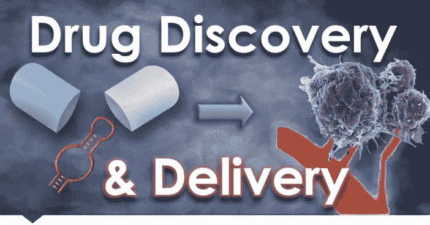
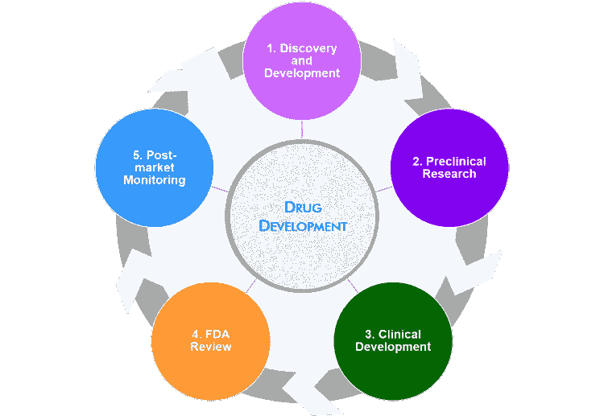
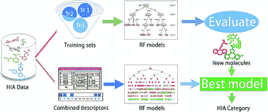
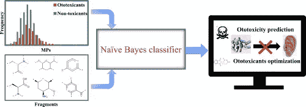
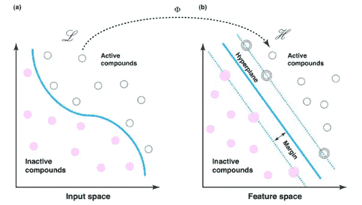
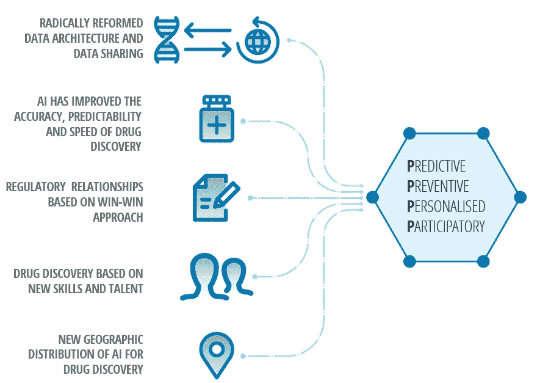

# 机器学习在药物研发中的崛起

> 原文：<https://medium.com/analytics-vidhya/the-rise-of-machine-learning-in-drug-discovery-f5dc4ac1005f?source=collection_archive---------3----------------------->

> 我们正在经历人工智能的新趋势吗？让我们在阅读的 7 分钟内找到答案！

# 介绍

你认为一种新药在美国获得批准需要多长时间？大约*12-15 年*，这大约是我们任何人整个职业生涯的三分之一。接下来，你认为将一种新药推向市场需要多少投资？~ $ 10 亿，那相当于以年薪 *$100k 雇佣 665+员工 15 年。*

简而言之，批准一种新药是一项艰巨的任务，选择正确的合作伙伴，他们与你同步确定优先顺序，专注于高质量和快速周转，对避免失误和使你的药物计划更接近成功大有帮助。

> **你们还能责怪科学家没有尽快发明救命药吗？**

## 让我们快速看一下药物发现涉及哪些阶段！

# 阶段

理解完整的药物发现所涉及的阶段是必不可少的，因为机器学习就是首先理解问题陈述。*本文更侧重于理解药物开发背后的机器学习，而不是开发市场现成的药物 LOL！*

美国药物开发流程有五个关键步骤，每个步骤都包括许多阶段。我们将讨论这些不同的阶段，以深入理解整个过程。这五个步骤是:

*   **第一步:**发现和开发
*   **第二步:**临床前研究
*   **第三步:**临床开发
*   **第 4 步:** FDA 审查
*   第五步: FDA 上市后安全监控。

# 药物发现中的主要机器学习算法

# 1.随机森林

RF 是一种广泛使用的算法，专门为具有多个特征的大型数据集设计，因为它通过移除异常值以及基于为特定算法分类的相对特征对数据集进行分类和指定来简化。

**在药物发现中，RF 主要用于特征选择、分类器或回归**基于酶的训练数据集，通过选择分子描述符进行虚拟筛选，利用 RF 方法改善配体和蛋白质之间的亲和力预测。

药物发现中的随机森林分类器

# 2.朴素贝叶斯

NB 算法是监督学习方法的一个子集，它已经成为预测建模分类中使用的一个基本工具。

生物医学数据的分类在药物发现过程中至关重要，尤其是在目标发现子集中。NB 算法作为生物医学数据的分类工具已经显示出巨大的前景，这些数据通常充满了不相关的信息和数据，称为噪声。 NB 技术还可以在预测配体-靶相互作用方面发挥重要作用，这可能是先导化合物发现的巨大进步。

药物发现中的朴素贝叶斯分类器

# 支持向量机(SVM)

支持向量机是在药物发现中使用的受监督的机器学习算法，通过导出超平面基于特征选择器来分离化合物类别。

**SVM 对药物发现至关重要，因为它能够区分活性和非活性化合物，对每个数据库或训练回归模型中的化合物进行排序。** SVM 可以归属于不同的场景。SVM 分类有一个子集二元类预测，可以区分活性和非活性分子。

药物发现中的支持向量机

# **这里有一个针对你们的快速投票问题！**

让我知道你的思维过程

> ***AI 可以为更准确理解病理细胞和分子机制量身定制方法。***
> 
> **听起来很奢侈吧？让我们深入了解一下吧！**

# 案例研究 1。

## BenevolentAI:使用机器学习改进目标预测

***公司***

**BenevolentAI** 是一家成立于 2013 年的英国公司，创造并应用人工智能技术来改变药物的发现、开发、测试和上市方式。该公司有 200 多名生物学家、化学家、工程师、信息学家和数据科学家在跨职能团队中工作，总部位于伦敦，在剑桥(英国)设有研究机构，在纽约设有办事处。BenevolentAI 在 ALS、帕金森、溃疡性结肠炎和肌肉减少症等疾病领域积极开展研发药物项目。它与一些主要的生物制药公司建立了伙伴关系。

***药物发现的人工智能解决方案***

BenevolentAI 拥有从早期发现到后期临床开发的能力。该公司开发了 Benevolent Platform，这是一个领先的计算和实验发现平台，允许他们的科学家找到治疗疾病的新方法，并为患者提供个性化的药物。Benevolent 平台专注于三个关键领域，目标识别、分子设计和精准医疗。

***主要项目和疾病领域***

BenevolentAI 的平台产生了潜在 ALS、治疗方法以及生物学证据的排名列表。BenevolentAI 团队能够使用专注于多个 ALS 过程中涉及的路径的策略来快速地对这些预测进行分类。五种最有希望的化合物被带到谢菲尔德转化神经科学研究所(SITraN)，一个 ALS 的世界权威机构。一种 ALS 先导分子出现在一种乳腺癌药物中，当在金标准疾病模型中测试时，该药物显示出症状发作的延迟。

2019 年 4 月，该公司开始与阿斯利康进行长期合作，旨在利用人工智能和机器学习开发慢性肾病(CKD)和特发性肺纤维化(IPF)的新疗法。

2019 年 9 月，BenevolentAI 与诺华制药股份有限公司(简称“诺华”)签署了框架合作协议。与诺华在肿瘤学领域的这个初始项目将应用人工智能和人工智能技术对患者进行分层，并更好地了解患者和疾病的异质性，以更准确地为需要的患者提供药物。

***成就***

该公司旨在利用人工智能的力量将患者放在第一位，并通过创造一种降低药物发现和开发成本、降低失败率和提高药物交付给患者的速度的方法来切实改变他们的生活。BenevolentAI 在著名的科学杂志和世界知名的会议上发表了几篇研究论文。

> ***DL 技术不仅改变了小分子研究领域，而且在新生物制剂的鉴定方面也显示出潜力。***
> 
> *好奇如何？让我们马上完成案例研究吧！*

# 案例研究 2。

**原子方式**

**使用 DL 加速发现，为最难的目标找到分子**

***公司***

Atomwise 是一家成立于 2012 年的美国公司，使用人工智能技术来预测小分子-蛋白质结合亲和力，并专注于识别任何疾病目标的潜在疗法。该公司有 46 名员工。它与世界各地的主要生物制药公司和学术研究中心建立了 300 多个合作伙伴关系。2018 年，它获得了 4500 万美元的风险投资基金，用于进一步开发人工智能技术，迄今为止共有 5130 万美元的资金。

***药物发现的人工智能解决方案***

人工智能平台 AtomNet 是由 DL 卷积神经网络构成的专利结构，用于命中发现和先导化合物识别和优化。它学习药物与靶分子结合的三维特征，并识别识别物。该平台可以选择具有关键特征的命中结果，例如能够在短时间内穿过血脑屏障，并在几天内获得新的先导化合物，从而无需进行昂贵而漫长的高通量筛选实验。

***主要项目***

他们正在与全球各地的合作伙伴合作，开展针对多种疾病的药物研发项目，包括埃博拉病毒、多发性硬化症和白血病。

***成就***

该公司与多伦多大学合作，使用人工智能技术和算法来快速确定对抗埃博拉病毒的治疗方法。研究结果已提交给同行评审的出版物。Atomwise 还发现了一种针对多发性硬化症的新分子，它可以抑制中枢神经系统中的蛋白质相互作用，并在小鼠模型中以非常低的剂量口服显示出活性。该药物已被许可给一家未披露的生物制药公司。更近的成果包括在**南美锥虫病**、手足口病、缺血性中风和帕金森病上的成功。

# 药物研发的未来:提供“4P”药物

人工智能和其他创新技术的采用，以及来自多个来源的大数据的使用，正在实现更精确的针对性治疗，并将健康生态系统转向未来，在未来，医学是**个性化、预测性、预防性和参与性的(“4p”)，**导致新的、更高效和有效的护理模式。在未来十年，这些转变将对治疗和患者结果产生重大影响，特别是在那些需求未得到满足的医学领域。

