# 烹饪“更好”机器学习模型的秘方

> 原文：<https://medium.com/analytics-vidhya/the-secret-recipe-to-cook-a-better-machine-learning-model-823108b2ac5b?source=collection_archive---------15----------------------->

数据科学和机器学习在过去几十年中呈指数增长，这不是神话。根据这个，

> 2018 年，全球机器学习市场规模为 69 亿美元，预计到 2025 年将达到 967 亿美元。

**967 亿美元，**让这个数字沉淀一会儿。

由[米歇尔·亨德森](https://unsplash.com/@micheile?utm_source=medium&utm_medium=referral)在 [Unsplash](https://unsplash.com?utm_source=medium&utm_medium=referral) 上拍摄的照片

现在问题来了，到底什么是机器学习？简单来说，这就像让一个孩子通过学校。给你的机器学习算法一大块数据，该算法将简单地学习你的数据的各个组成部分之间的复杂关系。听起来很简单，对吧？没那么多！

> 如果很容易，每个人都会去做。“努力”是任何事情伟大的原因。
> ~吉米·杜根(自己的联盟)

有一些已定义的机器学习算法，这些算法期望向它们提供数据，并输出基于这些数据“训练”的机器学习模型。您可以使用该模型并对类似数据进行未来预测。有许多机器学习模型，您可以根据问题的复杂程度进行选择。有一个阶段，你必须“调整”你的模型，使它可以一般化，但不要太一般化，以至于它基本上是哑的。

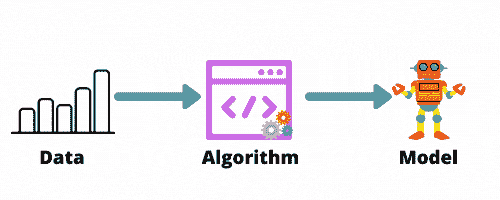

作者图片

我讲这些的原因是因为你的模型的学习直接依赖于你的机器学习算法。*算法越好，模型越好，因此性能越好*。嗯，**这在某种程度上是** **对的。**如果模型性能只依赖于机器学习算法，你可以只建立你所知道的最复杂的模型，比如人工神经网络，然后完成它。这实际上是大多数人试图做的事情。既然大多数人都这样做，你如何确保你的模型脱颖而出？

所以，问题仍然存在，如何建立一个更好的机器学习模型？嗯，就像他们说的，伟大的学生来自伟大的老师。问问你自己，你的机器学习模型的老师是谁？**数据。你是谁？**数据科学家。**我的观点是，要更好地学习机器模型，你需要成为一名*创新思维者*数据科学家。它基本上意味着，发挥你的科学家气质，尽可能多地用你的数据做实验。*你的数据质量越好，算法越好，模型越好！***

这种从现有特性中提取更多特性的惊人过程被称为**特性工程！**

> 让我给你一个简单的高中理由，告诉你为什么要用你的数据做实验。我相信你们大多数人已经知道了这一点。氢是可燃的，需要氧来保持火焰，但是将 2 个氢原子和 1 个氧原子结合，你得到水，一种灭火的分子。所以你看，仅仅通过结合两种不同的成分，我们得到了另一种具有完全不同性质的成分。尝试将这一论点扩展到数据中的组件。

是时候举个例子了，Kaggle 上传说中的[泰坦尼克号生存预测](https://www.kaggle.com/c/titanic)比赛。这就是我处理这个问题的方法，并且发现了一些你可能已经错过的*事实！*

简单介绍一下这个问题，这是我们心爱的数据的样子，

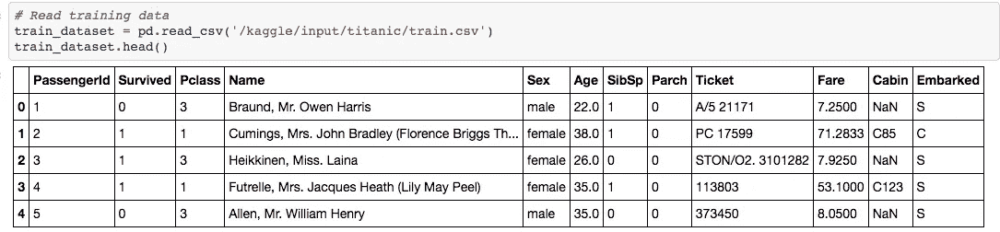

泰坦尼克号生存预测数据集

你会看到泰坦尼克号上每个人的一些特征，以及他们是否在沉船中幸存。特征包括姓名、性别、兄弟姐妹的数量、父母和孩子的数量、票号、票价、客舱等级和登机类别。你需要预测一个特定的人是否会幸存。每个数据科学家的第一直觉是*删除不相关的列*，这是有意义的，因为你不想将一些数据输入到没有学习的算法中。所以，首先想到的是丢弃 PassengerId、Name 和 Ticket。但是请耐心等待，让我们仔细观察一下。

以**的名义再深入挖掘一下。**

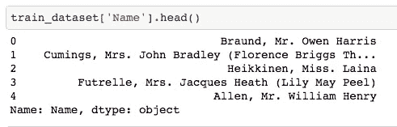

这些名字与诸如先生、夫人、小姐等头衔联系在一起。把标题和名字分开，

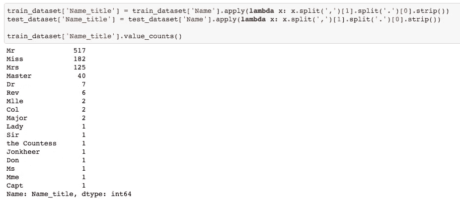

哇哦。泰坦尼克号上有各种各样的人。如果你检查了高级职称的人是否幸存，惊喜惊喜！他们做到了。头衔越高的人越有可能在泰坦尼克号沉没后幸存下来。

在**票**中深入挖掘一下。

ticket 列有一些数字字段和一些字符字段。所以，我区分了数字和字符。

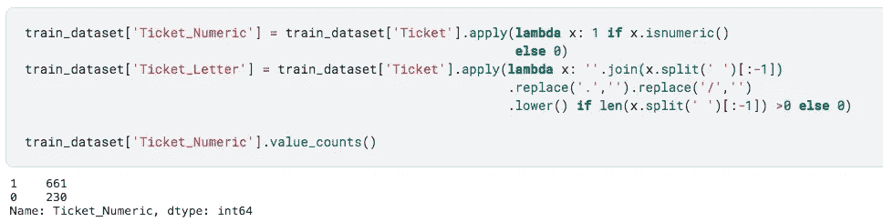

检查持有数字票的人的存活率

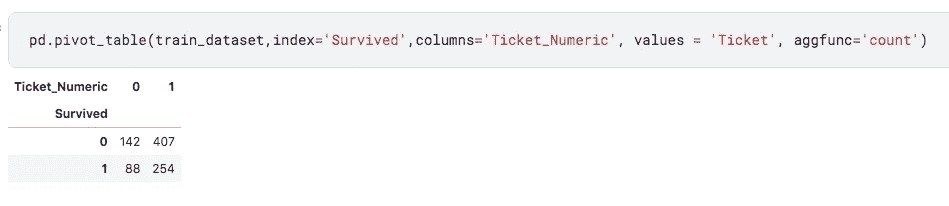

解释不多，但值得实验。看起来有数字票的人有更高的生存机会，但是如果你看到，大约 3 倍的人有数字票，所以这可能不是一个公平的假设。

删除非必填字段后的下一步是检查空值，并删除空值计数较高的列。

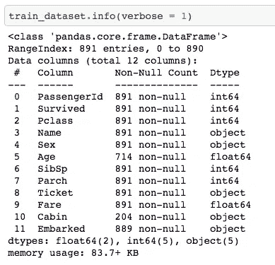

**Cabin，**在 891 个值中只有 204 个，这意味着大约 75%的值为空。第一直觉会告诉你放弃这个专栏。但是，允许科学家对数据进行实验！

在**小屋**中深入挖掘

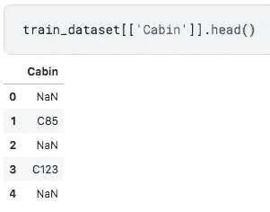

泰坦尼克号上的船舱号码

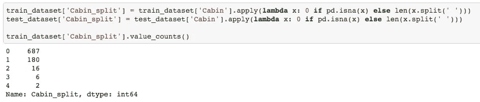

舱号长度

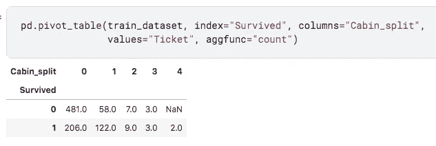

正如你所观察到的，船舱编号越大的人生还的机会就越大！现在，只有有钱人才买得起小屋。这是否意味着富人有更高的生存机会？

泰坦尼克号数据集的一些其他结论

**PClass**

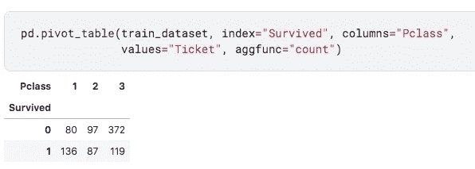

一等生存比率实际上比 1 高得多。这确实意味着**的富人有更大的机会在沉没的泰坦尼克号上幸存下来。我们得赚更多的钱，伙计！**

**性**

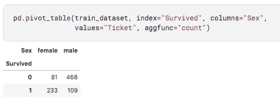

这是意料之中的事，我相信我们大多数人都已经探索过了。女性的存活率比男性高得多。

> 因此，如果你是一位拥有显赫头衔的富有女性，你最有可能在泰坦尼克号沉没时幸存下来。

你看到特征工程的力量了，对吧？我知道一个事实，在任何比赛中，评分最高和表现最好的车型，总是有一个独特和有趣的功能工程。他们可能不会使用最先进的模型，但他们总是对自己的数据进行实验。

在这里查看我的完整实现。

继续实验吧，我的“数据科学家”伙伴！