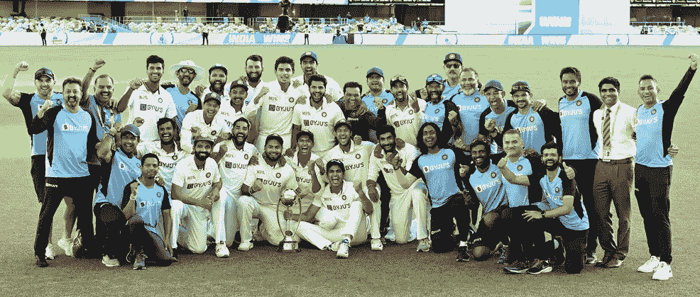
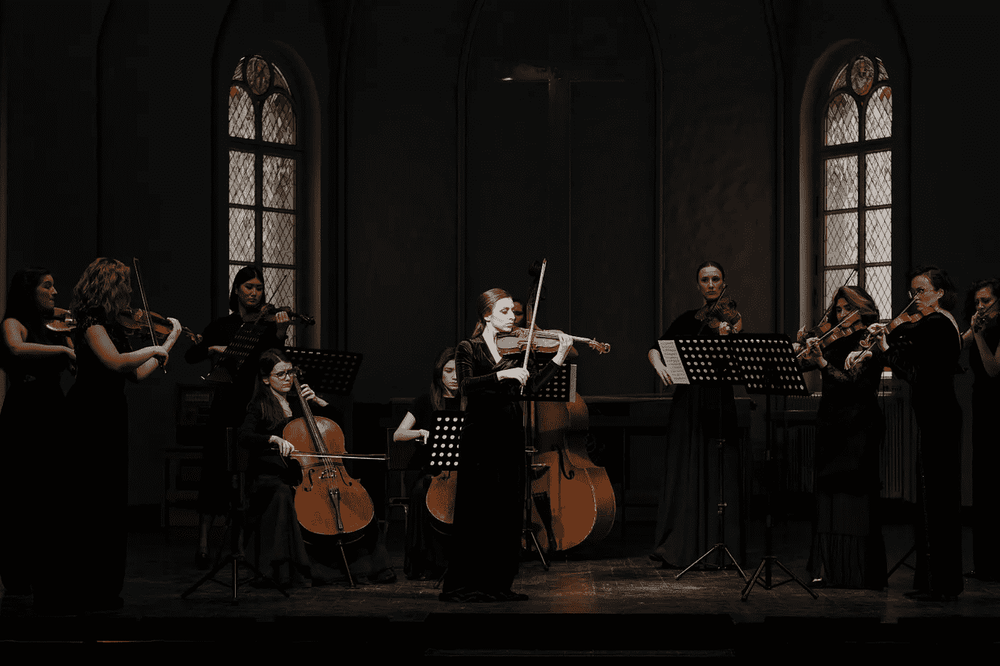

# 合奏精神

> 原文：<https://medium.com/analytics-vidhya/the-spirit-of-ensemble-d345dc9459c8?source=collection_archive---------9----------------------->

来源:BCCI 推特

在印度，佝偻病是一种共同的纽带，它将人们团结在一起，即使他们有不同的观点和信仰。这是印度的一项大型运动，我们热爱板球。现在的印度队踢得太棒了。让它在澳大利亚的测试赛中下注，印度在第一场测试赛中全力以赴 36 分后以 2 比 1 获胜。伟大的成就。或者是印度-英格兰测试赛，印度以 3-1 轻松击败英格兰。

## 那么是什么让印度队如此强大呢？

*   他们不仅仅关心球场。无论是步伐，弹性，摆动，帕塔，转弯。他们将尽全力赢得这场比赛。
*   板凳实力很强。在澳大利亚，印度队因受伤而面临选人困难。尽管如此，他们还是赢了，因为有强大的板凳。
*   印度队有适合各种条件的队员。假设三柱门是摆动的，那么我们有 Bhuvneshwar Kumar，因为摆动保龄球是他的强项，如果有弹性，那么我们有米沙，Ishant Sharma 可以利用他们的身高和速度，如果三柱门是转动的，那么 R Ashwin 和 Jadeja 可以诱捕世界上任何击球手。贾斯普里特·布姆拉对任何类型的三柱门都是致命的。
*   在击球方面，我们有维拉特和罗希特，他们可以在任何情况下得分，普哈拉和拉哈尼为球队提供了稳定性。哈迪克，潘特可以摧毁世界上任何一个保龄球队。
*   印度队的整体防守水平很高。

我们可以在这里观察，印度队在所有三个部门的深度。**印度队有各种各样的球员，即使一名球员失败了，队里的其他人也能管理他的失败。因为板球是一项团队运动。**

在比赛中获得一席之地是一项非常困难的任务。我们可以说他们是全国最好的 11 人。关于谁比谁更好的观点可能是不同的。但是**我们都同意这样一个事实，他们都是高于平均水平的球员。**

你可能会在这里想，博客的标题提到了合奏，那么为什么我会读到印度板球队呢？

我们可以在印度板球队和合奏团之间找到相似之处，两者的工作方式都是如此。

# 全体

资料来源:c .技术人员

> “单独我们能做的很少，而团结起来我们能做的很多。”—海伦·凯勒

集合是模型的集合，这些模型一起工作，集合比集合中的单个模型更好。每种模式都有其优点和缺点。在某些情况下，一种型号比另一种性能更好，反之亦然。因此，作为一个团队，通过相互补充，他们可以更好地处理不同的情况。

就像印度队一样，当他们作为一个团队比赛时，赢得比赛的机会非常高。有时一两个玩家可能无法完成任务，但是其他人可以代替他们。

组建一个模型团队并让它在算法环境中工作并不是一件简单的任务。我们来看看怎么做。

## 合奏背后的理念

每个合奏团(队)应符合以下标准
1。**多样性**2
。**可接受性**

## 多样性

我们放在一起的模型的优点和缺点应该相互补充。这意味着单个模型使预测相互独立。如果我们把同类的模型放在一个团队里是没有用的。那就不会有个体和群体的区别了。假设队里的 11 名球员都是击球手。即使他们把一个很大的总数放在黑板上，他们也无法保护它。最终主要目标是赢得比赛。一个更加平衡的团队赢得比赛的机会更大。

## 可接受性

集合中的每个模型应该比随机猜测表现得好得多。它不应该根据掷硬币来决定产出。给出正确答案的概率应该大于 0.5。就像在印度队一样，一名球员需要成为他各自部门的专家。

## **如何带来多样性？**

1.  通过向不同的模型显示训练数据的子集。因此，这里每个模型将在不同的数据上进行训练。
2.  用不同的超参数设置训练每个模型。即使我们在一个团队中使用 4 个逻辑回归，他们的行为也会不同。
3.  可以使用不同的分类器。例如，逻辑回归、SVM、KNN 等的集合。
4.  通过向模型显示不同的特征。这将改变每个模型的行为，即使所有模型都是相同的类型。

## 集体 v/s 个人

机器学习中的基本问题是，我们如何期待一个通过使用有限数量的训练数据建立的模型能够很好地处理该模型从未见过的东西？

**在模型训练中，我们试图找到一组正确的假设(参数值)、一组规则(就像决策树一样),根据训练数据得出正确的答案。**这里我们只知道有限的训练数据。看不见的数据可能不同于训练数据，在这种情况下，训练模型的**固定假设**将不起作用。然后偏差、方差、过度拟合的问题就出现了。

系综提供了**灵活性**，这里不同的模型会有**不同的假设**所以我们不会拘泥于一套规则。总的来说，这将有助于解决看不见的情况。集合的输出基于**平均值**(平均值或众数)。系综介绍**概化。**

*有不同种类的集成技术，如* ***投票、堆叠和混合、打包(引导-聚合)、助推*** *。假设集合中的所有模型都是可接受的，那么每个模型都有自己引入多样性的方式。*

## 结束注释

总的来说，all ensemble 是实现更稳定、更可靠、更通用的模型的一项伟大技术。

我希望这篇博客有助于理解合奏背后的直觉。请在下面评论您的想法、反馈或建议(如果有的话)。

**参考文献:**

[集合方法- Nptel](https://nptel.ac.in/courses/106/106/106106139/)

[集成学习-维基百科](https://en.wikipedia.org/wiki/Ensemble_learning)