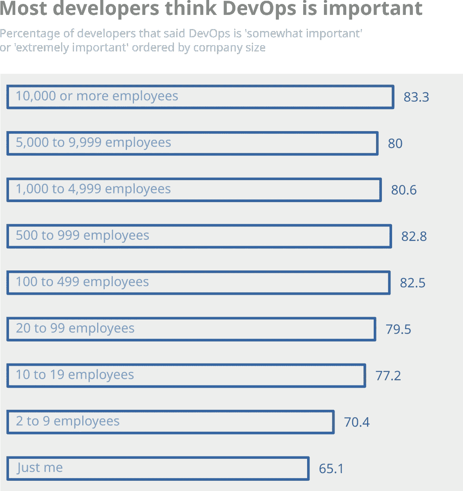

# 德沃普斯州

> 原文：<https://medium.com/analytics-vidhya/the-state-of-devops-10eba4a10d96?source=collection_archive---------7----------------------->

这篇文章是关于使用数据来发现软件工程社区是如何看待 DevOps 的。

我们将分析以下问题:

*   开发者是不是只有拥有了 DevOps 才看重它？
*   拥有 DevOps 如何影响工作满意度？
*   在不同规模的公司中，对 DevOps 的好感度分布如何？

但是首先，我们先来回顾一下 DevOps 到底是什么。

# DevOps 是什么？

[维基百科](https://en.wikipedia.org/wiki/DevOps)是这样定义的:

> *DevOps 是一套结合了软件开发(Dev)和 IT 运营(Ops)的实践。它旨在缩短系统开发生命周期，并提供高质量的持续交付。*

我们看到 DevOps 是关于*缩短开发生命周期*和*提供高质量的持续交付*。这是每个团队在代码中寻找的两个特性。有效开发运维背后的一些范例包括:

## 持续部署

持续部署描述了持续部署新功能的过程。自动化管道部署新的代码变更。通过这种方式，工程团队可以随时了解整个系统的健康状况。

## 连续累计

通过持续集成，每当代码被检入到版本控制系统中时，都会被立即分析和测试。这使得持续集成成为敏捷团队的一个重要工具，因为他们可以在问题出现时立即解决问题。

## 自动化仪表板

DevOps 为软件开发过程带来了自动化和可观察性。这种自动化使团队能够为他们感兴趣的关键指标创建自动化的仪表板。这些关键指标可以作为重要业务决策的基础。

组织从开发运维中受益，因为它通过缩短开发和部署之间的周期时间来加速创新。DevOps 也是可伸缩性的重要工具。它引入了高度的一致性，允许您管理和更改复杂的系统。

# 堆栈溢出 2020 开发者调查

所有这些好处在理论上听起来都不错。但是如果社区不承认它们的价值，它们就毫无价值。因此，我们将查看来自 [Stack Overflow 2020 开发者调查](https://insights.stackoverflow.com/survey)的数据，以了解社区对 DevOps 的想法。

Stack Overflow 针对与编程相关的广泛主题进行了一项年度调查。2020 年有近 65000 人参与。除了前几年的一系列问题外，2020 年的调查还包括了关于 DevOps 的数据。参与者回答了他们的组织是否有专门的 DevOps 人员，以及他们认为 DevOps 对扩展软件开发有多重要。

年度堆栈溢出调查让我们对开发者对新技术的看法有了最全面的了解。所以我们会用它来考核 DevOps 是否得到了应有的爱。

# 人们是不是只有拥有了 DevOps 才认可它的价值？

这是我们要回答的第一个问题。我的印象是，在一个有坚实的 DevOps 流程的环境中工作会改变人们的想法。在开发人员体验到良好的 DevOps 管道的好处之前，他们通常会怀疑它是否有助于他们编写更好的代码。有些人可能还会把它视为额外的负担。

但是一旦他们体验到他们的生活变得多么容易，许多人就会改变主意。人们意识到好的 DevOps 管道可以减轻开发人员的负担。

这也是我们在调查受访者认为 DevOps 有多重要的数据中发现的。如果我们将没有专职 DevOps 人员的公司的答案与有 DevOps 人员的公司的答案进行比较，我们会发现明显的差异。回答中立的受访者比例下降了 13%。此外，人们明显倾向于将 DevOps 视为“极其重要”。

数据显示，如果他们的公司提供 DevOps 过程，开发人员会学会欣赏它们。我无法校正其他因素，如了解以前公司开发人员的受访者。然而，总体情况仍然是拥有 DevOps 增强了它对开发者的重要性。

这就引出了下一个问题。如果工程师在使用 DevOps 时学会欣赏它的好处，拥有 DevOps 是否也会影响他们的工作满意度？

# 拥有 DevOps 如何影响工作满意度？

在这里，数据不太清楚。回答“稍微不满意”的受访者较少。但是，感觉“非常满意”的开发者数量增加了。

这可能表明拥有 DevOps 人员稍微增加了开发人员的工作满意度。但这也可能是由于公司规模和薪酬等其他因素。

# 对 DevOps 的看法如何随着公司规模的变化而变化？

下一张图显示了根据公司规模，认为开发运维“极其重要”或“有点重要”的开发人员的比例。

我们看到大多数开发人员将 DevOps 视为现代软件组织中的一个重要工具。然而，员工少于 10 人的公司的受访者认为这不太重要。这是可以理解的，因为 DevOps 流程的有效性在较大的公司中表现得更好。

尽管如此，高支持率还是令人鼓舞。这表明，社区已经团结一致，确信 DevOps 的重要性。

# 结论

这是我们通过栈溢出开发者调查对 DevOps 状态的分析。对我来说，有趣的是看到有/没有 DevOps 给 DevOps 留下了重要的印象。我还对认为 DevOps 对规模化软件开发很重要的开发人员的高比例感到惊讶。

如果您对这个分析的代码感兴趣，您可以在 [my Github](https://github.com/bewagner/stack_overflow_survey_devops) 上查看。

*最初发表于*[T5【https://bewagner.net】](https://bewagner.net/programming/2021/06/01/stackoverflow-developer-survey/)*。*