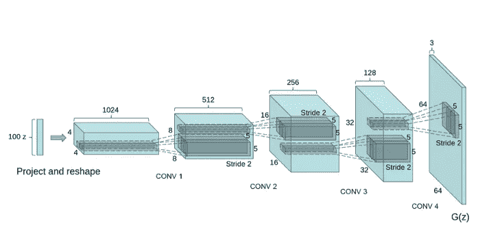
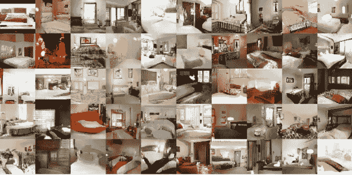
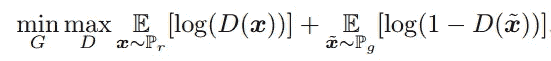

# DCGANs、WGAN 和 cgan 的故事

> 原文：<https://medium.com/analytics-vidhya/the-story-of-dcgans-wgan-and-cgans-c0182ad014bd?source=collection_archive---------7----------------------->

对 GANs 的选定变体及其定义概念的介绍。

[苏西·黑兹尔伍德](https://www.pexels.com/@suzyhazelwood)

*嗖！我终于让自己写下我的想法。这篇文章将带你了解我对某些 gan 变体的发现，以及它们之间的区别。如果你像我一样是一个数据科学爱好者，我敢肯定你已经发现了 GANs 的概念及其巨大的可能性。*

**我们将在本文中讨论的重点:**

*   GANs 的简要概述
*   深度卷积生成对抗网络
*   沃瑟斯坦生成对抗网络
*   条件生成广告串行网络

# ***甘斯*** 概述

**生成对抗网络(GANs)** 由 **Ian** **Goodfellow 等人**提出。在最初的设置中，GANs 由一个发生器和一个鉴别器组成，它们被训练成具有竞争目标。该发生器被训练以产生朝向真实数据分布的样本来欺骗鉴别器，而鉴别器被优化以区分来自真实数据分布的真实样本和由发生器产生的假样本。

用图形术语来说，生成者是艺术伪造者，鉴别者是艺术专家或艺术评论机构请来辨别真艺术和假艺术的人。这比这复杂得多，但它解释了他们的基本作用。这是神经网络的一个有趣的应用。随着我们的深入，我们将看到它是如何在不同的变化中成为可能的。最近，GANs 在模拟复杂的数据分布方面显示出巨大的潜力，例如文本、图像和视频。

# DCGANs

**深度卷积 GANs** 是一种不太复杂且易于实现的变异 GANs，由 [***亚历克* *拉德福德***](https://arxiv.org/search/cs?searchtype=author&query=Radford%2C+A)**[***卢克·梅斯***](https://arxiv.org/search/cs?searchtype=author&query=Metz%2C+L) 和 [***苏密特·钦塔拉***](https://arxiv.org/search/cs?searchtype=author&query=Chintala%2C+S) 在一篇论文中称之为**

****

**DCGAN 发生器架构**

**这是用于 LSUN 场景建模论文的 DCGANs 生成器的图示，它采用形状为 100x1x1 的随机噪声向量，表示为 Z，并被传递到生成器网络，该网络将其映射到形状为 64x64x3 的 G(Z)输出。该网络包含转置的 CNN 层，其对输入张量进行上采样，应用批量归一化，并且除了包含在[-1，1]范围内缩放图像的 Tanh 激活的最后一层之外，每一层都具有 Relu 激活。**

**如图所示的第一层将输入从 100x1x1 扩展到 1024x4x4，这一层称为 ***项目和整形*** 。在这一层之后，应用经典的卷积层，这利用与卷积层相关联的*(N+P-F)/S+1*等式来重塑网络。我们可以看到 *N 参数(身高，体重)*从 4 到 8 到 16 到 32，内核过滤器 *F* 是 5x5，步幅 *S* 是 2，似乎没有填充。**

**网络从 100 x1x 1→1024 x4x 4→512 x8x 8→256 x16x 16→128 x32x 32→64 x64x 3。**

****

**上面的图像是生成器经过 5 个时期的训练后产生的令人印象深刻的输出。**

## **DCGANs 的关键概念**

*   **它由像其他 GAN 一样的神经网络组成，即**发生器**和**鉴别器**。**
*   ****鉴别器**将生成的图像和真实图像作为输入，并输出一个介于 0 和 1 之间的值，即图像是真实还是虚假的置信度。**
*   ****发生器**看不到真实图像，它通过**鉴频器**的反馈进行学习。**
*   **在**鉴别器**和**发生器**中，分别用步长卷积和分数步长卷积代替池层。**
*   **在**发生器**和**鉴别器**中都使用了批量归一化。**
*   **使用更深的架构，而不是完全连接的隐藏层。**
*   **ReLu 激活在**发生器**中用于所有层，除了使用 Tanh 激活的输出层。**
*   **LeakyReLu 激活用于**鉴别器**中的所有层。**
*   **使用小批量随机梯度下降(SGD)训练模型，小批量大小为 128。**
*   **二元交叉熵损失(BCE)函数用于**发生器**。**

## **DCGANs 的约束**

**DCGANs 的一些局限性是由 BCE 损失函数造成的，即:**

*   *****模式崩溃:*** 这用于描述 GANs 网络无法生成分布的不同类别，例如 MNIST，GANs 可能只能从 10 个可能的类别中生成一个类别，在 Dog 实施中，模型可能只能在许多可能的可用种类中生成一个种类的狗。**
*   *****消失梯度:*****鉴别器**的置信水平是一个只能在 0 和 1 之间的单一值，目标是使该值尽可能接近 1，因此当计算出的梯度接近 0 时，**发生器**无法获得太多信息，使其无法学习，这留给我们一个强**鉴别器**和一个弱**发生器**。**

****

# **WGAN**

****瓦瑟斯坦·甘**是由 [*马丁·阿约夫斯基*](https://arxiv.org/search/stat?searchtype=author&query=Arjovsky%2C+M)*[*苏密特·钦塔拉*](https://arxiv.org/search/stat?searchtype=author&query=Chintala%2C+S)*[*莱昂·博托*](https://arxiv.org/search/stat?searchtype=author&query=Bottou%2C+L) 在一篇论文中提出的，命名为 [*瓦瑟斯坦·甘*](https://arxiv.org/abs/1701.07875) *。*该算法被引入作为传统 GANs 训练的替代方案，在该模型中，学习的稳定性被提高，并且模式崩溃等问题被处理。****

**与 DCGANs 不同，在本文中， ***EM 距离*** 也被称为 ***wasserstein 距离*** 被引入作为度量，EM 距离是将一个分布移动到另一个分布的努力量，即你应该花费多少工作来将该分布运输到另一个分布。值为正，形状对称。EM 距离有两个属性:**

1.  ****该功能在任何地方都是连续的****
2.  ****函数的梯度几乎无处不在****

**利用这两个性质，我们能够避免消失梯度的问题，并且能够继续训练和更新我们的模型，直到它收敛。**

****

**EM-距离的对偶关系**

**然而，在寻找下确界时，很难穷尽联合分布中所有可能的样本。使用 *Kantorovich-Rubinstein 对偶方法*，该问题可以近似为其对偶格式，我们继续寻找其上确界。这两种形式之间的关系如上所示。 ***唯一的约束条件是函数应该是 Lipschitz-1 连续函数* *，即梯度的范数在每一点上必须最大为 1*。****

****

**WGAN 的目标。**

**在 **DCGANs** 中，我们总是以最大化分类得分为目标。如果图像是假的，**鉴别器**给它一个分值 0，如果图像是真的，**鉴别器**给它一个分值 1。在 **WGAN** 中，鉴别器的任务变成了更多的回归问题，马丁将其重命名为**批评家**。评论家应该测量 EM-distance *，即应该花费多少工作*，并找到上图所示的最大值。**

****

**WGAN 算法**

**上图所示为 **WGAN** 的训练过程，与普通 GAN 相似，主要区别在于:**

*   **评论家多次更新。**
*   **我们在计算损失时不使用交叉熵，即我们不需要取对数。**
*   **应进行权重裁剪，以满足 ***Lipschitz 连续性*** 的约束。**
*   **不要使用像 Adam optimizer 这样的基于动量的优化器。**

**为了加强 ***Lipschitz 连续性*** ，进行了权重裁剪。减肥有它自己的缺点，在这篇[文章](/@sunnerli/the-story-about-wgan-784be5acd84c)中有详细的讨论。提出了另一种达到 ***Lipschitz 连续性*** 极限的方法:将极限项合并到损失函数中。这种变化的思想类似于在 SVM 机制中加入约束项。唯一的区别是拉格朗日乘数，这是应该通过二次规划找到的最佳参数，但我们只需要在 **WGAN** 中将它设置为常数。这一项叫做**梯度惩罚**。**

****

**WGAN-GP 中的修订目标**

**上图显示了修改后的损失函数。然而，在 ***Lipschitz 连续性*** 的定义中，我们要穷尽联合分布中所有可能的样本。作者声称我们根本不需要考虑整个样本。事实上，有人建议我们只需要生成两个分布之间的组合，并且**只对这些中间样本**进行惩罚。**

****

**WGAN-GP 算法。**

**上图是修改后的训练流程，它被赋予了另外一个名字: **WGAN-GP** 。在这个版本中，可以使用基于动量的优化器来更新模型，并且不会导致损失爆炸错误。在更新批评时，损失函数中应加入梯度惩罚项。**

**有一点你要记住:B **不应该使用补丁规范化**！在 Kantorovich-Rubinstein 的对偶理论中，每一对的梯度都是唯一的。然而，批量规范化会打乱这种情况，并使映射受到干扰。因此，建议在结构中使用层标准化(或其他方法)。这篇 [*文章*](/@sunnerli/the-story-about-wgan-784be5acd84c) 对于详细阐述 **WGAN** 和 **WGAN-GP** 的概念确实很有帮助。**

# **CGANs**

****条件甘(cgan)**是甘的一个更加平和的变体。顾名思义，CGANs 可以生成具有特定条件或特征的图像。**

**像前面讨论的 GANs 的两种变体一样， **CGANs** 有两个组件一个**发生器**和一个**鉴别器**。 **CGANs** 与之前讨论的变体的不同之处在于**发生器**和**鉴别器**接收额外的调节输入信息，该信息可以是一类当前图像或一些其他优先级。这是它比 **DCGANs** 更酷的地方，我们无法控制它生成什么类。在 **CGANs** 中解决了 **DCGANs** 的特定问题，我们添加了一个额外的输入层，其中包含一个热编码图像标签的值。**

## **CGANs 的优先级**

*   **添加一个特征向量来引导和控制生成器的输出，它帮助生成器弄清楚该做什么。**
*   **向量特征应该对我们想要生成的图像的类别或者我们期望图像拥有的一组特定特征进行编码。**
*   **我们将信息整合到将要学习的图像中，也整合到 Z 输入中，这不再是随机的。**
*   ****鉴别器的**评估不仅针对伪数据和原始数据之间的相似性，还针对伪图像与其输入标签(或特征)之间的对应性。**
*   **我们可以像对 **DCGANs** 那样做，但是必须在**发生器**和**鉴别器**上施加一个独热向量形式的条件。**

*****注:cgan****并不是严格意义上的无人监管，它们需要某种标签才能工作。***

****

**CGANs 示意图**

****CGANs** 的**鉴别器**和**发生器**模型与 **DCGANs** 相似，不同之处在于用于调节**鉴别器**和**发生器**的独热向量。**

****

**CGANs 架构**

****鉴别器有两个任务****

1.  **将从训练数据集中采样的真实图像正确标记为*【真实】***
2.  **将来自**发生器**的图像正确标记为“*假*”。**

**我们计算了**鉴别器**的两个损耗，假图像和真实图像损耗之和就是**鉴别器**的总损耗。损失函数旨在最小化预测来自训练集的真实图像和来自生成器的假图像的误差，给定它们的一个热标签。**

****

**鉴别器的损失函数**

****发生器**只有一个责任，那就是生成一个看起来足够真实的图像来骗过**鉴别器**。其损失函数旨在最小化**鉴别器**的正确预测。**

****

**发电机的损耗函数。**

*****鉴别器的训练流程*****

****

**鉴频器的训练过程**

*****发电机的培训流程*****

****

**发电机的培训过程**

***我发现这篇* [*文章*](https://medium.datadriveninvestor.com/an-introduction-to-conditional-gans-cgans-727d1f5bb011) *在我对****CGANs****的解释中非常有用，很有帮助。***

****

# **结论**

**我希望这篇文章无论如何是有用的，而不是令人厌烦的。***DC GANs****，****WGAN****和****cgan****都是****GANs****的有趣变种。他们都有长处和短处。我试图记录我所知道的关于每个变体的所有信息，并且我期待着就每个变体写一篇更加以代码为中心的文章，展示如何用 python 实现它们。所有这一切都在不久的将来。***

## **参考**

*   **[https://towards data science . com/DC gans-deep-convolutional-generative-adversarial-networks-c7f 392 C2 c8 f 8](https://towardsdatascience.com/dcgans-deep-convolutional-generative-adversarial-networks-c7f392c2c8f8)**
*   **[https://medium . datadriveninvestor . com/an-introduction-to-conditional-gans-cgans-727 D1 F5 bb 011](https://medium.datadriveninvestor.com/an-introduction-to-conditional-gans-cgans-727d1f5bb011)**
*   **[https://medium . com/@ sunner Li/the-story-about-wgan-784 be 5 ACD 84 c](/@sunnerli/the-story-about-wgan-784be5acd84c)**
*   **[https://towards data science . com/deep-convolutional-vs-wasser stein-generative-adversarial-network-183 fbcfdce1 f](https://towardsdatascience.com/deep-convolutional-vs-wasserstein-generative-adversarial-network-183fbcfdce1f)**

***这是我的第一份媒体出版物，我非常感谢对所讨论主题的反馈和建议，以及任何有助于我成为更好的* ***数据科学家*** *和* ***作家*** *。随时和我联系*[***LinkedIn***](https://www.linkedin.com/in/busayo-awobade-107a94175/)*。* ***我很乐意回答您的任何问题或数据科学自由职业者的任务:)*****