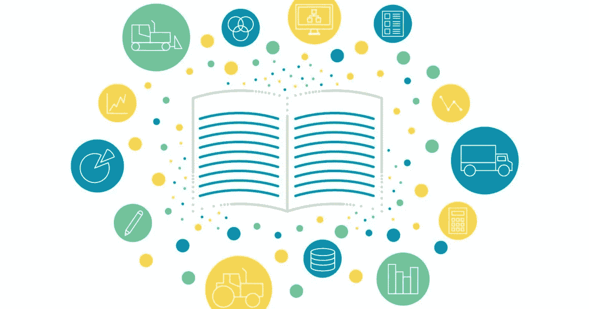

# 帮助我发展数据科学事业的故事

> 原文：<https://medium.com/analytics-vidhya/the-story-that-has-helped-develop-my-data-science-career-9cc6dbae16dc?source=collection_archive---------5----------------------->

资料来源:uptake.com

从事数据行业是一项巨大的挑战。你必须知道许多不同主题的许多东西:数学、编码、机器学习、云，等等。这个清单很大，而且每天都在变大。

如果你在网上搜索“给数据科学家的建议”，不到 1 秒钟你就能得到 128，000，000 次点击。你去 Linkedin，会有一堆人发布关于数据科学需要做什么或者一个好的数据科学项目的各个阶段的文章。当然，我对此也感到内疚，可能这篇文章也有一些已经说过的内容。

但在这种情况下，我想告诉你我的论文导师告诉我的一个故事，自从我听到这个故事以来，它就一直困扰着我，并且对我的数据科学生涯至关重要。

故事是这样的…

我们正在完成多变量技术课程，顺便说一下，这门课程叫做“从问题到分析”(这是强调数据科学真正意义的一种非常好的方式)，他告诉我们这门课程非常重要的一课不是关于技术的东西，而是其他东西。他是这样说的:

> “想象一下，你要做一个在周日新闻中播出的重要报告。这将是国家频道，每个人都会听到你的工作。我的祖母是一名数学家，我的阿姨是一名作家，她讨厌数学。
> 
> 因此，你的作品需要面向所有受众。你必须尽可能地**准确**，这样我的祖母就不会对你发火，同时**尽可能地清晰**，这样我的阿姨才能真正明白你在说什么。
> 
> 你的工作将非常重要，你应该集中精力确保该国没有人被遗漏”
> 
> - Tacq

当时我觉得这个故事很好，很有意义。随着时间的推移，我意识到它比我想象的更有用。它谈到了一个数据科学家要取得成功应该具备的许多重要技能。经过深思熟虑后，我列出了一个行动清单，来获得我自己使用的技能，现在我与你分享。

**周日新闻准确清晰的技巧……**

1.  学好数学，这样当你向利益相关者或数据专家同事解释你的工作时，你就能准确无误。
2.  确保你很好地理解了数学，这样当你向利益相关者解释你的工作是什么以及它的影响时，你会非常清楚。
3.  深入了解你自己的编码技能，这样你就能写出整洁清晰的代码，可以向同事或团队成员解释，并投入生产。
4.  很好地理解问题，这样你就可以**精确**并且可以用适当的分析解决方案处理问题(从问题到分析，记得吗？).
5.  学习如何成为一个好的讲故事者，这样你就可以**精确**和**清晰**。用数据讲述一个伟大的故事是很困难的，它需要沟通技巧、准备、对你的工作的深刻理解和解决问题的能力。但是如果你设法做到了，你就能产生巨大的影响，带来大量的价值。

**…这样的例子不胜枚举。**

6.玩得开心。

7.永远做好惊讶的准备…

可能所有这些要点对你来说都不陌生。每个人都在谈论他们，你肯定已经碰到他们一千次了。在现实中，以我卑微的经验来看，谈论它们很容易，但付诸实践却很难。

日常工作很容易将你的注意力从一些重要的事情上转移，或者经验可能会让你认为你精通这些技能中的一项或多项。即使这可能是真的，对我来说，想到有一天我将不得不上周日新闻是一个很好的提醒，重温并不断发展这些技能总是好的。

如果你的工作对利益相关者有意义，发展成为其他公司成员的行动，并转化为巨大的成果，那么你做得很好。但要实现这一点，你和你的团队必须做大量的分析，并让每个利益相关者都知道这一点。

为了做到这一点，你必须**清晰**和**精确。**