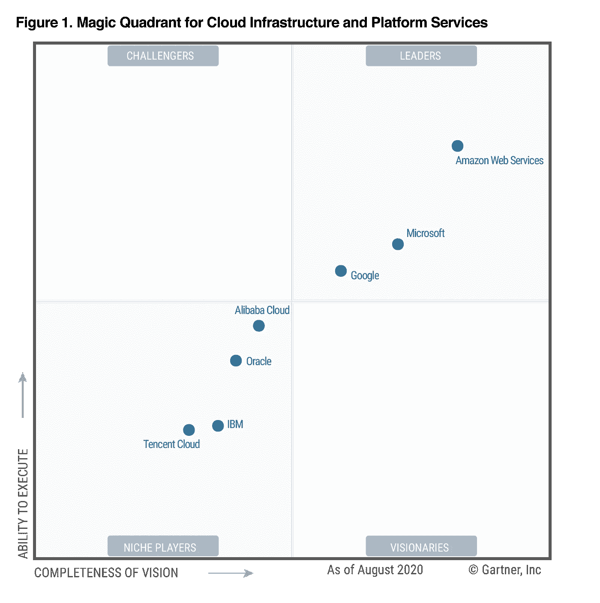
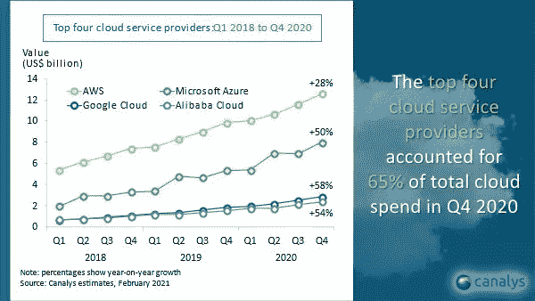

# 世界上顶尖和最好的云提供商。

> 原文：<https://medium.com/analytics-vidhya/the-top-and-best-cloud-providers-in-the-world-d97fecd06cde?source=collection_archive---------7----------------------->

马文·迈耶在 [Unsplash](https://unsplash.com?utm_source=medium&utm_medium=referral) 上的照片

在这个世界性的世界里，我们很容易得到印度或任何国家的美国的最新信息或新闻。我们可以很容易地在网上订购产品，从一个国家到另一个国家，并遵循两国的法律规则。如此相似，我们很容易获得云计算服务，遵循两国的法律规则。云计算是基于 Web 的计算，允许企业和个人消费计算资源，如虚拟机、数据库、处理、内存、服务、存储、消息传递、事件和现收现付。

云计算可以分为三大类，软件即服务(SaaS)、平台即服务(PaaS)和基础设施即服务(IaaS)。

***IaaS*** 提供整个 IT 计算基础设施，通过互联网进行供应和管理。IaaS 的关键组件用于替代现有的开发和测试环境、虚拟机、网站托管、存储、备份、网络、服务器、操作系统、中间件、数据和应用以及高性能计算(HPC)。

云计算的 ***PaaS*** 组件在云中提供了完整的开发和部署环境，包括开发、测试、QA、调试以及部署工具和服务。

***SaaS*** 是别人开发托管的软件。企业或个人可以根据需要使用它们。

如今，大多数顶级云服务提供商都提供所有这些服务。云计算的两个领导者是亚马逊和微软，其次是谷歌、阿里巴巴和 IBM。

云服务的顶级和最佳提供商是:

1.  **AWS(亚马逊网络服务)**
2.  **微软 Azure**
3.  **谷歌云平台**
4.  **IBM 云**
5.  甲骨文云
6.  销售力量
7.  精力
8.  Rackspace 云
9.  VMware
10.  阿里云
11.  （里面或周围有树的）小山谷
12.  卡马拉
13.  利诺德
14.  场地
15.  数字海洋
16.  石灰石
17.  关键的
18.  开放星云
19.  NaviSite
20.  韦尔锡安云
21.  CloudSigma
22.  武尔图
23.  液体网
24.  OVHCloud
25.  云之路
26.  ScalaHosting
27.  服务器空间
28.  RedHat OpenShift
29.  Dropbox
30.  埃尼特
31.  砖坯黏土
32.  pcloud
33.  铟软件
34.  菲尼克斯纳普
35.  赫罗库
36.  GearHost
37.  工作日
38.  ServiceNow
39.  AppScale
40.  网络套件

根据 Gartner 魔力象限，AWS 在 IaaS 领域领先于微软和谷歌云。

[https://pages . AWS cloud . com/GLOBAL-multi-DL-Gartner-MQ-CIPS-2020-learn . html？pg=WIAWS-mp](https://pages.awscloud.com/GLOBAL-multi-DL-gartner-mq-cips-2020-learn.html?pg=WIAWS-mp)

根据下图所示的科纳仕公司报告，在 2020 年第四季度，AWS 云增长了 28%，Azure、谷歌和阿里云分别增长了 50%、58%和 54%。截至这份报告，AWS 拥有 31%的总云市场份额，其次是 Azure、谷歌和阿里巴巴，分别拥有 20%、7%和 6%的份额。

[https://pages . AWS cloud . com/GLOBAL-multi-DL-Gartner-MQ-CIPS-2020-learn . html？pg=WIAWS-mp](https://pages.awscloud.com/GLOBAL-multi-DL-gartner-mq-cips-2020-learn.html?pg=WIAWS-mp)

参考:

[https://pages . AWS cloud . com/GLOBAL-multi-DL-Gartner-MQ-CIPS-2020-learn . html？pg=WIAWS-mp](https://pages.awscloud.com/GLOBAL-multi-DL-gartner-mq-cips-2020-learn.html?pg=WIAWS-mp)

感谢您的阅读，如果您喜欢请 ***点击*** 按钮。

关注我们，获取更多简单有趣的文章。

*更多内容请看*[***AnalyticsVidhya***](https://medium.com/analytics-vidhya)***。***

 [## 安装 OPENCV 的 5 个简单易行的步骤

### 在这个有趣的教程中，我们将学习在 Ubuntu 系统中设置 OpenCV-Python。以下步骤针对 Ubuntu 16.04 进行了测试…

medium.com](/analytics-vidhya/installation-of-opencv-in-simple-and-easy-way-15556edca7a4)  [## 机器学习、深度学习、人工智能(免费)的顶级最好的内容

### 这篇中型文章特别为那些想在机器学习/深度学习领域开始职业生涯的初学者而写…

medium.com](/analytics-vidhya/the-top-and-best-content-of-machine-learning-deep-learning-artificial-intelligence-free-9e36186d4b2)  [## 从 JSON 文件中提取有用数据用于机器学习

### 如何从一个 JSON 文件中提取数据用于 Python 中的机器学习模型

medium.com](/analytics-vidhya/extract-the-useful-data-from-jason-file-for-data-sceince-34ed5ae0b350) 

**在 LinkedIn 上帮我联系-**

 [## 印度马哈拉施特拉邦 ankit Gupta-Pune |职业简介| LinkedIn

### 我是深度学习爱好者/学习者，正在寻找一个可以贡献和提高技能的机会…

www.linkedin.com](https://www.linkedin.com/in/ankit-gupta2/)