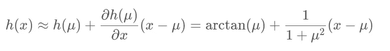
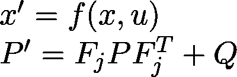

# 扩展卡尔曼滤波器的真正魅力

> 原文：<https://medium.com/analytics-vidhya/the-true-beauty-of-extended-kalman-filters-32e0c08d9258?source=collection_archive---------3----------------------->

我已经为成为一名自动驾驶工程师努力了一段时间。最近，作为传感器融合模块的一部分，我的任务是建立一个算法，在给定先前输入和不确定性的情况下，可以预测移动汽车的轨迹和位置。

# 卡尔曼滤波器是什么？

卡尔曼滤波器是一种特殊类型的算法，用于在给定不确定测量值的情况下进行估计。对算法进行硬编码听起来很容易，而且更实用，但是使诸如卡尔曼滤波器之类的估计算法对于这样的任务来说是最佳的，因为它需要间接的和不确定的测量来进行这样的预测。

激光雷达和雷达等传感器容易受到噪声和漂移的影响。卡尔曼滤波器可以将这些传感器合并(融合)在一起，以帮助优化对位置/检测的估计。这正是传感器融合的意义所在。卡尔曼滤波器在其中起着不可或缺的作用。

在自主车辆的情况下，卡尔曼滤波器广泛用于预测其他车辆和行人的运动。计算物体的轨迹和位置对于自动驾驶至关重要，特别是因为直接穿过会(并将)导致其他车辆/行人死亡。

# 卡尔曼滤波器如何工作

卡尔曼滤波器遵循两步迭代过程:测量更新，然后预测。它通过一系列高斯分布来表示。

下面我们来看一个一维高斯的例子。假设这是我们汽车的位置:

[来源](https://www.youtube.com/watch?v=VFXf1lIZ3p8&list=PLn8PRpmsu08pzi6EMiYnR-076Mh-q3tWr&index=5)

这是我们在时间 **xₖ-₁** 对汽车位置的初始高斯估计。请注意，有一点方差σ，但估计值似乎相当有把握。

[来源](https://www.youtube.com/watch?v=VFXf1lIZ3p8&list=PLn8PRpmsu08pzi6EMiYnR-076Mh-q3tWr&index=5)

现在让我们预测一下 xₖ的时间**。注意下图，我们的方差σ实际上比以前更高了。现在让我们来看看最新的测量结果， **yₖ** :**

****

**[来源](https://www.youtube.com/watch?v=VFXf1lIZ3p8&list=PLn8PRpmsu08pzi6EMiYnR-076Mh-q3tWr&index=5)**

**yₖ现在是我们从传感器获得的测量更新输入。测量值更新的方差并不太大，尽管其根本原因主要是因为来自传感器的噪声。**

****

**[来源](https://www.youtube.com/watch?v=VFXf1lIZ3p8&list=PLn8PRpmsu08pzi6EMiYnR-076Mh-q3tWr&index=5)**

**现在，卡尔曼滤波器所做的是，它试图通过将在 **xₖ** 的预测与在 yₖ的更新测量相结合来做出**光学状态估计**，因此，当方差比以前更低时，产生高斯。**

**让我们通过两个主要步骤来分解卡尔曼滤波算法——预测然后测量更新:**

# **预言**

**给定一个物体的当前位置和速度，让我们将其存储到向量 x 中。因此，在一维世界中，**x =【xₚ,vₚ】**其中 xₚ是汽车在一维世界中的位置，vₚ是汽车的速度。**

**然后我们会有一个状态转移矩阵，F，把时间加入到方程中。假设 **vₚ** 是常数，我们的状态转移矩阵看起来像:**

****

**对于我们的测量向量 z，我们将只包含测量值，而不包含速度。这看起来像是，**

****

**这个[1，0]矩阵称为 h，乘以我们的输入位置 xₚ和速度 vₚ.**

**现在我们已经定义并指定了输入矩阵，下面是我们的位置更新的样子:**

****

**其中 u 是我们的外部运动矢量。**

**我们用于预测的另一个矩阵是 P，它是我们的估计协方差矩阵，有助于描述我们的不确定性。这看起来会像**

****

**记住 F 是状态转移矩阵，我们取它的转置，乘以 F 和初始协方差矩阵 p。**

**既然我们已经做出了最初的预测，那么是时候更新测量值以更好地预测 x 和 p 了。**

# **更新测量值**

**我们可以通过定义误差向量 y 来开始进行测量更新，其定义为**

****

**记住，z 是我们的测量输入，H 是测量函数(矩阵)，它消除了输入向量 x 的速度分量。**

**现在，我们将把我们的系统不确定性投影到测量空间中，使用我们现有的测量函数投影，定义为矩阵 s。**

****

**r 定义为考虑输入传感器噪声的测量噪声。**

**所有这些实际上都被映射到另一个称为 K 的矩阵中，也称为卡尔曼增益。**

****

**既然我们已经定义了卡尔曼增益，我们可以使用以下等式简单地更新我们的预测变量 x 和 P:**

****

**并更新我们的估计协方差矩阵 P，**

****

**这正是我们如何编写一个卡尔曼滤波器，在给定所有这些输入的情况下，在自动驾驶汽车领域检测汽车和车辆。**

**在扩展卡尔曼滤波器中，我们将通过融合激光雷达和雷达输入来执行传感器融合，以帮助做出比简单地使用其中一个更好的预测。**

**通过结合每个传感器(具有高分辨率输入的激光雷达和提供速度输入的雷达)的强度，可以更好地预测物体(汽车/行人)的位置和速度，因此，允许在真实世界情况下进行准确的估计和有限的死亡/干预。**

# **真正的乐趣开始了——扩展卡尔曼滤波器**

**扩展卡尔曼滤波器(EKF)使用我们上面描述的基本卡尔曼滤波器的主要方程/逻辑。我们使用 EKF 的原因主要是因为预测状态 x 被映射到一个非线性函数(来自雷达输入)。EKF 的目标是解决这个问题，同时能够将输入融合在一起。**

**融合流程的整个过程将如下所示:**

****

**来源: [Udacity](https://www.udacity.com/)**

**要点是，如果我们对任何传感器进行初始测量，我们首先要初始化所有的状态和协方差矩阵。从那里，我们必须建立矩阵，并执行新的预测+更新。我们会重复这个过程，直到达到预期的结果(理想情况下，避开现实世界中的行人和其他物体)。我们将对雷达和激光雷达重复这一过程。**

**激光雷达实际上非常容易使用和编程(在卡尔曼滤波器的意义上)，因为它直接给我们所需的坐标，我们可以输入到 x 向量。**

**雷达和激光雷达完全不同。让我们再细分一下。**

# **雷达**

**雷达使用的坐标系与传统的笛卡尔坐标系完全不同。雷达使用[极坐标系统](https://en.wikipedia.org/wiki/Polar_coordinate_system)，该系统具有不同的测量功能。这是 z 的样子:**

****

**p 是从物体到行人的径向距离。这基本上是物体的大小，假设我们画出物体的位置，并取其矢量。**

**φ(ρ)是射线(矢量线)和 x 轴之间的测量角度。更多信息请看下图**

****

**来源: [Udacity](https://www.udacity.com/) 。注意，我们总是把对象的位置放在 x 轴上，而不是 y 轴上。**

**ṗ是沿射线的距离变化率(速度)。[这里有更多关于速度的信息](https://glossary.ametsoc.org/wiki/Doppler_velocity#:~:text=The%20radial%20component%20of%20the,Doppler%20radar%20or%20Doppler%20lidar.&text=%2C%20where%20r%20is%20a%20unit,motion%20away%20from%20the%20radar.)(多普勒/径向速度)。**

**我们的雷达噪声模型如下所示:**

****

**请注意，我们正在为输入的雷达测量值计算每个“坐标点”的方差。**

**现在出现的问题是:“我如何从笛卡尔空间映射到极坐标系统，在那里我们可以使用雷达并获得角度、速度和星等的精确测量值？”我们可以通过定义一个函数 h(x)来解决这个问题:**

****

**我们用这样一个函数从坐标映射到雷达空间(记住:那是我们的测量向量 z)得到的问题是， *h(x)* 是一个非线性函数的事实。**

**由于没有使用非线性函数，这导致输出不是高斯型的。**

****

**来源: [Udacity](https://www.udacity.com/)**

**下面是通过非线性函数 *h(x) = atan(x)从均值为 0 的正态分布中抽取 10，000 个随机值后的样子。*看看下图:**

****

**来源: [Udacity](https://www.udacity.com/)**

**请注意，右边的图形不是高斯型的。这样做的主要问题是，卡尔曼滤波器不再适用，因为我们使用的是非线性函数 *atan(x)* ，所以输出不是高斯型的。**

**我们如何解决这个问题？让我们考虑非线性函数的一阶导数(一阶泰勒级数展开)。下面是输出的样子:**

****

**来源: [Udacity](https://www.udacity.com/) 好多了！**

# **泰勒级数展开**

**让我们谈谈泰勒级数展开和它是如何工作的。下面是一般等式的样子:**

****

**我们可以简单地将 *f(x)* 替换为我们的函数 *h(x)* ，并应用相同的逻辑。假设我们将一阶泰勒表达式应用于非线性函数 *arctan(x)。它的导数(线性函数)是什么？***

**假设μ = 0， *σ* =3。**

**因此，将 *x* 投影到 *z* (测量空间)的函数为**

****

**这个的偏导数是**

****

**当我们采用泰勒级数方程时，我们的线性近似函数输出将是**

****

**这就相当于**

****

**这正是我们执行一阶泰勒级数方程的方式。记住，雷达测量是多维方程。我们怎么能这样工作呢？**

# **多元泰勒级数**

**多维泰勒级数展开的一般方程为**

****

**其中 *Df* ( *a* )称为雅可比矩阵， *D f* ( *a* )称为[海森矩阵](https://en.wikipedia.org/wiki/Hessian_matrix)其中前者代表多维方程组的一阶导数，阶梯部分代表多维方程组的二阶导数。**

**完整的泰勒级数表达式实际上也包括高阶项(三阶、四阶、五阶导数……)。**

**为了导出 h(x)的线性近似，我们可以简单地使用雅可比矩阵( *Df(a)* )，因为我们将假设*(x-a)*是一个小值。**

**让我们再多谈谈雅可比矩阵:**

# **雅可比矩阵**

**雅可比矩阵的要点是:取 2 个*变量的所有偏导数，并将它们存储在一个矩阵 Hj 中。***

**下面是我们案例中 Hj 的样子:**

****

**这是我们的情况下雅可比矩阵的样子——我们将对 p、φ和ṗ求关于 pₓ、pᵧ、vₓ和 vᵧ的导数，因为我们的 *x* 向量由这 4 个测量值组成，我们希望将它们转换到我们的测量空间， *z* (这将是雷达坐标)。这正是矩阵为 3x4 的原因——3 行是测量空间 *z* 的一部分，4 列是 x 向量。**

**下面是计算出 *Hj* 的雅可比矩阵(偏导数)后 *Hj* 的样子:**

****

# **计算扩展卡尔曼滤波器的最终方程**

**现在，我们已经定义了所有的矩阵，并为进行预测和更新我们的测量设置了一切，现在我们可以将方程放在一起。**

# **预测方程**

****

**请记住， *f(x，u)* 是泰勒级数展开的函数，其中 x 是 pₓ、pᵧ、vₓ和 vᵧ的输入， *u* 是传感器模型中的噪声。**

**p '将是我们对不确定性估计协方差矩阵。**

# **测量校正**

****

**记住，在计算系统不确定性投影和卡尔曼增益时，我们必须使用雅可比矩阵 Hj，而不是标准的 H 矩阵。**

**另外，请注意 R 是输入测量噪声。我们还使用上面定义的 h 函数来帮助计算误差。**

# **评估 EKF 模式——RMSE**

**既然我们已经定义了一个扩展卡尔曼滤波器，那么就需要一个有效的比较标准来观察我们的 EKF 模型的表现。我们可以使用均方根误差(RMSE)来帮助完成这项任务。**

**RMSE 可以帮助测量估计状态与真实状态的偏差。**

****

**地面真实状态(表示为 yᵢ)和预测状态之间的差异给出了称为残差的输出。然后对其求平方、平均值，然后求平方根，得到误差度量。注意:误差越小，精度越高。**

**我用 C++在 Udacity 的模拟器中完成并运行了这一切。看看下面提供的 Github 库和视频，看看运行中的代码。**

 **[## srianumakonda/成为自动驾驶汽车工程师-Term-1/扩展卡尔曼滤波器

### 此时您不能执行该操作。您已使用另一个标签页或窗口登录。您已在另一个选项卡中注销，或者…

github.com](https://github.com/srianumakonda/Become-a-Self-Driving-Car-Engineer-Term-1/tree/main/CarND-Extended-Kalman-Filter-Project)** 

**Udacity 模拟器结果:**

# **与我联系**

**[电子邮件](mailto:sri.anumakonda06@gmail.com)**

**[领英](https://www.linkedin.com/in/srianumakonda/)**

**[推特](https://twitter.com/srianumakonda)**

**[网站](http://srianumakonda.com/)**

**感谢 [Udacity](https://medium.com/u/2929690a28fb?source=post_page-----32e0c08d9258--------------------------------) …**