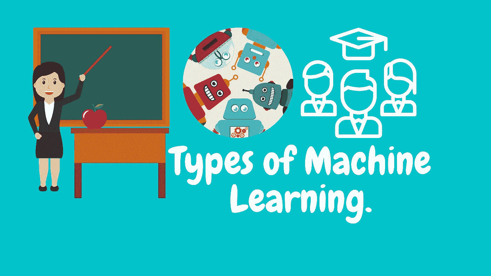
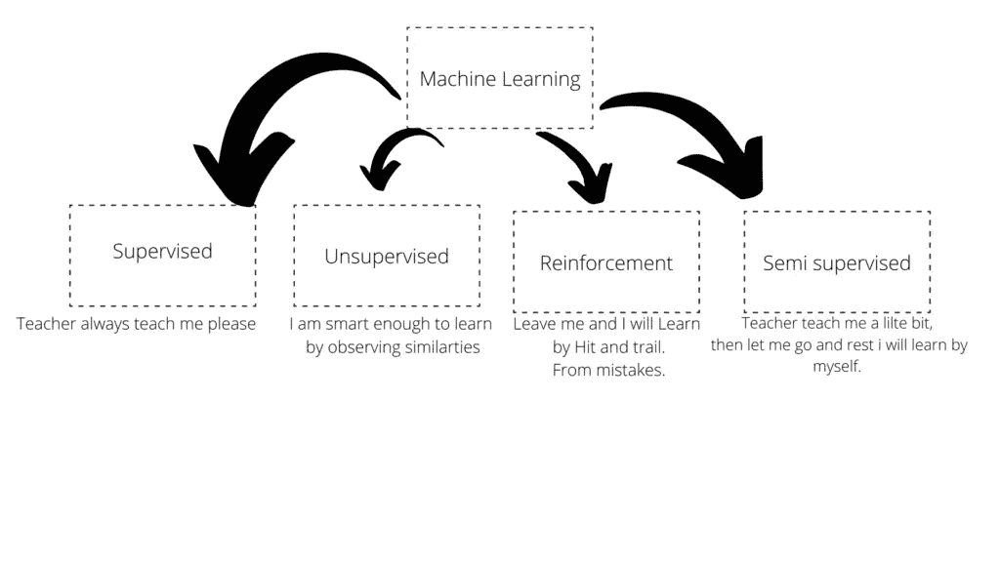
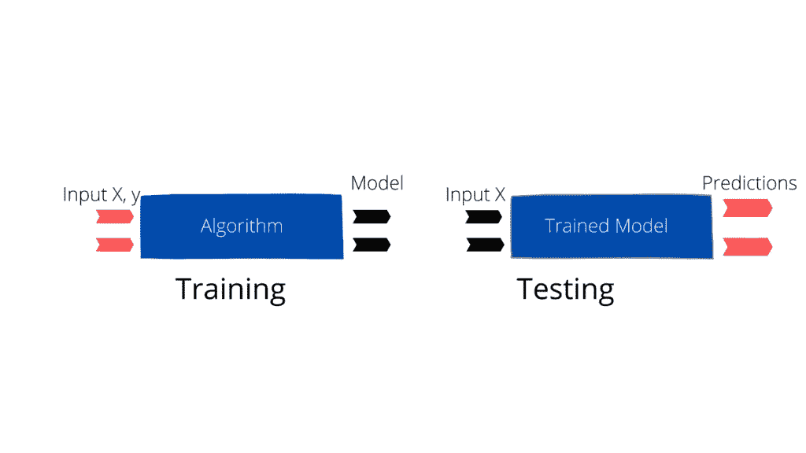
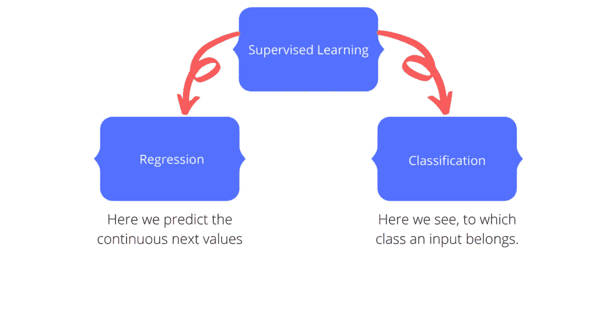
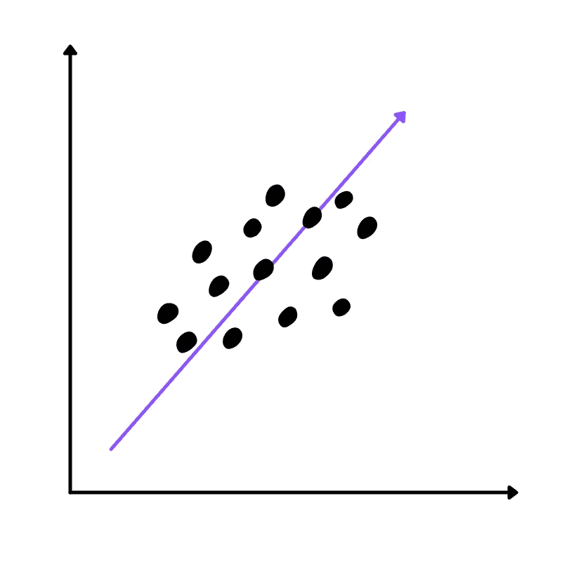
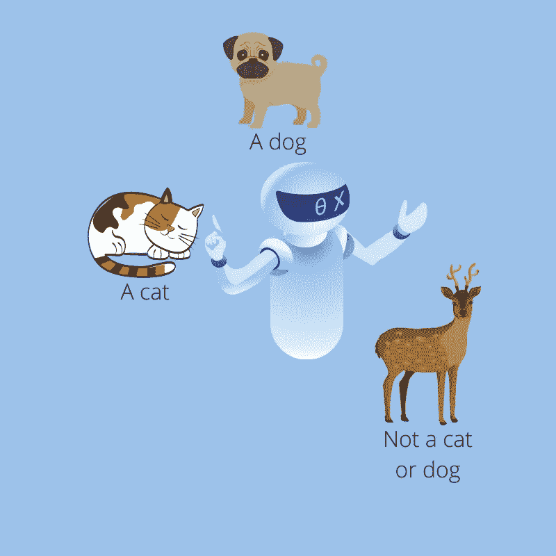
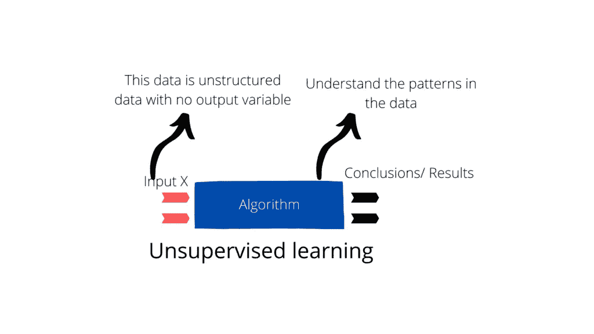
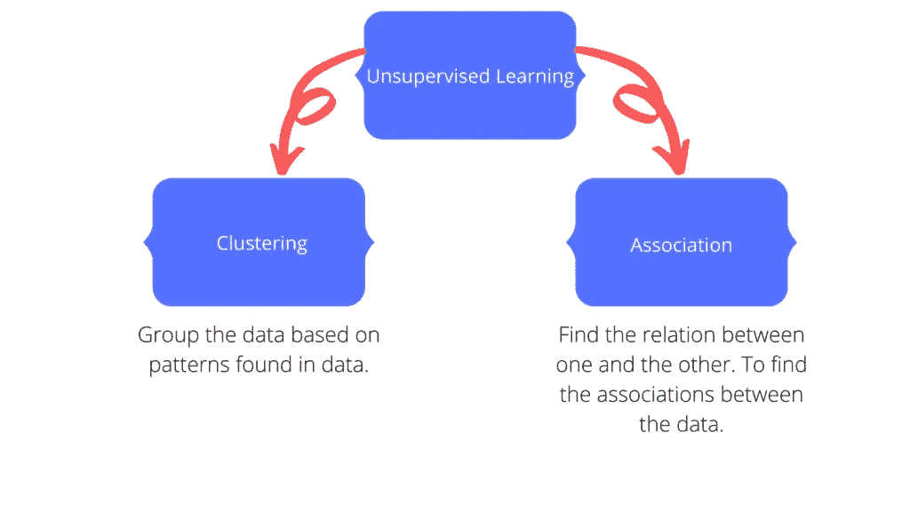
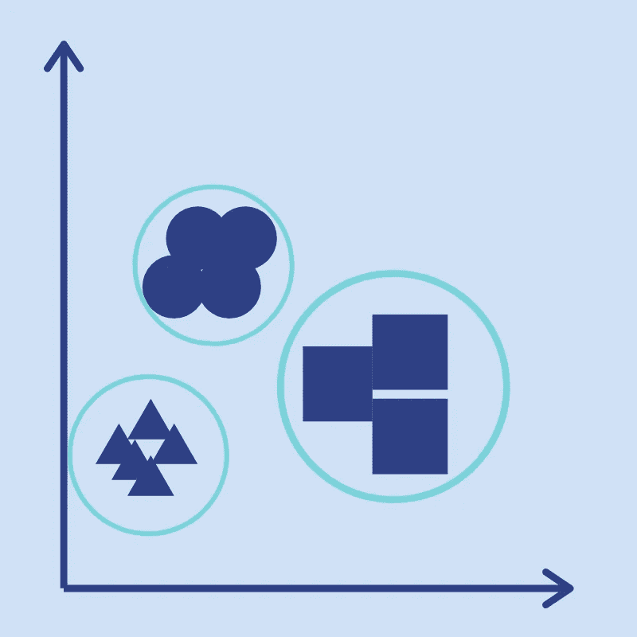
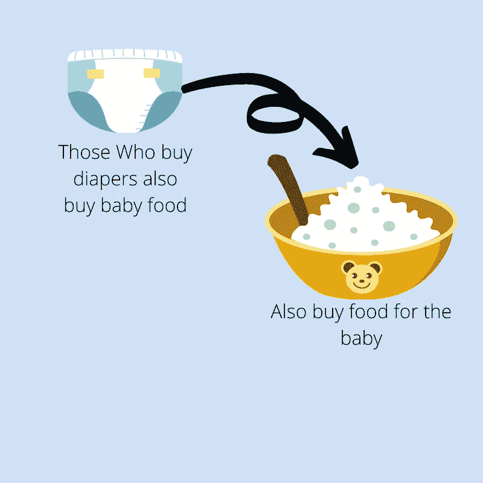

# 机器学习的类型|让我们来理解第 1 部分。

> 原文：<https://medium.com/analytics-vidhya/the-types-of-machine-learning-lets-understand-part-1-d70b4e3e63a?source=collection_archive---------17----------------------->

假设你想容易地理解机器学习及其算法，以及机器学习中的各种其他东西。但是你不可能从任何地方得到这些解释。你并不孤单；我自己就是新学习者之一，甚至今天还在学习。我也在努力提高这方面的知识。如果你只知道机器学习的定义，你就已经准备好了这些我们用来训练机器的学习策略。所以让我们来谈谈我们日常使用的机器学习的类型(像机器学习的学生，机器学习的工程师等等。)但是如果你不知道或者已经忘记了， [*看看我之前的帖子*](https://mlforlazy.in/all-you-need-to-know-about-getting-started-machine-learning/) 。

这将是一篇两篇文章。在第一部分中，我们将经历前两种类型，在下一部分中，我们将学习后两种类型。现在，既然我们都准备好了，那就让我们开始吧。

# 机器学习策略的类型。

机器学习有三种类型。最初有三种，但后来 type 在机器学习类型的行列中又增加了一种。因此，我们总共有 4 种机器学习策略。让我们看看这些是什么，然后逐一定义它们。我们将进入这些策略的简要深度，以了解它们的上层。当我们准备好深入学习它们的时候，我会公布这些策略中的每一个算法。当我们详细了解算法后，我们就可以实施它们了。让我知道你是否想要使用 Python 的实际实现。

让我们看看我们一直在谈论的不同类型的战略是什么。

从上图可以看出，机器学习有四种类型。这些内容如下:

1.  **监督学习。**
2.  **无监督学习。**
3.  **半监督学习。**
4.  **强化学习。**

# 1.监督机器学习(第一种机器学习)。

> *监督机器学习是基于示例输入-输出对将输入映射到输出的学习策略*
> 
> [*维基百科说。*](https://7r6.com/fXRqrSZ)

现在，让我们试着最彻底地理解这一点。你还记得给你一张试卷和一个答题脚本练习准备考试的情况。你必须练习，第二天来准备考试。这里也是如此。在我们的例子中，问题和答案分别是输入和输出。以同样的方式，监督学习包括为算法提供问题和答案以供学习。现在，另一个概念开始发挥作用。这个概念被称为“老师”当我们犯错时纠正我们的人。在机器学习的情况下，我们可以说有一个监督者。这位监督者在监督学习的全过程。当算法出错时，这个主管会纠正错误，或者至少向纠正靠拢。

简而言之，我们可以说监督学习就是这样的学习，其中学习算法被给定了答案(输出特征)和问题(输入特征)。算法学习映射，然后一旦模型学习了这个映射，就用它从未见过的数据对它进行测试。这个测试给了我们一个想法，算法已经学习了多少，可以处理新数据吗？。这个概念被称为泛化(我们将在以后的文章中讨论)。这种测试类似于我们出现在考试中，用备考时没见过的题目进行测试。

监督学习可以分为另外两种类型:

1.  回归。
2.  分类。

监督机器学习子类化

# 回归。

我将试着触及这些概念，我们将在以后详细讨论它们。

回归，简单来说，就是我们要预测一个连续值的时候，比如根据经验、年龄等来预测工资。在回归中，基本概念是拟合数据中的直线，使得点和直线之间所有差异的总和最小。这个线拟合概念和我们高中学过的是一样的。

# 分类。

在这些问题中，算法试图预测输入的类别。这是机器学习最常见的应用。这就像当显示一张猫或狗的照片时，说它是猫还是狗一样。将动物分类到它们的栖息地，将电子邮件分类为垃圾邮件和非垃圾邮件，等等。这里面还有很多例子。

# 2.无监督学习(第二种机器学习)。

无监督的不同于有监督的机器学习，因为我们没有结果或输出变量。给我们的数据没有标注，也就是说没有告诉我们哪一个是猫，哪一个是狗。在机器学习中，我们将未标记的数据提供给机器，它试图找到数据点之间的相似性，并以最简单的形式提供聚类。基于我们的算法发现的特征，这些聚类中的点是相似的。

如果说类比的话，这就像给一个孩子一堆玩具，告诉他把相似的玩具分成各自的组。

无监督学习还有 2 个子类型:

1.  聚类。
2.  协会。

# 聚类。

聚类是我们讨论过的。将相似的事物分组，或者用机器学习术语来说，将相似的数据分组。在下面的例子中，我们的算法学习圆、正方形和三角形之间的区别。从而形成一簇簇。

# 联合

关联意味着找到各种数据点之间的关系，并将它们彼此关联起来。商场、沃尔玛等。，使用这种技术。他们使用这种技术向不同的顾客推荐一起购买的东西。让我们举一个父母给婴儿买尿布的例子，已经看到买尿布的人也买婴儿食品。这种关系由关联算法学习，并基于这些关联向父母推荐产品。

# 结论

这就完成了文章的第 1 部分。为第二部分连接。如果你喜欢我的作品，把这个分享给你的机器学习朋友吧:)。