# 美国餐饮业:是什么让游客想在网上预订你的餐厅？

> 原文：<https://medium.com/analytics-vidhya/the-u-s-dining-industry-what-makes-visitors-want-to-book-your-restaurant-online-9e5a0ca59388?source=collection_archive---------24----------------------->

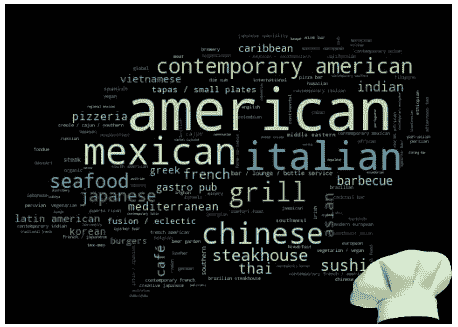

用字云制作的厨师帽

# 动机

自疫情爆发以来，情况发生了显著变化。取消旅游预订，如酒店、汽车租赁和飞机票。此外，似乎没有人愿意出去吃饭。这些企业正感受到边境关闭、强制留在家中的命令或拒绝在公共场所用餐的艰难。然而，自这一划时代事件开始以来，几乎一年过去了，我们知道疫苗接种需要时间来建立保护。因此，我们需要重组我们的业务，以鼓励购物者对与我们一起花费时间和金钱充满信心。

这篇文章将重点介绍餐饮业。我认识的人没有一个在这段时间去餐馆吃饭，所以我想知道餐馆老板在这段时间是如何生存的。有哪些餐厅还有一些顾客？哪些餐馆目前很忙？有客人的餐馆在哪里？这些餐馆是奢侈昂贵的还是便宜的？什么类型的食物仍然在人群中受欢迎？吃东西最好的地方在哪里？这些问题的答案可能有助于努力吸引更多顾客的餐馆老板。

# 数据收集

为了收集关于餐馆的信息，我使用 opentable 网站，这是领先的在线预订服务之一。它涵盖了全球 60，000 多家餐厅的信息。我使用了一种先进的网络抓取技术，我已经在这个博客中详细讨论过了。我获得了纽约、芝加哥、休斯顿、费城和凤凰城(美国人口最多的五个城市)的餐厅数据。应该注意的是，并非所有这些地区的餐厅都在该网站上列出，因此我们的研究主要局限于那些有列表的餐厅。然而，考虑到 Opentable 上的大量餐馆，我们很好地理解了是什么推动了这些城市的餐饮业增长。因此，我能够识别出所有这些城市中的近 23000 家餐馆。

对于每个餐馆，我收集了包含以下信息的数据点。

*N𝑎𝑚𝑒* :包含餐厅名称；

*预订*:客户一天的预订数量；

*R𝑎𝑡ing* :包含餐厅的总评分，满分 5 分；

*R𝑒𝑣𝑖𝑒𝑤s* :包含对餐馆业务的总体评价，如非常好、非常棒、优秀、非常好和良好；

*价格*:餐厅的价格范围；

*料理*:餐厅提供的食物种类；

*L𝑜𝑐𝑎𝑡𝑖𝑜𝑛* :包含餐厅所在的街区；

# 洁化过程

在进行任何分析之前，需要清理数据集。作为查找数据中是否有任何缺失值的过程的一部分，遵循几个重要步骤来处理缺失数据以识别并更正缺失数据和数据格式是很重要的。网站中美元符号的数量表明了网上销售的食品的价格范围。因为我抓取这些网站，在抓取阶段，我把它们转换成数字。这些数字背后的含义如下:

*   2→＄30 及以下
*   3 → $31 到$50
*   4 → $50 及以上

数据已在列评级中提取为“ *4.7，满分为 5 星*”。我们不需要短语“*满分 5 星*”，所以我已经删除了这一栏。由于 name、review、cuisine 和 location 列有文本值，所以我删除了不必要的字符，比如空格，并确保在处理之前所有的字母都是小写的。此外，一些数据类型需要转换成适当的格式。

# 数据分析

我首先发现人们愿意为在线餐厅预订服务和餐食配送成本支付多少钱。

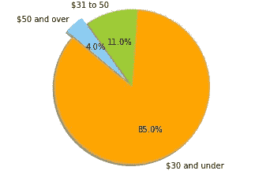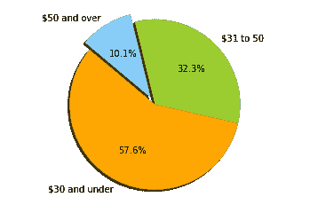

**Opentable 网站上的菜品价格与预订价格的差异**

虽然大多数菜单价格在 30 美元或以下(85%)，但只有一半多一点的餐馆(58%)预订的菜单价格在 30 美元或以下。中档餐馆比高档餐馆表现更好。

现在，我们将检查点评对预订数量的影响。从图表中我们可以看到，那些被标记为更具激励性的评论会产生更多的预订。因此，餐馆老板需要说服他们的客户在预订后留下积极的评价，因为这有助于将网站访问者转化为客户。

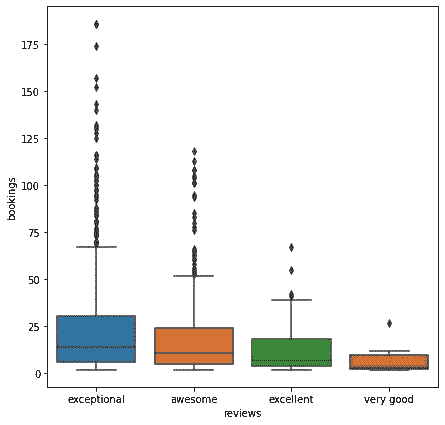

评论对预订的影响

让我们看看除了点评和这些餐厅的食物价格之外，菜单上还有什么。你会注意到在下图中，有一些大城市被突出显示出来，这些城市看起来对美食家来说非常棒，人们可以在这些城市轻松满足他们的渴望。他们的菜单上有 170 多种不同文化的食物，包括美式、意大利式、韩式、地中海式等等。下图说明了 15 种最受欢迎的食物类型。意大利、美国和牛排馆组成了前三名。

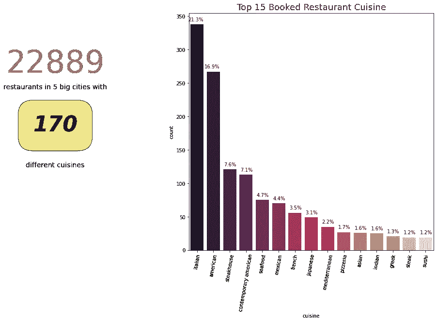

**20 大热门美食**

现在大家都知道意大利和美国食物有多受欢迎。让我们看看哪些餐厅提供这种食物，并以实惠的价格范围和出色的评论获得顶级评级(75%以上)。以下是排名前五的餐厅，按预订数量排序。

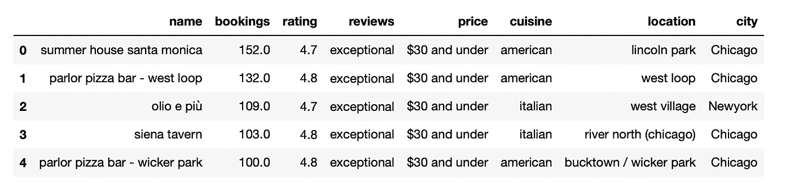

你是不是和我一样好奇，想知道哪些昂贵的餐厅评论最高，质量排名最好？

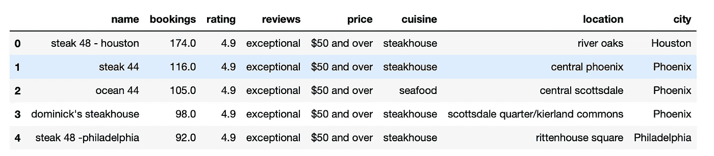

在一个有很多餐厅的地方，从众多的餐厅中进行选择是很容易的。根据地理位置的不同，你可以在一个地方找到来自世界各地的不同美食。这些信息也可以从我收集的数据中获得。排名前 20 的地区是根据餐馆的数量排列的，芝加哥最多，然后是休斯顿，接下来是费城。

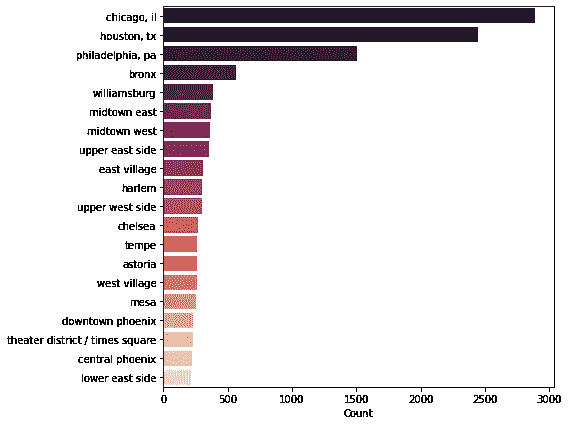

**餐馆高度集中的地点**

这张图表显示了拥有最多餐馆的社区，但是人们仍然在那里用餐和接受最多的预订。下图说明了它们。

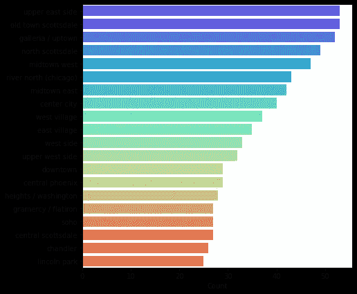

**营业额最高的地点**

为了能够在地图上看到位置，我们可以将它们转换成地理坐标。我画了一张芝加哥餐馆的热图。

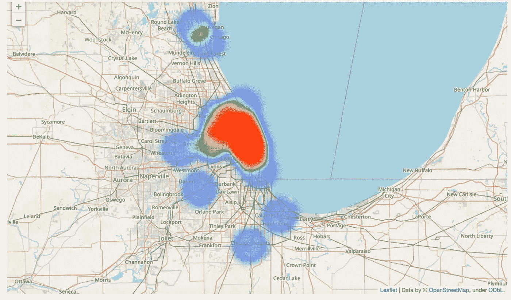

**芝加哥地区的餐馆**

最后，我列出了这些城市的平均餐饮成本，以及这些城市的餐馆总数。除了纽约，其他地方的价格都一样，纽约的排名最差。休斯顿的餐馆不仅价格实惠，而且服务一流。

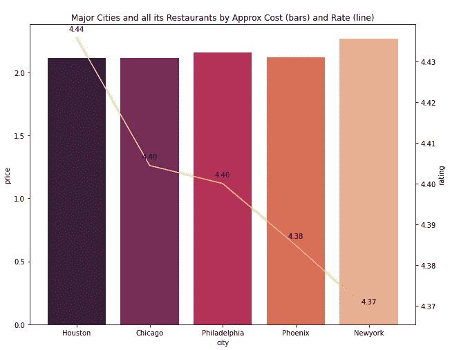

以下是我对餐馆在线业务的简单看法。我们从实验中了解到，评级、评论和价格会影响预订行为。我列举了一些提供各种菜肴的成功餐厅的例子。此外，还对不同城市进行了比较。

希望让自己的餐馆成功的个人可以找到选择合适的菜肴的想法，并了解附近的人口统计。此外，这些发现/观察表明，可能还有其他因素，这些因素有待探索，决定了餐馆的成功。