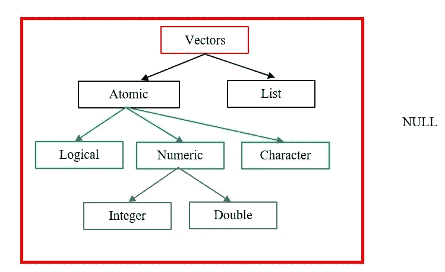

# R 语言中数据类型的最终初学者指南

> 原文：<https://medium.com/analytics-vidhya/the-ultimate-beginners-guide-to-data-types-in-r-ac4358985150?source=collection_archive---------3----------------------->

# **简介**

r 是一个统计计算和图形系统。它提供了编程语言、高级图形、到其他语言的接口和调试工具。如果你仔细阅读各种数据科学家工作的职位描述，你会注意到 R 正成为越来越需要的技能。r 提供了广泛的统计和图形技术，例如时间序列分析、分类、聚类和建模等等。**在本文中，我将讨论 R 中最基本的概念:数据类型**。


数据科学家的工作描述强调作者 R | Image 的重要性

**数据类型**

R 中有 6 种数据类型:

1.  [**矢量**](#abc9)
2.  [**列出了**](#3e1f)
3.  [**矩阵**](#a533)
4.  [**阵列**](#f5c3)
5.  [**因素**](#3339)
6.  [**数据帧**](#efbb)

我们将逐一解决它们。

**矢量**

向量又进一步分为两类:原子向量和列表。



矢量|作者图片

原子向量和列表之间的主要区别在于后者可以是异构的，即列表可以包含不同的数据类型。而原子向量必须是同质的。

**空 v/s NA v/s NaN**


作者图片

**向量的性质**

每个向量都有类型和长度。

```
typeof(4)[1] “integer”typeof(“name”)[1] “character”
```

如果您无法确定向量的数据类型，您可以使用:

```
·       is.logical()·       is.numeric()·       is.double()·       is.character()·       is.integer()·       is.list()
```

**胁迫**

您也可以使用以下方法将一种向量类型转换为另一种向量类型:

```
·       as.logical()·       as.numeric()·       as.double()·       as.character()·       as.integer()·       as.list()
```

**原子向量的类型**

我们现在详细讨论逻辑、数字和字符向量。

**1。** **逻辑向量:**这是最简单的向量类型，因为它们只包含三个值 TRUE、FALSE 和 NA。

```
5==10[1] FALSE
```

**2。** **数值向量:**它包含整数和双精度向量。默认情况下，数字是双精度的。要将 double 转换为整数，请在数字后放置一个`L`。

```
typeof(6849867)[1] “double”typeof(7L)[1] “integer”
```

需要注意的是，doubles 是近似值，因此不精确。考虑下面的例子:

```
x<-sqrt(3)^ 16x[1] 6561
```

但是，sqrt(3) ^ 16 的实际值是 6560.9999999999。整数和 doubles 的另一个区别是，整数只有一个特殊值:NA。然而，doubles 有四个特殊值:NA，NaN，Inf，-Inf

```
c(-1,0,1)/0[1] -Inf NaN Inf
```

要检查特殊值，使用`is.finite()`、`is.infinite()`、`is.nan()`

**3。** **字符向量:**字符向量是原子向量中最复杂的一种。字符向量的每个元素都是一个字符串，一个字符串可以包含任意数量的数据。

```
b<-c(“Barbara”,5,0,”George”)typeof(b)[1] “character”
```

下表简要概述了三种原子向量之间的差异。


作者图片

**向量回收:**当你在添加两个不同长度的向量时会发生什么？

```
a<-c(5,10)b<-c(0,-6,2,7,23)a+b[1] 5 4 7 17 28
```

`a`和`b`被相加，但是如果你仔细观察产生的向量，你会注意到`a`被重复以获得总和。这意味着长度较短的向量`a`被*回收*。这个过程被称为矢量回收。应该避免矢量回收，因为它会破坏生成的矢量。

**列表**

列表也被称为**递归向量**。列表是包含不同类型元素的对象，比如数字、字符串和向量。适合表示树状结构。**列表也可以包含其他列表**。例如:

```
a<-list(4,”name”,Inf,-8,NA)a[[1]][1] 4[[2]][1] “name”[[3]][1] Inf[[4]][1] -8[[5]][1] NA
```

`str()`在处理列表时非常有用，因为它提到了列表中每个元素的结构。

```
str(a)List of 5$ : num 4$ : chr “name”$ : num Inf$ : num -8$ : logi NA
```

**列表可视化:**列表是复杂的对象。让我们考虑下面的例子，想象一下，以便清楚地理解列表是如何工作的。

```
p <- list(c(10, 20), c(30, 40))q <- list(list(10, 20), list(30, 40))r <- list(10, list(20, list(30)))
```


作者图片

**列表子集化:** [ ]提取列表的一部分，该部分将永远是列表。假设`x`是包含多个其他列表的列表:

```
x<-list(5,”apple”,list(c(3,10)),list(“orange”),8)x[[1]][1] 5[[2]][1] “apple”[[3]][[3]][[1]][1] 3 10[[4]][[4]][[1]][1] “orange”[[5]][1] 8
```

我们来提取`x`的第 4 个元素。

```
x[4][[1]][[1]][[1]][1] “orange”
```

**[ ] v/s [[ ]]:** 这两个符号**很容易混淆。** `[[` 从列表中提取单个组件，并从列表中删除一个层级。例如:


作者图片

**矩阵**

矩阵是 R 对象，其中的元素以二维矩形布局排列。矩阵可以保存数字、字符或逻辑值。矩阵中的**元素都具有相同的数据类型**。**矩阵是一个二维数组**。它还包含维度属性。可使用`attributes()`功能检查对象的所有属性。

在 R 中创建矩阵的基本语法是

```
matrix(data, nrow, ncol, byrow, dimnames)
```

哪里

`data` =成为矩阵数据元素的输入向量。

`nrow` =要创建的行数。

`ncol`=要创建的列数。

`byrow` =一条逻辑线索。如果为真，则输入向量元素按行排列。

`dimname` =分配给行和列的名称。

例如:

```
matrix(1:10,nrow=5,ncol=5,dimnames=list(c(‘A’,’B’,’C’,’D’,’E’),c(‘w’,’e’,’r’,’t’,’y’)))w e r t yA 1 6 1 6 1B 2 7 2 7 2C 3 8 3 8 3D 4 9 4 9 4E 5 10 5 10 5
```

也可以通过以下方法添加行名和列名:

```
x<-matrix(1:12,nrow=2,ncol=3,byrow=FALSE)rownames(x)<-c(“A”,”B”)colnames(x)<-c(“x1”,”x2",”x3")xx1 x2 x3A 1 3 5B 2 4 6
```

**特殊矩阵**

1.**所有行和列都由一个常数“k”填充的矩阵:**

```
matrix(3,nrow=3,ncol=4)[,1] [,2] [,3] [,4][1,] 3 3 3 3[2,] 3 3 3 3[3,] 3 3 3 3
```

2.**对角矩阵:**它是主对角线以外的元素为零的矩阵。

```
diag(13,nrow=3,ncol=3)[,1] [,2] [,3][1,] 13 0 0[2,] 0 13 0[3,] 0 0 13
```

3.**单位矩阵**

它是一个主对角线的所有元素都是 1，其他元素都是 0 的矩阵。

```
diag(1,nrow=3,ncol=3)[,1] [,2] [,3][1,] 1 0 0[2,] 0 1 0[3,] 0 0 1
```

**访问矩阵元素**

考虑矩阵“m”

```
m<-matrix(1:15,nrow=5,ncol=3,byrow=TRUE)m[,1] [,2] [,3][1,] 1 2 3[2,] 4 5 6[3,] 7 8 9[4,] 10 11 12[5,] 13 14 15
```

我可以访问第二行第三列的 6，比如:

```
m[2,3][1] 6
```

这是如何发生的:


作者图片

“2”和“3”分别是要选择的行和列的索引。因此，位于第 2 行和第 3 列交叉处的元素，即 6，被自动选择并打印在输出中。

如果我将所需的列索引留空会发生什么？

```
m[2,][1] 4 5 6
```


作者图片

整个第二行被选中。

类似地，如果我只想从`m`中选择一个特定的列，我将行索引留空。例如，让我们选择第三列`m`。

```
m[ ,3]
[1]  3  6  9 12 15
```

我也可以通过 ***切片*** *选择矩阵的某一部分或多行/列。*Python 和 R 中的切片是不同的。由于这是一个初学者指南，您可以将切片视为使用方括号`[ ]`来提取元素或矩阵的特定部分或 r 中的数据帧。我们将在本文的最后一部分讨论数据帧*。*

`m[1:3,2:3]`产生第 1、2、3 行和第 2、3 列的数据-

```
[,1] [,2][1,] 2 3[2,] 5 6[3,] 8 9
```

*工作过程:*


作者图片

**矩阵串联**

它由 **rbind** ()和 **cbind** ()组成

`rbind()`:用于将行追加到矩阵中。

```
x<-c(3,0,-23,5,7)y<-c(199,4,0,-2,5)rbind(x,y)[,1] [,2] [,3] [,4] [,5]x 3 0 -23 5 7y 199 4 0 -2 5
```

`cbind()`:用于将列追加到矩阵中。

```
x<-c(3,0,-23,5,7)y<-c(199,4,0,-2,5)cbind(x,y)x y[1,] 3 199[2,] 0 4[3,] -23 0[4,] 5 -2[5,] 7 5
```

**数组**

数组是 R 数据对象，可以在两个以上的维度上存储数据。到目前为止，我们知道**矩阵是二维数组，**由固定数量的行和列组成。**数组由相同数据类型的所有元素组成**。

数组的基本语法是-

```
array(data, dim = (nrow, ncol, nmat), dimnames=names)
```

其中所有的参数都有它们通常的含义，如上所述。

比如说-

```
array(1:30,dim=c(2,3,4),dimnames=list(c(“A”,”B”),c(“p”,”q”,”r”),c(“Tulip”,”Lily”,”Jasmine”,”Rose”))), , Tulipp q rA 1 3 5B 2 4 6, , Lilyp q rA 7 9 11B 8 10 12, , Jasminep q rA 13 15 17B 14 16 18, , Rosep q rA 19 21 23B 20 22 24
```

**功能**

**1。** **敷()**

`apply()`的语法是-

```
apply(x,margin,function)
```

让我们考虑一个数组“a”。

```
a<-array(1:10,dim=c(3,3,2)), , 1[,1] [,2] [,3][1,] 1 4 7[2,] 2 5 8[3,] 3 6 9, , 2[,1] [,2] [,3][1,] 10 3 6[2,] 1 4 7[3,] 2 5 8
```

我们将使用`apply()`来查找数组“a”的元素的行方向和:

```
apply(a,c(1),sum)[1] 31 27 33
```

`c(1)` for margin 用于按行对数组‘a’的元素求和，得到上面的输出。这里，31 是数组中两个矩阵的索引为 1 的行的总和。27 是两个矩阵中索引为 2 的行的和，33 是两个矩阵中索引为 3 的行的和。类似地，`c(2)` for margin 可用于获取数组“a”中元素的列方向和。`c(1,2)`行和列都适用。

让我们仔细看看 apply()的*工作流程:*


作者图片

**1。** **在数组中追加值**

**c(向量，值)**

此函数允许您将值追加到数组的末尾。也可以将多个值相加。

添加单个元素:

```
c(c(2,5),6)[1] 2 5 6
```

添加多个元素:

```
(c(2,5),1:10)[1] 2 5 1 2 3 4 5 6 7 8 9 10
```

**追加(向量，值)**

该函数允许将值附加到向量中的任何位置。

默认情况下，该函数在末尾添加元素。

```
append(c(2,5),7)[1] 2 5 7
```

**追加(vector，values，after=length(vector))**

此函数在数组的指定索引后添加新值。要在其后添加新元素的索引在函数的最后一个参数中指定。

```
p<-c(1,0,-4,2,38)append(p,1000,after=3)[1] 1 0 -4 1000 2 38
```

**因素**

因子用于表示分类数据，并将其存储为级别。因子可以存储字符串和整数。它们在非重复值数量有限的列中很有用。当您想以非字母顺序显示字符向量时，它们也很有用。因子可以是有序的，也可以是无序的。

考虑记录月份的变量 x2:

```
x2<-c(“January”,”February”,”March”)
```

*使用字符串时出现的问题*

如果我们对 x2 排序-

```
sort(x2)[1] “February” “January” “March”
```

我们没有把月份按时间顺序排序。

*解决方案*

我们可以使用一个因子来解决上述两个问题。创建因子的第一步是制作*关卡。*

```
x2<-c(“January”,”February”,”March”)month_levels <- c(“January”, “February”, “March”, “April”, “May”, “June”,“July”, “August”, “September”, “October”, “November”, “December”)
```

现在我们将 x2 存储为一个因子。

```
x2<-factor(x2,levels=month_levels)x2[1] January February March12 Levels: January February March April May … December
```

现在让我们再次对 x2 排序-

```
sort(x2)[1] January February March12 Levels: January February March April May … December
```

该程序现在按时间顺序对月份进行排序。让我们看一个更简单的例子，比如颜色。

```
colours<-factor(c(“Yellow”,”Red”,”Red”,”Red”,”Yellow”,”Blue”))levels(colours)[1] “Blue” “Red” “Yellow”
```

因子函数自动检测“红色”重复多次，并将其归类为其中一个级别。

我们还可以通过使用`gl()`函数来生成因子等级。它的语法如下-

```
gl(n, k, labels)
```

哪里-

`n` =给出级数的整数。

`k` =给出复制次数的整数。

`labels` =结果因子等级的标签向量。

让我们用`gl()`来编码高度

```
heights<-gl(3,4,labels=c(“short”,”medium”,”tall”))heights[1] short short short short medium medium medium[8] medium tall tall tall tall
```

我们可以用`nlevels()`来统计级数。

```
nlevels(colours)[1] 3
```

如果我们的关卡有秩序呢？例如，低

```
food <- factor(food, levels = c(“low”, “medium”, “high”), ordered = TRUE)levels(food)[1] “low” “medium” “high”
```

Since the levels are ordered, there must be a minimum level. Let’s check it out-

```
min(food)[1] lowLevels: low < medium < high
```

**数据帧**

**数据框也是列表，但它们有一些限制**:

*   你*可以*但是你**不应该**对两个不同的变量使用同一个名字。
*   数据帧的所有元素都是矢量。
*   数据帧的所有元素长度相等。

数据帧**中可以有不同类型的数据类型**。存储在数据框中的数据可以是数字、因子或字符类型。每列应包含相同数量的数据项。

让我们创建一个数据框。

```
emp<-data.frame(id=1:5,names=c(“A”,”B”,”C”,”D”,”E”),salary=c(150,200,90,84,114))empid names salary1 1 A 1502 2 B 2003 3 C 904 4 D 845 5 E 114
```

**数据帧功能**

**1。** **str()**

使用`str()`功能可以获得数据帧的结构。

```
str(emp)‘data.frame’: 5 obs. of 3 variables:$ id : int 1 2 3 4 5$ names : chr “A” “B” “C” “D” …$ salary: num 150 200 90 84 114
```

**2。**从数据帧中提取数据类似于从矩阵中访问元素，方法(如**切片**)已在以上章节中讨论。使用`rbind()`和`cbind()`功能可以扩展数据帧。

然而，我们也可以使用`subset()`函数来获取数据帧的特定部分。

数据框子集的语法是-

```
df1 = subset(df, conditions)
```

哪里-

`df` =原始数据帧
`conditions` =特定条件

例如，如果我想提取收入为 150 或 90 单位的雇员的数据，那么我输入以下命令-

```
emp1<-subset(emp,salary==150 | salary==90)emp1id names salary1 1 A 1503 3 C 90
```

并获得期望的输出。

**3。** **总结()**

`summary()`可以用来获得一个数据帧的统计摘要。

```
summary(emp)id names salaryMin. :1 Length:5 Min. : 84.01st Qu.:2 Class :character 1st Qu.: 90.0Median :3 Mode :character Median :114.0Mean :3 Mean :127.63rd Qu.:4 3rd Qu.:150.0Max. :5 Max. :200.0
```

**结论**

本文涵盖了学习 R 最重要的部分:数据类型。前述数据类型还有**无数的其他功能和能力。我希望**你现在已经熟悉**并且清楚**R 编程的一些最重要的概念**。**