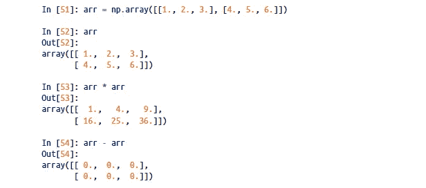
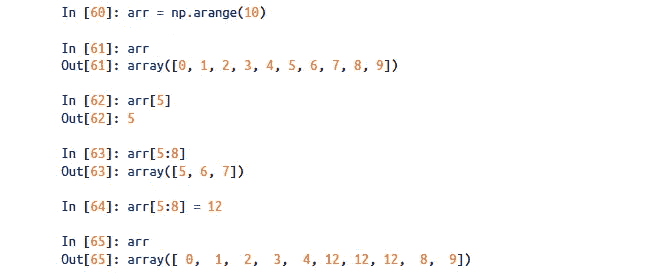
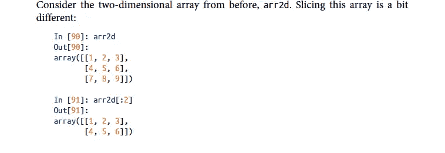
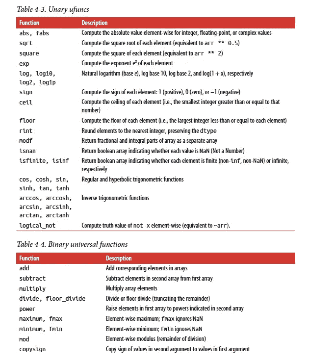
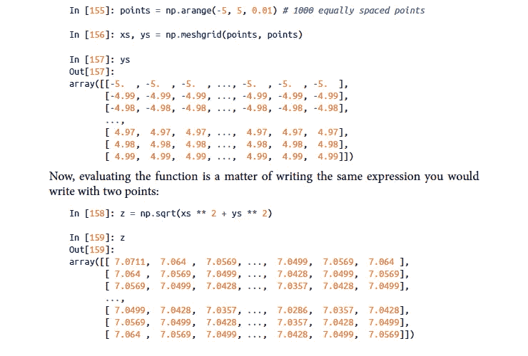
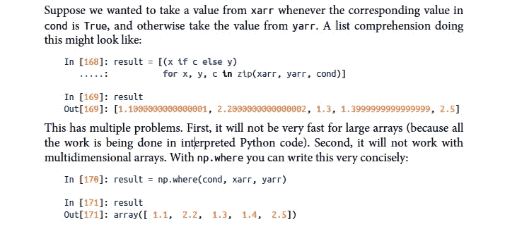
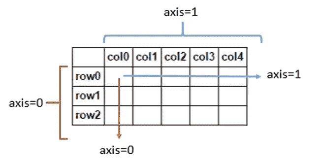
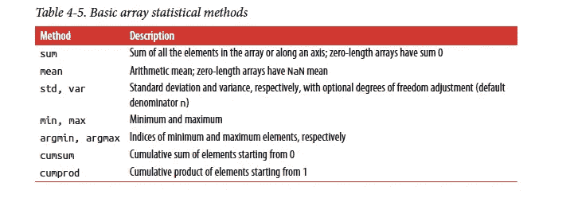
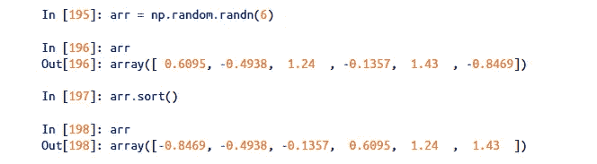
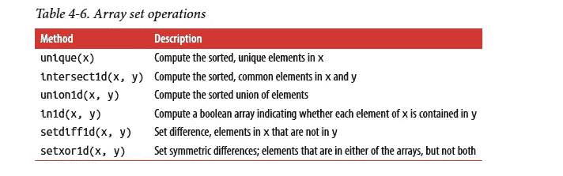

# Python 中 NumPy 的最终初学者指南

> 原文：<https://medium.com/analytics-vidhya/the-ultimate-beginners-guide-to-numpy-664c0ef806c5?source=collection_archive---------12----------------------->

## 带有大量示例的 NumPy 基础知识


在 [Unsplash](https://unsplash.com?utm_source=medium&utm_medium=referral) 上由 [Boitumelo Phetla](https://unsplash.com/@writecodenow?utm_source=medium&utm_medium=referral) 拍摄的照片

**注意:**大多数用来解释 NumPy 概念的例子都来自 Wes McKinney 的 **Python，用于数据分析。**

让我们开始吧。

一个**n array**是一个用于同构数据的通用多维容器；也就是说，所有的元素必须是相同的类型。

每个数组都有一个形状、一个指示每个维度大小的元组和一个描述数组数据类型的对象 dtype:

```
# randn returns elements from a standard normal distributiondata = np.random.randn(2,3)
data
```

**输出:**

```
array([[-1.00945873, -0.14747028,  1.04654565],
       [-0.69762101,  0.35370184, -0.08946465]])
```

要检查我们使用的每个元素的类型:

```
type(data.dtype)
```

**输出:**

```
numpy.dtype[float64]
```

## 1.数字算术

数组很重要，因为它们使您能够在不编写任何 for 循环的情况下对数据进行批处理操作。NumPy 用户称之为矢量化。大小相等的数组之间的任何算术运算都按元素应用运算:



NumPy 的基本算术运算(截图来自上面提到的那本书)

```
# arithmetic operations with a scalar will be applied to each and every elementmy_arr1 = my_arr * 2
print(my_arr1)
```

**输出:**

```
[[ 2  4  6]
 [ 8 10 12]]
```

## 2.基本索引和切片

NumPy 数组索引是一个内容丰富的主题，因为有许多方法可以选择数据子集或单个元素。

在一维数组中，我们可以简单地使用 **start:end** 对其进行索引，其中包含开始索引元素，但不包含结束索引元素。



一维 numpy 数组中的索引

我们还将 5:8 更新为 12。然后我们可以看到，更新切片值也更新了原始数组。

要更新数组中的所有值，我们可以使用 **arr[:] = 12。**从第 1 个索引到 its (length-1)，将整个数组更新为 12。

对于二维数组，每个索引处的元素不是标量，而是一维数组。

在更高维度下也是如此。在多维数组中，如果忽略后面的索引，返回的对象将是一个低维的 ndarray，由所有高维数据组成。

```
arr2d = np.array([[1, 2, 3], [4, 5, 6], [7, 8, 9]])
arr2d[2]Output: array([7, 8, 9])
```

因此，可以递归地访问单个元素。但是这有点太麻烦了，所以您可以传递一个逗号分隔的索引列表来选择单个元素。

所以这些是等价的:

```
arr2d[0][2]
Output: 3arr2d[0, 2]
Output: 3
```

我们甚至可以用切片做**索引。让我们用一个例子来理解一下。**

这里，它将选取位置 0 和 1 处的一维数组元素，位置分别为[1，2，3]和[4，5，6]。



带切片的索引

我们甚至可以将行和列元素分割在一起，如下所示:

```
arr2d[:2, 1:]Output: array([[2, 3],
        [5, 6]])
```

## 3.通用函数

通用函数或 UFuncs 在我们的 n 数组上执行元素操作。我们有一元或二元函数。

```
my_arr = np.arange(20)
my_arr = my_arr.reshape((5,4))
my_arr
```

**输出:**

```
array([[ 0,  1,  2,  3],
       [ 4,  5,  6,  7],
       [ 8,  9, 10, 11],
       [12, 13, 14, 15],
       [16, 17, 18, 19]])
```

在应用像 **np.sqrt(my_arr)** 这样的一元函数时，我们得到:

```
array([[0\.        , 1\.        , 1.41421356, 1.73205081],
       [2\.        , 2.23606798, 2.44948974, 2.64575131],
       [2.82842712, 3\.        , 3.16227766, 3.31662479],
       [3.46410162, 3.60555128, 3.74165739, 3.87298335],
       [4\.        , 4.12310563, 4.24264069, 4.35889894]])
```

我们还有二进制 ufuncs，它接受两个数组作为输入:

```
x = np.random.randn(10)
y = np.random.randn(10)
print(x)
print("\n")
print(y)
```

**输出:**

```
[ 0.4803378   1.43452441  0.56222455  0.4097964  -0.28604575  0.83715151
  0.02814258  0.51104714 -0.21852359  1.57191921]

[-0.87110468  0.31741718 -0.64925443 -0.76802201  0.30300398  2.43681536
  0.4366532   0.42144164 -1.49904037 -0.08998904]
```

在应用类似 **np.maximum(x，y)** 的二进制 ufunc 时，它将比较 x 和 y 数组的所有元素，并返回最大元素:

```
array([ 0.4803378 ,  1.43452441,  0.56222455,  0.4097964 ,  0.30300398,
       2.43681536,  0.4366532 ,  0.51104714, -0.21852359,  1.57191921])
```

NumPy 提供了一长串通用功能，让我们的生活更加轻松。挑选并尝试其中的一些。



一长串通用函数(截图来自上面提到的那本书)

## 4.数组运算

与使用 python 循环或列表理解相比，使用 NumPy 数组来执行面向数组的操作是非常强大的。

我们可以用几行代码**在值**的规则网格上执行 **sqrt(x + y)的复杂计算。**



对值的规则网格进行复杂的计算**sqrt(x+y)**

使用 NumPy 数组甚至可以轻松地执行基于某些条件逻辑的操作。

```
xarr = np.array([1.1, 1.2, 1.3, 1.4, 1.5])yarr = np.array([2.1, 2.2, 2.3, 2.4, 2.5])cond = np.array([True, False, True, True, False])
```



将条件逻辑表示为数组运算

我用一百万个数据点进行了测试，惊讶地发现 NumPy 数组操作的执行速度比 python 列表理解快 100 倍左右。

我们甚至可以用 ndarrays 执行**统计操作**。

```
my_arr = np.random.randn(4,4)
my_arr
```

**输出:**

```
array([[ 0.6052009 ,  0.11951734, -0.80470578, -2.54784742],
       [ 0.5399688 ,  1.66262227,  0.81955271, -0.55774819],
       [ 0.41959478,  0.2194956 , -1.81219585,  0.85218674],
       [ 1.6213405 ,  0.0761287 , -0.32877757,  1.07090786]])
```

在尝试求和、均值、标准差等之前。这里我们需要理解轴的概念



解释 ndarrays 中轴概念的图片

(我的安排): 1 . 58686 . 38686868667

**np.mean(my_arr，axis=1)** :数组([-0.65695874，0.6160989，-0.08022968，0.60989987])

我们还有孜然、孜然等。计算拉伸数组或沿轴的累积和或积的操作。

```
arr = np.arange(1,15, 2)
arr
```

**输出:**数组([ 1，3，5，7，9，11，13])

```
np.cumsum(arr)
```

**输出:**数组([ 1，4，9，16，25，36，49])

从下表中挑选并尝试其中几款。



数字阵列中的基本统计方法

## **5。排序**

NumPy 数组可以用 sort 方法就地排序。



numpy 数组中的排序

现在，当在高维 NumPy 数组中排序时，我们甚至可以提到我们需要排序的轴。

```
arr = np.random.randn(5, 3)
arr
```

**输出:**

```
array([[ 0.1357564 , -1.21689356, -0.03179582],
       [-0.018589  ,  0.76169735, -0.09404734],
       [-0.27728709, -0.27615453, -0.80852859],
       [ 0.08735213,  0.37884326,  2.23298412],
       [-2.33812985, -1.53835618, -0.92607446]])
```

应用 **arr.sort(axis=1)** 后，我们得到:

沿轴 1 排序的输出:

```
array([[-1.21689356, -0.03179582,  0.1357564 ],
       [-0.09404734, -0.018589  ,  0.76169735],
       [-0.80852859, -0.27728709, -0.27615453],
       [ 0.08735213,  0.37884326,  2.23298412],
       [-2.33812985, -1.53835618, -0.92607446]])
```

我们甚至有一个**类型的**参数给我们的**排序方法**，它可以从{'quicksort '，' mergesort '，' heapsort '，' stable'}中取任何值。**默认为“快速排序”。**

## 6.集合操作

NumPy 对一维 ndarrays 有一些基本的 set 操作。一个常用的是 **np.unique** ，它返回数组中排序后的唯一值

```
names = np.array(['Bob', 'Joe', 'Will', 'Bob', 'Will', 'Joe', 'Joe'])
names
```

**输出:**

```
array(['Bob', 'Joe', 'Will', 'Bob', 'Will', 'Joe', 'Joe'], dtype='<U4')
```

在应用 **np.unique(names)** 时我们得到:

```
array(['Bob', 'Joe', 'Will'], dtype='<U4')
```

类似地，我们可以应用 **union1d** ，它将计算元素的排序并集:

```
np.union1d(names, ["Hie"])
```

**输出:**

```
array(['Bob', 'Hie', 'Joe', 'Will'], dtype='<U4')
```

我还是会说同样的话。从下表中挑选并尝试其中几款。



数组操作集列表

**注意:** NumPy 能够使用 *load、save、savez 等以文本或二进制格式将数据保存到磁盘或从磁盘加载数据。*方法。但是我们不会在这里讨论它，因为熊猫或其他工具比这个更受欢迎。

我故意省略了一些高级概念，因为这篇文章是初学者指南。我将在另一篇文章中讨论它们。

如果你在评论中遇到任何困难，请告诉我。