# 混合数据聚类的最终指南

> 原文：<https://medium.com/analytics-vidhya/the-ultimate-guide-for-clustering-mixed-data-1eefa0b4743b?source=collection_archive---------0----------------------->

[滕玉红](https://unsplash.com/@live_for_photo?utm_source=medium&utm_medium=referral)在 [Unsplash](https://unsplash.com?utm_source=medium&utm_medium=referral) 上的照片

聚类是一种无监督的机器学习技术，用于将未标记的数据分组到聚类中。这些聚类被构造成包含彼此“相似”的数据点，以及与分配给其他聚类的数据点“不相似”的数据点。每个聚类算法都是通过使用某种“相似性”度量将数据点组织成簇来工作的。对于基于数字的数据，这种相似性度量通常使用欧几里得距离来计算，而 Jaccard 距离用于分类数据。

不幸的是，大多数聚类算法只能处理只包含数字或分类特征的数据。这是一个巨大的问题，因为大多数真实世界的数据集将包含多种类型的要素。本文提供了不同方法的 pythonic 实现，这些方法可用于混合数据的基于距离的聚类。本文的工作流程受到了 M Van de Velden 的一篇名为“*基于距离的混合数据聚类*”的论文的启发。李宏，在这里可以找到**。这些方法如下:**

1.  **高尔距离。**
2.  **降维技术。**
3.  **重新编码分类变量。**
4.  **重新编码连续变量。**
5.  **k 原型。**

**“用于创建本文的所有代码可以在[***GitHub***](https://github.com/Ekeany/Clustering-Mixed-Data/tree/main/Notebooks)*中找到”***

# ***数据集***

***以下所有方法都应用于三个开源数据集。这些数据集因其包含的数值和分类变量的比例而异。这种变化为所有基于距离的聚类方法提供了更严格的评估过程。***

***来自 UCI 机器学习资料库的 [**克里夫兰心脏病**](https://github.com/Ekeany/Clustering-Mixed-Data/blob/main/data/heart.csv) 数据集总共包含 13 个变量，5 个数字变量和 8 个分类变量。这 13 个医学变量是从 303 名患者身上收集的，以便诊断患者是否患有心脏病。在这项分析中，任何缺少记录的患者都被从数据集中删除，剩下 297 名患者进行实际分析。心脏病诊断也被用作我们的目标变量来评估聚类算法的性能。因此，该数据集的聚类数被设置为 2。***

***[**Kaggle FIFA 19 完整球员**](https://github.com/Ekeany/Clustering-Mixed-Data/blob/main/data/fifa_data_2019.csv) 数据集是公开可用的，包含来自 42 个不同足球联赛的大约 7000 名球员的信息。为了加快计算速度，我们随机抽取了 2500 名玩家的子集，以及 43 个连续变量& 4 个分类变量，其中包含有关单个玩家游戏风格的信息。球员的位置(守门员、前锋、中场或后卫)被用作目标变量来验证聚类算法的性能。***

***[**银行营销**](https://www.kaggle.com/prakharrathi25/banking-dataset-marketing-targets) 数据集包括与葡萄牙银行机构的直接营销活动相关的信息。数据集包含大约 50，000 行和 18 列，由于类别不平衡，数据集被随机欠采样，留下 8，512 行用于实际分析。根据初步分析，删除了 3 个冗余列，因为它们与目标变量缺乏相关性。用于验证集群解决方案的外部变量是客户是否订阅了定期存款。对于该数据集，聚类数设置为 2。***

# ***评估指标***

***评估任何聚类算法都是一项复杂的任务，因为决定成功的定义完全取决于具体的环境和问题。这是因为您的非监督分析的目标将根据您的问题需求而变化。尽管存在这种模糊性，但“调整后的 Rand 指数”被用来衡量获得的聚类和我们的真实值之间的相似性。由不同算法产生的聚类的相似性也使用“调整的 Rand 指数”来测量。为了评估的公平性，所应用的所有方法都使用 K-Means ++算法的版本来创建它们的最佳聚类解决方案，聚类的数量(K)也是先验知识，并且对于每种方法保持不变。***

# ***1.高尔距离***

***高尔距离是一种度量标准，用于测量包含数值和分类变量的两个数据点之间的相似性。它只是通过对每种数据类型应用不同的相似性度量来工作。然后，将每种数据类型的相似性得分组合起来，以创建总的相似性得分。用于每种数据类型的度量如下:***

*   *****数值变量:**一个归一化的[曼哈顿距离](https://en.wikipedia.org/wiki/Taxicab_geometry)***
*   *****分类变量:**首先对变量进行热编码，然后应用 Jaccard 距离。***
*   *****顺序变量:**首先对变量进行排序，然后应用曼哈顿距离，并对关系进行调整。***

***下面的要点包括一个玩具 python 函数，它将从熊猫数据帧创建高尔距离矩阵。这段代码有望帮助您理解幕后发生的事情。***

***但是，如果您真的打算对自己的数据使用这种方法，我会推荐使用*【gower】*python 包。该软件包可以简单地使用“pip”框架安装，然后可以执行以下代码来计算您的距离矩阵。***

***对于所有三个数据集，我们使用上述函数计算了它们相应的高尔距离矩阵。从几何学的观点来看，人们不应该从合成的高尔矩阵计算欧几里得距离。因此，该方法不能与 **Kmeans** 算法结合使用。而是使用 python 中的*“sk learn _ extra”*包提供的 **KMedoids** 算法来确定最佳聚类解决方案。***

## ***高尔集群解决方案的 2D 可视化***

***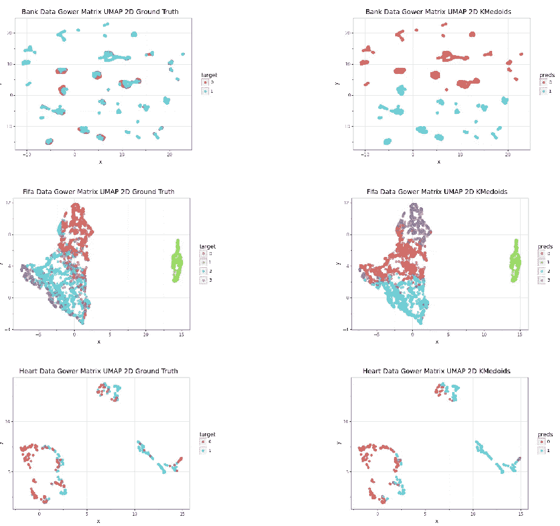***

# ***2.降维***

***降维是一种用于聚类高维数据的常用技术。这种技术试图将数据转换到低维空间，同时保留尽可能多的关于原始数据的信息。出于我们的目的，我们对将数据转换到低维空间不感兴趣。相反，我们希望利用该技术，通过将所有变量转换为标准化数值，来使我们的混合数据集均匀化。在这篇文章中，我们利用了两种不同的降维技术**混合数据的因子分析(FAMD)** 和**一致流形逼近和投影降维(UMAP)。*****

*****a .混合数据的因子分析(FAMD)*****

***该算法将主成分分析(PCA)算法推广到混合数据集。该方法首先对分类变量进行热编码。然后，通过减去平均值并除以标准偏差，对每个数值变量进行标准化。一个热编码变量的处理略有不同，因为它们除以列中对象比例的平方根(1 的数量除以列中观察值的数量)，然后居中(减去平均值)。最后，对结果矩阵执行 PCA 算法，以获得最终输出。下面的代码片段显示了上述 FAMD 算法过程的 pythonic 实现。***

***上面的代码更多的是演示算法如何工作的可视化过程。我不建议您在自己的分析中使用这些代码。相反，我会使用“prince”包中的 python 实现，它很容易被“pip”安装。***

## ***FAMD 集群解决方案的 2D 可视化***

***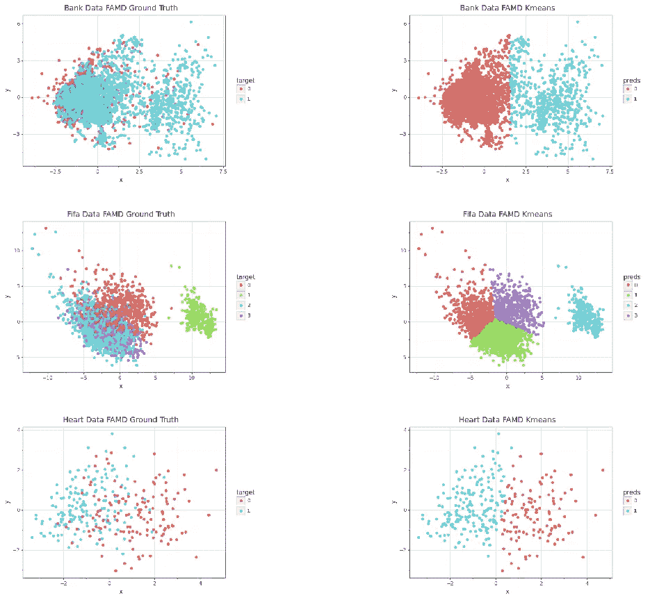***

*****b.** **均匀流形逼近和降维投影(UMAP)*****

***UMAP 是一种基于流形学习的降维技术&来自拓扑数据分析的思想。它提供了一个应用降维的通用框架，是任何数据科学家的武器库中一个非常强大的工具。为了将 UMAP 应用于混合数据，我们必须创建两个单独的流形，每个流形对应一种数据类型，因为 UMAP 仍然需要计算点之间的距离。然后，或者通过计算更多地保持分类嵌入的并集，或者通过计算将使嵌入更类似于数值流形的交集，来组合这两个流形。***

## ***UMAP 集群解决方案的 2D 可视化***

***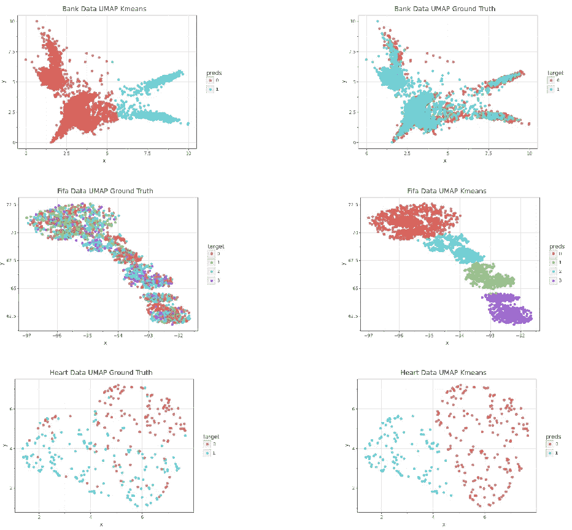***

# ***记录分类变量***

***记录分类变量的一般预处理工作流程是首先对变量进行热编码。这意味着对于每个唯一的类别，一个新的二进制变量被添加到数据集的后面。然后，通过减去列平均值并除以标准偏差来标准化每个热编码变量。该方法在下面的 Python 代码片段中实现。***

***需要注意的一点是，基于距离的聚类方法，如 K-means，对于仿射变换并不是不变的。此外，标准化一个热变量的选择对集群性能有影响。然而，适用于各种不同数据集或聚类技术的最佳选择并不存在。***

## ***分类变量重新编码的聚类解的 2D 可视化***

***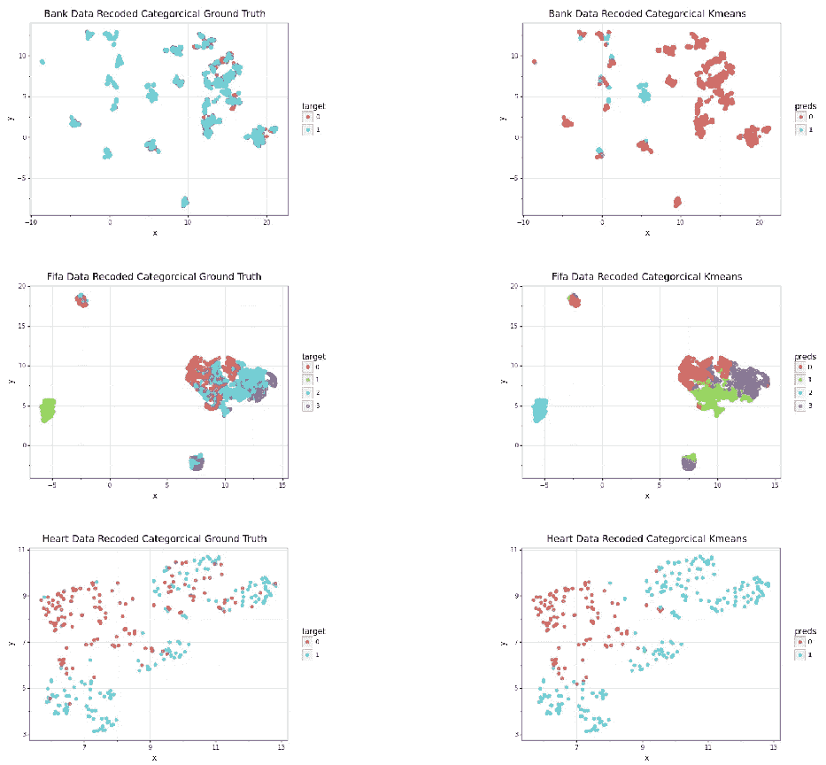***

# ***记录数字变量***

***数字变量可以通过一个叫做离散化的过程转换成类别。离散化将数值变量分割成 N 个区间，然后根据值所处的区间来标记类别。除了明显的信息损失之外，这种方法的另一个挑战是选择正确的离散化方法。一些变量会有一个自然的区间，这有助于进行有意义的离散化。将年龄分为自然年龄组，如儿童、青少年、成人和老年人。不幸的是，在许多情况下，这些自然分组并不存在，或者在没有专业知识的情况下无法应用。这种为每个变量选择合适的离散化方法的模糊性带来了一个问题。因为离散化的选择直接影响聚类算法的性能。***

***对于本文，所有的数值变量都使用相同的方法进行离散化，分别对每个变量应用 KMeans 算法(k=5)。这种方法非常简单&肯定可以改进，甚至通过简单地单独选择 k 的最佳数量就可以改进结果。以下函数通过离散化数据帧中的每个数字特征来应用上述简单方法。***

***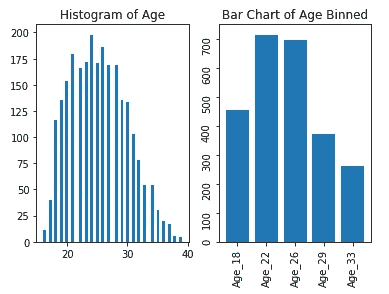***

***离散化前后足球运动员的年龄分布***

***在所有的数字数据被转换成类别后，应用三种不同的聚类技术并测量它们的性能。这些方法是:***

1.  ******KModes******
2.  ******分类嵌入+k 均值******
3.  ******图形分析社区检测******

## ***a.KModes***

***K-Modes 算法通过用相异度代替距离的概念，修改了分类数据聚类的标准 K-Means 过程。这意味着它不是测量距离，而是计算两次观察之间不匹配的总数，计数越小，两次观察越相似。此外，它不使用均值来寻找聚类的质心，而是使用模式。这些变化允许算法收敛到分类数据集的局部最小值。更多信息请查看这篇[**博文**](https://ai.plainenglish.io/k-means-and-k-modes-clustering-algorithm-4ff51395fa8d) **。*****

***不幸的是，到目前为止，KModes 算法还没有作为 sklearn.cluster 模块的一部分实现。因此，需要 PYPI antifactory 的“kmodes”包来对分类数据进行聚类。下面的代码演示了如何使用“KModes”中的 **KModes** 函数。***

## ***KModes 聚类解决方案的 2D 可视化***

***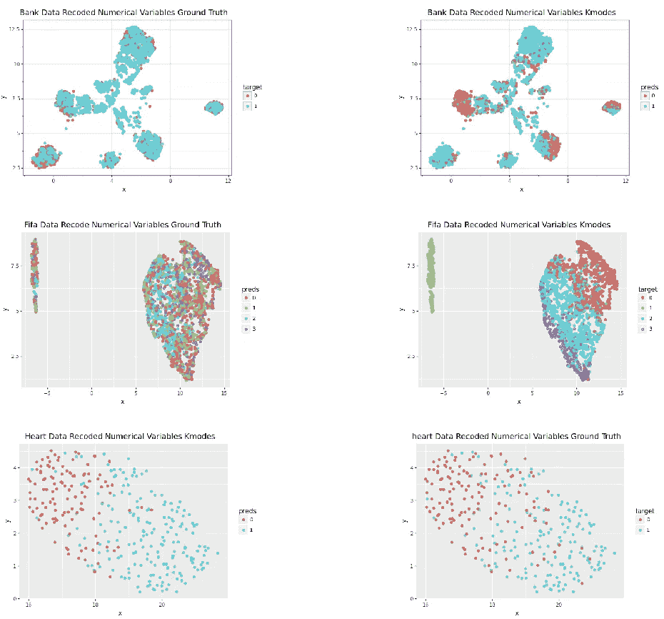***

## ***b.分类嵌入+k 均值***

***由于我们的数据现在是同质的(只包含一种数据类型)，我们可以应用某些专门针对分类数据的降维技术。这里的思路是应用降维来创建数据的标准化数字表示，以便 KMeans 算法进行聚类。在本文中，我们选择了具有“Dice”距离度量的 UMAP 算法，尽管可以应用任何能够处理分类数据的维度缩减技术。***

## ***分类 UMAP 嵌入+k 均值聚类解的 2D 可视化***

***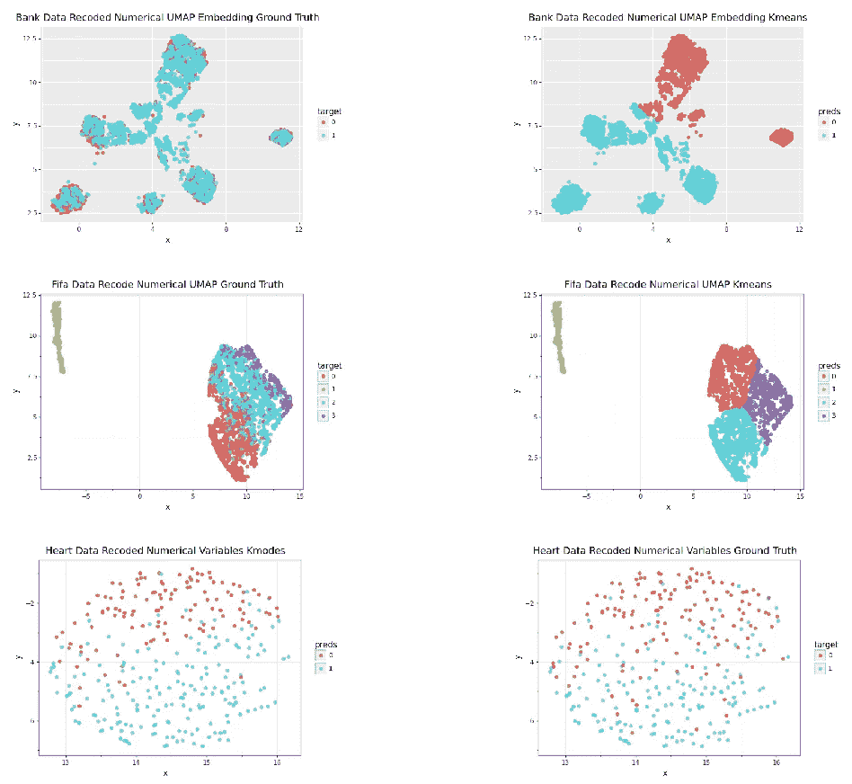***

## ***c.图形分析社区检测***

***我们可以通过创建一个边列表，将重新编码的(只包含分类数据)表格数据转换成图形结构。为了创建边列表，我们可以将每一行视为图中的一个节点，这一行将连接到其分类值或关联的元数据，因为这些类别也将是图中的节点。***

***以这种方式对数据建模允许我们见证分类变量和我们的观察之间的所有不同的非线性相互作用。下面是将表格数据转换成边缘列表所需的代码。***

***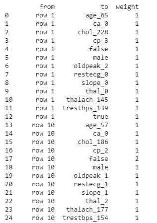***

***为心脏数据集创建的边列表的一个示例中，每一行仅与其分类值相关联。所有边的权重都是 1。***

***一旦我们有了一个图表，现在是分析它的时候了。由于本文关注的是聚类，我们将在图上执行社区检测。社区检测本质上是找到彼此密集连接并且稀疏连接到图中其他节点的节点子集。这相当于聚类的图形分析。在本文中我们使用“社区”python 包来执行 [**Louvain 方法**](https://neo4j.com/docs/graph-data-science/current/algorithms/louvain/) 进行社区检测。***

## ***结果图的可视化***

***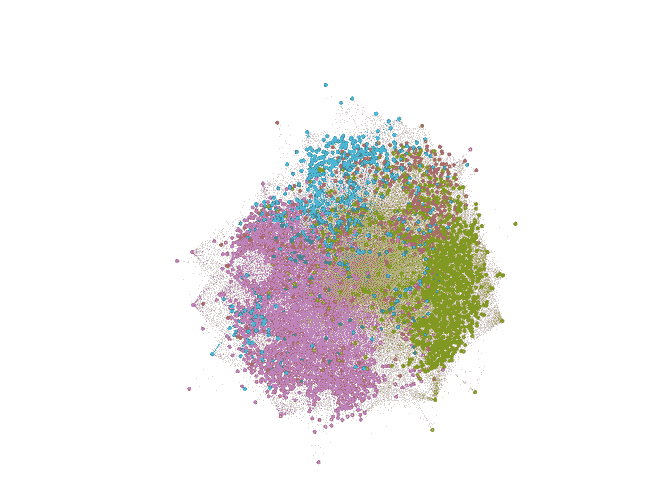******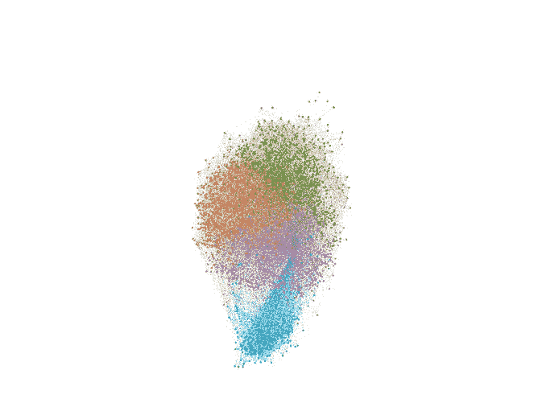******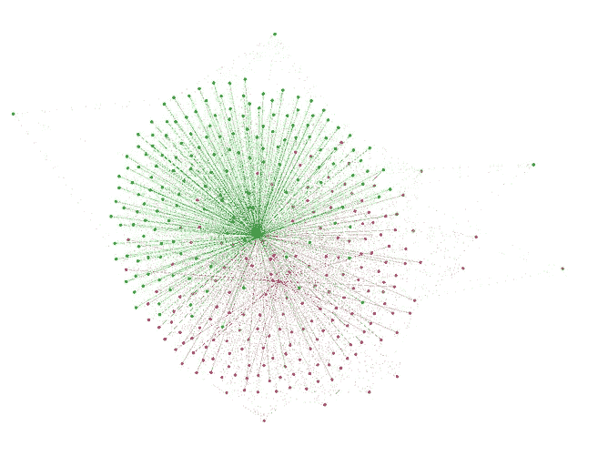***

***上面的代码在我们的三个数据集(从左到右的银行数据集营销目标、Kaggle FIFA 19 Complete Player 和 Cleveland Heart Disease)的每个数据集上生成的结果图，每个图中的颜色突出显示了节点所属的社区。可视化是使用 Gephi 软件创建的。***

# ***k 原型***

*****K-Prototypes** 是对 **KMeans** 算法的改编，提供了对混合数据进行聚类的能力。就像 **KMeans** 一样， **K-Prototypes** 使用“欧几里德”距离测量数值变量之间的距离。然而，与 **KMeans** 算法不同，它使用匹配类别的数量来测量分类变量之间的距离。该算法结合这两种距离度量来计算样本之间的实际距离。***

***不幸的是，到目前为止， **K-Prototypes** 算法还没有作为 sklearn.cluster 模块的一部分实现。因此，需要 PYPI antifactory 的“kmodes”包。下面的代码演示了如何从“kmodes”中使用 **KPrototypes** 函数。***

## ***K 原型集群解决方案的 2D 可视化***

***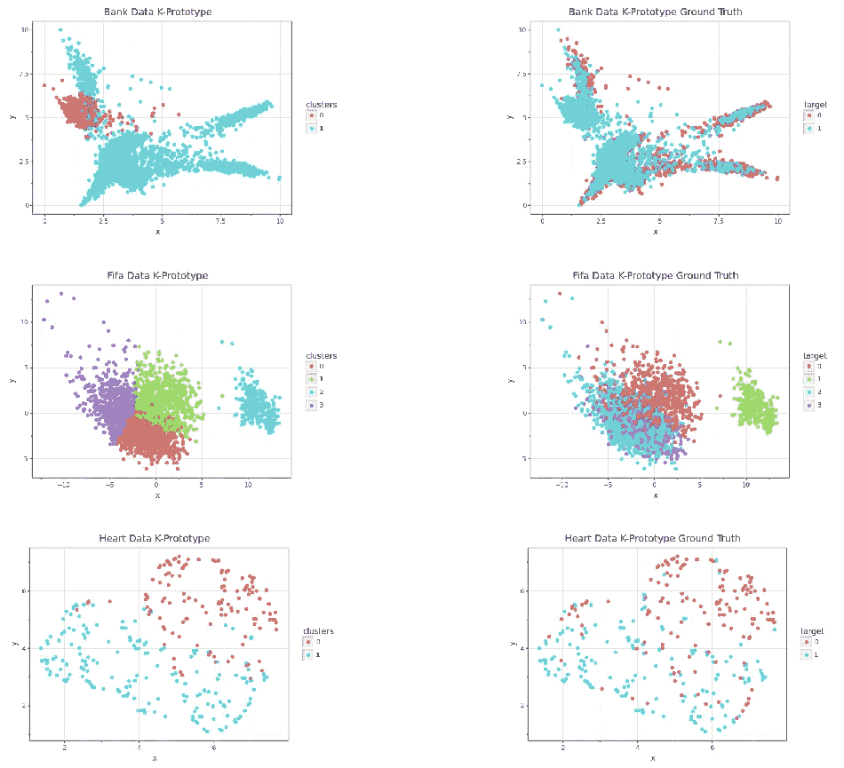***

# ***结果***

***本文展示了混合数据的基于距离的聚类算法的几种 pythonic 实现。尽管混合数据在自然环境中无处不在，但是对这种数据进行聚类的最佳方法仍然没有达成一致。这种模糊性的主要原因在于评估所产生的集群的质量或成功的问题。***

***如下面的结果所示，所应用的方法可以产生非常独特的输出，尽管用目标标签获得了相似的“调整后的 Rand 指数”分数。这使得比较我们算法的性能成为一个挑战。此外，在真实世界设置中，聚类分析将主要是无监督的，因此必须应用替代方法来选择最佳算法。仅仅因为这个原因，一些人嘲笑地称无监督学习更像是一种艺术形式，而不是一门科学。尽管如此，还是有一些表现在我们的结果中脱颖而出。***

***首先，UMAP·2D 方法产生的聚类与其他算法几乎完全不同。此外，当针对目标变量进行评估时，结果聚类的表现明显更差。相比之下，由重新编码的分类变量方法产生的聚类用目标变量实现了最高的平均调整 Rand 指数值(0.26)。紧随其后的是 UMAP 记录数值变量法提供的解决方案，其平均得分为(0.25)。有趣的是，这两种聚类解决方案之间的相似性在不同的数据集之间变化很大。新的社区检测方法工作良好，在实际问题上，该方法具有自动选择聚类数目的优点。但是，对于这种分析，它妨碍了它的性能，因为我们无法预先选择已知的集群数量。对于银行数据集，每个聚类算法相对于目标变量的性能都会下降。这些低分数可归因于班级之间的不良分隔界限。显然，所选择的变量无法预测客户是否订阅了定期存款。***

***总之，本文提供了各种不同的基于距离的聚类方法供选择。不幸的是，在对混合数据进行聚类时，没有免费的午餐，因为每个聚类解决方案完全取决于您自己的成功标准。虽然结合了大量不同的聚类技术，将产生不相关的聚类解决方案，与各种评估指标，如“剪影评分”，“戴维斯&波尔丁”和人工评估，以评估您的聚类解决方案的质量。会让你发现问题的最佳解决方案。***

***“用于创建本文的所有代码都可以在[***GitHub***](https://github.com/Ekeany/Clustering-Mixed-Data/tree/main/Notebooks)*找到”****

****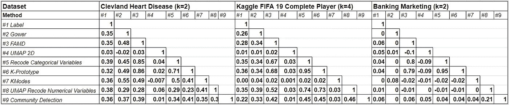****

****该矩阵显示了三个数据集的每种方法和标签之间调整后的 Rand 指数得分。该表还显示了方法本身之间调整后的 Rand 指数得分。列标为# 1-# 9，这些数字代表每种方法，相应的数字可在方法列中看到****